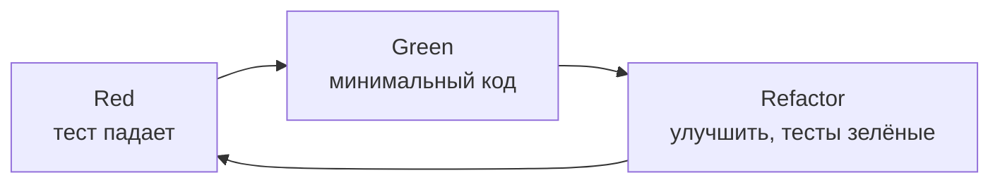
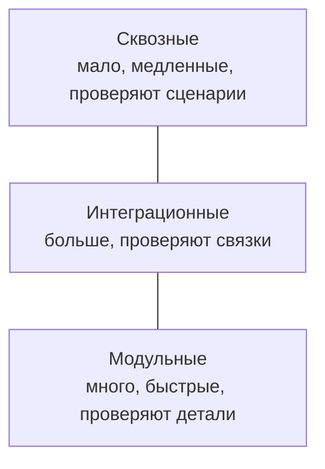

# 10_1 — Модульное и интеграционное тестирование: конспект

**Курс:** 3813ICT, недели 10–11
**Источник:** `10_1_-_Unit_and_Integration_Testing_.pdf` (17 слайдов)
**Связанные файлы:** [поправки](10_1-testing-basics-popravki.md) · [примеры](10_1-testing-basics-primery.md) · [вопросы](10_1-testing-basics-voprosy.md) · [ответы](10_1-testing-basics-otvety.md) · дальше: [10_2 Mocha](10_2-mocha-konspekt.md)

> Значок **⚠** со ссылкой вида **П-N** ведёт в файл поправок. Там разобрано, где исходный материал курса расходится с официальной документацией, со ссылкой на источник.

**Содержание**

1. [Зачем тестировать](#s1)
2. [Когда писать тесты: TDD](#s2)
3. [Виды тестов](#s3)
4. [Модульные тесты](#s4): [что это](#s4-1) · [планирование](#s4-2) · [тест-кейсы](#s4-3)
5. [Интеграционные тесты](#s5): [что это](#s5-1) · [тест-кейсы с данными](#s5-2) · [планирование](#s5-3)
6. [Автоматизация и инструменты](#s6)
7. [Ключевые факты](#s7)

---

## 1. Зачем тестировать

До этой недели мы проверяли код руками: открыть страницу, нажать кнопку, посмотреть в консоль. Для маленького приложения это работает, но итоговый проект уже состоит из сервера, базы, сервисов и компонентов. Каждое изменение может сломать что-то в другом месте, и перепроверять всё вручную после каждой правки невозможно. Недели 10–11 — о том, как поручить эту проверку коду.

**Тестирование** — проверка того, что программа ведёт себя так, как требуется, и поиск дефектов: ошибок выполнения, неверной логики, неверно реализованных функций.

Материал называет три причины тестировать как можно раньше:

- **дефект дешевле найти маленьким** — ошибку в одной функции легко найти, пока функция не стала частью большой системы;
- **чем позже найдена ошибка, тем труднее её отследить** — в собранном приложении у симптома много возможных причин;
- **исправление должно попасть в источник** — если ошибку в общей библиотеке исправить только в текущем проекте, в следующем проекте она вернётся.

---

## 2. Когда писать тесты: TDD

Во многих описаниях жизненного цикла тестирование стоит отдельным этапом между разработкой и выпуском. Материал справедливо говорит, что на практике тестирование идёт **на протяжении всего цикла**: тесты проектируют при проектировании кода и пишут каждый раз, когда пишется новый код. Этап тестирования перед выпуском нужен для исправления оставшихся ошибок, а не для того, чтобы задним числом дописывать тесты к готовому коду.

**TDD** (Test-Driven Development, разработка через тестирование) — подход, при котором тест пишут **до** кода и работают короткими циклами из трёх шагов: ⚠ [П-1](10_1-testing-basics-popravki.md#p-1)

1. **Red** — написать тест на ещё не существующее поведение; он падает;
2. **Green** — написать минимальный код, чтобы тест прошёл;
3. **Refactor** — улучшить код, не ломая тесты.

Даже если не следовать TDD строго, главная мысль материала остаётся: тесты пишут вместе с кодом, а не после.

---

## 3. Виды тестов

Тесты различаются тем, насколько большую часть системы они проверяют за раз. Вот виды из материала:

| Вид | Что проверяет | Пример в итоговом проекте |
|---|---|---|
| **Модульный** (unit) | одну функцию, класс или компонент в изоляции | функция проверки данных товара; сервис Angular с поддельным HTTP |
| **Интеграционный** | как несколько частей работают вместе | маршрут Express вместе с базой: запрос → проверка → запись → ответ |
| **UI / сквозной** (end-to-end) | сценарий пользователя через интерфейс | «войти, создать группу, увидеть её в списке» — тема недели 11 |
| **Проверка требований** | решает ли система задачу заказчика | соответствует ли чат описанию задания |

Материал утверждает, что UI-тесты трудно или невозможно автоматизировать и их выполняют вручную. Сегодня это не так: сценарии через браузер автоматизируют инструментами вроде Cypress и Playwright — именно этим занимается неделя 11. ⚠ [П-2](10_1-testing-basics-popravki.md#p-2)

Соотношение видов часто изображают **пирамидой тестов**: модульных тестов много (они быстрые и дешёвые), интеграционных меньше, сквозных — немного, для главных сценариев.

---

## 4. Модульные тесты

### 4.1 Что это

**Модульный тест** — автоматическая проверка одной небольшой части кода (функции, класса, компонента) в изоляции от остальной системы.

Материал перечисляет, что дают модульные тесты:

- показывают, что самые маленькие части кода работают как задумано;
- защищают от того, что изменение в маленькой части незаметно поменяет её поведение;
- сразу показывают, если изменение принесло новую ошибку (это называют **регрессией**).

### 4.2 Планирование

Материал предлагает порядок работы над новой функцией, и он хорошо ложится на TDD:

1. **Определить требования** к функции: ожидаемое поведение, типы входных данных, ожидаемый результат, какие ошибки нужно перехватывать, в каких случаях функция не должна работать.
2. **Спроектировать тест-кейсы.**
3. **Написать код тестов.**
4. **Написать саму функцию.**
5. **Запустить тесты** и убедиться, что функция работает правильно.

### 4.3 Тест-кейсы

Один тест с одним набором данных почти ничего не гарантирует: функция может случайно дать правильный ответ на этих данных. Поэтому функцию проверяют серией сценариев.

**Тест-кейс** — один сценарий проверки: что тестируется, описание сценария, входные данные и ожидаемый результат.

Вот таблица из материала для функции сложения двух чисел:

| Описание | Вход | Ожидаемый результат |
|---|---|---|
| Missing Input | первый параметр 22, второй отсутствует, но по умолчанию равен 2 | функция возвращает 24 |
| Bad input | первый 22, второй — строка `"2"` | функция возвращает 24: `"2"` приводится к числу 2 |
| File system not found | первый 22, второй `"2"` | файловую систему не удалось записать, выбрасывается ошибка |
| Triggers validation | первый 22, второй `"2"` | функция выбрасывает ошибку «parameter 2 must be an int» |

**Что в ней происходит.** Таблица показывает правильную идею — у каждого сценария описание, вход и ожидаемый результат, и сценарии покрывают не только «нормальный» случай.

Но как пример она противоречива: у трёх последних строк **одинаковый вход** и три **разных** ожидаемых результата — вернуть 24, выбросить ошибку файловой системы, выбросить ошибку проверки. По такой таблице нельзя написать тесты. У функции сложения нет файловой системы, а «приведение строки к числу» и «ошибка для строки» — взаимоисключающие требования. ⚠ [П-3](10_1-testing-basics-popravki.md#p-3)

Вот согласованная версия. Сначала выбираем требование: функция принимает только числа, второй параметр необязателен и по умолчанию равен 2.

| Описание | Вход | Ожидаемый результат |
|---|---|---|
| Обычный случай | `add(22, 3)` | `25` |
| Параметр по умолчанию | `add(22)` | `24` |
| Отрицательные числа | `add(-5, 2)` | `-3` |
| Дробные числа | `add(0.1, 0.2)` | примерно `0.3` (сравнение с допуском) |
| Неверный тип | `add(22, "2")` | ошибка `TypeError: arguments must be numbers` |

Каждая строка — отдельный тест, и ни одна не противоречит другой.

---

## 5. Интеграционные тесты

### 5.1 Что это

Функции могут правильно работать поодиночке и ломаться вместе: один модуль возвращает дату строкой, другой ждёт объект `Date`; маршрут вызывает сервис с аргументами не в том порядке.

**Интеграционный тест** — автоматическая проверка того, как несколько частей системы работают вместе. В веб-разработке чаще всего так тестируют маршруты API: запрос проходит через Express, проверку данных, базу и возвращается ответом.

Материал называет три пользы интеграционных тестов:

1. они строятся на функциональных требованиях, поэтому показывают, соответствует ли продукт требованиям;
2. защищают от регрессий при изменениях;
3. находят ошибки **взаимодействия** частей, которые модульные тесты в изоляции увидеть не могут.

### 5.2 Тест-кейсы с данными

Интеграционные тесты крупнее модульных, и у тест-кейса появляются дополнительные этапы: **подготовка данных** (чтобы в базе было то, что нужно для проверки) и **очистка** (чтобы следующий тест начинал с известного состояния). Вот пример из материала:

| Описание | Требования к данным | Входные данные | Ожидаемый результат | Очистка |
|---|---|---|---|---|
| Пустое имя при создании клиента — срабатывает проверка | данные не нужны | Name="", Age="22", State="QLD" | JSON с сообщением «the name field is required» | не нужна |
| Все данные есть — пользователь записан в базу | в таблице пользователей нет пользователей | Name="Joe", Age="22", State="QLD" | JSON с `true`, новый пользователь есть в базе | удалить добавленного пользователя |

**Что в нём происходит.** Первый кейс проверяет отказ: базе ничего не нужно и ничего не меняется. Второй проверяет успешную запись: перед тестом в базе должно быть пусто, после — созданного пользователя нужно удалить, иначе он помешает следующим тестам.

Пример хороший. Одна деталь: `Age="22"` — строка. Если API ждёт число, это отдельный кейс «неверный тип». Если принимает строку — стоит проверить, что в базе оказалось число, а не строка.

### 5.3 Планирование

Материал предлагает такой порядок:

1. Описать все функциональные требования.
2. Для каждого требования — свой набор тест-кейсов.
3. Для каждого набора — кейсы на четыре исхода:
   1. все данные верны;
   2. проверка отклоняет данные;
   3. возвращаются правильные данные;
   4. все блоки `try/catch` срабатывают и обрабатываются правильно.
4. Для каждого кейса — какие данные нужны заранее и что убрать после.
5. Написать код тестов.
6. Написать код.
7. Запустить тесты.

Как такой план превращается в код, показано в [примерах, пример 2](10_1-testing-basics-primery.md#ex-2) и в [10_2](10_2-mocha-konspekt.md#s6).

---

## 6. Автоматизация и инструменты

Прогонять тесты вручную долго, скучно и дорого, а человек ошибается. **Фреймворк тестирования** запускает тесты автоматически, показывает, что прошло и что упало, и позволяет запускать их при каждом изменении.

Материал перечисляет фреймворки для Node.js — Expresso, Mocha, Intern, Vows, nodeunit, JsUnit, node-tap — и говорит, что «стек MEAN использует Mocha». Список устарел: большинство названных проектов давно не развиваются, а у стека MEAN нет «официального» фреймворка тестирования. ⚠ [П-4](10_1-testing-basics-popravki.md#p-4)

Вот что используют сейчас:

| Инструмент | Где | Особенности |
|---|---|---|
| **Mocha** + библиотека проверок | сервер Node.js | гибкий, давно на рынке; курс использует его в [10_2](10_2-mocha-konspekt.md) |
| **`node:test`** | сервер Node.js | встроен в Node.js 20+, ничего не нужно устанавливать |
| **Jest** | Node.js, фронтенд | «всё в одном»: запуск, проверки, заглушки |
| **Vitest** | Angular 21+, Vite-проекты | в Angular 21 — стандартный инструмент для модульных тестов ([10_3](10_3-vitest-konspekt.md)) |
| **Cypress**, **Playwright** | браузер | сквозные тесты ([11_3](11_3-cypress-konspekt.md)) |

---

## 7. Ключевые факты

**Зачем и когда**

- Тестирование подтверждает требуемое поведение и находит дефекты; чем раньше, тем дешевле.
- Тесты пишут вместе с кодом; TDD — тест до кода, цикл Red → Green → Refactor.

**Виды**

- Модульные — одна часть в изоляции; интеграционные — связка частей; сквозные — сценарий пользователя через интерфейс.
- UI и сквозные тесты сегодня автоматизируют (Cypress, Playwright).
- Пирамида: много модульных, меньше интеграционных, немного сквозных.

**Тест-кейсы**

- Тест-кейс: что проверяем, описание, вход, ожидаемый результат; у интеграционного — ещё подготовка данных и очистка.
- Кейсы не должны противоречить друг другу: один вход — один ожидаемый результат.
- Кроме «нормального» случая — граничные значения, неверные данные, ошибки.

**Инструменты**

- Сервер: Mocha, `node:test`, Jest; Angular 21+: Vitest; браузер: Cypress, Playwright.
