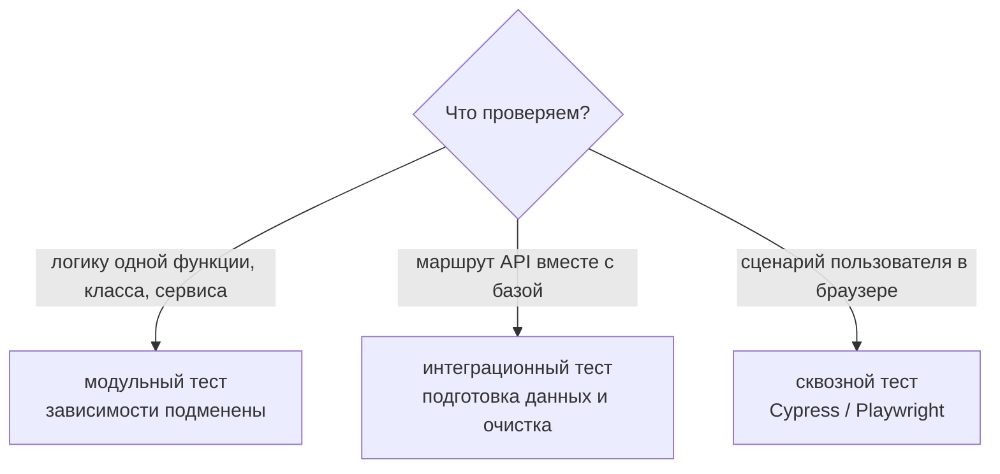
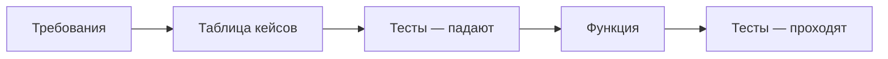
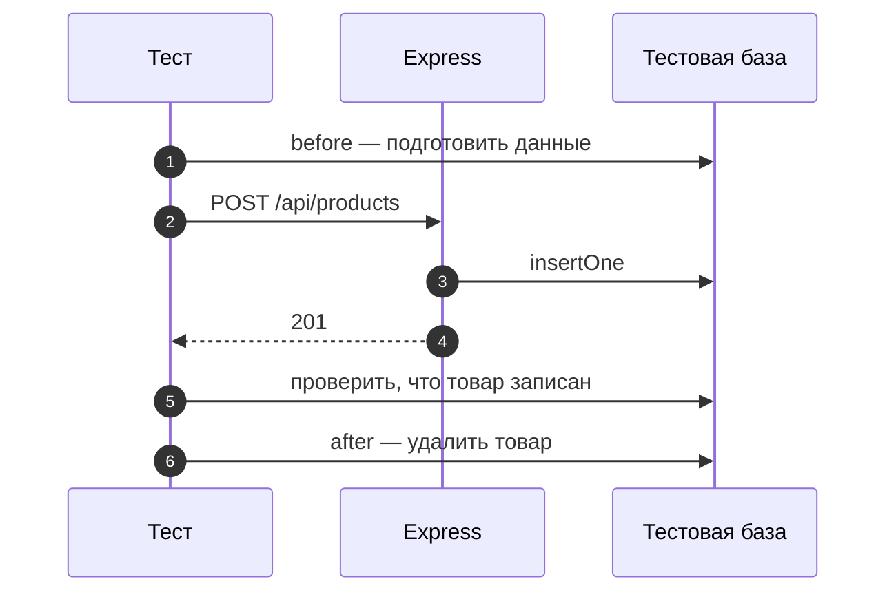

# 10_1 — Модульное и интеграционное тестирование: примеры использования

**Курс:** 3813ICT, недели 10–11
**Связанные файлы:** [конспект](10_1-testing-basics-konspekt.md) · [поправки](10_1-testing-basics-popravki.md) · [вопросы](10_1-testing-basics-voprosy.md) · [ответы](10_1-testing-basics-otvety.md)

Примеры показывают, как план из материала превращается в тесты для итогового проекта: от требований к таблице тест-кейсов и дальше к коду. Код тестов — Mocha и `node:assert/strict` (подробно — [10_2](10_2-mocha-konspekt.md)).

> **Диаграммы.** В Obsidian mermaid рендерится сам. В VS Code нужно расширение **Markdown Preview Mermaid Support**.

---

<a id="ex-0"></a>

## Какой вид теста выбрать



| Пример | Что показывает |
|---|---|
| [1. От требований к модульным тестам](#ex-1) | функция проверки товара: требования → таблица кейсов → тесты |
| [2. План интеграционного теста маршрута](#ex-2) | `POST /api/products`: данные до, запрос, ожидание, очистка |

---

<a id="ex-1"></a>

## Пример 1 — От требований к модульным тестам

**Когда использовать:** перед тем как писать функцию, которую будут вызывать маршруты сервера. Сначала требования, потом таблица кейсов, потом тесты, и только потом функция — так, как предлагает материал.

**Где в конспекте:** [§4.2 Планирование](10_1-testing-basics-konspekt.md#s4-2) · [§4.3 Тест-кейсы](10_1-testing-basics-konspekt.md#s4-3)

**Требования к `validateProduct(body)`:**

- возвращает `{ ok: true, product }`, где `product` содержит только `name`, `price`, `units`;
- `name` — непустая строка, пробелы по краям обрезаются;
- `price` — число не меньше 0; `units` — целое не меньше 0;
- при ошибке возвращает `{ ok: false, error }` с понятным текстом; не бросает исключений.

| № | Описание | Вход | Ожидаемый результат |
|---|---|---|---|
| 1 | всё верно | `{ name: ' Pen ', price: 2.5, units: 10 }` | `ok: true`, `name: 'Pen'` |
| 2 | лишние поля отброшены | `{ name: 'Pen', price: 1, units: 1, admin: true }` | в `product` нет `admin` |
| 3 | нет имени | `{ price: 1, units: 1 }` | `ok: false`, текст про `name` |
| 4 | отрицательная цена | `{ name: 'Pen', price: -1, units: 1 }` | `ok: false`, текст про `price` |
| 5 | дробный остаток | `{ name: 'Pen', price: 1, units: 1.5 }` | `ok: false`, текст про `units` |
| 6 | не объект | `undefined` | `ok: false`, без исключения |

```js
// ═════ server/unitTest/validate-product.test.js ═════
const assert = require('node:assert/strict');
const { validateProduct } = require('../lib/validate-product');

describe('validateProduct', () => {
  it('1. всё верно — обрезает пробелы в имени', () => {
    const r = validateProduct({ name: ' Pen ', price: 2.5, units: 10 });
    assert.deepEqual(r, { ok: true, product: { name: 'Pen', price: 2.5, units: 10 } });
  });

  it('2. отбрасывает лишние поля', () => {
    const r = validateProduct({ name: 'Pen', price: 1, units: 1, admin: true });
    assert.equal('admin' in r.product, false);
  });

  it('3. нет имени — ошибка про name', () => {
    const r = validateProduct({ price: 1, units: 1 });
    assert.equal(r.ok, false);
    assert.match(r.error, /name/);
  });

  it('4. отрицательная цена — ошибка про price', () => {
    assert.match(validateProduct({ name: 'Pen', price: -1, units: 1 }).error, /price/);
  });

  it('5. дробный остаток — ошибка про units', () => {
    assert.match(validateProduct({ name: 'Pen', price: 1, units: 1.5 }).error, /units/);
  });

  it('6. не объект — ошибка без исключения', () => {
    assert.doesNotThrow(() => validateProduct(undefined));
    assert.equal(validateProduct(undefined).ok, false);
  });
});

// ═════ server/lib/validate-product.js — пишется ПОСЛЕ тестов ═════
function validateProduct(body) {
  const { name, price, units } = body ?? {};
  if (typeof name !== 'string' || !name.trim()) return { ok: false, error: 'name is required' };
  if (typeof price !== 'number' || price < 0) return { ok: false, error: 'price must be a non-negative number' };
  if (!Number.isInteger(units) || units < 0) return { ok: false, error: 'units must be a non-negative integer' };
  return { ok: true, product: { name: name.trim(), price, units } };
}
module.exports = { validateProduct };
```

### Последовательность

1. Требования записаны до кода — однозначно, без противоречий.
2. Каждое требование превращено в строку таблицы: вход и один ожидаемый результат.
3. Каждая строка — отдельный `it` с номером кейса в названии.
4. Тесты запускаются и падают: функции ещё нет (Red).
5. Пишется функция — тесты проходят (Green).
6. Если позже функцию перепишут, тесты сразу покажут, что сломалось.



---

<a id="ex-2"></a>

## Пример 2 — План интеграционного теста маршрута

**Когда использовать:** перед тестированием маршрута, который пишет в базу. Главное в плане — колонки «данные до» и «очистка»: без них тесты начинают зависеть от порядка запуска и от того, что осталось в базе после прошлого прогона.

**Где в конспекте:** [§5.2 Тест-кейсы с данными](10_1-testing-basics-konspekt.md#s5-2) · [§5.3 Планирование](10_1-testing-basics-konspekt.md#s5-3)

| № | Описание | Данные до | Запрос | Ожидаемый результат | Очистка |
|---|---|---|---|---|---|
| 1 | создание — верные данные | в `products` нет товара с `id: 101` | `POST /api/products` `{ id: 101, name: 'Pen', price: 1, units: 5 }` | `201`, в теле `_id`; в базе есть товар `101` | удалить товар `101` |
| 2 | дубликат `id` | в базе есть товар `id: 101` | тот же запрос | `409`, в базе по-прежнему **один** товар `101` | удалить товар `101` |
| 3 | проверка отклоняет | не нужны | `{ id: 102, price: 1, units: 5 }` (без имени) | `400`, текст про `name`; товара `102` нет | не нужна |
| 4 | ошибка базы обработана | база недоступна (подмена коллекции, которая бросает ошибку) | верный запрос | `500`, `{ error: 'Server error' }`, сервер работает | вернуть коллекцию |

```js
// ═════ server/integrationTest/products.test.js — каркас по плану (код — в 10_2) ═════
describe('POST /api/products', () => {
  describe('1. создание — верные данные', () => {
    before(async () => { /* убедиться, что товара 101 нет */ });
    it('отвечает 201 и записывает товар', async () => { /* запрос и проверки */ });
    after(async () => { /* удалить товар 101 */ });
  });

  describe('2. дубликат id', () => {
    before(async () => { /* вставить товар 101 */ });
    it('отвечает 409, второй товар не появляется', async () => { /* ... */ });
    after(async () => { /* удалить товар 101 */ });
  });

  describe('3. проверка отклоняет', () => {
    it('отвечает 400 без имени', async () => { /* ... */ });
  });
});
```

### Последовательность

1. Для каждого кейса указано, что должно быть в базе **до** теста.
2. `before` приводит базу в это состояние.
3. `it` отправляет запрос и проверяет **и ответ, и базу** — интеграционный тест смотрит на оба.
4. `after` возвращает базу в исходное состояние, чтобы следующий кейс не зависел от этого.
5. Кейс 4 проверяет ветку `catch`: ошибку базы подменяют, чтобы убедиться, что сервер отвечает `500` и не падает.


