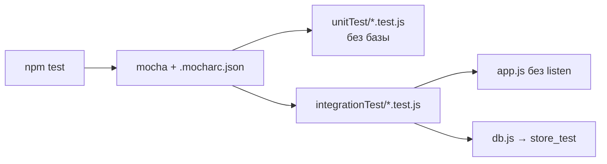
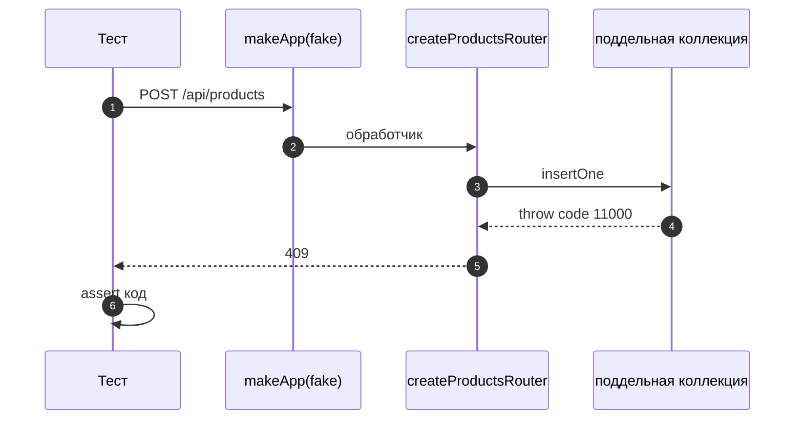

# 10_2 — Mocha: модульные и интеграционные тесты Node.js: примеры использования

**Курс:** 3813ICT, недели 10–11
**Связанные файлы:** [конспект](10_2-mocha-konspekt.md) · [поправки](10_2-mocha-popravki.md) · [вопросы](10_2-mocha-voprosy.md) · [ответы](10_2-mocha-otvety.md)

Примеры — опорные куски для тестов сервера итогового проекта. Интеграционный тест маршрутов с тестовой базой — в [конспекте §6.3](10_2-mocha-konspekt.md#s6-3); здесь — настройка проекта и модульный тест маршрута без базы.

> **Диаграммы.** В Obsidian mermaid рендерится сам. В VS Code нужно расширение **Markdown Preview Mermaid Support**.

---

<a id="ex-0"></a>

## Три способа дождаться асинхронного теста

| Способ | Запись | Когда |
|---|---|---|
| `async`/`await` | `it('...', async () => { const r = await f(); assert.equal(r, 1); })` | основной |
| `return` Promise | `it('...', () => f().then((r) => assert.equal(r, 1)))` | если удобна цепочка |
| `done` | `it('...', (done) => { f((err, r) => { assert.equal(r, 1); done(); }); })` | только для колбэк-API |
| ❌ ничего | `it('...', () => { f().then(...) })` | тест зелёный до проверки |

| Пример | Что показывает |
|---|---|
| [1. Настройка тестов в проекте](#ex-1) | структура папок, скрипты, `.mocharc`, тестовая база через переменную окружения |
| [2. Модульный тест маршрута без базы](#ex-2) | фабрика роутера с зависимостью, поддельная коллекция, supertest |

---

<a id="ex-1"></a>

## Пример 1 — Настройка тестов в проекте

**Когда использовать:** один раз при добавлении тестов в сервер итогового проекта. Задача — чтобы `npm test` запускал всё, а тесты никогда не трогали рабочую базу.

**Где в конспекте:** [§1 Установка и запуск](10_2-mocha-konspekt.md#s1) · [§6.3 Исправленная версия](10_2-mocha-konspekt.md#s6-3)

```bash
npm i -D mocha supertest
```

```
server/
├── app.js                   ← express-приложение БЕЗ listen (экспорт)
├── server.js                ← require('./app') + connect + listen
├── db.js                    ← connect(dbName), getDb(), close()  (9_1, пример 2)
├── lib/validate-product.js
├── routes/products.js
├── unitTest/
│   └── validate-product.test.js
├── integrationTest/
│   └── products.test.js
├── .mocharc.json
└── package.json
```

```jsonc
// ═════ server/package.json (фрагмент) ═════
{
  "scripts": {
    "start": "node server.js",
    "test": "mocha \"unitTest/**/*.test.js\" \"integrationTest/**/*.test.js\"",
    "test:unit": "mocha \"unitTest/**/*.test.js\"",
    "test:integration": "mocha \"integrationTest/**/*.test.js\""
  }
}

// ═════ server/.mocharc.json — общие настройки Mocha ═════
{
  "timeout": 5000,          // интеграционным тестам с базой нужно больше 2 с по умолчанию
  "exit": true              // завершить процесс после тестов, даже если осталось открытое соединение
}
```

```js
// ═════ server/db.js — имя базы из окружения, чтобы тесты не трогали рабочую ═════
const { MongoClient } = require('mongodb');
const client = new MongoClient(process.env.MONGO_URL ?? 'mongodb://localhost:27017');
let db;

async function connect(dbName = process.env.DB_NAME ?? 'store') {
  if (process.env.NODE_ENV === 'test' && !dbName.endsWith('_test')) {
    throw new Error(`Refusing to run tests against "${dbName}"`);   // защита от ошибки
  }
  await client.connect();
  db = client.db(dbName);
  return db;
}
const getDb = () => db;
const close = () => client.close();
module.exports = { connect, getDb, close };

// Запуск интеграционных тестов:
// NODE_ENV=test npm run test:integration     (в тестах — connect('store_test'))
```

### Последовательность

1. `npm test` запускает Mocha с двумя шаблонами путей — все модульные и все интеграционные тесты.
2. Mocha читает `.mocharc.json`: увеличенный таймаут и завершение после тестов.
3. Интеграционный тест вызывает `connect('store_test')`.
4. `db.js` проверяет: если это тестовый запуск, а имя базы не заканчивается на `_test`, — отказ. Случайно запустить тесты на рабочей базе нельзя.
5. `app.js` подключается без `listen`, поэтому supertest работает с приложением напрямую, а порт 3000 свободен.



---

<a id="ex-2"></a>

## Пример 2 — Модульный тест маршрута без базы

**Когда использовать:** хочется проверить логику маршрута (коды ответов, проверку данных) быстро и без MongoDB. Для этого роутер получает коллекцию **параметром**, а тест передаёт поддельную. Это та самая «инверсия зависимостей» из [10_4](10_4-testable-code-konspekt.md).

**Где в конспекте:** [§3 Проверки](10_2-mocha-konspekt.md#s3) · [§5 Асинхронные тесты](10_2-mocha-konspekt.md#s5)

```js
// ═════ server/routes/products-router.js — фабрика: зависимость приходит снаружи ═════
const express = require('express');
const { validateProduct } = require('../lib/validate-product');

module.exports = function createProductsRouter(col) {
  const router = express.Router();

  router.get('/count', async (req, res) => {
    res.json({ count: await col.countDocuments({}) });
  });

  router.post('/', async (req, res) => {
    const check = validateProduct(req.body);
    if (!check.ok) return res.status(400).json({ error: check.error });
    try {
      const { insertedId } = await col.insertOne(check.product);
      res.status(201).json({ _id: insertedId, ...check.product });
    } catch (err) {
      if (err.code === 11000) return res.status(409).json({ error: 'duplicate' });
      res.status(500).json({ error: 'Server error' });
    }
  });

  return router;
};
// В рабочем app.js: app.use('/api/products', createProductsRouter(getDb().collection('products')));

// ═════ server/unitTest/products-router.test.js ═════
const assert = require('node:assert/strict');
const express = require('express');
const request = require('supertest');
const createProductsRouter = require('../routes/products-router');

// Поддельная коллекция: только нужные методы, результат задаёт тест
function fakeCollection(overrides = {}) {
  return {
    countDocuments: async () => 3,
    insertOne: async () => ({ insertedId: 'abc123' }),
    ...overrides,
  };
}

function makeApp(col) {
  const app = express();
  app.use(express.json());
  app.use('/api/products', createProductsRouter(col));
  return app;
}

describe('products router (без базы)', () => {
  it('GET /count возвращает число из коллекции', async () => {
    const res = await request(makeApp(fakeCollection())).get('/api/products/count').expect(200);
    assert.deepEqual(res.body, { count: 3 });
  });

  it('POST — 400, если проверка не прошла, и в базу ничего не пишется', async () => {
    let called = false;
    const col = fakeCollection({ insertOne: async () => { called = true; } });
    await request(makeApp(col)).post('/api/products').send({ price: 1, units: 1 }).expect(400);
    assert.equal(called, false);
  });

  it('POST — 409 на ошибку дубликата', async () => {
    const col = fakeCollection({ insertOne: async () => { throw Object.assign(new Error('dup'), { code: 11000 }); } });
    await request(makeApp(col)).post('/api/products').send({ name: 'Pen', price: 1, units: 1 }).expect(409);
  });

  it('POST — 500, если база упала, и сервер не падает', async () => {
    const col = fakeCollection({ insertOne: async () => { throw new Error('connection lost'); } });
    await request(makeApp(col)).post('/api/products').send({ name: 'Pen', price: 1, units: 1 }).expect(500);
  });
});
```

### Последовательность

1. Роутер не импортирует базу сам — он получает коллекцию аргументом `createProductsRouter(col)`.
2. Тест собирает маленькое приложение с **поддельной** коллекцией, у которой только нужные методы.
3. Каждый тест подменяет поведение: вернуть число, бросить ошибку `11000`, бросить «connection lost».
4. supertest отправляет запрос в приложение; `.expect(...)` проверяет код ответа.
5. Тесты проверяют ветки, которые на настоящей базе трудно вызвать: дубликат и сбой соединения.
6. Всё выполняется за миллисекунды и без MongoDB.


