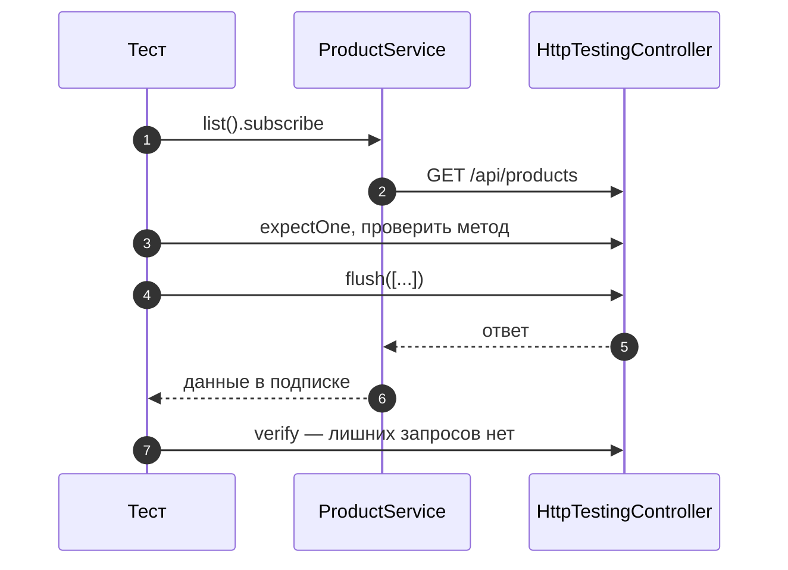
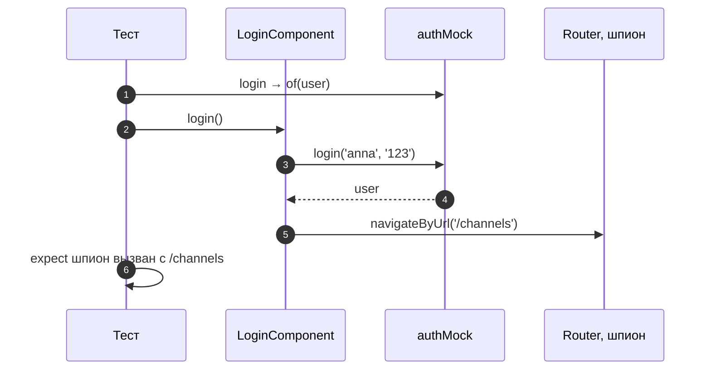

# 10_3 — Модульные тесты Angular с Vitest: примеры использования

**Курс:** 3813ICT, недели 10–11
**Связанные файлы:** [конспект](10_3-vitest-konspekt.md) · [поправки](10_3-vitest-popravki.md) · [вопросы](10_3-vitest-voprosy.md) · [ответы](10_3-vitest-otvety.md)

Примеры — тесты для частей клиента итогового проекта: HTTP-сервиса и страницы входа. Запуск — `ng test` (Angular 21+, Vitest).

> **Диаграммы.** В Obsidian mermaid рендерится сам. В VS Code нужно расширение **Markdown Preview Mermaid Support**.

---

<a id="ex-0"></a>

## Jasmine → Vitest: что заменить

| Jasmine / Karma | Vitest |
|---|---|
| `async(() => ...)`, `waitForAsync` | обычный `async`/`await` |
| `spyOn(obj, 'm')` | `vi.spyOn(obj, 'm')` |
| `spyOn(obj, 'm').and.returnValue(x)` | `vi.spyOn(obj, 'm').mockReturnValue(x)` |
| `jasmine.createSpy()` | `vi.fn()` |
| `expect(spy).toHaveBeenCalledTimes(0)` | `expect(spy).not.toHaveBeenCalled()` |
| `el.innerText` (в браузере Karma) | `el.textContent` (jsdom) |

| Пример | Что показывает |
|---|---|
| [1. HTTP-сервис с `HttpTestingController`](#ex-1) | запрос проверен, ответ подставлен, ошибка сервера |
| [2. Страница входа с подменами](#ex-2) | подмена сервиса, шпион на `Router`, ветка ошибки `401` |

---

<a id="ex-1"></a>

## Пример 1 — HTTP-сервис с `HttpTestingController`

**Когда использовать:** тест сервиса, который ходит на сервер. Настоящий запрос не нужен: контроллер перехватывает его, проверяет адрес и метод и отдаёт заготовленный ответ.

**Где в конспекте:** [§2 Общие провайдеры](10_3-vitest-konspekt.md#s2) · [§6 Тест сервиса](10_3-vitest-konspekt.md#s6)

```ts
// ═════ src/app/services/product.service.ts ═════
@Injectable({ providedIn: 'root' })
export class ProductService {
  private http = inject(HttpClient);
  list(): Observable<Product[]> { return this.http.get<Product[]>('/api/products'); }
  add(p: ProductInput): Observable<Product> { return this.http.post<Product>('/api/products', p); }
}

// ═════ src/app/services/product.service.spec.ts ═════
import { TestBed } from '@angular/core/testing';
import { provideHttpClient, HttpErrorResponse } from '@angular/common/http';
import { HttpTestingController, provideHttpClientTesting } from '@angular/common/http/testing';
import { ProductService } from './product.service';

describe('ProductService', () => {
  let service: ProductService;
  let http: HttpTestingController;

  beforeEach(() => {
    TestBed.configureTestingModule({
      providers: [provideHttpClient(), provideHttpClientTesting()],   // не нужно, если есть в providersFile
    });
    service = TestBed.inject(ProductService);
    http = TestBed.inject(HttpTestingController);
  });

  afterEach(() => http.verify());          // не осталось неожиданных запросов

  it('list() отправляет GET /api/products и отдаёт массив', () => {
    let result: unknown;
    service.list().subscribe((r) => (result = r));

    const req = http.expectOne('/api/products');          // ровно один запрос на этот адрес
    expect(req.request.method).toBe('GET');
    req.flush([{ _id: 'a1', id: 1, name: 'Pen', description: '', price: 1, units: 5 }]);   // ответ

    expect(result).toEqual([{ _id: 'a1', id: 1, name: 'Pen', description: '', price: 1, units: 5 }]);
  });

  it('add() передаёт ошибку 409 подписчику', () => {
    let status = 0;
    service.add({ id: 1, name: 'Pen', description: '', price: 1, units: 5 }).subscribe({
      error: (e: HttpErrorResponse) => (status = e.status),
    });

    const req = http.expectOne('/api/products');
    expect(req.request.method).toBe('POST');
    expect(req.request.body.name).toBe('Pen');                                   // проверка тела
    req.flush({ error: 'duplicate' }, { status: 409, statusText: 'Conflict' });  // ответ с ошибкой

    expect(status).toBe(409);
  });
});
```

### Последовательность

1. Тестовый модуль подключает `HttpClient` и тестовый бэкенд вместо сети.
2. Тест подписывается на `list()` — запрос уходит в тестовый бэкенд и ждёт.
3. `expectOne('/api/products')` находит запрос (и упадёт, если запросов нет или их несколько).
4. Тест проверяет метод и тело запроса.
5. `flush(...)` отдаёт ответ — подписчик получает данные или ошибку с нужным статусом.
6. `afterEach` вызывает `verify()`: если сервис отправил лишний запрос, тест упадёт.



---

<a id="ex-2"></a>

## Пример 2 — Страница входа с подменами

**Когда использовать:** компонент зависит от сервиса и от роутера. Тест проверяет только логику компонента: что при успехе он переходит на нужную страницу, а при `401` показывает сообщение. Компонент — `LoginComponent` из [5_6 §5.2](../week5/5_6-node-angular-konspekt.md#s5-2) (поля `username`, `pwd`, метод `login()`); адрес перехода подставь свой — здесь `/channels`, как в практике недели 5.

**Где в конспекте:** [§5 Шпионы](10_3-vitest-konspekt.md#s5) · [§7 Подмена сервиса](10_3-vitest-konspekt.md#s7)

```ts
// ═════ src/app/pages/login/login.component.spec.ts ═════
import { TestBed } from '@angular/core/testing';
import { provideRouter, Router } from '@angular/router';
import { HttpErrorResponse } from '@angular/common/http';
import { of, throwError } from 'rxjs';
import { vi } from 'vitest';
import { LoginComponent } from './login.component';
import { AuthService } from '../../services/auth.service';

describe('LoginComponent', () => {
  const authMock = { login: vi.fn() };           // подмена: только нужный метод

  beforeEach(async () => {
    authMock.login.mockReset();
    await TestBed.configureTestingModule({
      imports: [LoginComponent],
      providers: [provideRouter([]), { provide: AuthService, useValue: authMock }],
    }).compileComponents();
  });

  it('при успехе переходит на /channels', () => {
    authMock.login.mockReturnValue(of({ id: 2, username: 'anna', role: 'groupadmin' }));
    const router = TestBed.inject(Router);
    const navigate = vi.spyOn(router, 'navigateByUrl').mockResolvedValue(true);   // не переходить по-настоящему

    const fixture = TestBed.createComponent(LoginComponent);
    const comp = fixture.componentInstance;
    comp.username = 'anna';
    comp.pwd = '123';
    comp.login();

    expect(authMock.login).toHaveBeenCalledWith('anna', '123');
    expect(navigate).toHaveBeenCalledWith('/channels');
  });

  it('при 401 показывает сообщение и остаётся на странице', () => {
    authMock.login.mockReturnValue(throwError(() => new HttpErrorResponse({ status: 401 })));
    const navigate = vi.spyOn(TestBed.inject(Router), 'navigateByUrl');

    const fixture = TestBed.createComponent(LoginComponent);
    fixture.componentInstance.login();
    fixture.detectChanges();

    expect(navigate).not.toHaveBeenCalled();
    expect((fixture.nativeElement as HTMLElement).textContent).toContain('Неверное имя или пароль');
  });
});
```

### Последовательность

1. `authMock.login` — функция-подмена `vi.fn()`; перед каждым тестом она сбрасывается.
2. Тест 1 задаёт ответ `of(user)`, ставит шпиона на `router.navigateByUrl` (с заглушкой, чтобы не переходить по-настоящему).
3. Компонент получает поля и вызывает `login()` — подмена сразу отдаёт пользователя.
4. Проверки: подмену вызвали с нужными аргументами, роутер — с `/channels`.
5. Тест 2 задаёт ответ `throwError(401)`; компонент ставит текст ошибки, `detectChanges()` отрисовывает его.
6. Проверки: перехода не было, текст ошибки есть в DOM (`textContent`).


