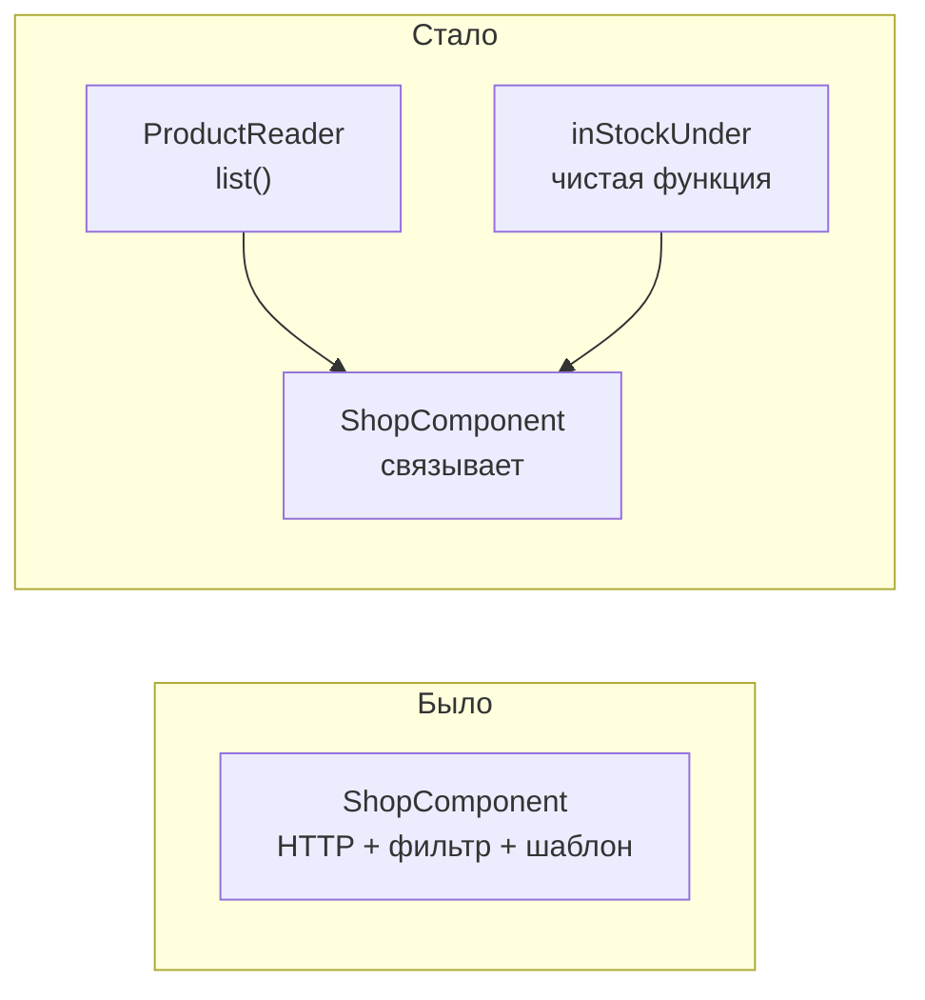
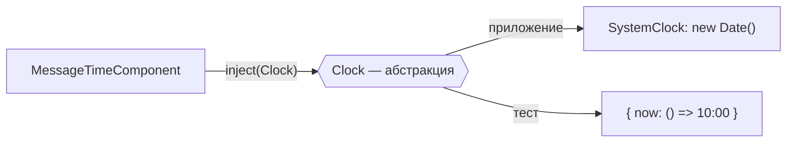

# 10_4 — Принципы тестируемого кода (SOLID): примеры использования

**Курс:** 3813ICT, недели 10–11
**Связанные файлы:** [конспект](10_4-testable-code-konspekt.md) · [поправки](10_4-testable-code-popravki.md) · [вопросы](10_4-testable-code-voprosy.md) · [ответы](10_4-testable-code-otvety.md)

Примеры показывают один и тот же приём с двух сторон: как переписать трудно тестируемый код клиента и как сделать время управляемым в тесте.

> **Диаграммы.** В Obsidian mermaid рендерится сам. В VS Code нужно расширение **Markdown Preview Mermaid Support**.

---

<a id="ex-0"></a>

## Признаки трудно тестируемого кода

| Признак | Какой принцип нарушен | Что сделать |
|---|---|---|
| чтобы проверить правило, нужно поднять сервер и отрисовать шаблон | S | вынести правило в чистую функцию |
| каждый новый вариант поведения — правка одного и того же метода | O | стратегия или функция-параметр |
| подмена в тесте ведёт себя не так, как настоящий сервис | L | подмена соблюдает контракт (форму данных, ошибки) |
| подмене нужно «реализовать» методы, которые компонент не вызывает | I | разделить сервис на маленькие части |
| внутри кода `new Something()`, `new Date()`, прямой импорт базы | D | получать зависимость через DI или параметр |

| Пример | Что показывает |
|---|---|
| [1. Разделить загрузку, правило и отображение](#ex-1) | S и I: чистая функция + маленькая абстракция + простой тест компонента |
| [2. Время как зависимость](#ex-2) | D: абстракция `Clock`, фиксированное время в тесте |

---

<a id="ex-1"></a>

## Пример 1 — Разделить загрузку, правило и отображение

**Когда использовать:** компонент сам делает HTTP-запрос, фильтрует и показывает. Чтобы проверить фильтр, приходится подменять HTTP и отрисовывать шаблон. После разделения фильтр тестируется одной строкой, а компонент — с маленькой подменой.

**Где в конспекте:** [§2 Единственная ответственность](10_4-testable-code-konspekt.md#s2) · [§5 Разделение интерфейсов](10_4-testable-code-konspekt.md#s5)

```ts
// ═════ БЫЛО: всё в компоненте ═════
// export class ShopComponent {
//   private http = inject(HttpClient);
//   visible: Product[] = [];
//   maxPrice = 50;
//   ngOnInit() {
//     this.http.get<Product[]>('/api/products').subscribe((list) => {
//       this.visible = list.filter((p) => p.units > 0 && p.price <= this.maxPrice);
//     });
//   }
// }

// ═════ СТАЛО ═════
// src/app/shop/in-stock.ts — правило: чистая функция
export const inStockUnder = (list: Product[], max: number): Product[] =>
  list.filter((p) => p.units > 0 && p.price <= max);

// src/app/shop/product-reader.ts — маленькая абстракция (только то, что нужно странице)
export abstract class ProductReader {
  abstract list(): Observable<Product[]>;
}
// app.config.ts: { provide: ProductReader, useExisting: ProductService }   // ProductService реализует list()

// src/app/shop/shop.component.ts — только связывает и показывает
@Component({
  selector: 'app-shop',
  template: `@for (p of visible(); track p._id) { <p>{{ p.name }}</p> } @empty { <p>Нет товаров</p> }`,
})
export class ShopComponent {
  private reader = inject(ProductReader);
  protected maxPrice = signal(50);
  private all = toSignal(this.reader.list(), { initialValue: [] as Product[] });
  protected visible = computed(() => inStockUnder(this.all(), this.maxPrice()));
}

// ═════ Тесты ═════
// in-stock.spec.ts — без Angular
describe('inStockUnder', () => {
  const p = (name: string, price: number, units: number) => ({ _id: name, id: 1, name, description: '', price, units });
  it('оставляет только товары в наличии и не дороже max', () => {
    expect(inStockUnder([p('A', 10, 1), p('B', 10, 0), p('C', 90, 5)], 50).map((x) => x.name)).toEqual(['A']);
  });
});

// shop.component.spec.ts — подмена одного метода
it('показывает отфильтрованные товары', () => {
  TestBed.configureTestingModule({
    imports: [ShopComponent],
    providers: [{ provide: ProductReader, useValue: { list: () => of([
      { _id: '1', id: 1, name: 'Pen', description: '', price: 5, units: 3 },
      { _id: '2', id: 2, name: 'Lamp', description: '', price: 5, units: 0 },
    ]) } }],
  });
  const fixture = TestBed.createComponent(ShopComponent);
  fixture.detectChanges();
  expect(fixture.nativeElement.textContent).toContain('Pen');
  expect(fixture.nativeElement.textContent).not.toContain('Lamp');
});
```

### Последовательность

1. Правило отбора вынесено в функцию `inStockUnder` — её тест не требует ни Angular, ни HTTP.
2. Компонент зависит от абстракции `ProductReader` с одним методом, а не от всего `ProductService`.
3. В приложении `useExisting` указывает, что `ProductReader` — это уже существующий `ProductService`.
4. В тесте подмена реализует только `list()`.
5. Тест компонента проверяет лишь связку: данные пришли, правило применено, результат отрисован.



---

<a id="ex-2"></a>

## Пример 2 — Время как зависимость

**Когда использовать:** код зависит от текущего времени — «5 мин назад», «сессия истекла», «сообщение отправлено сегодня». С `new Date()` внутри тест зависит от момента запуска и может проходить утром и падать вечером.

**Где в конспекте:** [§6 Инверсия зависимостей](10_4-testable-code-konspekt.md#s6)

```ts
// ═════ src/app/core/clock.ts ═════
export abstract class Clock {
  abstract now(): Date;
}

@Injectable()
export class SystemClock extends Clock {
  now(): Date { return new Date(); }
}
// app.config.ts: providers: [{ provide: Clock, useClass: SystemClock }, ...]

// ═════ src/app/chat/message-time.component.ts (из конспекта §6) ═════
@Component({ selector: 'app-message-time', template: `{{ label() }}` })
export class MessageTimeComponent {
  private clock = inject(Clock);
  readonly sentAt = input.required<Date>();
  protected label = computed(() => {
    const minutes = Math.round((this.clock.now().getTime() - this.sentAt().getTime()) / 60000);
    return minutes < 1 ? 'только что' : `${minutes} мин назад`;
  });
}

// ═════ src/app/chat/message-time.component.spec.ts ═════
describe('MessageTimeComponent', () => {
  const NOW = new Date('2026-10-01T10:00:00Z');

  function render(sentAt: Date): string {
    TestBed.configureTestingModule({
      imports: [MessageTimeComponent],
      providers: [{ provide: Clock, useValue: { now: () => NOW } }],   // время зафиксировано
    });
    const fixture = TestBed.createComponent(MessageTimeComponent);
    fixture.componentRef.setInput('sentAt', sentAt);                  // задать входной параметр
    fixture.detectChanges();
    return fixture.nativeElement.textContent.trim();
  }

  it('меньше минуты — «только что»', () => {
    expect(render(new Date('2026-10-01T09:59:40Z'))).toBe('только что');
  });

  it('пять минут — «5 мин назад»', () => {
    expect(render(new Date('2026-10-01T09:55:00Z'))).toBe('5 мин назад');
  });
});
```

### Последовательность

1. Компонент не создаёт время сам, а получает `Clock` через DI.
2. В приложении провайдер подставляет `SystemClock` с настоящим `new Date()`.
3. В тесте провайдер подставляет объект, который всегда возвращает 10:00:00.
4. `setInput` задаёт время сообщения, `detectChanges()` пересчитывает `computed` и отрисовывает текст.
5. Результат теста не зависит от того, когда его запустили.


