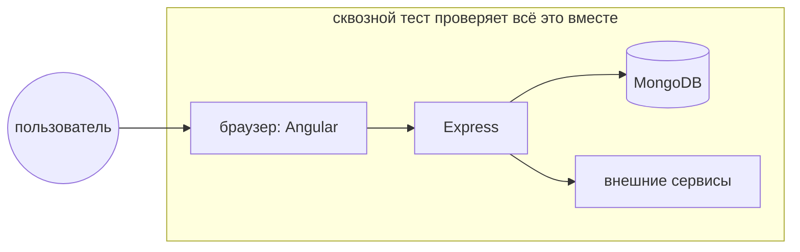

# 11_1 — Сквозное (end-to-end) тестирование: конспект

**Курс:** 3813ICT, недели 10–11
**Источник:** `11_1_-_End_to_End_Testing_.pdf` (12 слайдов)
**Связанные файлы:** [поправки](11_1-e2e-basics-popravki.md) · [примеры](11_1-e2e-basics-primery.md) · [вопросы](11_1-e2e-basics-voprosy.md) · [ответы](11_1-e2e-basics-otvety.md) · назад: [10_4](10_4-testable-code-konspekt.md) · дальше: [11_2 Protractor](11_2-protractor-konspekt.md)

> Значок **⚠** со ссылкой вида **П-N** ведёт в файл поправок. Там разобрано, где исходный материал курса расходится с официальной документацией, со ссылкой на источник.

**Содержание**

1. [Что такое сквозное тестирование](#s1)
2. [Сквозное и системное тестирование](#s2)
3. [Зачем оно нужно](#s3)
4. [Как проектировать сквозные тесты](#s4): [этапы](#s4-1) · [функции пользователя](#s4-2) · [условия](#s4-3) · [тест-кейсы](#s4-4)
5. [Сценарии для страницы входа](#s5)
6. [Ключевые факты](#s6)

---

## 1. Что такое сквозное тестирование

Модульные тесты (10_2, 10_3) проверяют части по отдельности, интеграционные — связку сервера и базы. Но пользователь видит не части, а приложение целиком: он открывает страницу, вводит пароль, нажимает кнопку — и ждёт, что попадёт на нужную страницу. Проверить, что вся цепочка работает вместе, — задача сквозных тестов.

**Сквозное тестирование** (end-to-end, E2E) — проверка полного сценария использования системы от начала до конца: через интерфейс, вместе со всеми частями — клиентом, сервером, базой и внешними системами.

Материал добавляет:

- цель — выполнить сценарий, максимально похожий на реальную работу;
- проверяется не только сама система, но и её связь с внешними интерфейсами и системами «до» и «после» неё;
- тестирование ведётся в среде, похожей на рабочую, на данных, похожих на реальные. ⚠ [П-2](11_1-e2e-basics-popravki.md#p-2)

Второе название — **цепное тестирование** (chain testing): проверяется вся цепочка.

---

## 2. Сквозное и системное тестирование

Материал сравнивает сквозное тестирование с **системным** — проверкой готовой системы на соответствие спецификации:

| Сквозное | Системное |
|---|---|
| проверяет систему и связанные с ней подсистемы | проверяет только саму систему по требованиям |
| проверяет весь процесс от начала до конца | проверяет функции и возможности |
| учитываются все интерфейсы и серверные системы | учитываются функциональные и нефункциональные требования |
| выполняется после системного | выполняется после интеграционного |
| проверяет внешние интерфейсы, которые сложно автоматизировать, поэтому предпочтительно ручное | возможно и ручное, и автоматическое |

Разница в охвате передана верно. Но последняя строка устарела: в веб-разработке сквозные тесты **автоматизируют** — инструменты вроде Cypress и Playwright управляют настоящим браузером (этим заняты 11_2 и 11_3), а запускают их не «после системного тестирования», а при каждом изменении кода. ⚠ [П-1](11_1-e2e-basics-popravki.md#p-1)

---

## 3. Зачем оно нужно

Современные системы сложны и связаны со множеством подсистем, часть которых принадлежит другим организациям. Если откажет одна, может упасть вся система. Сквозной тест проверяет полный путь данных, увеличивает покрытие подсистем и повышает уверенность в продукте целиком.

Для итогового проекта это значит: модульные тесты могут пройти и у клиента, и у сервера, но приложение всё равно не работает — клиент шлёт `PUT`, а сервер ждёт `POST` ([9_2 П-6](../week9/9_2-mongodb-angular-popravki.md#p-6)). Такое несовпадение находит именно сквозной тест.

Цена — скорость и хрупкость: сквозные тесты медленные и зависят от многих частей сразу. Поэтому их пишут для **главных** сценариев, а детали проверяют модульными тестами ([10_1 §3](10_1-testing-basics-konspekt.md#s3)).

---

## 4. Как проектировать сквозные тесты

### 4.1 Этапы

Материал показывает процесс так: требования → проектирование E2E → проектирование компонентов → разработка → сквозное тестирование (настройка среды, проектирование и выполнение тестов). Работы на этом пути:

- изучить требования к сквозному тестированию;
- настроить тестовую среду: оборудование и программы;
- описать все системы и подсистемы и их процессы;
- распределить роли и ответственность;
- выбрать методику и стандарты тестирования;
- отслеживать требования и проектировать тест-кейсы;
- определить входные и выходные данные для каждой системы.

Само проектирование тестов состоит из трёх шагов: **функции пользователя → условия → тест-кейсы**.

### 4.2 Функции пользователя

Сначала перечисляют, что пользователь может делать:

- перечислить функции системы и связанные с ними компоненты;
- для каждой — входные данные, действие и результат;
- найти связи между функциями;
- определить, какие функции независимы, а какие используются повторно (например, «войти» нужна перед почти всеми остальными).

### 4.3 Условия

Для каждой функции составляют **условия** — варианты, в которых её нужно проверить, включая порядок действий, время и данные. Для страницы входа материал приводит: неверные имя и пароль, верные имя и пароль, проверка сложности пароля, сообщения об ошибках.

### 4.4 Тест-кейсы

**Сценарий** (test scenario, test condition) — любая возможность системы, которую можно проверить; тестировщик ставит себя на место пользователя и ищет реальные случаи использования. Для каждого сценария строят один или несколько **тест-кейсов**; часто каждое условие — отдельный тест-кейс.

---

## 5. Сценарии для страницы входа

Вот сценарии из материала — хороший образец того, как формулировать сквозные тесты: от лица пользователя и с наблюдаемым результатом:

| № | Сценарий | Ожидаемый результат |
|---|---|---|
| 1 | пользователь открывает приложение | видит стандартную «публичную» страницу |
| 2 | неавторизованный пользователь открывает защищённую страницу (`/protected`) | перенаправлен на страницу входа |
| 3 | вход с неверными данными | остаётся на странице входа и видит сообщение об ошибке |
| 4 | успешный вход | перенаправлен на «публичную» страницу |
| 5 | вошедший пользователь открывает защищённую страницу | попадает на неё |

Каждая строка — отдельный тест: он начинается с известного состояния (вошёл или нет), выполняет действия через интерфейс и проверяет то, что видит пользователь: адрес страницы, текст, сообщение. Как эти сценарии выглядят в коде, — в [11_2](11_2-protractor-konspekt.md#s5) (устаревший Protractor) и [11_3](11_3-cypress-konspekt.md#s6) (Cypress).

Для итогового проекта те же сценарии ложатся на гарды из [5_1](../week5/5_1-data-persistence-primery.md#ex-1): сценарии 2 и 5 проверяют `authGuard`, сценарий 3 — обработку `401`.

---

## 6. Ключевые факты

- Сквозной тест проверяет полный сценарий через интерфейс вместе с сервером, базой и внешними системами.
- Системный тест — только сама система по требованиям; сквозной — вся цепочка.
- В веб-разработке сквозные тесты автоматизируют (Cypress, Playwright) и запускают при каждом изменении.
- Проектирование: функции пользователя → условия → тест-кейсы.
- Сценарий формулируют от лица пользователя с наблюдаемым результатом (адрес, текст, сообщение).
- Сквозные тесты медленные и хрупкие — ими покрывают главные сценарии, детали — модульными тестами.
- Тестовая среда похожа на рабочую, но данные в ней — тестовые, а не реальные данные пользователей.
