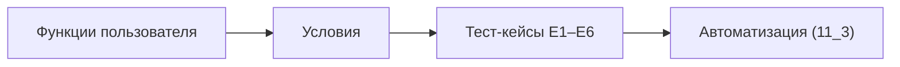
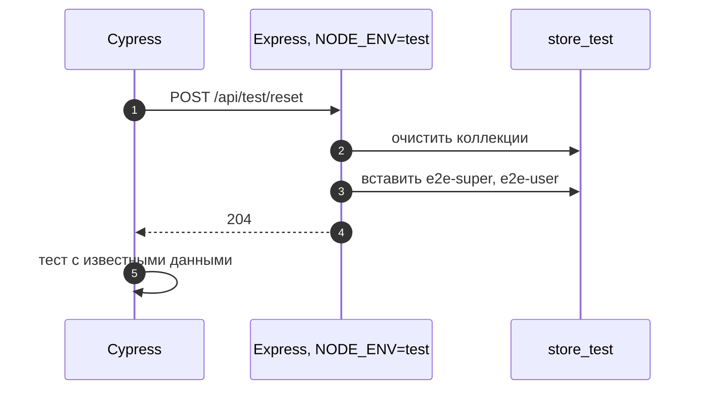

# 11_1 — Сквозное (end-to-end) тестирование: примеры использования

**Курс:** 3813ICT, недели 10–11
**Связанные файлы:** [конспект](11_1-e2e-basics-konspekt.md) · [поправки](11_1-e2e-basics-popravki.md) · [вопросы](11_1-e2e-basics-voprosy.md) · [ответы](11_1-e2e-basics-otvety.md)

Примеры превращают теорию 11_1 в план сквозных тестов итогового проекта и показывают, как готовить для них данные. Код тестов — в [11_3](11_3-cypress-konspekt.md).

> **Диаграммы.** В Obsidian mermaid рендерится сам. В VS Code нужно расширение **Markdown Preview Mermaid Support**.

---

<a id="ex-0"></a>

## Что проверять сквозным тестом, а что — нет

| Проверка | Сквозной тест? | Почему |
|---|---|---|
| вход → переход на страницу каналов | да | главный сценарий, проходит через все слои |
| гость не попадает на `/admin` | да | работа гардов в настоящем браузере |
| все варианты ошибок проверки имени товара | нет — модульный | много мелких случаев, сквозной тест медленный |
| формат даты «5 мин назад» | нет — модульный | чистая логика |
| сообщение из одной вкладки появляется в другой | да (или два клиента) | сокеты, сервер и интерфейс вместе |

| Пример | Что показывает |
|---|---|
| [1. План сквозных тестов чата](#ex-1) | функции пользователя → условия → тест-кейсы |
| [2. Тестовые данные для сквозных тестов](#ex-2) | сброс и заполнение базы только в тестовой среде |

---

<a id="ex-1"></a>

## Пример 1 — План сквозных тестов чата

**Когда использовать:** перед тем как писать сквозные тесты итогового проекта. Три шага из материала — функции, условия, тест-кейсы — дают список тестов, которые стоит автоматизировать.

**Где в конспекте:** [§4 Как проектировать](11_1-e2e-basics-konspekt.md#s4) · [§5 Сценарии входа](11_1-e2e-basics-konspekt.md#s5)

**Шаг 1. Функции пользователя**

| Функция | Вход | Действие | Результат | Зависит от |
|---|---|---|---|---|
| войти | имя, пароль | форма входа | переход на `/channels` | — |
| выйти | — | кнопка «Выйти» | переход на `/login` | войти |
| создать группу | название | форма на `/admin` | группа в списке | войти (роль admin) |
| отправить сообщение | текст | форма в канале | сообщение в ленте | войти |

**Шаг 2. Условия для «войти»**

- верные имя и пароль;
- неверный пароль;
- пустые поля;
- сервер недоступен;
- гость открывает защищённую страницу напрямую.

**Шаг 3. Тест-кейсы**

| № | Начальное состояние | Действия | Проверка |
|---|---|---|---|
| E1 | гость, `/login` | ввести `e2e-user` / `test-123`, «Войти» | адрес `/channels`, в шапке имя пользователя |
| E2 | гость, `/login` | ввести `e2e-user` / `wrong`, «Войти» | адрес `/login`, текст «Неверное имя или пароль» |
| E3 | гость, `/login` | ничего не вводить | кнопка «Войти» заблокирована |
| E4 | гость | открыть `/channels` | адрес `/login` |
| E5 | вошёл как `e2e-user` | открыть `/admin` | адрес `/channels` (нет прав) |
| E6 | вошёл как `e2e-super` | создать группу «E2E Group» | группа в списке; после F5 — тоже |



### Последовательность

1. Перечислены функции и их зависимости — «войти» нужна почти всем.
2. Для каждой функции записаны условия, включая ошибки и прямой переход по адресу.
3. Каждое условие стало тест-кейсом с начальным состоянием, действиями и наблюдаемой проверкой.
4. Проверки — только то, что видит пользователь: адрес, текст, доступность кнопки.
5. Кейсы с разными ролями (E5, E6) требуют разных тестовых пользователей — их готовит пример 2.

---

<a id="ex-2"></a>

## Пример 2 — Тестовые данные для сквозных тестов

**Когда использовать:** сквозным тестам нужны известные пользователи и группы. Их создают перед запуском, в отдельной тестовой базе, и никогда — в рабочей.

**Где в конспекте:** [§1 Что такое сквозное тестирование](11_1-e2e-basics-konspekt.md#s1) · [П-2](11_1-e2e-basics-popravki.md#p-2)

```js
// ═════ server/routes/test-support.js — подключается ТОЛЬКО при NODE_ENV=test ═════
const express = require('express');
const { getDb } = require('../db');
const router = express.Router();

// POST /api/test/reset — очистить и заполнить тестовую базу известными данными
router.post('/reset', async (req, res) => {
  const db = getDb();
  await Promise.all([
    db.collection('users').deleteMany({}),
    db.collection('groups').deleteMany({}),
    db.collection('messages').deleteMany({}),
  ]);
  await db.collection('users').insertMany([
    { _id: 1, username: 'e2e-super', pwd: 'test-123', role: 'superadmin' },
    { _id: 2, username: 'e2e-user', pwd: 'test-123', role: 'user' },
  ]);
  res.status(204).end();
});

module.exports = router;

// ═════ server/app.js (фрагмент) ═════
// if (process.env.NODE_ENV === 'test') {
//   app.use('/api/test', require('./routes/test-support'));    // в рабочей сборке маршрута нет
// }

// ═════ cypress/support/e2e.ts — перед каждым тестом известное состояние ═════
// beforeEach(() => {
//   cy.request('POST', 'http://localhost:3000/api/test/reset');
// });
```

### Последовательность

1. Сервер для сквозных тестов запускается с `NODE_ENV=test` и тестовой базой (`store_test`, как в [10_2](10_2-mocha-primery.md#ex-1)).
2. Только в этом режиме подключается маршрут `/api/test/reset`.
3. Перед каждым тестом Cypress вызывает его через `cy.request` — база очищается и заполняется известными пользователями.
4. Тест начинается с одинакового состояния, независимо от того, что делали предыдущие тесты.
5. В рабочей сборке маршрута нет — сбросить рабочую базу через него невозможно.


