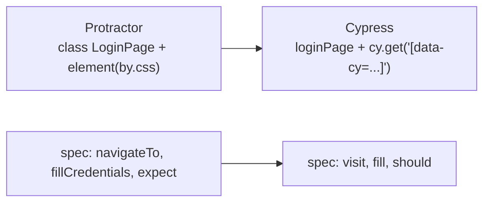
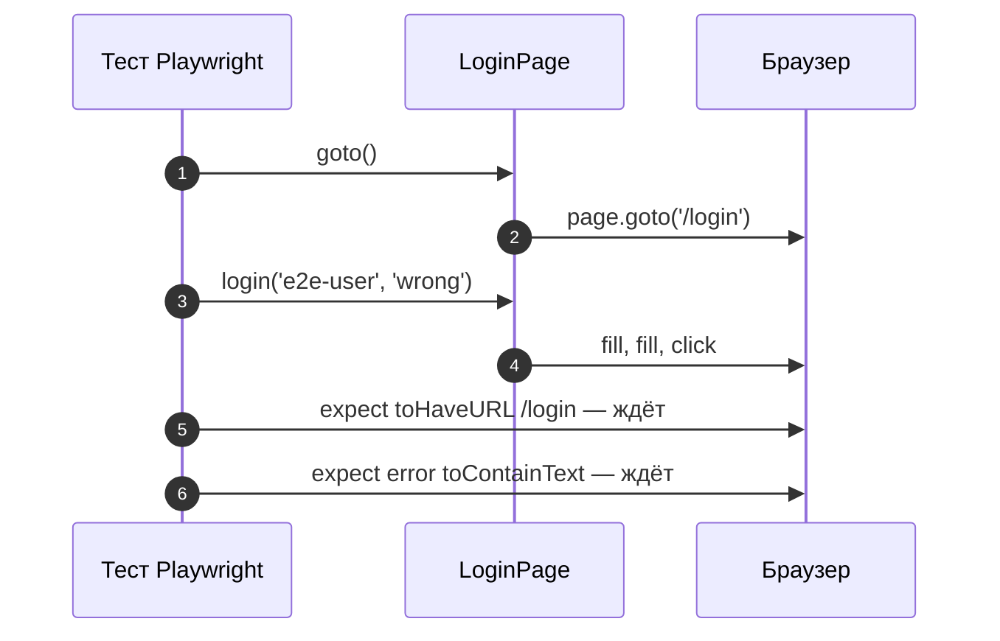

# 11_2 — Protractor: сквозные тесты Angular (устаревший подход): примеры использования

**Курс:** 3813ICT, недели 10–11
**Связанные файлы:** [конспект](11_2-protractor-konspekt.md) · [поправки](11_2-protractor-popravki.md) · [вопросы](11_2-protractor-voprosy.md) · [ответы](11_2-protractor-otvety.md)

Protractor устарел, поэтому примеры показывают, как перенести его идеи — Page Object и сценарии входа — в современные инструменты.

> **Диаграммы.** В Obsidian mermaid рендерится сам. В VS Code нужно расширение **Markdown Preview Mermaid Support**.

---

<a id="ex-0"></a>

## Какой инструмент выбрать вместо Protractor

| | Cypress | Playwright |
|---|---|---|
| Как подключить в Angular | `ng add @cypress/schematic` | `npm init playwright@latest` (или через `ng e2e`) |
| Стиль тестов | очередь команд `cy.*`, Mocha + Chai | `async`/`await`, свой тест-раннер |
| Браузеры | Chrome/Chromium, Firefox, Edge, Electron (WebKit — экспериментально) | Chromium, Firefox, WebKit |
| Подмена сети | `cy.intercept` | `page.route` |
| В курсе | да, 11_3 | нет |

| Пример | Что показывает |
|---|---|
| [1. Сценарии входа: Protractor → Cypress](#ex-1) | тот же Page Object и те же тесты на Cypress |
| [2. Тот же Page Object на Playwright](#ex-2) | класс страницы, `await`, проверки с ожиданием |

---

<a id="ex-1"></a>

## Пример 1 — Сценарии входа: Protractor → Cypress

**Когда использовать:** в проекте или материалах есть тесты Protractor, и их нужно перенести. Структура (Page Object + spec) сохраняется, меняются команды.

**Где в конспекте:** [§4 Page Object](11_2-protractor-konspekt.md#s4) · [§6 Чем пользоваться сейчас](11_2-protractor-konspekt.md#s6)

```ts
// ═════ cypress/support/pages/login.page.ts — Page Object ═════
export interface Credentials { username: string; password: string; }

export const loginPage = {
  visit: () => cy.visit('/login'),
  fill: ({ username, password }: Credentials) => {
    cy.get('[data-cy=username]').type(username);
    cy.get('[data-cy=password]').type(password);
    cy.get('[data-cy=submit]').click();
  },
  title: () => cy.get('[data-cy=page-title]'),
  error: () => cy.get('[data-cy=login-error]'),
};

// ═════ cypress/e2e/login.cy.ts ═════
import { loginPage } from '../support/pages/login.page';

describe('Страница входа', () => {
  beforeEach(() => {
    cy.request('POST', 'http://localhost:3000/api/test/reset');   // известные данные (11_1, пример 2)
    cy.clearAllSessionStorage();                                   // не зависим от прошлых тестов
  });

  it('при неверных данных остаётся на странице входа и видит ошибку', () => {
    loginPage.visit();
    loginPage.fill({ username: 'e2e-user', password: 'wrong' });
    cy.url().should('include', '/login');
    loginPage.error().should('contain.text', 'Неверное имя или пароль');
  });

  it('гость, открывший защищённую страницу, попадает на вход', () => {
    cy.visit('/channels');
    cy.url().should('include', '/login');
  });

  it('после успешного входа открывается страница каналов', () => {
    loginPage.visit();
    loginPage.fill({ username: 'e2e-user', password: 'test-123' });
    cy.url().should('include', '/channels');
  });
});
```

### Последовательность

1. Page Object — объект с методами вместо класса с `element(by.css(...))`; селекторы — атрибуты `data-cy`.
2. `beforeEach` сбрасывает тестовую базу и хранилище — вместо ручного «выйти перед тестом».
3. Тесты вызывают методы Page Object — сценарии читаются как в Protractor.
4. Проверки `should(...)` Cypress сам повторяет, пока условие не выполнится или не истечёт время; `await` и control flow не нужны.



---

<a id="ex-2"></a>

## Пример 2 — Тот же Page Object на Playwright

**Когда использовать:** если для сквозных тестов выбран Playwright. Page Object здесь — класс, как в Protractor, но с `await` и проверками, которые ждут сами.

**Где в конспекте:** [§4 Page Object](11_2-protractor-konspekt.md#s4) · [§6 Чем пользоваться сейчас](11_2-protractor-konspekt.md#s6)

```ts
// ═════ e2e/pages/login.page.ts ═════
import { type Page, type Locator } from '@playwright/test';

export class LoginPage {
  readonly username: Locator;
  readonly password: Locator;
  readonly submit: Locator;
  readonly error: Locator;

  constructor(private page: Page) {
    this.username = page.getByTestId('username');     // data-testid="username"
    this.password = page.getByTestId('password');
    this.submit = page.getByRole('button', { name: 'Войти' });
    this.error = page.getByTestId('login-error');
  }

  async goto() { await this.page.goto('/login'); }

  async login(username: string, password: string) {
    await this.username.fill(username);
    await this.password.fill(password);
    await this.submit.click();
  }
}

// ═════ e2e/login.spec.ts ═════
import { test, expect } from '@playwright/test';
import { LoginPage } from './pages/login.page';

test.beforeEach(async ({ request }) => {
  await request.post('http://localhost:3000/api/test/reset');
});

test('неверный пароль — ошибка и остаёмся на /login', async ({ page }) => {
  const login = new LoginPage(page);
  await login.goto();
  await login.login('e2e-user', 'wrong');
  await expect(page).toHaveURL(/\/login/);
  await expect(login.error).toContainText('Неверное имя или пароль');
});

test('верные данные — переход на /channels', async ({ page }) => {
  const login = new LoginPage(page);
  await login.goto();
  await login.login('e2e-user', 'test-123');
  await expect(page).toHaveURL(/\/channels/);
});
```

### Последовательность

1. Page Object получает объект `page` и заранее описывает **локаторы** — способы найти элементы.
2. `getByTestId` и `getByRole` устойчивее селекторов по классам: первый ищет по `data-testid`, второй — как пользователь, по роли и подписи.
3. Перед каждым тестом база сбрасывается запросом через встроенный `request`.
4. Методы Page Object выполняют действия с `await`.
5. `expect(...).toHaveURL` и `toContainText` сами ждут, пока условие выполнится.


