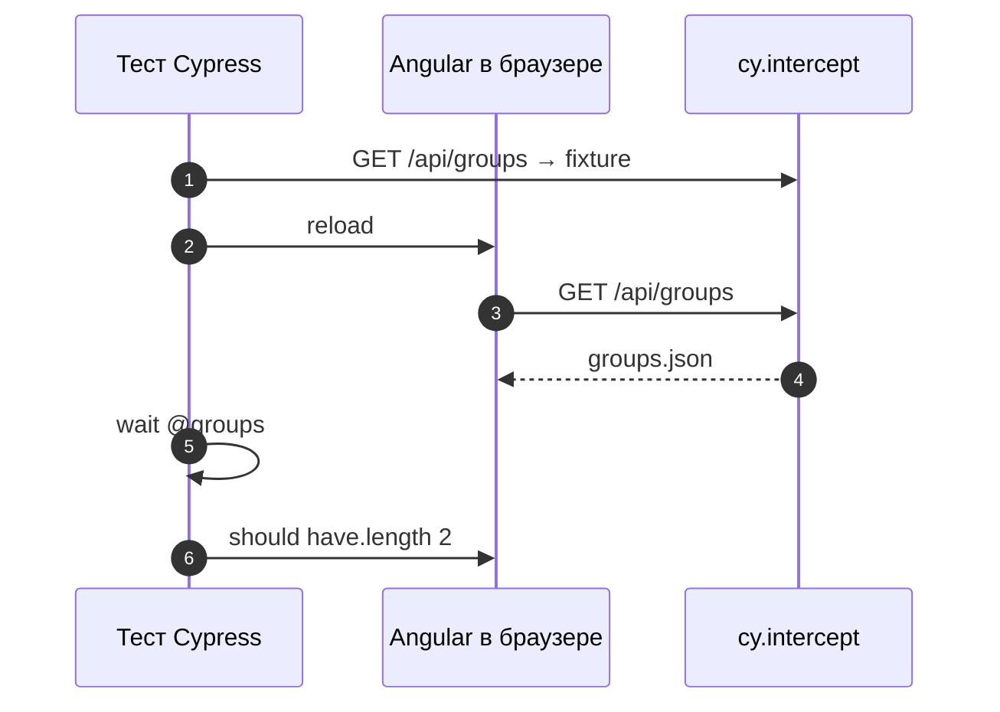
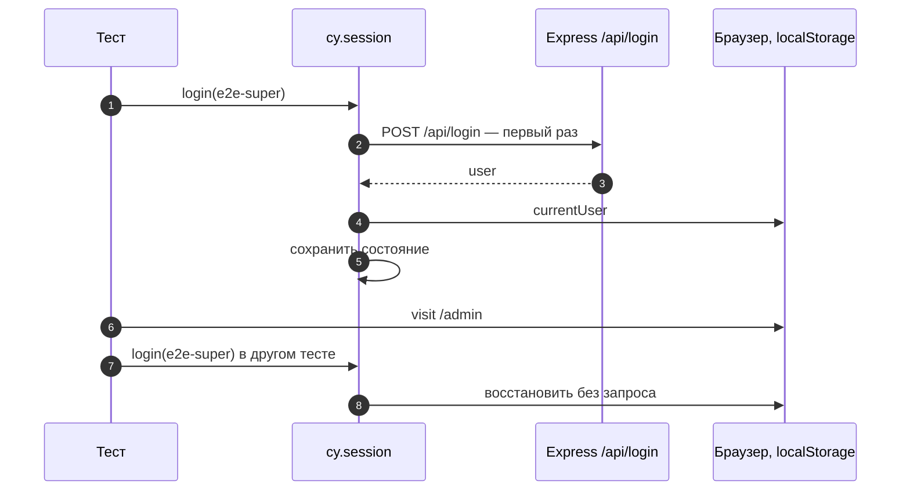

# 11_3 — Cypress: сквозные тесты Angular: примеры использования

**Курс:** 3813ICT, недели 10–11
**Связанные файлы:** [конспект](11_3-cypress-konspekt.md) · [поправки](11_3-cypress-popravki.md) · [вопросы](11_3-cypress-voprosy.md) · [ответы](11_3-cypress-otvety.md)

Примеры — опорные куски для сквозных тестов итогового проекта: как отделить интерфейс от сервера и как не повторять вход в каждом тесте.

> **Диаграммы.** В Obsidian mermaid рендерится сам. В VS Code нужно расширение **Markdown Preview Mermaid Support**.

---

<a id="ex-0"></a>

## Настоящий сервер или подменённый ответ

| | Настоящий сервер (full-stack) | `cy.intercept` (подмена) |
|---|---|---|
| Что проверяет | всю цепочку: Angular + Express + MongoDB | только Angular: как интерфейс реагирует на ответы |
| Что нужно | запущенный сервер с тестовой базой и сбросом данных | ничего, кроме `ng serve` |
| Скорость и стабильность | медленнее, зависит от сервера | быстрее, стабильнее |
| Ошибки сервера (`500`, таймаут) | трудно вызвать | одна строка |
| Когда | несколько главных сценариев | состояния интерфейса, ошибки, пустые списки |

| Пример | Что показывает |
|---|---|
| [1. Интерфейс с подменённым API](#ex-1) | `cy.intercept`, fixture, ожидание запроса, ошибка `500` |
| [2. Своя команда входа и сессия](#ex-2) | `Cypress.Commands.add`, вход через API, `cy.session` |

---

<a id="ex-1"></a>

## Пример 1 — Интерфейс с подменённым API

**Когда использовать:** проверить, как страница групп показывает данные, пустой список и ошибку сервера, — без Express и MongoDB. Cypress перехватывает запрос браузера и отвечает заготовкой.

**Где в конспекте:** [§3 Как пишутся тесты](11_3-cypress-konspekt.md#s3) · [П-4](11_3-cypress-popravki.md#p-4)

```jsonc
// ═════ cypress/fixtures/groups.json ═════
[
  { "_id": "g1", "name": "Study Group" },
  { "_id": "g2", "name": "Random" }
]
```

```ts
// ═════ cypress/e2e/groups.cy.ts ═════
describe('Страница групп (API подменён)', () => {
  beforeEach(() => {
    // гарду нужен вошедший пользователь — кладём его в хранилище до загрузки приложения
    cy.visit('/groups', {
      onBeforeLoad(win) {
        win.localStorage.setItem('currentUser', JSON.stringify({ id: 2, username: 'anna', role: 'groupadmin' }));
      },
    });
  });

  it('показывает группы из ответа сервера', () => {
    cy.intercept('GET', '/api/groups', { fixture: 'groups.json' }).as('groups');
    cy.reload();                                        // запрос уйдёт уже после установки перехвата
    cy.wait('@groups');                                 // дождаться именно этого запроса
    cy.get('[data-cy=group-item]').should('have.length', 2);
    cy.contains('[data-cy=group-item]', 'Study Group');
  });

  it('показывает «Групп нет» для пустого списка', () => {
    cy.intercept('GET', '/api/groups', []).as('groups');
    cy.reload();
    cy.wait('@groups');
    cy.contains('Групп нет');
  });

  it('показывает ошибку при 500', () => {
    cy.intercept('GET', '/api/groups', { statusCode: 500, body: { error: 'Server error' } }).as('groups');
    cy.reload();
    cy.wait('@groups');
    cy.get('[data-cy=error]').should('be.visible');
  });

  it('отправляет правильное тело при создании', () => {
    cy.intercept('GET', '/api/groups', []);
    cy.intercept('POST', '/api/groups', { statusCode: 201, body: { _id: 'g3', name: 'New' } }).as('create');
    cy.reload();
    cy.get('[data-cy=new-group]').type('New');
    cy.get('[data-cy=create-group]').click();
    cy.wait('@create').its('request.body').should('deep.equal', { name: 'New' });   // проверка запроса
    cy.contains('[data-cy=group-item]', 'New');
  });
});
```

### Последовательность

1. `onBeforeLoad` кладёт пользователя в localStorage до запуска приложения — гард пропускает на `/groups`.
2. `cy.intercept` регистрирует перехват `GET /api/groups` с ответом из fixture, пустым массивом или ошибкой `500`.
3. `cy.reload()` перезагружает страницу — её запрос попадает в перехват.
4. `cy.wait('@groups')` ждёт именно этот запрос, а не угадывает время.
5. Проверки смотрят на видимый результат: число строк, текст, сообщение об ошибке.
6. В последнем тесте `cy.wait('@create').its('request.body')` проверяет, что интерфейс отправил на сервер правильные данные.



---

<a id="ex-2"></a>

## Пример 2 — Своя команда входа и сессия

**Когда использовать:** почти всем сквозным тестам нужен вошедший пользователь. Входить через форму в каждом тесте медленно и повторяет один и тот же код. Своя команда входит через API, а `cy.session` запоминает результат и восстанавливает его в следующих тестах.

**Где в конспекте:** [§6.3 Исправленная версия](11_3-cypress-konspekt.md#s6-3) · [11_1, пример 2](11_1-e2e-basics-primery.md#ex-2)

```ts
// ═════ cypress/support/commands.ts ═════
declare global {
  namespace Cypress {
    interface Chainable {
      login(username: string, password: string): Chainable<void>;
    }
  }
}

Cypress.Commands.add('login', (username: string, password: string) => {
  cy.session([username, password], () => {                    // выполнится один раз на пару данных
    cy.request('POST', 'http://localhost:3000/api/login', { username, pwd: password })
      .its('body.user')
      .then((user) => {
        // тот же формат, что пишет AuthService (6_2 недели 5): одна JSON-запись
        window.localStorage.setItem('currentUser', JSON.stringify(user));
      });
  });
});

export {};

// ═════ cypress/support/e2e.ts ═════
import './commands';

// ═════ cypress/e2e/admin.cy.ts ═════
describe('Администрирование', () => {
  before(() => {
    cy.request('POST', 'http://localhost:3000/api/test/reset');   // известные пользователи
  });

  it('суперадмин видит страницу администрирования', () => {
    cy.login('e2e-super', 'test-123');
    cy.visit('/admin');
    cy.url().should('include', '/admin');
  });

  it('обычный пользователь перенаправляется на /channels', () => {
    cy.login('e2e-user', 'test-123');
    cy.visit('/admin');
    cy.url().should('include', '/channels');
  });
});
```

Сам вход через форму проверяется один раз — отдельным тестом из [конспекта §6.3](11_3-cypress-konspekt.md#s6-3).

### Последовательность

1. В `commands.ts` объявлен тип новой команды и её реализация.
2. `cy.login` вызывает `cy.session` с ключом — именем и паролем.
3. При первом вызове выполняется функция настройки: запрос `POST /api/login` к серверу и запись пользователя в localStorage.
4. Cypress сохраняет получившиеся cookies и хранилища под этим ключом.
5. При следующем `cy.login` с теми же данными настройка не повторяется — Cypress восстанавливает сохранённое состояние.
6. Тест открывает защищённую страницу уже вошедшим пользователем и проверяет работу гарда ролей.


