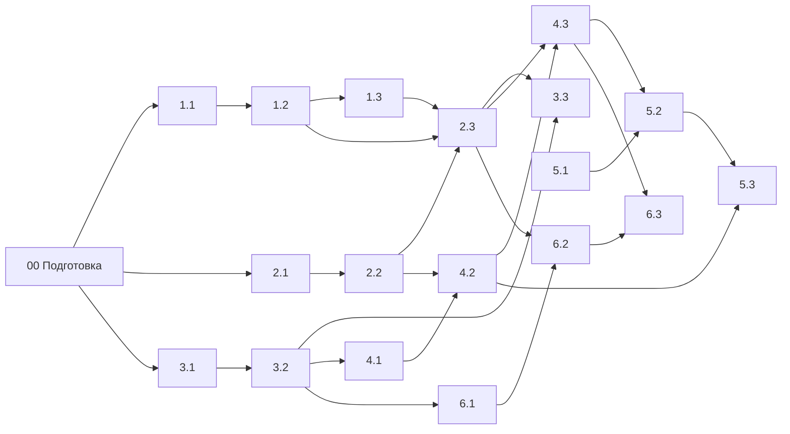

# 3813ICT — Неделя 5: практика

Конспекты объясняют, как всё устроено, но в памяти остаётся то, что ты сделал руками. Поэтому каждая тема недели 5 закрепляется тремя заданиями: от короткого упражнения на базовый концепт до рабочего куска, который встанет в Phase 2.

Задания не разрознены — они строят одно приложение, **chat-practice**. Каждое следующее опирается на предыдущие, и к концу недели у тебя будет работающий скелет чата.

## Что получится в конце

- вход по имени и паролю через Express-сервер, пользователь переживает F5, маршруты закрыты гардами по ролям;
- группы, каналы и сообщения, которые Angular получает и меняет через `HttpClient`;
- лента сообщений с разными типами, подгрузкой старых сообщений и своими директивами;
- страница профиля, которая безопасно сохраняет данные в JSON-файл на сервере;
- два режима запуска: разработка (`ng serve` + прокси) и сборка на одном сервере (single origin).

## Как устроен бандл

- **[00-setup](00-setup/README.md)** — один раз создаёшь проект `chat-practice`, в котором делаются все задания.
- **Шесть тем** по файлам недели 5, в каждой три задания по нарастающей: базовый концепт → связка концептов → рабочий кусок Phase 2.
- В папке задания лежит **только README**. Все файлы ты создаёшь сам в проекте `chat-practice` — куда именно, сказано в разделе «Старт».
- **[materials](materials/README.md)** — конспекты, поправки, примеры, вопросы и ответы по неделе 5. Ссылки из заданий ведут прямо в нужные разделы.

## Порядок и связи

Стрелка означает «опирается на»: код из одного задания используется в следующем.

Проще всего идти по порядку тем. Тема 5 (шаблоны) частично независима: задание 5.1 можно делать в любой момент.

## Как работать с заданием

1. **Прочитай «Задачу» и «Зачем».** Там объяснено, какую проблему приложения решает задание и куда его результат встанет дальше.
2. **Выполни «Старт»** — создай нужные файлы и установи пакеты.
3. **Делай «Что сделать» по частям.** Застрял — сначала «Наводящие вопросы», потом ссылки из «Материалов».
4. **Проверь себя по «Критериям готовности».** Вопросы в критериях — по памяти.
5. **Пришли решение в чат**: код и ответы на вопросы из критериев. Разберём ошибки и пойдём дальше.
6. **Только после этого** открой «Сверку после попытки» — там похожее готовое решение из материалов. Если открыть его раньше, задание превратится в переписывание.

## Правила

- Отвечай по памяти. Если не знаешь — так и пиши «не знаю»: это честнее и полезнее догадки.
- Если в задании встретился концепт, которого не было в материалах, скажи — сначала будет пример, потом практика.
- Не смотри готовые решения в интернете и в файлах примеров до первой собственной попытки.
- Не стремись к идеальному дизайну: стили — по минимуму, главное — логика.

## Как открыть

- **VS Code:** открой папку бандла, README смотри в превью (`Ctrl+Shift+V`, на Mac `Cmd+Shift+V`). Ссылки прыгают прямо к разделам материалов. Для диаграмм нужно расширение **Markdown Preview Mermaid Support**.
- Папку `materials` не перемещай — ссылки на неё относительные.

## Задания

| Тема | 1 — базовый концепт | 2 — связка | 3 — кусок Phase 2 |
|---|---|---|---|
| [1. Хранилища браузера](01-storage/README.md) | [1.1 Хранилища в консоли](01-storage/01-console-storage/README.md) | [1.2 StorageService и настройки](01-storage/02-storage-service/README.md) | [1.3 Сессия пользователя без сервера](01-storage/03-user-session/README.md) |
| [2. Сервисы и DI](02-services/README.md) | [2.1 Один экземпляр на всех](02-services/01-one-instance/README.md) | [2.2 Состояние каналов в сервисе](02-services/02-channel-state/README.md) | [2.3 AuthService и гарды ролей](02-services/03-auth-guards/README.md) |
| [3. Хостинг и CORS](03-hosting/README.md) | [3.1 Поймать CORS](03-hosting/01-catch-cors/README.md) | [3.2 Прокси вместо CORS](03-hosting/02-proxy/README.md) | [3.3 Single origin и F5](03-hosting/03-single-origin/README.md) |
| [4. HTTP-запросы](04-http/README.md) | [4.1 Observable руками](04-http/01-observables/README.md) | [4.2 Группы через HttpClient](04-http/02-group-crud/README.md) | [4.3 Сообщения: страницы и перехватчик](04-http/03-messages/README.md) |
| [5. Шаблоны и директивы](05-templates/README.md) | [5.1 Разминка control flow](05-templates/01-control-flow/README.md) | [5.2 Лента сообщений](05-templates/02-message-feed/README.md) | [5.3 Свои директивы](05-templates/03-directives/README.md) |
| [6. Вход целиком](06-login/README.md) | [6.1 Вход на сервере](06-login/01-login-route/README.md) | [6.2 Вход из Angular](06-login/02-angular-login/README.md) | [6.3 Профиль и запись файла](06-login/03-profile/README.md) |

Модули Node, npm, Express и REST — материал недели 3. Здесь они используются, но не тренируются отдельно: код сервера, который не относится к теме задания, дан в «Старте» целиком.
