# 5_1 — Data Persistence: примеры использования

**Курс:** 3813ICT, неделя 5
**Связанные файлы:** [конспект](5_1-data-persistence-konspekt.md) · [поправки](5_1-data-persistence-popravki.md) · [вопросы](5_1-data-persistence-voprosy.md) · [ответы](5_1-data-persistence-otvety.md)

Каждый пример — рабочий кусок кода, на который можно сослаться при разработке. Он состоит из одного большого фрагмента (несколько файлов подряд, разделённых заголовками-комментариями), пошаговой последовательности и диаграмм. Примеры затрагивают и будущие темы (сервисы, HttpClient, гарды, Express): важнее реальный сценарий, чем строгие рамки одного файла курса.

> **Диаграммы.** В Obsidian mermaid рендерится сам. В VS Code для этого нужно расширение **Markdown Preview Mermaid Support**.

---

<a id="ex-0"></a>

## Какое хранилище выбрать

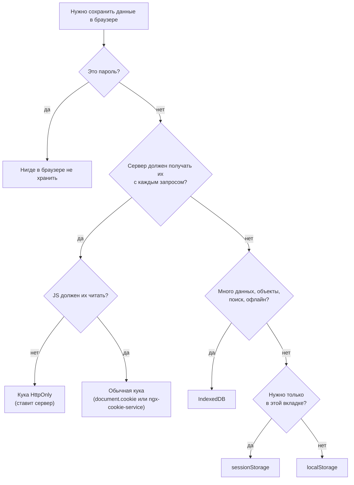

| Пример | Хранилище | Что показывает | Затрагивает темы |
|---|---|---|---|
| [1. Вход с ролями на localStorage](#ex-1) | localStorage | Главный сценарий Phase 2: логин, пользователь переживает F5, гарды по ролям, выход во всех вкладках | сервисы (5_2), HttpClient (5_4), гарды, Express |
| [2. Черновик сообщения в канале](#ex-2) | sessionStorage | Черновик на каждый канал, только в этой вкладке; хуки жизненного цикла | `@Input`/`@Output`, `@ViewChild` |
| [3. Сессия на HttpOnly-куке](#ex-3) | cookie (HttpOnly) | Твой вариант 1, исправленный: сервер ставит куку, восстановление сессии после F5 | Express, CORS (5_3), HttpClient |
| [4. Тема оформления в куке](#ex-4) | cookie (JS) | Твой вариант 2, перенесённый на подходящую задачу; `ngx-cookie-service` с `path` | сервисы, сигналы |
| [5. Заметки в IndexedDB](#ex-5) | IndexedDB | Твой NoteService, исправленный: `autoIncrement`, `@for`, обновление сигнала без перечитывания | сервисы, сигналы, `@for` (5_5) |

---

<a id="ex-1"></a>

## Пример 1 — Вход с ролями на localStorage

**Когда использовать:** основной вариант для чата в Phase 2. Пользователь логинится, сервер возвращает его данные без пароля, клиент хранит их в localStorage. После F5 пользователь остаётся залогиненным, маршруты закрыты гардами, выход в одной вкладке разлогинивает все остальные.

**Где в конспекте:** [§3.4 Объекты и JSON](5_1-data-persistence-konspekt.md#s3-4) · [§7 Безопасность](5_1-data-persistence-konspekt.md#s7) · [§8.1 Событие storage](5_1-data-persistence-konspekt.md#s8-1)

```ts
// ═════ src/app/models/user.ts ═════
export type Role = 'superadmin' | 'groupadmin' | 'user';

export interface User {
  id: number;
  username: string;
  email: string;
  role: Role;
  // пароля здесь нет и быть не должно: клиент его не хранит
}

// ═════ src/app/services/auth.service.ts ═════
import { Injectable, computed, inject, signal } from '@angular/core';
import { HttpClient } from '@angular/common/http';
import { Router } from '@angular/router';
import { Observable, tap } from 'rxjs';
import { Role, User } from '../models/user';

const STORAGE_KEY = 'currentUser';               // один ключ на всё приложение
const API = 'http://localhost:3000/api';         // при single-origin достаточно '/api'

@Injectable({ providedIn: 'root' })              // один экземпляр сервиса на всё приложение
export class AuthService {
  private http = inject(HttpClient);
  private router = inject(Router);

  // Начальное значение берём из localStorage → после F5 пользователь остаётся залогиненным
  readonly currentUser = signal<User | null>(this.readUser());
  // computed сам пересчитывается, когда меняется currentUser
  readonly isLoggedIn = computed(() => this.currentUser() !== null);

  constructor() {
    // Вход или выход в ДРУГОЙ вкладке того же origin → синхронизируем эту.
    // Во вкладке, которая сама изменила localStorage, событие не срабатывает.
    // (Если в проекте включён SSR — обернуть проверкой isPlatformBrowser, на сервере нет window.)
    window.addEventListener('storage', (event) => {
      if (event.key !== STORAGE_KEY && event.key !== null) return; // key === null → вызвали clear()
      this.currentUser.set(this.readUser());
      if (!this.currentUser()) this.router.navigateByUrl('/login');
    });
  }

  login(username: string, password: string): Observable<User> {
    // Пароль уходит на сервер и в браузере не сохраняется.
    // Сервер отвечает пользователем БЕЗ пароля.
    return this.http.post<User>(`${API}/login`, { username, password }).pipe(
      tap((user) => {
        localStorage.setItem(STORAGE_KEY, JSON.stringify(user)); // объект → JSON-строка
        this.currentUser.set(user);
      }),
    );
  }

  logout(): void {
    localStorage.removeItem(STORAGE_KEY);          // удаляем свой ключ, а не clear()
    this.currentUser.set(null);
    this.router.navigateByUrl('/login');
  }

  // Только для интерфейса: показать или скрыть кнопки.
  // Роль в localStorage легко подделать, права проверяет сервер.
  hasRole(...roles: Role[]): boolean {
    const user = this.currentUser();
    return user !== null && roles.includes(user.role);
  }

  private readUser(): User | null {
    try {
      const raw = localStorage.getItem(STORAGE_KEY); // строка или null
      return raw ? (JSON.parse(raw) as User) : null;
    } catch {
      // JSON испорчен (отредактировали руками) или хранилище недоступно
      return null;
    }
  }
}

// ═════ src/app/guards/auth.guards.ts ═════
import { inject } from '@angular/core';
import { CanActivateFn, Router } from '@angular/router';
import { AuthService } from '../services/auth.service';
import { Role } from '../models/user';

// Гард — функция. Роутер вызывает её ПЕРЕД открытием маршрута.
export const authGuard: CanActivateFn = () => {
  const auth = inject(AuthService);
  const router = inject(Router);
  // true — пускаем. UrlTree — роутер сам отменит этот переход и откроет /login
  return auth.isLoggedIn() || router.createUrlTree(['/login']);
};

// Гард получает (route, state). route.data — то, что записано в маршруте в поле data
export const roleGuard: CanActivateFn = (route) => {
  const auth = inject(AuthService);
  const router = inject(Router);
  const allowed = (route.data['roles'] ?? []) as Role[];
  return auth.hasRole(...allowed) || router.createUrlTree(['/groups']);
};

// ═════ src/app/app.routes.ts ═════
import { Routes } from '@angular/router';
import { authGuard, roleGuard } from './guards/auth.guards';
import { LoginComponent } from './pages/login/login.component';
import { GroupsComponent } from './pages/groups/groups.component';
import { AdminComponent } from './pages/admin/admin.component';

export const routes: Routes = [
  { path: 'login', component: LoginComponent },
  { path: 'groups', component: GroupsComponent, canActivate: [authGuard] },
  {
    path: 'admin',
    component: AdminComponent,
    canActivate: [authGuard, roleGuard],           // пустит, только если оба гарда пропустят
    data: { roles: ['superadmin', 'groupadmin'] }, // это читает roleGuard
  },
  { path: '', pathMatch: 'full', redirectTo: 'groups' },
];

// ═════ src/app/app.config.ts ═════
import { ApplicationConfig } from '@angular/core';
import { provideRouter } from '@angular/router';
import { provideHttpClient } from '@angular/common/http';
import { routes } from './app.routes';

export const appConfig: ApplicationConfig = {
  providers: [
    provideRouter(routes),
    provideHttpClient(),                           // без этого HttpClient не внедрится
  ],
};

// ═════ src/app/pages/login/login.component.ts ═════
import { Component, inject } from '@angular/core';
import { FormsModule } from '@angular/forms';
import { Router } from '@angular/router';
import { AuthService } from '../../services/auth.service';

@Component({
  selector: 'app-login',
  imports: [FormsModule],                          // нужен для ngModel и ngSubmit
  template: `
    <form (ngSubmit)="onSubmit()">
      <input [(ngModel)]="username" name="username" placeholder="Имя">
      <input [(ngModel)]="password" name="password" type="password" placeholder="Пароль">
      <button type="submit">Войти</button>
      @if (error) {
        <p class="error">{{ error }}</p>
      }
    </form>
  `,
})
export class LoginComponent {
  private auth = inject(AuthService);
  private router = inject(Router);

  username = '';
  password = '';
  error = '';

  onSubmit(): void {
    this.error = '';
    this.auth.login(this.username, this.password).subscribe({
      next: () => this.router.navigateByUrl('/groups'), // authGuard пропустит: сигнал уже true
      error: () => (this.error = 'Неверное имя или пароль'),
    });
  }
}

// ═════ src/app/components/header.component.ts ═════
import { Component, inject } from '@angular/core';
import { RouterLink } from '@angular/router';
import { AuthService } from '../services/auth.service';

@Component({
  selector: 'app-header',
  imports: [RouterLink],
  template: `
    @if (auth.currentUser(); as user) {
      <span>{{ user.username }} · {{ user.role }}</span>
      @if (auth.hasRole('superadmin', 'groupadmin')) {
        <a routerLink="/admin">Управление</a>
      }
      <button (click)="auth.logout()">Выйти</button>
    }
  `,
})
export class HeaderComponent {
  auth = inject(AuthService);                      // public — чтобы шаблон видел сервис
}

// ═════ server/routes/auth.js (Node + Express, JavaScript) ═════
// Подключение в server.js: app.use(cors()); app.use(express.json());
//                          app.use('/api', require('./routes/auth'));   → POST /api/login
const express = require('express');
const router = express.Router();
const { findUserByUsername } = require('../data/users');

router.post('/login', (req, res) => {
  const { username, password } = req.body;
  const user = findUserByUsername(username);
  if (!user || user.password !== password) {       // учебно; в реальности пароли хранят хэшем
    return res.status(401).json({ error: 'Invalid username or password' });
  }
  const { password: _omit, ...safeUser } = user;   // убираем пароль из ответа
  res.json(safeUser);
});

module.exports = router;
```

### Последовательность: вход

1. Пользователь вводит имя и пароль и жмёт «Войти».
2. `LoginComponent.onSubmit()` вызывает `auth.login()`.
3. `AuthService` отправляет `POST /api/login` с именем и паролем.
4. **Если пароль неверный:** сервер отвечает 401.
5. Observable завершается ошибкой, срабатывает обработчик `error` в компоненте.
6. Компонент показывает «Неверное имя или пароль».
7. **Если пароль верный:** сервер отвечает 200 и объектом пользователя без пароля.
8. В `tap` сервис сохраняет пользователя в localStorage через `JSON.stringify`.
9. Сервис кладёт пользователя в сигнал `currentUser`. `isLoggedIn` пересчитывается сам.
10. Компонент получает `next`.
11. Компонент просит роутер перейти на `/groups`.
12. Перед открытием маршрута роутер вызывает `authGuard`.
13. Гард читает `isLoggedIn()`.
14. Сервис отвечает `true`.
15. Гард возвращает `true`.
16. Роутер открывает страницу групп.

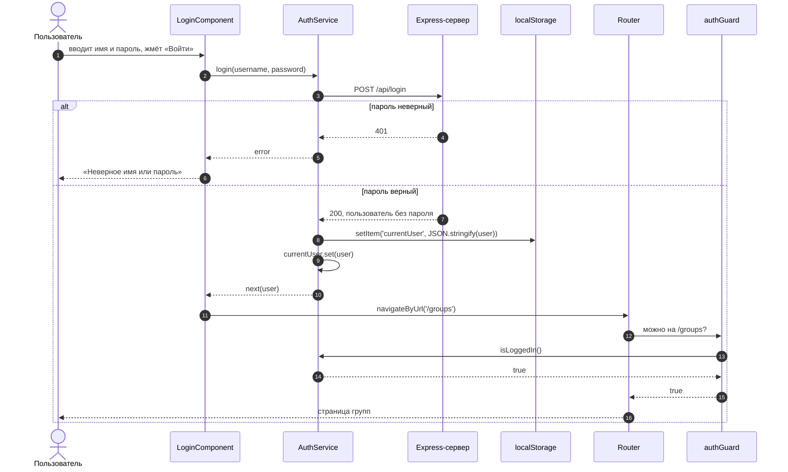

### Последовательность: перезагрузка страницы (F5)

1. Пользователь нажимает F5, находясь на `/groups`.
2. Память JS очищена, Angular запускается с нуля.
3. Гард первым делом внедряет `AuthService`, и сервис создаётся.
4. При создании сервис читает `currentUser` из localStorage.
5. localStorage возвращает JSON-строку с пользователем.
6. Сервис разбирает её и кладёт пользователя в сигнал.
7. Гард спрашивает `isLoggedIn()`.
8. Сервис отвечает `true`.
9. Гард пропускает.
10. Страница групп открывается без повторного логина.

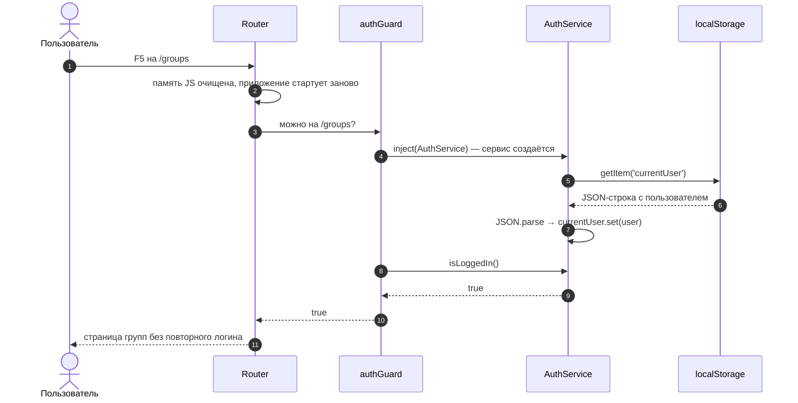

### Как гарды решают, пускать ли

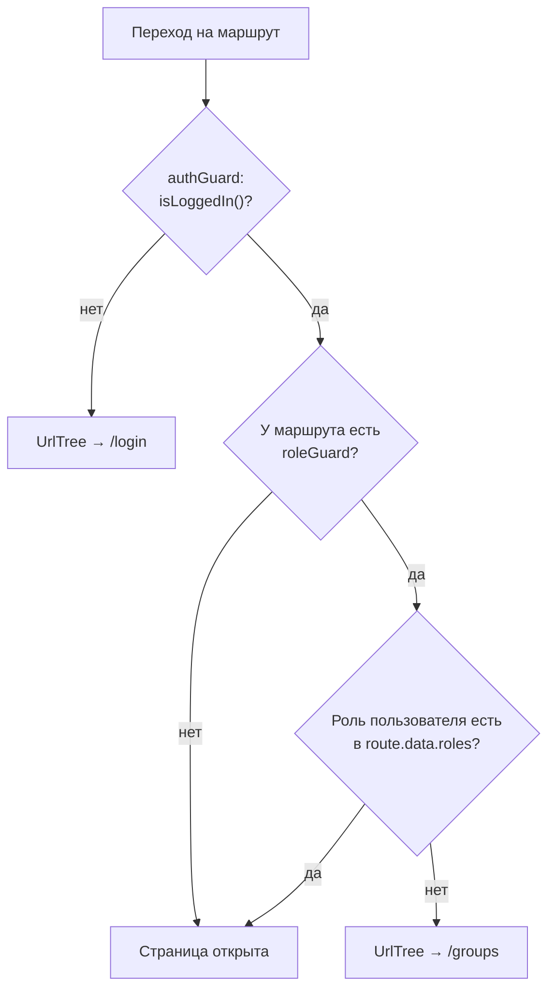

### Последовательность: выход в одной вкладке разлогинивает другие

1. Пользователь жмёт «Выйти» во вкладке A.
2. Вкладка A удаляет ключ `currentUser` из localStorage.
3. Браузер отправляет событие `storage` во все **остальные** вкладки этого origin.
4. Вкладка B перечитывает хранилище и кладёт в сигнал `null`.
5. Вкладка B уходит на `/login`.

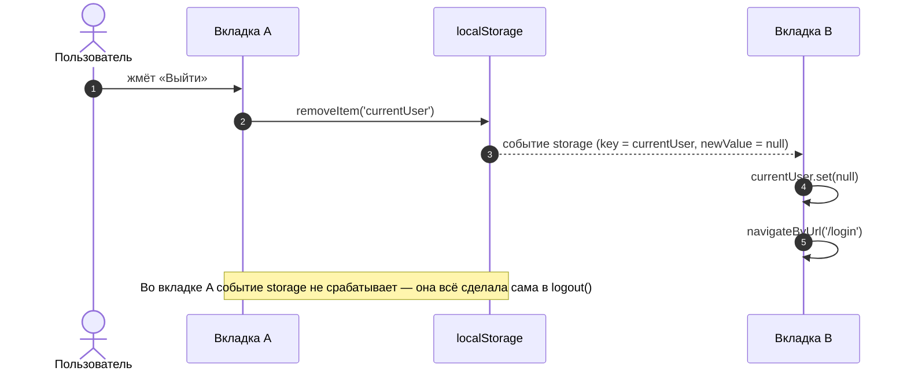

---

<a id="ex-2"></a>

## Пример 2 — Черновик сообщения в канале

**Когда использовать:** данные нужны только в текущей вкладке и должны пережить F5, но не закрытие вкладки. У каждого канала свой черновик.

**Где в конспекте:** [§4 sessionStorage](5_1-data-persistence-konspekt.md#s4) · [§3.5 Пример из материала и хуки](5_1-data-persistence-konspekt.md#s3-5) · [П-4 ngOnInit](5_1-data-persistence-popravki.md#p-4)

```ts
// ═════ src/app/components/message-input.component.ts ═════
import {
  AfterViewInit, Component, ElementRef, EventEmitter,
  Input, OnChanges, Output, SimpleChanges, ViewChild,
} from '@angular/core';
import { FormsModule } from '@angular/forms';

@Component({
  selector: 'app-message-input',
  imports: [FormsModule],
  template: `
    <input
      #box
      [ngModel]="text"
      (ngModelChange)="onType($event)"
      (keydown.enter)="send()"
      placeholder="Сообщение"
    />
    <button (click)="send()" [disabled]="!text.trim()">Отправить</button>
  `,
})
export class MessageInputComponent implements OnChanges, AfterViewInit {
  @Input({ required: true }) channelId!: number;   // канал передаёт родитель
  @Output() sent = new EventEmitter<string>();     // готовое сообщение уходит родителю
  @ViewChild('box') box!: ElementRef<HTMLInputElement>; // <input #box> из шаблона

  text = '';

  // Ключ зависит от канала → у каждого канала свой черновик
  private get draftKey(): string {
    return `draft:${this.channelId}`;
  }

  // Вызывается при первом получении channelId и при КАЖДОЙ смене канала.
  // ngOnInit тут не подходит: он срабатывает один раз, а роутер переиспользует
  // компонент при переходе /channels/3 → /channels/5
  ngOnChanges(changes: SimpleChanges): void {
    if (changes['channelId']) {
      this.text = sessionStorage.getItem(this.draftKey) ?? ''; // null → пустая строка
      this.box?.nativeElement.focus();             // при первом вызове шаблона ещё нет → ?.
    }
  }

  // Шаблон отрисован → элемент доступен
  ngAfterViewInit(): void {
    this.box.nativeElement.focus();
  }

  onType(value: string): void {
    this.text = value;
    if (value) {
      sessionStorage.setItem(this.draftKey, value); // это уже строка → JSON не нужен
    } else {
      sessionStorage.removeItem(this.draftKey);     // пустые черновики не храним
    }
  }

  send(): void {
    const message = this.text.trim();
    if (!message) return;
    this.sent.emit(message);
    this.text = '';
    sessionStorage.removeItem(this.draftKey);       // отправлено → черновик не нужен
  }
}

// ═════ src/app/pages/channel/channel.component.ts ═════
import { Component, inject } from '@angular/core';
import { ActivatedRoute } from '@angular/router';
import { MessageInputComponent } from '../../components/message-input.component';

@Component({
  selector: 'app-channel',
  imports: [MessageInputComponent],
  template: `
    <h2>Канал #{{ channelId }}</h2>
    <!-- ... список сообщений ... -->
    <app-message-input [channelId]="channelId" (sent)="onSend($event)" />
  `,
})
export class ChannelComponent {
  private route = inject(ActivatedRoute);
  channelId = 0;

  constructor() {
    // /channels/:id. При переходе на другой канал компонент тот же, меняется только параметр.
    // От ActivatedRoute отписываться не нужно: Angular завершит поток сам вместе с компонентом
    this.route.paramMap.subscribe((params) => {
      this.channelId = Number(params.get('id'));   // строка из URL → число
    });
  }

  onSend(text: string): void {
    // Здесь сообщение уйдёт на сервер: HTTP-запрос (5_4) или сокет (неделя 6)
    console.log(`Канал ${this.channelId}:`, text);
  }
}
```

### Порядок хуков: что доступно в каждом

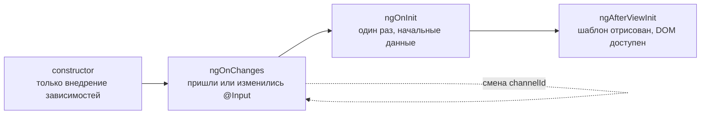

### Последовательность

1. Пользователь открывает канал 3.
2. `ChannelComponent` передаёт `channelId = 3` в поле ввода.
3. Срабатывает `ngOnChanges`.
4. Компонент ищет черновик `draft:3` в sessionStorage.
5. Черновика нет, `getItem` вернул `null`, поле пустое.
6. Шаблон отрисован: в `ngAfterViewInit` поле получает фокус.
7. Пользователь печатает «Привет».
8. На каждое изменение черновик сохраняется в sessionStorage.
9. Пользователь нажимает F5.
10. Вкладка та же, поэтому sessionStorage жив. Страница канала снова передаёт `channelId = 3`.
11. `ngOnChanges` снова ищет `draft:3`.
12. Находит «Привет», и поле восстановлено.
13. Пользователь нажимает Enter.
14. Компонент отдаёт сообщение родителю через `(sent)`.
15. Черновик удаляется из sessionStorage.

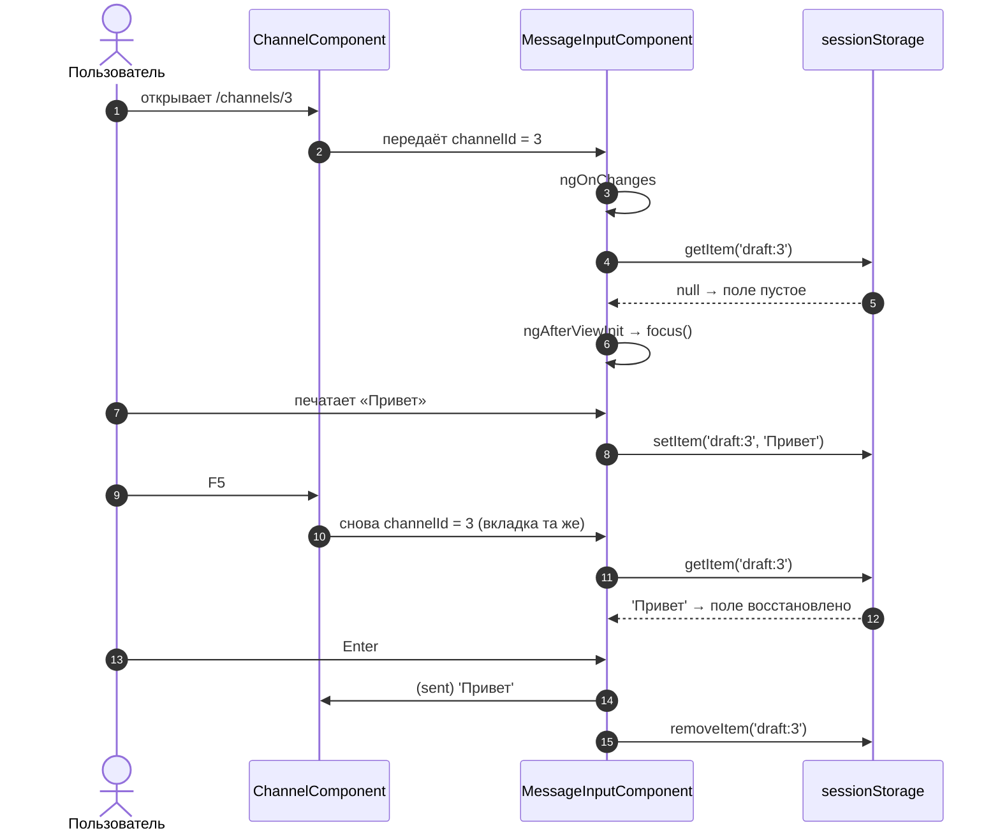

---

<a id="ex-3"></a>

## Пример 3 — Сессия на HttpOnly-куке

**Когда использовать:** когда идентификатор сессии не должен быть доступен JS (защита от кражи через XSS). Это твой вариант 1 с исправлениями: сервер ставит и удаляет куку, клиент после F5 спрашивает сервер, жива ли сессия, а `withCredentials` и CORS настроены под два origin.

**Где в конспекте:** [§5.3 Как куки путешествуют](5_1-data-persistence-konspekt.md#s5-3) · [§5.5 Атрибуты](5_1-data-persistence-konspekt.md#s5-5) · [П-10 Атрибуты и Express](5_1-data-persistence-popravki.md#p-10)

```ts
// ═════ server/server.js (Node + Express, JavaScript) ═════
// npm install express cors cookie-parser
const express = require('express');
const cors = require('cors');
const cookieParser = require('cookie-parser');
const crypto = require('crypto');                  // встроенный модуль Node, ставить не нужно
const { findUserByUsername } = require('./data/users');

const app = express();
app.use(express.json());                           // тело запроса JSON → req.body
app.use(cookieParser());                           // заголовок Cookie → req.cookies

// Нужно только при двух origin (Angular на 4200 → сервер на 3000).
// credentials: true и конкретный origin (не '*'), иначе браузер не отдаст ответ с куками
app.use(cors({ origin: 'http://localhost:4200', credentials: true }));

// Сессии в памяти: sid → пользователь без пароля. Перезапуск сервера всё сотрёт
const sessions = new Map();

app.post('/api/login', (req, res) => {
  const { username, password } = req.body;
  const user = findUserByUsername(username);
  if (!user || user.password !== password) {
    return res.status(401).json({ error: 'Invalid username or password' });
  }
  const { password: _omit, ...safeUser } = user;
  const sid = crypto.randomUUID();                 // случайный идентификатор — не угадать
  sessions.set(sid, safeUser);

  res.cookie('sid', sid, {
    httpOnly: true,                                // JS в браузере куку не видит
    sameSite: 'lax',                               // с запросами с чужих сайтов почти не уходит
    maxAge: 24 * 60 * 60 * 1000,                   // в Express — МИЛЛИсекунды: сутки
    path: '/',
    // secure: true,                               // включить, когда будет https
  });
  res.json(safeUser);                              // ответ: Set-Cookie + тело с пользователем
});

app.get('/api/me', (req, res) => {
  const user = sessions.get(req.cookies.sid);      // кука пришла сама, JS клиента её не трогал
  if (!user) return res.status(401).json({ error: 'Not logged in' });
  res.json(user);
});

app.post('/api/logout', (req, res) => {
  sessions.delete(req.cookies.sid);
  res.clearCookie('sid', { path: '/' });           // HttpOnly-куку может удалить только сервер
  res.json({ ok: true });
});

app.listen(3000, () => console.log('API: http://localhost:3000'));

// ═════ src/app/services/session-auth.service.ts ═════
import { Injectable, computed, inject, signal } from '@angular/core';
import { HttpClient } from '@angular/common/http';
import { Observable, catchError, finalize, map, of, tap } from 'rxjs';
import { User } from '../models/user';

@Injectable({ providedIn: 'root' })
export class SessionAuthService {
  private http = inject(HttpClient);

  // Разные origin → нужен withCredentials: без него браузер не примет и не отправит куку.
  // Single-origin (Angular отдаёт сам Express): API = '/api', и флаг можно убрать
  private readonly API = 'http://localhost:3000/api';
  private readonly withCookies = { withCredentials: true };

  readonly currentUser = signal<User | null>(null);
  readonly isLoggedIn = computed(() => this.currentUser() !== null);
  private sessionChecked = false;                  // спрашивали ли сервер после загрузки страницы

  login(username: string, password: string): Observable<User> {
    return this.http
      .post<User>(`${this.API}/login`, { username, password }, this.withCookies)
      .pipe(
        tap((user) => {
          this.currentUser.set(user);              // куку браузер уже сохранил сам
          this.sessionChecked = true;
        }),
      );
  }

  // После F5 сигнал пуст, а кука жива. JS её не прочитает → спрашиваем сервер
  ensureSession(): Observable<boolean> {
    if (this.sessionChecked) return of(this.isLoggedIn());
    return this.http.get<User>(`${this.API}/me`, this.withCookies).pipe(
      tap((user) => this.currentUser.set(user)),
      map(() => true),                             // 200 → сессия жива
      catchError(() => of(false)),                 // 401 → не залогинен
      finalize(() => (this.sessionChecked = true)),
    );
  }

  logout(): Observable<unknown> {
    return this.http
      .post(`${this.API}/logout`, {}, this.withCookies)
      .pipe(tap(() => this.currentUser.set(null)));
  }
}

// ═════ src/app/guards/session.guard.ts ═════
import { inject } from '@angular/core';
import { CanActivateFn, Router } from '@angular/router';
import { map } from 'rxjs';
import { SessionAuthService } from '../services/session-auth.service';

// Гард может вернуть Observable — роутер дождётся ответа сервера
export const sessionGuard: CanActivateFn = () => {
  const auth = inject(SessionAuthService);
  const router = inject(Router);
  return auth.ensureSession().pipe(
    map((ok) => ok || router.createUrlTree(['/login'])),
  );
};

// ═════ src/app/app.routes.ts (фрагмент) ═════
// { path: 'groups', component: GroupsComponent, canActivate: [sessionGuard] }
// LoginComponent — как в примере 1, только с SessionAuthService
```

### Нужен ли `withCredentials`

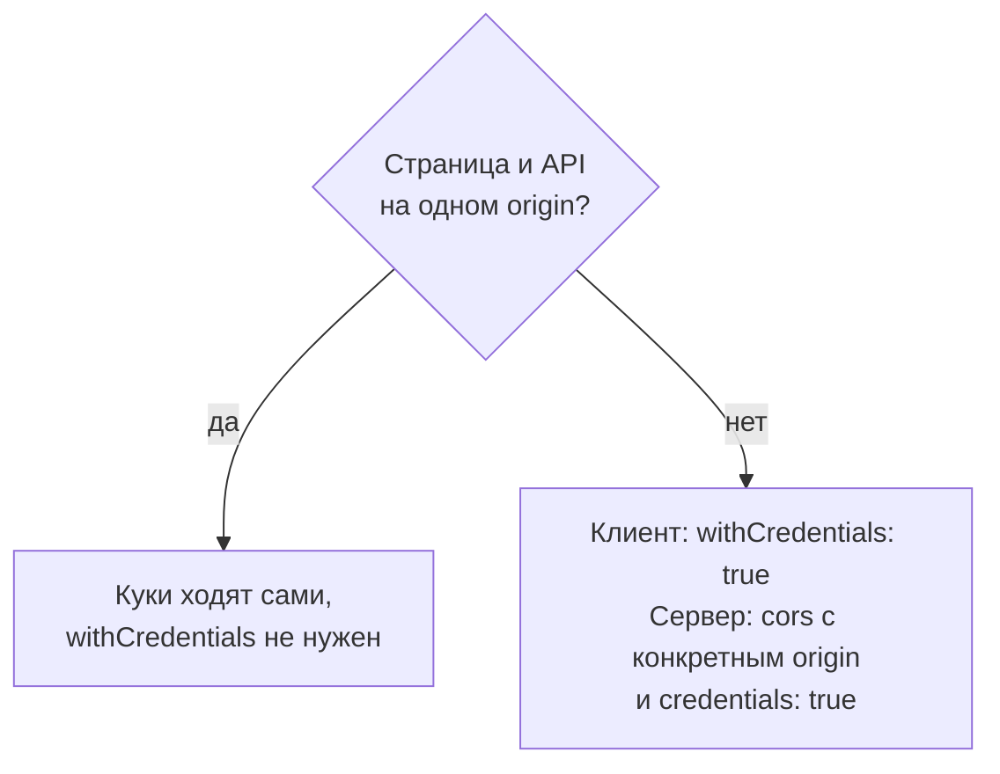

### Последовательность

1. Пользователь вводит логин и пароль.
2. Angular отправляет `POST /api/login` с `withCredentials`.
3. Сервер проверяет пароль, создаёт случайный `sid` и запоминает сессию.
4. Сервер отвечает 200 с заголовком `Set-Cookie` (кука `sid` с `HttpOnly`).
5. Браузер сохраняет куку. JS её не видит.
6. Angular получает тело ответа с пользователем.
7. Сервис кладёт пользователя в сигнал.
8. Пользователь нажимает F5.
9. Память JS очищена, сигнал пуст, а куку JS прочитать не может.
10. Гард вызывает `ensureSession()`, и уходит `GET /api/me`. Браузер сам прикладывает `Cookie: sid=…`.
11. Сервер находит сессию по `sid`.
12. Сервер отвечает 200 с пользователем (или 401, если сессии нет).
13. Сервис кладёт пользователя в сигнал, гард пропускает.
14. Пользователь жмёт «Выйти».
15. Angular отправляет `POST /api/logout`.
16. Сервер удаляет сессию и присылает куку с истёкшим сроком.
17. Браузер удаляет куку.

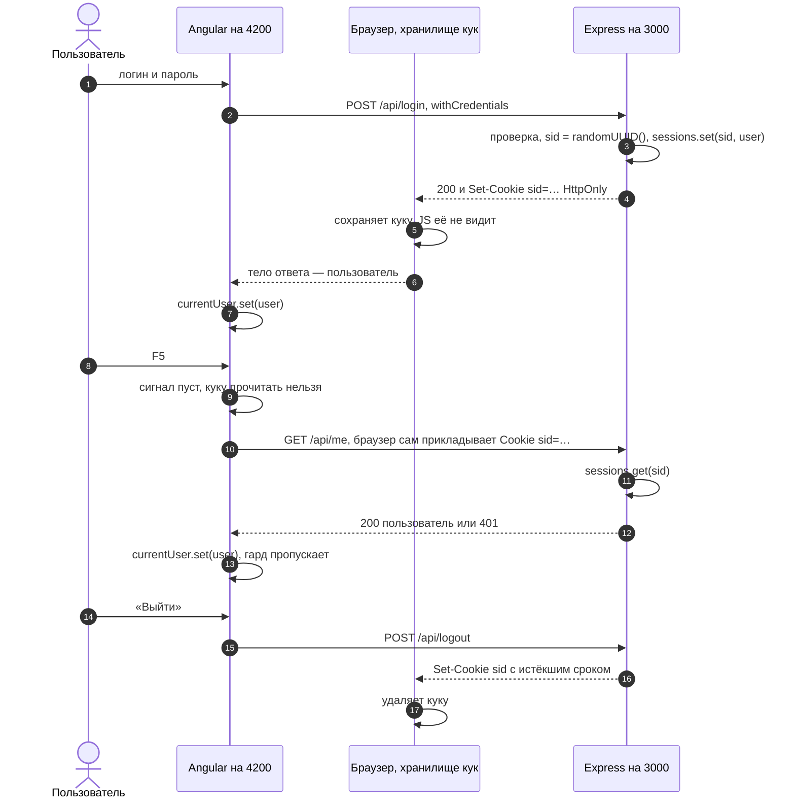

---

<a id="ex-4"></a>

## Пример 4 — Тема оформления в куке

**Когда использовать:** небольшая настройка, которую полезно знать и серверу (например, чтобы сразу отдать страницу в нужной теме). Если серверу значение не нужно, проще localStorage: кука зря едет с каждым запросом.

Это твой вариант 2, перенесённый на задачу, для которой он подходит. Для входа JS-кука без проверки пароля не годится: любой поставит `username=admin` в DevTools.

**Где в конспекте:** [§5.5 Атрибуты](5_1-data-persistence-konspekt.md#s5-5) · [§5.7 Куки из JS](5_1-data-persistence-konspekt.md#s5-7) · [П-9 JS-примеры](5_1-data-persistence-popravki.md#p-9)

```ts
// npm install ngx-cookie-service   ← сторонняя библиотека, в Angular её нет
// Под капотом это обёртка над document.cookie: сама она ничего не хранит, хранит браузер.

// ═════ src/app/services/theme.service.ts ═════
import { Injectable, inject, signal } from '@angular/core';
import { CookieService } from 'ngx-cookie-service';

export type Theme = 'light' | 'dark';

@Injectable({ providedIn: 'root' })
export class ThemeService {
  private cookies = inject(CookieService);         // объявлен ВЫШЕ сигнала, который его использует

  // Кука читается ОДИН раз, при создании сервиса. Дальше сигнал меняется только через
  // setTheme() и resetTheme(): куки не реактивны, об изменении куки сигнал не узнает
  readonly theme = signal<Theme>(this.cookies.get('theme') === 'dark' ? 'dark' : 'light');

  constructor() {
    this.apply(this.theme());                      // применяем сохранённую тему при старте
  }

  setTheme(theme: Theme): void {
    // path: '/' обязателен: без него на вложенном маршруте (/settings/theme)
    // кука привяжется к /settings и не будет видна на других страницах.
    // Эквивалент: document.cookie = 'theme=dark; expires=<+365 дней>; path=/; SameSite=Lax'
    this.cookies.set('theme', theme, { expires: 365, path: '/', sameSite: 'Lax' });
    this.theme.set(theme);
    this.apply(theme);
  }

  resetTheme(): void {
    this.cookies.delete('theme', '/');             // тот же path, что при записи, иначе не удалится
    this.theme.set('light');
    this.apply('light');
  }

  private apply(theme: Theme): void {
    document.documentElement.dataset['theme'] = theme; // <html data-theme="dark"> → стили в CSS
  }
}

// ═════ src/app/pages/settings/settings.component.ts ═════
import { Component, inject } from '@angular/core';
import { ThemeService } from '../../services/theme.service';

@Component({
  selector: 'app-settings',
  template: `
    <p>Тема: {{ themeService.theme() }}</p>
    <button (click)="themeService.setTheme('dark')">Тёмная</button>
    <button (click)="themeService.setTheme('light')">Светлая</button>
    <button (click)="themeService.resetTheme()">Сбросить</button>
  `,
})
export class SettingsComponent {
  themeService = inject(ThemeService);             // public — шаблон читает сигнал из сервиса
}

/* ═════ src/styles.css ═════
:root                { --bg: #ffffff; --text: #1a1a1a; }
[data-theme="dark"]  { --bg: #1a1a1a; --text: #f0f0f0; }
body                 { background: var(--bg); color: var(--text); }
*/
```

### Последовательность

1. При создании `ThemeService` просит у `CookieService` значение `theme`.
2. `CookieService` читает строку `document.cookie`.
3. Браузер отдаёт значение или пустоту.
4. Сервис кладёт тему в сигнал (по умолчанию `light`) и применяет её к `<html>`.
5. Пользователь жмёт «Тёмная».
6. Компонент вызывает `setTheme('dark')`.
7. Сервис просит `CookieService` записать куку на 365 дней с `path=/`.
8. `CookieService` присваивает строку `document.cookie`.
9. Сервис обновляет сигнал, и шаблон перерисовывается.
10. С каждым следующим запросом на сервер браузер сам отправляет `Cookie: theme=dark`.

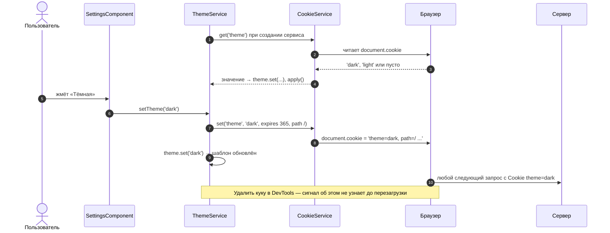

---

<a id="ex-5"></a>

## Пример 5 — Заметки в IndexedDB

**Когда использовать:** много структурированных данных на клиенте, работа офлайн. Это твой NoteService с исправлениями: `id` назначает сама база (`autoIncrement`), список рисуется через `@for` без импортов, сигнал обновляется без перечитывания всей базы, ошибки обрабатываются.

**Где в конспекте:** [§6 IndexedDB](5_1-data-persistence-konspekt.md#s6) · [П-12 Терминология и IndexedDB](5_1-data-persistence-popravki.md#p-12)

```ts
// npm install idb   ← обёртка с промисами над IndexedDB.
// Сама IndexedDB встроена в браузер; idb просто делает её API удобнее.

// ═════ src/app/services/note.service.ts ═════
import { Injectable, signal } from '@angular/core';
import { DBSchema, IDBPDatabase, openDB } from 'idb';

export interface Note {
  id?: number;                                     // назначит база при добавлении
  text: string;
  createdAt: number;
}

// Схема базы для TypeScript: хранилище notes, ключ — число, значение — Note
interface NotesDB extends DBSchema {
  notes: { key: number; value: Note };
}

@Injectable({ providedIn: 'root' })
export class NoteService {
  readonly notes = signal<Note[]>([]);             // шаблон читает этот сигнал
  readonly error = signal<string | null>(null);

  // Promise, который разрешится открытой базой. Все методы сначала ждут его
  private dbPromise: Promise<IDBPDatabase<NotesDB>> = openDB<NotesDB>('NotesDB', 1, {
    // Вызывается при первом создании базы и при повышении версии (1 → 2 …).
    // Только здесь можно создавать хранилища и индексы
    upgrade(db) {
      // autoIncrement: id выдаёт база — две заметки в одну миллисекунду не столкнутся
      db.createObjectStore('notes', { keyPath: 'id', autoIncrement: true });
    },
  });

  constructor() {
    this.loadNotes();                              // сразу показываем то, что сохранено ранее
  }

  async loadNotes(): Promise<void> {
    try {
      const db = await this.dbPromise;
      this.notes.set(await db.getAll('notes'));    // асинхронно: страница не блокируется
    } catch (e) {
      this.error.set('Не удалось открыть хранилище заметок');
      console.error(e);
    }
  }

  async addNote(text: string): Promise<void> {
    const db = await this.dbPromise;
    const note: Note = { text, createdAt: Date.now() }; // объект как есть, без JSON.stringify
    const id = await db.add('notes', note);        // база вернула назначенный id
    // Перечитывать всю базу не нужно: добавляем одну заметку в сигнал
    this.notes.update((list) => [...list, { ...note, id }]);
  }

  async deleteNote(id: number): Promise<void> {
    const db = await this.dbPromise;
    await db.delete('notes', id);
    this.notes.update((list) => list.filter((n) => n.id !== id));
  }
}

// ═════ src/app/pages/notes/notes.component.ts ═════
import { Component, inject } from '@angular/core';
import { FormsModule } from '@angular/forms';
import { NoteService } from '../../services/note.service';

@Component({
  selector: 'app-notes',
  imports: [FormsModule],                          // для @for и @if импорт не нужен — встроенный синтаксис
  template: `
    @if (noteService.error(); as err) {
      <p class="error">{{ err }}</p>
    }

    <form (ngSubmit)="onAdd()">
      <input [(ngModel)]="draft" name="draft" placeholder="Новая заметка">
      <button type="submit">Добавить</button>
    </form>

    <ul>
      @for (note of noteService.notes(); track note.id) {
        <li>
          {{ note.text }}
          <button (click)="onDelete(note.id!)">✕</button>
        </li>
      } @empty {
        <li>Заметок пока нет</li>
      }
    </ul>
  `,
})
export class NotesComponent {
  noteService = inject(NoteService);               // public — шаблон читает сигналы сервиса
  draft = '';

  async onAdd(): Promise<void> {
    const text = this.draft.trim();
    if (!text) return;
    this.draft = '';
    try {
      await this.noteService.addNote(text);
    } catch {
      this.noteService.error.set('Не удалось сохранить заметку');
    }
  }

  async onDelete(id: number): Promise<void> {
    try {
      await this.noteService.deleteNote(id);
    } catch {
      this.noteService.error.set('Не удалось удалить заметку');
    }
  }
}
```

### Когда вызывается `upgrade`

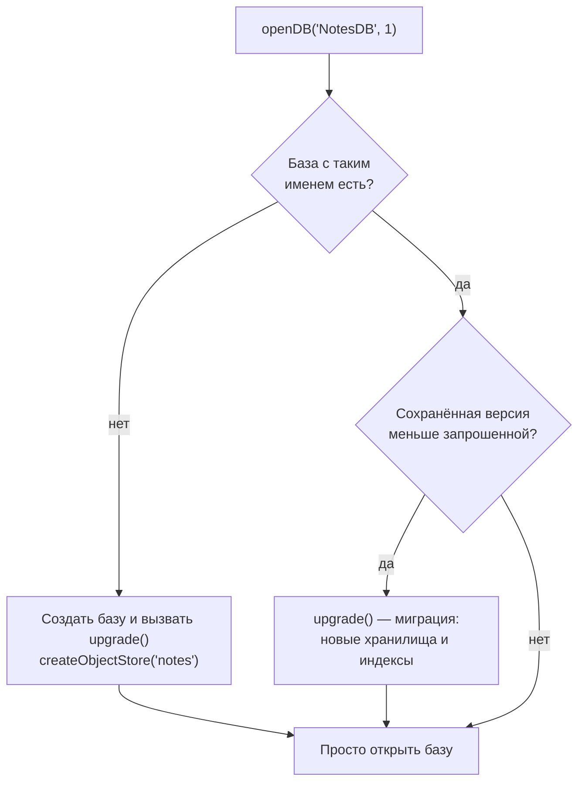

### Последовательность

1. Сервис открывает базу. При первом запуске вызывается `upgrade` и создаётся хранилище `notes`.
2. Сервис запрашивает все заметки через `getAll`.
3. База асинхронно возвращает сохранённые заметки.
4. Сервис кладёт их в сигнал `notes`.
5. Сигнал уведомляет шаблон об изменении.
6. `@for` рисует список.
7. Пользователь вводит текст и отправляет форму.
8. Компонент вызывает `addNote(text)`.
9. Сервис добавляет объект в базу как есть.
10. База возвращает назначенный `id`.
11. Сервис добавляет одну заметку в сигнал через `update`.
12. Сигнал уведомляет шаблон.
13. `@for` дорисовывает одну строку: благодаря `track note.id` остальные строки не пересоздаются.

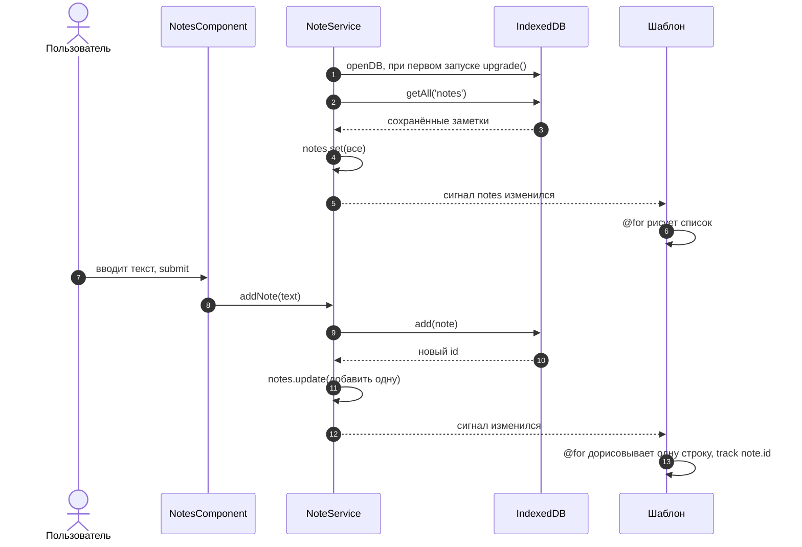
