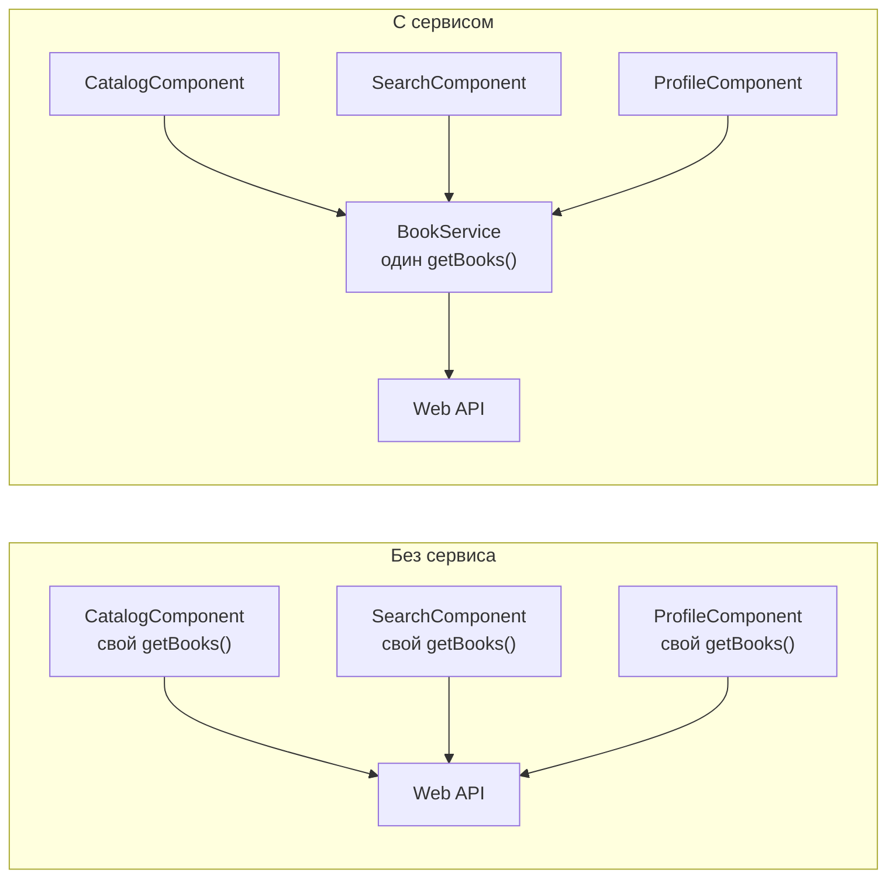
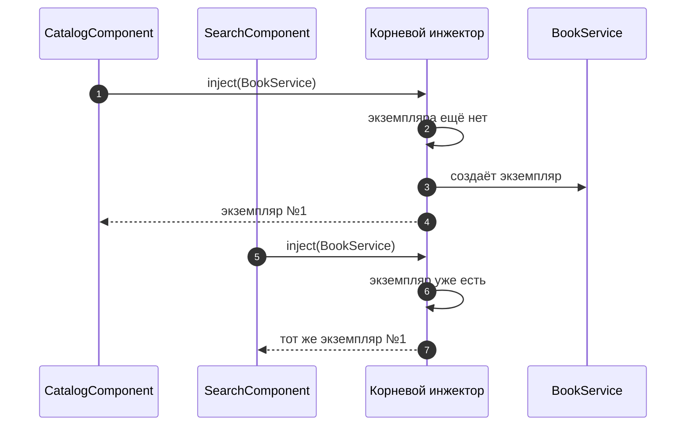
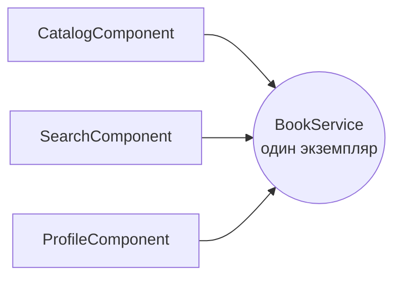
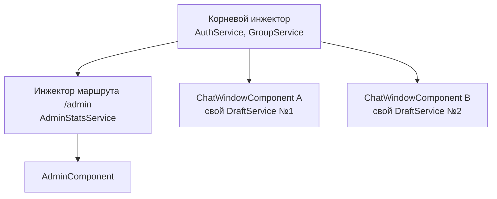
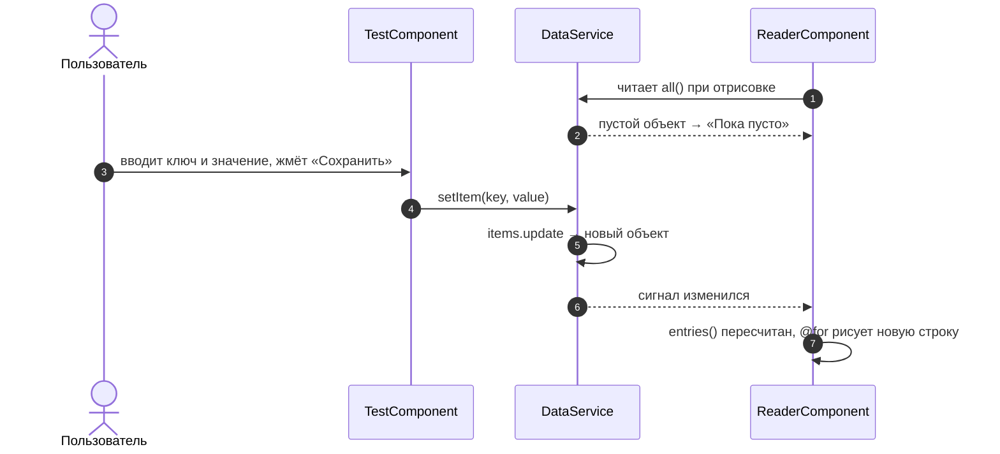
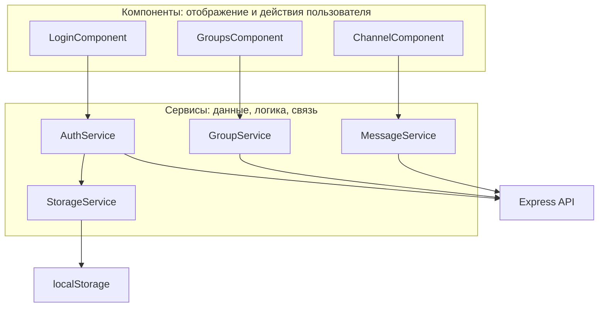

# 5_2 — Services: конспект

**Курс:** 3813ICT, неделя 5
**Источник:** `5_2-Services.pdf`
**Связанные файлы:** [поправки](5_2-services-popravki.md) · [примеры](5_2-services-primery.md) · [вопросы](5_2-services-voprosy.md) · [ответы](5_2-services-otvety.md) · [конспект 5_1 — Data Persistence](5_1-data-persistence-konspekt.md)

> Значок **⚠** со ссылкой вида **П-N** ведёт в файл поправок. Там разобрано, где исходный материал курса расходится с тем, что написано в конспекте, и почему.

**Содержание**

1. [Зачем нужны сервисы](#s1): [проблема](#s1-1) · [что такое сервис](#s1-2)
2. [Внедрение зависимостей (DI)](#s2): [что это](#s2-1) · [почему не new](#s2-2) · [как инжектор выдаёт сервис](#s2-3)
3. [Создание сервиса](#s3): [@Injectable](#s3-1) · [Angular CLI](#s3-2) · [сервис с данными](#s3-3)
4. [Использование сервиса в компоненте](#s4): [конструктор](#s4-1) · [inject()](#s4-2) · [что выбрать](#s4-3) · [private или protected](#s4-4) · [пример из материала](#s4-5)
5. [Singleton](#s5): [что это](#s5-1) · [когда создаётся](#s5-2) · [когда экземпляров несколько](#s5-3)
6. [Сервис для общих данных](#s6): [пример из материала](#s6-1) · [исправленная версия](#s6-2) · [обновление в другом компоненте](#s6-3)
7. [Разделение обязанностей](#s7)
8. [Пригодится в заданиях](#s8)
9. [Ключевые факты](#s9)

---

<a id="s1"></a>

## 1. Зачем нужны сервисы

До сих пор в наших компонентах всё было в одном месте: компонент сам хранил данные, сам их обрабатывал и сам показывал. Пока компонент один, это удобно. Проблемы начинаются, когда одно и то же нужно нескольким компонентам. Эта тема о том, куда выносить общий код и общие данные, чтобы не копировать их по всему приложению.

<a id="s1-1"></a>

### 1.1 Проблема: один и тот же код в разных компонентах

Большинство приложений получают данные с веб-сервера. Сервер предоставляет **Web API** — набор адресов (маршрутов), которые принимают параметры и возвращают результат, чаще всего в формате JSON. Чтобы обратиться к Web API, нужно знать адрес, передать параметры и разобрать пришедший ответ.

Представь API, который возвращает список книг, и этот список нужен на трёх страницах: в каталоге, в поиске и в профиле пользователя. Если каждый компонент сам напишет функцию `getBooks()`:

- один и тот же код окажется в трёх местах;
- если изменится адрес API, придётся править три файла, и один легко забыть;
- каждый компонент будет загружать книги заново, даже если они уже загружены.

Дублирование кода почти всегда плохая идея. Нужно одно место, где живёт `getBooks()`, и все компоненты пользуются им. Вот как это выглядит на схеме:



<a id="s1-2"></a>

### 1.2 Что такое сервис

**Сервис** — это класс с общей логикой или общими данными, который Angular сам создаёт и передаёт тем компонентам, которым он нужен.

Сервис решает три задачи:

- **Убирает дублирование.** Код пишется один раз и используется везде.
- **Делит данные между компонентами.** Все компоненты получают один и тот же экземпляр сервиса и поэтому видят одни и те же данные ([§5](#s5)).
- **Разделяет обязанности.** Компонент отвечает за отображение и действия пользователя, сервис — за данные, логику и связь с внешним миром: сервером и хранилищем ([§7](#s7)).

Что обычно выносят в сервисы:

- запросы к серверу (Web API);
- работу с хранилищами из темы 5_1 (localStorage, sessionStorage, куки, IndexedDB);
- общую логику: проверку прав, вычисления, форматирование;
- общее состояние: текущий пользователь, открытый канал, список групп.

Но если компонент не создаёт сервис сам, то откуда он его берёт? Для этого в Angular есть механизм внедрения зависимостей.

---

<a id="s2"></a>

## 2. Внедрение зависимостей (DI)

Это ключевая идея, на которой держатся сервисы. Без неё непонятно, почему сервис не создают через `new` и откуда берётся «один экземпляр на всех».

<a id="s2-1"></a>

### 2.1 Что такое зависимость и её внедрение

**Зависимость** — это объект, который нужен классу для работы. Если компоненту списка книг нужен `BookService`, то `BookService` — его зависимость.

**Внедрение зависимостей** (Dependency Injection, DI) — это подход, при котором класс не создаёт свои зависимости сам, а получает их готовыми снаружи. В Angular их создаёт и выдаёт специальный механизм — **инжектор** (injector).

Удобно представить ресторан. Ты не идёшь на кухню готовить сам: говоришь официанту, что хочешь, и получаешь готовое блюдо. Компонент так же «заказывает» сервис, называя его класс, а инжектор приносит готовый экземпляр.

Вот основные термины, которые встречаются в документации:

| Термин | Что это |
|---|---|
| **Зависимость** (dependency) | объект, который нужен классу: например, `BookService` для компонента |
| **Инжектор** (injector) | механизм Angular, который создаёт зависимости, хранит их и выдаёт по запросу |
| **Провайдер** (provider) | «инструкция» для инжектора: как создать зависимость. `providedIn: 'root'` — один из способов её задать |
| **Токен** (token) | ключ, по которому запрашивают зависимость. Обычно это сам класс сервиса |

<a id="s2-2"></a>

### 2.2 Почему не `new BookService()`

Кажется, что проще создать сервис вручную. Вот что при этом сломается:

- **Нет общего состояния.** Каждый `new` создаёт новый объект, поэтому у каждого компонента будет свой экземпляр, и данные между ними не разделятся.
- **Зависимости сервиса — вручную.** Если сервису самому что-то нужно (например, `HttpClient` для запросов), это тоже пришлось бы создавать в каждом компоненте.
- **Нельзя подменить в тестах.** Сервис «зашит» в компонент, и его не заменить фальшивым, чтобы проверить компонент отдельно от сервера.

Вот пример того, чем отличаются два подхода:

```ts
// ❌ Вручную: у каждого компонента свой экземпляр, общих данных нет
export class CatalogComponent {
  private bookService = new BookService();
}

// ✅ Через DI: Angular выдаёт один общий экземпляр
export class CatalogComponent {
  private bookService = inject(BookService);
}
```

<a id="s2-3"></a>

### 2.3 Как инжектор выдаёт сервис

Когда компонент просит сервис, инжектор проверяет, есть ли уже готовый экземпляр. Если нет — создаёт и запоминает. Если есть — отдаёт тот же самый. Вот как это выглядит, когда два компонента по очереди просят один сервис:



Чтобы инжектор вообще знал о сервисе и умел его создавать, сервис нужно правильно объявить.

---

<a id="s3"></a>

## 3. Создание сервиса

Сервис — это обычный TypeScript-класс с одним дополнением: декоратором, который сообщает Angular, что этот класс можно внедрять.

<a id="s3-1"></a>

### 3.1 Декоратор `@Injectable` и `providedIn`

Вот минимальный сервис:

```ts
import { Injectable } from '@angular/core';

@Injectable({
  providedIn: 'root',
})
export class BookService {
  // здесь будут данные и методы
}
```

- **`@Injectable`** помечает класс как то, что инжектор умеет создавать и внедрять.
- **`providedIn: 'root'`** регистрирует сервис в корневом инжекторе приложения. Это даёт три вещи:
  - один экземпляр на всё приложение;
  - сервис доступен в любом компоненте без дополнительной настройки;
  - **tree-shaking**: если сервис нигде не используется, он не попадёт в итоговую сборку приложения.

Для большинства сервисов это и есть правильный вариант. Другие способы зарегистрировать сервис (в компоненте или маршруте) нужны, когда требуется несколько экземпляров, — о них в [§5.3](#s5-3). ⚠ [П-3](5_2-services-popravki.md#p-3)

<a id="s3-2"></a>

### 3.2 Создание через Angular CLI

Сервис можно создать вручную, а можно командой — CLI создаст файл с готовым каркасом:

```bash
ng generate service book            # коротко: ng g s book
ng generate service services/book   # в папке src/app/services
```

Хранить сервисы в отдельной папке `services` удобно: так их легко найти.

Имена создаваемых файлов зависят от того, в какой версии Angular создан проект: ⚠ [П-4](5_2-services-popravki.md#p-4)

| Проект | Файл | Класс |
|---|---|---|
| создан в Angular 20 или новее | `book.ts` | `Book` |
| создан в более ранней версии (в том числе обновлённый через `ng update`) | `book.service.ts` | `BookService` |

Понять, как настроен твой проект, просто: посмотри на корневой компонент. Если он в файле `app.ts`, суффиксы не добавляются; если в `app.component.ts` — добавляются. Получить суффикс в новом проекте можно флагом: `ng g s book --type=service`.

В этом конспекте сервисы названы с суффиксом `Service` (`BookService`): так проще отличить сервис от модели данных (`Book` — интерфейс книги).

<a id="s3-3"></a>

### 3.3 Сервис с данными и методами

Каркас пустой — наполним его. Вот пример того, как выглядит простой сервис, который хранит список книг и отдаёт его компонентам:

```ts
import { Injectable } from '@angular/core';

// Модель данных: как выглядит одна книга
export interface Book {
  id: number;
  title: string;
  author: string;
}

@Injectable({ providedIn: 'root' })
export class BookService {
  // Данные сервиса. private — менять их можно только через методы сервиса
  private books: Book[] = [
    { id: 1, title: 'Clean Code', author: 'Robert C. Martin' },
    { id: 2, title: 'Refactoring', author: 'Martin Fowler' },
  ];

  getBooks(): Book[] {
    return [...this.books]; // копия: компонент не испортит внутренний массив
  }

  addBook(title: string, author: string): void {
    const id = Math.max(0, ...this.books.map((b) => b.id)) + 1;
    this.books.push({ id, title, author });
  }
}
```

Здесь книги лежат прямо в сервисе, чтобы сосредоточиться на устройстве сервиса. Настоящий Web API отвечает не мгновенно, поэтому метод, который ходит на сервер, возвращает не массив, а `Observable` — «обещание данных», на которое подписываются. Это тема файла 5_4 (HttpClient). ⚠ [П-11](5_2-services-popravki.md#p-11)

Сервис готов — теперь компонент должен его получить.

---

<a id="s4"></a>

## 4. Использование сервиса в компоненте

Чтобы компонент получил сервис, он просит его у инжектора. Сделать это можно двумя способами: через конструктор или через функцию `inject()`. Результат одинаковый — компонент получает общий экземпляр сервиса.

<a id="s4-1"></a>

### 4.1 Через конструктор

```ts
export class BookListComponent {
  constructor(private bookService: BookService) {}
}
```

Angular видит тип параметра конструктора (`BookService`), находит сервис у инжектора и передаёт его при создании компонента.

Слово `private` перед параметром — сокращение TypeScript: оно одновременно объявляет поле класса и присваивает ему значение. Две записи ниже делают одно и то же:

```ts
// Сокращённо
constructor(private bookService: BookService) {}

// Развёрнуто
private bookService: BookService;
constructor(bookService: BookService) {
  this.bookService = bookService;
}
```

<a id="s4-2"></a>

### 4.2 Через функцию `inject()`

```ts
import { inject } from '@angular/core';

export class BookListComponent {
  private bookService = inject(BookService);
}
```

`inject()` запрашивает сервис прямо при объявлении поля. Конструктор для этого не нужен.

**Где `inject()` работает.** Только в так называемом **контексте внедрения** (injection context) — пока Angular создаёт класс или вызывает функцию сам:

- в инициализаторах полей класса (как выше);
- в конструкторе;
- в функциях, которые Angular вызывает сам: функциональных гардах, фабриках провайдеров (гарды из [примера 1 темы 5_1](5_1-data-persistence-primery.md#ex-1) используют именно `inject()`).

В обычном методе, обработчике клика или внутри `setTimeout` `inject()` не работает и выдаёт ошибку `NG0203`. ⚠ [П-7](5_2-services-popravki.md#p-7) Вот пример правильного и неправильного использования:

```ts
export class BookListComponent {
  private bookService = inject(BookService); // ✅ поле класса

  onClick(): void {
    const service = inject(BookService);     // ❌ NG0203: метод — не контекст внедрения
  }
}
```

<a id="s4-3"></a>

### 4.3 Какой способ выбрать

Оба способа рабочие. Вот как они сравниваются:

| | Конструктор | `inject()` |
|---|---|---|
| Где запрашивается | параметр конструктора | поле класса |
| Работает в функциях (гарды, фабрики) | нет | да |
| Удобство при наследовании | родительские зависимости надо передавать через `super(...)` | не нужно |
| Где встречается | старый код, материалы курса | современная документация Angular |

Современное руководство по стилю Angular рекомендует `inject()`. Конструктор нужно уметь читать: он встречается в материалах курса и в существующем коде.

<a id="s4-4"></a>

### 4.4 `private`, `protected` или `public`

Модификатор доступа у поля с сервисом определяет, кто может к нему обращаться, и это касается шаблона тоже. ⚠ [П-6](5_2-services-popravki.md#p-6)

- **`private`** — только код класса. Шаблон к такому полю обратиться **не может**: будет ошибка компиляции.
- **`protected`** — код класса и его шаблон (Angular 14 и новее). Подходит, когда сервис нужен в шаблоне.
- **`public`** — кто угодно, в том числе другие классы.

Правило простое: если шаблон сервис не использует — `private`; если использует — `protected`.

```ts
@Component({
  selector: 'app-header',
  template: `<span>{{ auth.username() }}</span>`, // шаблон обращается к auth
})
export class HeaderComponent {
  protected auth = inject(AuthService); // protected: шаблону доступно, другим классам — нет
  private logger = inject(LoggerService); // private: используется только в коде класса
}
```

<a id="s4-5"></a>

### 4.5 Пример из материала: список книг

Вот как пример использования сервиса выглядит в материале курса. Первый вариант — через конструктор:

```ts
import { BookService } from ‘../book.service’;
class BookComponent {
constructor(private bookService: BookService) {
}
listBook(){
books:Books[] = this.bookService.getBooks();
}
}
```

Второй вариант — через `inject()`, отличается одной строкой:

```ts
import { BookService } from ‘../book.service’;
import {inject} from '@angular/core';
class BookComponent {
private bookService = inject(BookService);
listBook(){
books:Books[] = this.bookService.getBooks();
}
}
```

**Что в нём происходит.** Компонент получает `BookService` (в первом варианте через конструктор, во втором через `inject()`) и в методе `listBook()` запрашивает у сервиса список книг. Сервис объявлен как `private`, потому что используется только внутри класса.

Это фрагменты для иллюстрации идеи: в таком виде код не скомпилируется. Строка внутри метода записана с синтаксической ошибкой, у класса нет декоратора `@Component` и `export`, а кавычки в импорте типографские. ⚠ [П-5](5_2-services-popravki.md#p-5)

Вот рабочая версия — сервис из [§3.3](#s3-3) и компонент, который показывает список:

```ts
// ═════ src/app/services/book.service.ts ═════
// (как в §3.3: интерфейс Book и BookService с методом getBooks)

// ═════ src/app/pages/book-list/book-list.component.ts ═════
import { Component, OnInit, inject } from '@angular/core';
import { Book, BookService } from '../../services/book.service';

@Component({
  selector: 'app-book-list',
  template: `
    <h2>Книги</h2>
    <ul>
      @for (book of books; track book.id) {
        <li>{{ book.title }} — {{ book.author }}</li>
      } @empty {
        <li>Книг пока нет</li>
      }
    </ul>
  `,
})
export class BookListComponent implements OnInit {
  private bookService = inject(BookService); // шаблон сервис не использует → private
  books: Book[] = [];                        // шаблон читает books → поле public

  ngOnInit(): void {
    this.listBooks();                        // загрузить книги при открытии страницы
  }

  listBooks(): void {
    const books: Book[] = this.bookService.getBooks(); // так объявляют переменную с типом
    this.books = books;
  }
}
```

**Какая последовательность?**

1. **Пользователь открывает страницу со списком книг** — роутер создаёт `BookListComponent`.
2. **Инициализируется поле `bookService`** — вызывается `inject(BookService)`.
   1. Инжектор ищет экземпляр `BookService`.
   2. Если его нет (это первый запрос во всём приложении) — создаёт и запоминает.
   3. Если есть — отдаёт тот же самый экземпляр.
3. **Angular вызывает `ngOnInit()`**, а он — `listBooks()`.
   1. `listBooks()` вызывает `bookService.getBooks()`.
   2. Сервис возвращает копию своего массива книг.
   3. Компонент кладёт её в поле `books`.
4. **Angular отрисовывает шаблон** — `@for` выводит книгу за книгой (`track book.id` помогает Angular отличать строки), а если массив пуст, срабатывает `@empty`.
5. **Другой компонент** (например, поиск) тоже внедряет `BookService` — и получает тот же экземпляр с теми же данными, без повторного создания.

**Чем рабочая версия отличается от фрагмента из материала:**

- переменная с типом объявлена через `const books: Book[] = ...`, а тип называется `Book` — как интерфейс в сервисе;
- у класса есть `@Component` с шаблоном и `export`, иначе его не подключить к маршруту;
- кавычки в импорте обычные;
- список загружается в `ngOnInit` и выводится в шаблоне, иначе результат `listBooks()` никуда не попадает.

Мы уже несколько раз сказали «тот же экземпляр». Разберём подробно, что это значит и всегда ли это так.

---

<a id="s5"></a>

## 5. Singleton: один экземпляр на всё приложение

То, что все компоненты получают один и тот же объект сервиса, — не случайность, а важное свойство, на котором строится обмен данными между компонентами. У него есть название.

<a id="s5-1"></a>

### 5.1 Что такое singleton

**Singleton** («одиночка») — это класс, у которого в приложении существует ровно один экземпляр, и все пользуются именно им.

Сервис с `providedIn: 'root'` — singleton в пределах приложения: сколько бы компонентов ни запросили его, все получат один объект.



**Почему это важно.** Раз объект один, данные в нём общие. Если поиск добавит книгу через `bookService.addBook(...)`, каталог увидит её при следующем вызове `getBooks()`. Так компоненты обмениваются данными, не зная друг о друге.

<a id="s5-2"></a>

### 5.2 Когда сервис создаётся и сколько живёт

- **Создаётся лениво** — при первом запросе, а не при старте приложения. Если ни один компонент сервис не запросил, экземпляра нет. ⚠ [П-1](5_2-services-popravki.md#p-1)
- **Живёт, пока открыта страница.** Закрытие вкладки или F5 уничтожает все экземпляры, и при следующей загрузке они создаются заново.

**А что тогда с данными в сервисе после F5?** Они исчезнут, как и данные в компоненте: сервис хранит их в памяти JavaScript. Сервис не заменяет хранилища из темы 5_1, а дополняет их: чтобы данные пережили перезагрузку, сервис сам сохраняет их в localStorage или другое хранилище. Именно так устроен `AuthService` в [примере 1 темы 5_1](5_1-data-persistence-primery.md#ex-1): пользователь лежит в сигнале сервиса и одновременно в localStorage.

<a id="s5-3"></a>

### 5.3 Когда экземпляров несколько

Singleton — не магия, а следствие того, **где** сервис зарегистрирован. Если зарегистрировать его в другом месте, экземпляров может стать несколько. ⚠ [П-2](5_2-services-popravki.md#p-2)

Инжекторы в Angular образуют дерево: корневой инжектор приложения, под ним — инжекторы маршрутов и компонентов. Когда компонент просит сервис, Angular ищет его, поднимаясь от инжектора компонента к корню, и берёт первый найденный.

Вот три уровня, на которых можно зарегистрировать сервис:

| Где зарегистрирован | Сколько экземпляров | Когда уничтожается |
|---|---|---|
| `@Injectable({ providedIn: 'root' })` | один на всё приложение | при закрытии страницы |
| `providers: [X]` в маршруте | один на этот маршрут и его дочерние | при закрытии страницы |
| `providers: [X]` в компоненте | свой у **каждого экземпляра** компонента (его видят и дочерние компоненты) | вместе с компонентом |

Вот как это выглядит в дереве инжекторов чата, где у каждого окна чата свой черновик:



И пример кода для этих уровней:

```ts
// ═════ Уровень компонента: у каждого окна чата свой DraftService ═════
@Component({
  selector: 'app-chat-window',
  providers: [DraftService],            // новый экземпляр для каждого <app-chat-window>
  template: `...`,
})
export class ChatWindowComponent {
  private draft = inject(DraftService); // берёт СВОЙ экземпляр, а не общий
  private auth = inject(AuthService);   // AuthService здесь не указан → общий из корня
}

// ═════ Уровень маршрута: один AdminStatsService на всю админку ═════
export const routes: Routes = [
  {
    path: 'admin',
    component: AdminComponent,
    providers: [AdminStatsService],     // общий для /admin и его дочерних маршрутов
  },
];
```

Регистрация в компоненте нужна, когда состояние должно быть **независимым** у каждого экземпляра: черновик в каждом окне чата, история отмены в каждом редакторе. Во всех остальных случаях — `providedIn: 'root'`.

---

<a id="s6"></a>

## 6. Сервис для общих данных

Сервисы нужны не только для запросов к серверу. Очень часто сервис — просто общее место для данных, которыми пользуются несколько компонентов: один компонент записывает, другой читает.

<a id="s6-1"></a>

### 6.1 Пример из материала

Вот как такой сервис выглядит в материале курса. Сам сервис:

```ts
import { Injectable } from '@angular/core';

@Injectable({
  providedIn: 'root'
})
export class DataService {
  jsonItems = {};

  setItem(key, item) {
    this.jsonItems[key] = item;
  }

  getItem(key) {
    return this.jsonItems[key];
  }
}
```

Компонент, который записывает данные в сервис:

```ts
import { Component, OnInit } from '@angular/core';
// import { NgForm } from '@angular/forms';
import {DataService} from '../data.service';

@Component({
  selector: 'app-test',
  templateUrl: './test.component.html',
  styleUrls: ['./test.component.css']
})
export class TestComponent implements OnInit {
  username = '';
  password = '';
  constructor(private dataService: DataService) {
  }
  setItem(){
    this.dataService.setItem(this.username, this.password);
    console.log(this.dataService.jsonItems);
  }
  ngOnInit() {
  }
}
```

Шаблон компонента:

```html
<p>
    test works!
</p>

Username:
<input type="text" [(ngModel)]="username"> <br>

Password:
<input type="password" [(ngModel)]="password"> <br>

<button id="login" (click)="setItem()">Set Item</button>
```

**Что в нём происходит.** `DataService` хранит объект `jsonItems`, в который метод `setItem` кладёт значение под ключом, а `getItem` достаёт значение по ключу. `TestComponent` через `[(ngModel)]` связывает два поля ввода с переменными `username` и `password`. По кнопке он сохраняет в сервис пару «имя пользователя → пароль» и выводит содержимое сервиса в консоль. Поскольку сервис один на всё приложение, сохранённые пары может прочитать любой другой компонент.

Идея верная, но в современном Angular-проекте этот код не заработает без изменений:

- `DataService` не компилируется со строгими настройками TypeScript, которые включены в новых проектах по умолчанию ⚠ [П-8](5_2-services-popravki.md#p-8);
- для `[(ngModel)]` в standalone-компоненте нужно подключить `FormsModule` ⚠ [П-9](5_2-services-popravki.md#p-9);
- хранить пароли в сервисе и выводить их в консоль нельзя ⚠ [П-10](5_2-services-popravki.md#p-10).

<a id="s6-2"></a>

### 6.2 Исправленная версия

Вот рабочая версия того же примера. Сервис хранит произвольные пары «ключ → значение», а вместо имени и пароля форма принимает ключ и значение:

```ts
// ═════ src/app/services/data.service.ts ═════
import { Injectable } from '@angular/core';

@Injectable({ providedIn: 'root' })
export class DataService {
  // Record<string, string> — объект, где ключи и значения — строки.
  // private — снаружи данные меняются только через методы
  private items: Record<string, string> = {};

  setItem(key: string, value: string): void {
    this.items[key] = value;
  }

  getItem(key: string): string | undefined {
    return this.items[key];      // undefined, если такого ключа нет
  }

  getAll(): Record<string, string> {
    return { ...this.items };    // копия: снаружи не испортить внутренние данные
  }
}

// ═════ src/app/components/test/test.component.ts ═════
import { Component, inject } from '@angular/core';
import { FormsModule } from '@angular/forms';
import { DataService } from '../../services/data.service';

@Component({
  selector: 'app-test',
  imports: [FormsModule],        // без него [(ngModel)] не заработает
  templateUrl: './test.component.html',
})
export class TestComponent {
  private dataService = inject(DataService);

  key = '';
  value = '';

  setItem(): void {
    this.dataService.setItem(this.key, this.value);
    console.log(this.dataService.getAll()); // { theme: 'dark', ... }
  }
}
```

```html
<!-- src/app/components/test/test.component.html -->
Ключ:
<input type="text" [(ngModel)]="key"> <br>

Значение:
<input type="text" [(ngModel)]="value"> <br>

<button (click)="setItem()">Сохранить</button>
```

**Какая последовательность?**

1. **Angular создаёт `TestComponent`.**
   1. Поле `dataService` получает общий экземпляр `DataService` через `inject()`. Если это первый запрос в приложении, сервис создаётся именно сейчас.
   2. Поля `key` и `value` — пустые строки.
2. **Пользователь печатает в полях ввода.**
   1. `[(ngModel)]` на каждое изменение обновляет `key` и `value` в классе компонента.
3. **Пользователь жмёт «Сохранить»** — `(click)` вызывает `setItem()` компонента.
   1. Компонент вызывает `dataService.setItem(key, value)`.
   2. Сервис записывает значение в свой объект `items` под этим ключом. Если ключ уже был, значение перезаписывается.
   3. Компонент выводит в консоль копию всех данных через `getAll()`.
4. **Любой другой компонент** внедряет `DataService` и вызывает `getItem(key)` или `getAll()` — и получает те же данные, потому что экземпляр сервиса один.
5. **После F5** данные пропадут: они живут в памяти сервиса ([§5.2](#s5-2)).

**Чем исправленная версия отличается от исходной:**

- у полей и параметров есть типы, поэтому код компилируется в строгом режиме;
- данные закрыты (`private`), наружу отдаётся копия — никто не испортит их в обход методов;
- `FormsModule` подключён в `imports` компонента;
- пароли не сохраняются и не выводятся в консоль;
- сервис внедряется через `inject()`, пустой `ngOnInit` убран.

<a id="s6-3"></a>

### 6.3 Как другой компонент увидит изменения сам

Смысл общего сервиса в том, что записанное в одном компоненте можно прочитать в другом. Но появляется вопрос: **как второй компонент узнает, что данные изменились**, и перерисуется без перезагрузки?

Для этого данные в сервисе кладут в **сигнал** (signal) — ты разбирал их в неделе 4. Шаблон, который читает сигнал, обновляется автоматически, как только сигнал меняется. Вот пример того, как два компонента обмениваются данными через сервис на сигналах:

```ts
// ═════ src/app/services/data.service.ts ═════
import { Injectable, signal } from '@angular/core';

@Injectable({ providedIn: 'root' })
export class DataService {
  // Данные в сигнале: каждый, кто читает его, обновится сам при изменении
  private readonly items = signal<Record<string, string>>({});

  // Наружу — версия только для чтения: менять данные можно лишь через методы сервиса
  readonly all = this.items.asReadonly();

  setItem(key: string, value: string): void {
    // update создаёт НОВЫЙ объект. Если изменить старый объект на месте,
    // сигнал сочтёт значение прежним и никого не уведомит
    this.items.update((current) => ({ ...current, [key]: value }));
  }

  getItem(key: string): string | undefined {
    return this.items()[key];
  }
}

// ═════ src/app/components/test/test.component.ts — записывает ═════
import { Component, inject } from '@angular/core';
import { FormsModule } from '@angular/forms';
import { DataService } from '../../services/data.service';

@Component({
  selector: 'app-test',
  imports: [FormsModule],
  template: `
    <input [(ngModel)]="key" placeholder="Ключ">
    <input [(ngModel)]="value" placeholder="Значение">
    <button (click)="save()">Сохранить</button>
  `,
})
export class TestComponent {
  private dataService = inject(DataService);
  key = '';
  value = '';

  save(): void {
    this.dataService.setItem(this.key, this.value);
    this.key = '';
    this.value = '';
  }
}

// ═════ src/app/components/reader/reader.component.ts — читает ═════
import { Component, computed, inject } from '@angular/core';
import { DataService } from '../../services/data.service';

@Component({
  selector: 'app-reader',
  template: `
    <ul>
      @for (entry of entries(); track entry.key) {
        <li>{{ entry.key }}: {{ entry.value }}</li>
      } @empty {
        <li>Пока пусто</li>
      }
    </ul>
  `,
})
export class ReaderComponent {
  private dataService = inject(DataService);

  // computed пересчитывается сам, когда меняется сигнал в сервисе.
  // protected — чтобы шаблон мог его читать
  protected entries = computed(() =>
    Object.entries(this.dataService.all()).map(([key, value]) => ({ key, value })),
  );
}

// ═════ src/app/app.component.ts — оба компонента на одной странице ═════
import { Component } from '@angular/core';
import { TestComponent } from './components/test/test.component';
import { ReaderComponent } from './components/reader/reader.component';

@Component({
  selector: 'app-root',
  imports: [TestComponent, ReaderComponent],
  template: `<app-test /> <app-reader />`,
})
export class AppComponent {}
```

**Какая последовательность?**

1. **Оба компонента создаются** и внедряют `DataService` — получают один и тот же экземпляр.
2. **`ReaderComponent` при первой отрисовке** вычисляет `entries()`.
   1. `computed` читает `dataService.all()` и запоминает, что зависит от этого сигнала.
   2. Сигнал пуст, поэтому срабатывает `@empty` — «Пока пусто».
3. **Пользователь вводит ключ и значение в `TestComponent`** и жмёт «Сохранить».
   1. `save()` вызывает `dataService.setItem(key, value)`.
   2. Сервис через `update` кладёт в сигнал **новый** объект с добавленной парой.
4. **Сигнал уведомляет всех, кто от него зависит.**
   1. `computed` в `ReaderComponent` помечается как устаревший.
   2. Angular перерисовывает шаблон `ReaderComponent`: `entries()` пересчитывается, и `@for` выводит новую строку.
5. **`TestComponent` очищает поля** — готов к следующей паре.



---

<a id="s7"></a>

## 7. Разделение обязанностей

Когда сервисов становится несколько, возникает вопрос: как решать, что в какой сервис класть? Для этого есть несколько простых правил.

- **Общий код — в сервис.** Всё, что используется в нескольких местах приложения, выносят в сервис.
- **Хранилище и Web API — типичные обязанности сервисов.** Код чтения и записи хранилища и код общения с сервером почти всегда живёт в сервисах, а не в компонентах.
- **Один сервис — одна обязанность.** Например, один сервис работает с хранилищем, другой — с Web API. Так каждый сервис проще понять, изменить и проверить.
- **Сервис может использовать другой сервис.** Он внедряет его так же, как компонент: через `inject()`.
- **Компонент только показывает и реагирует.** Он берёт данные у сервисов и передаёт им действия пользователя, но сам не ходит на сервер и не работает с хранилищем напрямую.

Вот как эти правила выглядят в архитектуре чата для Phase 2:

| Сервис | Обязанность | Что использует |
|---|---|---|
| `StorageService` | чтение и запись localStorage с JSON и `try/catch` | localStorage |
| `AuthService` | вход, выход, текущий пользователь, проверка роли для интерфейса | `HttpClient`, `StorageService` |
| `GroupService` | группы: загрузка, создание, удаление, участники | `HttpClient` |
| `ChannelService` | каналы внутри групп | `HttpClient` |
| `MessageService` | сообщения канала (позже — через сокеты, неделя 6) | `HttpClient` или сокет |



Вот пример того, как один сервис использует другой:

```ts
@Injectable({ providedIn: 'root' })
export class AuthService {
  private http = inject(HttpClient);          // связь с сервером
  private storage = inject(StorageService);   // работа с хранилищем — отдельный сервис

  readonly currentUser = signal<User | null>(this.storage.get<User>('currentUser'));

  logout(): void {
    this.storage.remove('currentUser');        // AuthService не знает, как устроено хранилище
    this.currentUser.set(null);
  }
}
```

`AuthService` не работает с localStorage напрямую: он просит об этом `StorageService`. Если хранилище поменяется, изменится только `StorageService`. Сам `StorageService` с `try/catch` и JSON показан в [поправке П-5 темы 5_1](5_1-data-persistence-popravki.md#p-5).

---

<a id="s8"></a>

## 8. Пригодится в заданиях

Два приёма, которые помогут при работе над чатом.

<a id="s8-1"></a>

### 8.1 Сервис или компонент: короткий чек-лист

Перед тем как написать код, спроси себя:

- **Нужен ли этот код или эти данные больше чем одному компоненту?** Да — сервис.
- **Это запрос к серверу или работа с хранилищем?** Да — сервис.
- **Это логика, которую хочется проверить тестом без интерфейса?** Да — сервис.
- **Это только отображение или реакция на действие пользователя в этом компоненте?** Да — компонент.
- **Нужно ли состояние отдельно для каждого экземпляра компонента?** Да — сервис с `providers` в компоненте ([§5.3](#s5-3)).

<a id="s8-2"></a>

### 8.2 Как проверить, что экземпляр один

Если кажется, что компоненты видят разные данные, проверь, сколько экземпляров сервиса создано. Добавь вывод в конструктор сервиса:

```ts
@Injectable({ providedIn: 'root' })
export class DataService {
  constructor() {
    console.log('DataService создан');  // должно появиться один раз за загрузку страницы
  }
}
```

Если строка появилась несколько раз, значит, сервис где-то дополнительно указан в `providers` компонента или маршрута, и у кого-то свой экземпляр ([§5.3](#s5-3)).

---

<a id="s9"></a>

## 9. Ключевые факты

Короткая выжимка для повторения и сверки, сгруппированная по темам.

**Зачем нужны сервисы**

- Сервис — класс с общей логикой или данными, который Angular сам создаёт и передаёт компонентам.
- Сервисы убирают дублирование кода, делят данные между компонентами и разделяют обязанности.
- Web API — набор адресов сервера, которые принимают параметры и возвращают результат (обычно JSON).

**Внедрение зависимостей**

- DI — класс не создаёт зависимости сам, а получает их готовыми от инжектора.
- `new BookService()` в компоненте даёт отдельный экземпляр и ломает общее состояние.
- Инжектор создаёт сервис при первом запросе и дальше отдаёт тот же экземпляр.

**Создание сервиса**

- `@Injectable` помечает класс как внедряемый.
- `providedIn: 'root'` — один экземпляр на приложение, доступен везде, удаляется из сборки, если не используется.
- `ng generate service book` (`ng g s book`); в проектах Angular 20+ создаётся `book.ts` с классом `Book`, в более ранних — `book.service.ts` с `BookService`.

**Внедрение в компонент**

- Два способа: параметр конструктора (`constructor(private s: BookService)`) или поле с `inject(BookService)`.
- `inject()` работает только в контексте внедрения: поля, конструктор, функции, которые вызывает Angular. В обычном методе — ошибка `NG0203`.
- Современный Angular рекомендует `inject()`.
- `private` — шаблону недоступно; `protected` — доступно шаблону; `public` — всем.

**Singleton и области видимости**

- Singleton — ровно один экземпляр на приложение.
- Сервис создаётся лениво, при первом запросе, и живёт до закрытия или перезагрузки страницы.
- Данные в сервисе не переживают F5; для этого сервис сохраняет их в хранилище из 5_1.
- `providers` в маршруте — отдельный экземпляр на маршрут; в компоненте — свой экземпляр у каждого экземпляра компонента.

**Общие данные в сервисе**

- Данные в сервисе делают `private` и меняют только через методы.
- Чтобы другие компоненты обновлялись сами, данные хранят в сигнале, а наружу отдают `asReadonly()`.
- Сигнал с объектом обновляют через `update` с новым объектом, иначе уведомления не будет.

**Архитектура**

- Хранилище и Web API — в сервисах, не в компонентах.
- Один сервис — одна обязанность; сервисы могут внедрять другие сервисы.
- Компонент показывает данные и передаёт действия пользователя сервисам.
