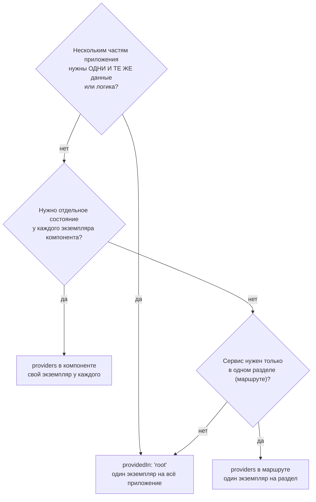
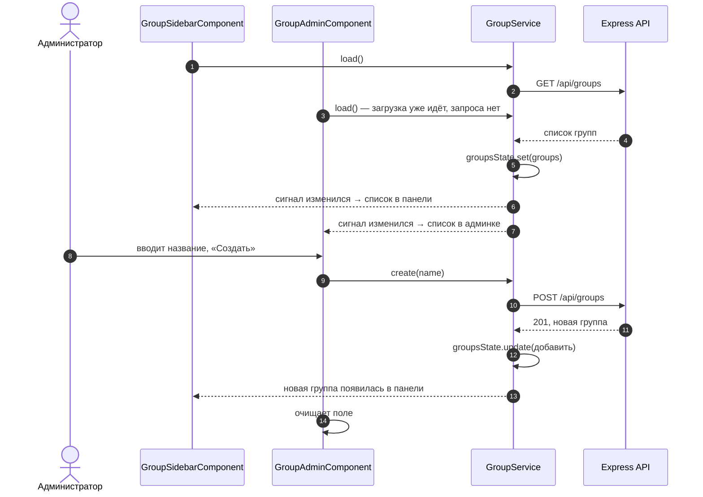
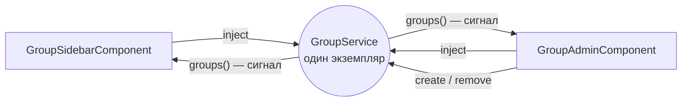
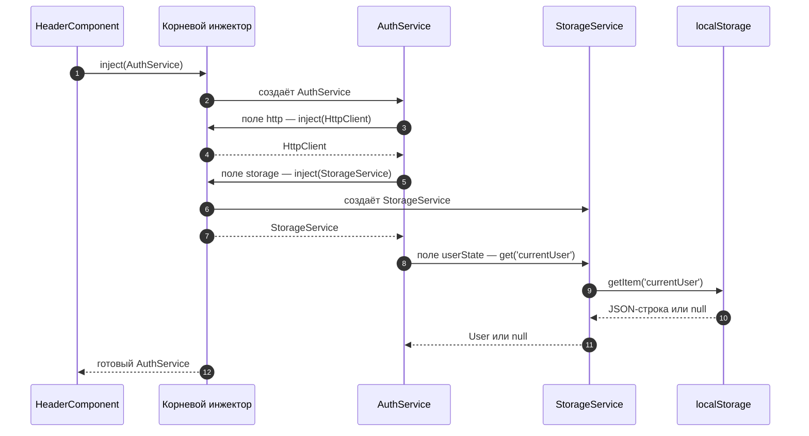
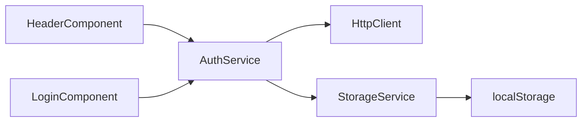
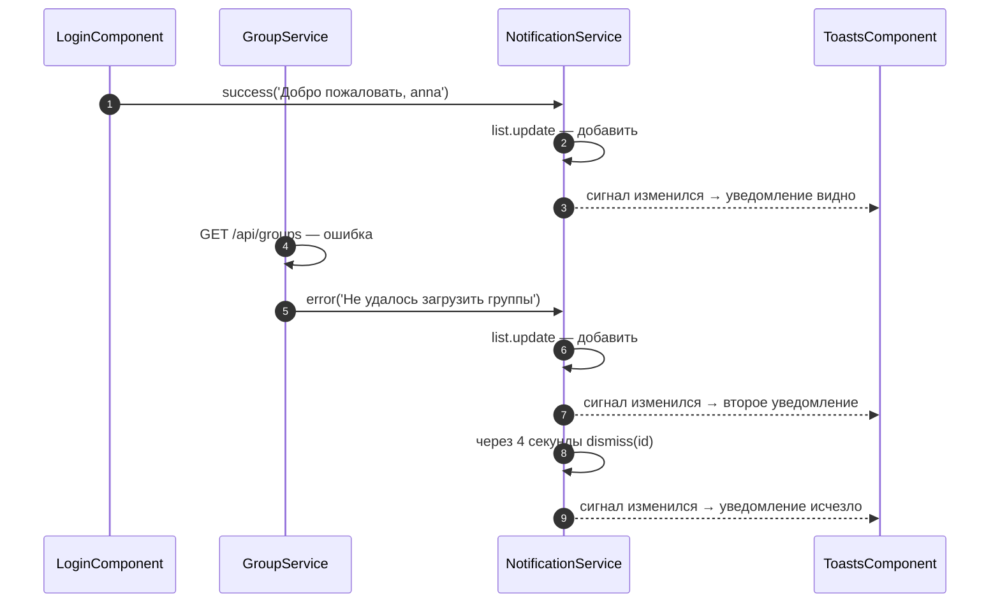
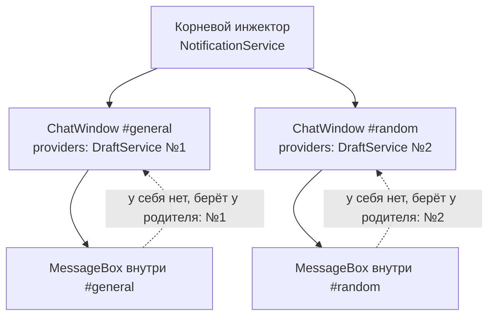
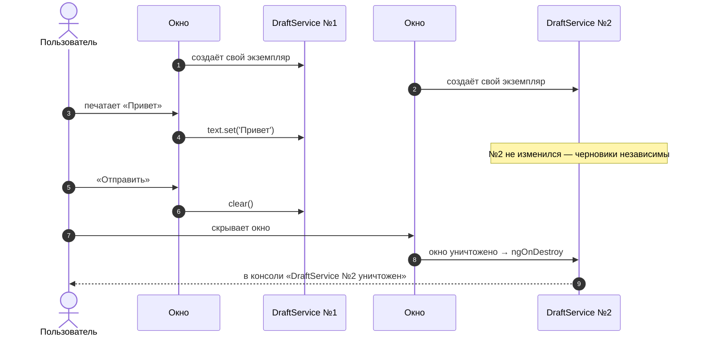
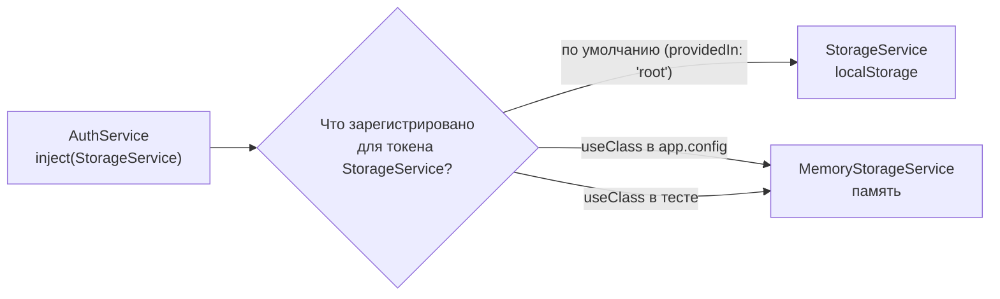
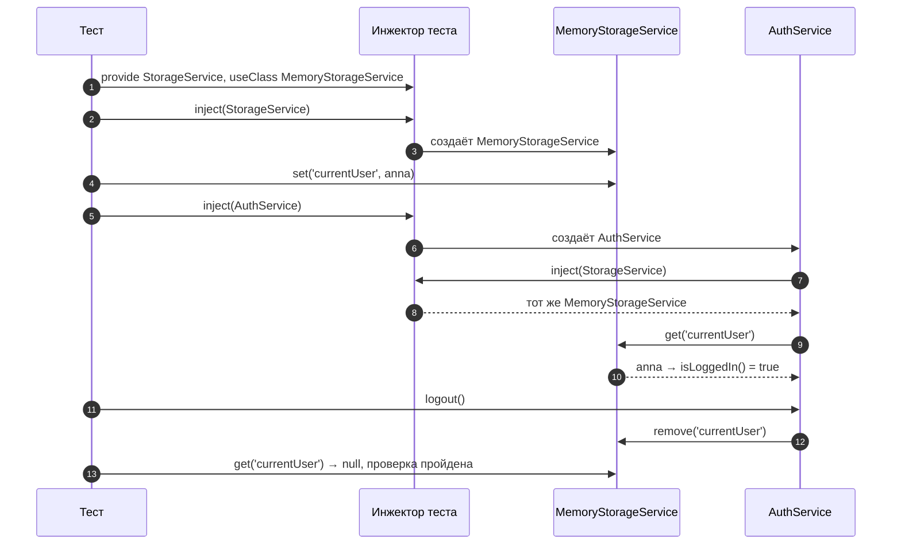

# 5_2 — Services: примеры использования

**Курс:** 3813ICT, неделя 5
**Связанные файлы:** [конспект](5_2-services-konspekt.md) · [поправки](5_2-services-popravki.md) · [вопросы](5_2-services-voprosy.md) · [ответы](5_2-services-otvety.md)

Каждый пример — рабочий кусок кода для чата Phase 2, на который можно сослаться при разработке. Он состоит из одного большого фрагмента (несколько файлов подряд, разделённых заголовками-комментариями), пошаговой последовательности и диаграмм. Примеры затрагивают и будущие темы (HttpClient из 5_4, тесты): важнее реальный сценарий, чем строгие рамки одного файла курса.

> **Диаграммы.** В Obsidian mermaid рендерится сам. В VS Code для этого нужно расширение **Markdown Preview Mermaid Support**.

---

<a id="ex-0"></a>

## Где регистрировать сервис



| Пример | Что показывает | Затрагивает темы |
|---|---|---|
| [1. GroupService — общий список групп](#ex-1) | Общее состояние на сигналах: создание группы в админке сразу видно в боковой панели | HttpClient (5_4), `@for` (5_5) |
| [2. AuthService использует StorageService](#ex-2) | Сервис внутри сервиса, одна обязанность на сервис, порядок создания зависимостей | хранилища (5_1), HttpClient |
| [3. NotificationService — уведомления отовсюду](#ex-3) | Сервис, который вызывают и компоненты, и другие сервисы, а показывает один компонент | сигналы |
| [4. DraftService — свой у каждого окна чата](#ex-4) | `providers` в компоненте, поиск сервиса вверх по дереву, уничтожение вместе с компонентом | `@Input`, `ngOnDestroy` |
| [5. Подмена реализации через провайдер](#ex-5) | `{ provide, useClass }`: тот же токен — другая реализация; зачем это в тестах | тесты (неделя 10+) |

---

<a id="ex-1"></a>

## Пример 1 — GroupService: общий список групп

**Когда использовать:** одни и те же данные нужны нескольким компонентам, и изменения в одном должны сразу появляться в другом. В чате список групп показывается в боковой панели, а создаётся и удаляется на странице администратора.

**Где в конспекте:** [§5.1 Singleton](5_2-services-konspekt.md#s5-1) · [§6.3 Сигналы в сервисе](5_2-services-konspekt.md#s6-3) · [П-11 Web API и Observable](5_2-services-popravki.md#p-11)

```ts
// ═════ src/app/models/group.ts ═════
export interface Group {
  id: number;
  name: string;
}

// ═════ src/app/services/group.service.ts ═════
import { Injectable, computed, inject, signal } from '@angular/core';
import { HttpClient } from '@angular/common/http';
import { Observable, tap } from 'rxjs';
import { Group } from '../models/group';

// Сервер (Express) отвечает так:
//   GET    /api/groups      → 200, Group[]
//   POST   /api/groups      → 201, созданная Group   (тело: { name })
//   DELETE /api/groups/:id  → 204
@Injectable({ providedIn: 'root' })
export class GroupService {
  private http = inject(HttpClient);
  private readonly API = 'http://localhost:3000/api/groups';

  // Изменяемый сигнал — только внутри сервиса
  private readonly groupsState = signal<Group[]>([]);
  // Наружу — только чтение: менять список можно лишь через методы ниже
  readonly groups = this.groupsState.asReadonly();
  // Производное значение: пересчитается само при изменении списка
  readonly count = computed(() => this.groupsState().length);

  private loadStarted = false;

  // Загрузить список один раз. Повторные вызовы из других компонентов ничего не делают
  load(): void {
    if (this.loadStarted) return;
    this.loadStarted = true;
    this.http.get<Group[]>(this.API).subscribe({
      next: (groups) => this.groupsState.set(groups),
      error: () => (this.loadStarted = false),       // разрешаем повторить попытку
    });
  }

  create(name: string): Observable<Group> {
    return this.http.post<Group>(this.API, { name }).pipe(
      // Сервер вернул созданную группу → добавляем её в сигнал НОВЫМ массивом
      tap((group) => this.groupsState.update((list) => [...list, group])),
    );
  }

  remove(id: number): Observable<void> {
    return this.http.delete<void>(`${this.API}/${id}`).pipe(
      tap(() => this.groupsState.update((list) => list.filter((g) => g.id !== id))),
    );
  }
}

// ═════ src/app/components/group-sidebar/group-sidebar.component.ts ═════
import { Component, OnInit, inject } from '@angular/core';
import { RouterLink } from '@angular/router';
import { GroupService } from '../../services/group.service';

@Component({
  selector: 'app-group-sidebar',
  imports: [RouterLink],
  template: `
    <h3>Группы ({{ groupService.count() }})</h3>
    <ul>
      @for (group of groupService.groups(); track group.id) {
        <li><a [routerLink]="['/groups', group.id]">{{ group.name }}</a></li>
      } @empty {
        <li>Групп пока нет</li>
      }
    </ul>
  `,
})
export class GroupSidebarComponent implements OnInit {
  protected groupService = inject(GroupService);   // шаблон читает сигналы сервиса → protected

  ngOnInit(): void {
    this.groupService.load();
  }
}

// ═════ src/app/pages/group-admin/group-admin.component.ts ═════
import { Component, OnInit, inject } from '@angular/core';
import { FormsModule } from '@angular/forms';
import { GroupService } from '../../services/group.service';

@Component({
  selector: 'app-group-admin',
  imports: [FormsModule],                           // для ngModel и ngSubmit
  template: `
    <form (ngSubmit)="create()">
      <input [(ngModel)]="name" name="name" placeholder="Название группы">
      <button type="submit" [disabled]="!name.trim()">Создать</button>
    </form>

    <ul>
      @for (group of groupService.groups(); track group.id) {
        <li>
          {{ group.name }}
          <button (click)="remove(group.id)">Удалить</button>
        </li>
      }
    </ul>

    @if (error) {
      <p class="error">{{ error }}</p>
    }
  `,
})
export class GroupAdminComponent implements OnInit {
  protected groupService = inject(GroupService);    // ТОТ ЖЕ экземпляр, что у боковой панели
  name = '';
  error = '';

  ngOnInit(): void {
    this.groupService.load();                       // безопасно: если список уже грузится, запроса не будет
  }

  create(): void {
    this.error = '';
    this.groupService.create(this.name.trim()).subscribe({
      next: () => (this.name = ''),                 // боковая панель обновится сама — через сигнал
      error: () => (this.error = 'Не удалось создать группу'),
    });
  }

  remove(id: number): void {
    this.groupService.remove(id).subscribe({
      error: () => (this.error = 'Не удалось удалить группу'),
    });
  }
}

// ═════ src/app/app.config.ts ═════
import { ApplicationConfig } from '@angular/core';
import { provideRouter } from '@angular/router';
import { provideHttpClient } from '@angular/common/http';
import { routes } from './app.routes';

export const appConfig: ApplicationConfig = {
  providers: [provideRouter(routes), provideHttpClient()],
};
```

### Последовательность

1. Боковая панель создаётся и в `ngOnInit` вызывает `groupService.load()`.
2. Сервис отправляет `GET /api/groups`.
3. Страница администратора тоже вызывает `load()`, но загрузка уже начата, поэтому второго запроса нет.
4. Сервер возвращает список групп.
5. Сервис кладёт список в сигнал `groupsState`.
6. Сигнал уведомляет боковую панель, и она рисует список.
7. Тот же сигнал уведомляет страницу администратора, и она тоже рисует список.
8. Администратор вводит название и жмёт «Создать».
9. Страница вызывает `groupService.create(name)`.
10. Сервис отправляет `POST /api/groups`.
11. Сервер отвечает 201 и созданной группой.
12. Сервис добавляет группу в сигнал новым массивом.
13. Боковая панель показывает новую группу без перезагрузки и без повторного запроса.
14. Страница администратора очищает поле ввода.



### Почему это работает



Оба компонента получают **один и тот же** экземпляр сервиса (singleton), а данные лежат в **сигнале**. Любое изменение через методы сервиса создаёт новый массив, сигнал уведомляет всех, кто его читает, и каждый шаблон перерисовывается сам.

---

<a id="ex-2"></a>

## Пример 2 — AuthService использует StorageService

**Когда использовать:** у сервиса несколько обязанностей, и их стоит разделить. `AuthService` отвечает за вход и выход, а как именно данные лежат в браузере, решает отдельный `StorageService`. Если хранилище поменяется, изменится только он.

**Где в конспекте:** [§7 Разделение обязанностей](5_2-services-konspekt.md#s7) · [§2.3 Как инжектор выдаёт сервис](5_2-services-konspekt.md#s2-3) · [§4.4 private или protected](5_2-services-konspekt.md#s4-4)

```ts
// ═════ src/app/services/storage.service.ts ═════
import { Injectable } from '@angular/core';

// Одна обязанность: безопасно читать и писать localStorage.
// Другие сервисы не знают, как устроено хранилище
@Injectable({ providedIn: 'root' })
export class StorageService {
  get<T>(key: string): T | null {
    try {
      const raw = localStorage.getItem(key);
      return raw === null ? null : (JSON.parse(raw) as T);
    } catch {
      return null;                                     // хранилище недоступно или JSON испорчен
    }
  }

  set(key: string, value: unknown): void {
    try {
      localStorage.setItem(key, JSON.stringify(value));
    } catch (e) {
      console.warn('Не удалось сохранить', key, e);    // нет места или хранение запрещено
    }
  }

  remove(key: string): void {
    try {
      localStorage.removeItem(key);
    } catch {
      // хранилище недоступно — удалять нечего
    }
  }
}

// ═════ src/app/services/auth.service.ts ═════
import { Injectable, computed, inject, signal } from '@angular/core';
import { HttpClient } from '@angular/common/http';
import { Observable, tap } from 'rxjs';
import { StorageService } from './storage.service';

export interface User {
  id: number;
  username: string;
  role: 'superadmin' | 'groupadmin' | 'user';
}

const USER_KEY = 'currentUser';

@Injectable({ providedIn: 'root' })
export class AuthService {
  // Поля инициализируются СВЕРХУ ВНИЗ — зависимости объявляем первыми
  private http = inject(HttpClient);                   // связь с сервером
  private storage = inject(StorageService);            // хранилище — отдельный сервис

  // storage уже получен строкой выше → можно читать сохранённого пользователя
  private readonly userState = signal<User | null>(this.storage.get<User>(USER_KEY));
  readonly currentUser = this.userState.asReadonly();
  readonly isLoggedIn = computed(() => this.userState() !== null);

  login(username: string, password: string): Observable<User> {
    return this.http
      .post<User>('http://localhost:3000/api/login', { username, password })
      .pipe(
        tap((user) => {
          this.storage.set(USER_KEY, user);            // КАК сохранить — забота StorageService
          this.userState.set(user);
        }),
      );
  }

  logout(): void {
    this.storage.remove(USER_KEY);
    this.userState.set(null);
  }
}

// ═════ src/app/components/header/header.component.ts ═════
import { Component, inject } from '@angular/core';
import { RouterLink } from '@angular/router';
import { AuthService } from '../../services/auth.service';

@Component({
  selector: 'app-header',
  imports: [RouterLink],
  template: `
    @if (auth.currentUser(); as user) {
      <span>{{ user.username }} · {{ user.role }}</span>
      <button (click)="auth.logout()">Выйти</button>
    } @else {
      <a routerLink="/login">Войти</a>
    }
  `,
})
export class HeaderComponent {
  // Шаблон обращается к auth → protected (с private была бы ошибка компиляции шаблона)
  protected auth = inject(AuthService);
}
```

### Последовательность: как создаются сервисы по цепочке

1. `HeaderComponent` создаётся и просит у инжектора `AuthService`.
2. Экземпляра ещё нет — инжектор начинает создавать `AuthService`.
3. Первое поле `AuthService` просит `HttpClient`.
4. Инжектор отдаёт `HttpClient`.
5. Второе поле просит `StorageService`.
6. Экземпляра нет — инжектор создаёт `StorageService`.
7. Инжектор отдаёт `StorageService` в `AuthService`.
8. Третье поле инициализирует сигнал: `AuthService` просит у `StorageService` сохранённого пользователя.
9. `StorageService` читает localStorage.
10. localStorage возвращает JSON-строку или `null`.
11. `StorageService` возвращает объект пользователя или `null`.
12. Готовый `AuthService` отдаётся в `HeaderComponent`, и шаблон показывает имя или ссылку «Войти».

Следующий компонент, который попросит `AuthService` или `StorageService`, получит уже готовые экземпляры.



### Кто от кого зависит



**Почему порядок полей важен.** Поля класса инициализируются сверху вниз. Если бы `userState` стоял выше `storage`, в момент его создания `this.storage` был бы ещё `undefined`, и чтение упало бы с ошибкой.

---

<a id="ex-3"></a>

## Пример 3 — NotificationService: уведомления отовсюду

**Когда использовать:** какое-то действие нужно вызывать из разных мест (компонентов и сервисов), а результат показывать в одном месте. Уведомления «Группа создана», «Не удалось загрузить сообщения» может отправить кто угодно, а видит их пользователь в одном углу экрана.

**Где в конспекте:** [§1.2 Что такое сервис](5_2-services-konspekt.md#s1-2) · [§6.3 Сигналы в сервисе](5_2-services-konspekt.md#s6-3) · [§7 Сервис использует сервис](5_2-services-konspekt.md#s7)

```ts
// ═════ src/app/services/notification.service.ts ═════
import { Injectable, signal } from '@angular/core';

export interface Notification {
  id: number;
  text: string;
  type: 'success' | 'error';
}

@Injectable({ providedIn: 'root' })
export class NotificationService {
  private readonly list = signal<Notification[]>([]);
  readonly notifications = this.list.asReadonly();
  private nextId = 1;

  success(text: string): void {
    this.show(text, 'success');
  }

  error(text: string): void {
    this.show(text, 'error');
  }

  dismiss(id: number): void {
    this.list.update((items) => items.filter((n) => n.id !== id));
  }

  private show(text: string, type: Notification['type']): void {
    const id = this.nextId++;
    this.list.update((items) => [...items, { id, text, type }]); // новый массив → сигнал уведомит
    setTimeout(() => this.dismiss(id), 4000);                    // исчезнет само через 4 секунды
  }
}

// ═════ src/app/components/toasts/toasts.component.ts — единственное место показа ═════
import { Component, inject } from '@angular/core';
import { NotificationService } from '../../services/notification.service';

@Component({
  selector: 'app-toasts',
  template: `
    <div class="toasts">
      @for (n of notifications.notifications(); track n.id) {
        <div class="toast" [class.error]="n.type === 'error'">
          {{ n.text }}
          <button (click)="notifications.dismiss(n.id)">✕</button>
        </div>
      }
    </div>
  `,
  styles: `
    .toasts { position: fixed; right: 1rem; bottom: 1rem; display: grid; gap: .5rem; }
    .toast  { padding: .5rem 1rem; background: #e6f4ea; border-radius: 6px; }
    .error  { background: #fde2e1; }
  `,
})
export class ToastsComponent {
  protected notifications = inject(NotificationService);
}

// ═════ Вызов из СЕРВИСА: GroupService из примера 1 ═════
// Добавляем зависимость и сообщаем об ошибке загрузки
@Injectable({ providedIn: 'root' })
export class GroupService {
  private http = inject(HttpClient);
  private notify = inject(NotificationService);        // сервис использует сервис
  // ...остальное как в примере 1

  load(): void {
    if (this.loadStarted) return;
    this.loadStarted = true;
    this.http.get<Group[]>(this.API).subscribe({
      next: (groups) => this.groupsState.set(groups),
      error: () => {
        this.loadStarted = false;
        this.notify.error('Не удалось загрузить группы');
      },
    });
  }
}

// ═════ Вызов из КОМПОНЕНТА: LoginComponent ═════
export class LoginComponent {
  private auth = inject(AuthService);
  private router = inject(Router);
  private notify = inject(NotificationService);
  username = '';
  password = '';

  onSubmit(): void {
    this.auth.login(this.username, this.password).subscribe({
      next: (user) => {
        this.notify.success(`Добро пожаловать, ${user.username}`);
        this.router.navigateByUrl('/groups');
      },
      error: () => this.notify.error('Неверное имя или пароль'),
    });
  }
}

// ═════ src/app/app.component.ts — ToastsComponent подключён один раз ═════
import { Component } from '@angular/core';
import { RouterOutlet } from '@angular/router';
import { HeaderComponent } from './components/header/header.component';
import { ToastsComponent } from './components/toasts/toasts.component';

@Component({
  selector: 'app-root',
  imports: [RouterOutlet, HeaderComponent, ToastsComponent],
  template: `
    <app-header />
    <router-outlet />
    <app-toasts />
  `,
})
export class AppComponent {}
```

### Последовательность

1. Пользователь вводит логин и пароль, `LoginComponent` вызывает `auth.login()`.
2. Вход успешен — компонент вызывает `notify.success('Добро пожаловать, anna')`.
3. `NotificationService` добавляет уведомление в сигнал новым массивом.
4. Сигнал уведомляет `ToastsComponent`, и уведомление появляется в углу экрана.
5. Роутер открывает `/groups`, `GroupService.load()` отправляет запрос.
6. Сервер недоступен — `GroupService` сам вызывает `notify.error('Не удалось загрузить группы')`.
7. `ToastsComponent` показывает и это уведомление.
8. Через 4 секунды таймер в сервисе вызывает `dismiss(id)` — уведомление исчезает.



**Главная мысль примера.** Ни `LoginComponent`, ни `GroupService` не знают, **как** показываются уведомления. Они только вызывают метод сервиса. Если захочется перенести уведомления в другое место экрана или заменить на звук, изменится только `ToastsComponent`.

---

<a id="ex-4"></a>

## Пример 4 — DraftService: свой у каждого окна чата

**Когда использовать:** у каждого экземпляра компонента должно быть своё независимое состояние, которое при этом нужно и его дочерним компонентам. Два окна чата открыты рядом: у каждого свой черновик, и текст из одного не должен попадать в другое.

**Где в конспекте:** [§5.3 Когда экземпляров несколько](5_2-services-konspekt.md#s5-3) · [П-2 Singleton и providers](5_2-services-popravki.md#p-2)

```ts
// ═════ src/app/services/draft.service.ts ═════
import { Injectable, OnDestroy, computed, signal } from '@angular/core';

// Нет providedIn: сервис НЕ регистрируется в корне.
// Его подключает тот компонент, которому нужен свой экземпляр
@Injectable()
export class DraftService implements OnDestroy {
  private static created = 0;
  readonly instanceNo = ++DraftService.created;      // номер экземпляра — чтобы увидеть, что их несколько

  readonly text = signal('');
  readonly length = computed(() => this.text().length);

  clear(): void {
    this.text.set('');
  }

  // Angular вызывает ngOnDestroy у сервиса, когда уничтожает его инжектор.
  // Здесь инжектор — окно чата, значит сервис умрёт вместе с окном
  ngOnDestroy(): void {
    console.log(`DraftService №${this.instanceNo} уничтожен`);
  }
}

// ═════ src/app/components/message-box/message-box.component.ts — дочерний ═════
import { Component, inject } from '@angular/core';
import { FormsModule } from '@angular/forms';
import { DraftService } from '../../services/draft.service';

@Component({
  selector: 'app-message-box',
  imports: [FormsModule],
  template: `
    <textarea [ngModel]="draft.text()" (ngModelChange)="draft.text.set($event)"></textarea>
    <small>{{ draft.length() }} симв. · черновик №{{ draft.instanceNo }}</small>
  `,
})
export class MessageBoxComponent {
  // В providers ЭТОГО компонента DraftService нет → Angular поднимается
  // к родителю (окну чата) и берёт экземпляр окна
  protected draft = inject(DraftService);
}

// ═════ src/app/components/chat-window/chat-window.component.ts ═════
import { Component, Input, inject } from '@angular/core';
import { DraftService } from '../../services/draft.service';
import { NotificationService } from '../../services/notification.service';
import { MessageBoxComponent } from '../message-box/message-box.component';

@Component({
  selector: 'app-chat-window',
  imports: [MessageBoxComponent],
  providers: [DraftService],                          // свой DraftService у КАЖДОГО окна
  template: `
    <h3>#{{ channelName }}</h3>
    <app-message-box />
    <button (click)="send()" [disabled]="!draft.length()">Отправить</button>
  `,
})
export class ChatWindowComponent {
  @Input({ required: true }) channelName!: string;

  protected draft = inject(DraftService);             // тот же экземпляр, что у message-box внутри
  private notify = inject(NotificationService);       // не в providers → общий из корня (пример 3)

  send(): void {
    this.notify.success(`#${this.channelName}: ${this.draft.text()}`);
    this.draft.clear();                               // message-box очистится сам — сигнал общий
  }
}

// ═════ src/app/pages/chat-page/chat-page.component.ts — два окна рядом ═════
import { Component } from '@angular/core';
import { ChatWindowComponent } from '../../components/chat-window/chat-window.component';

@Component({
  selector: 'app-chat-page',
  imports: [ChatWindowComponent],
  template: `
    <button (click)="showRandom = !showRandom">Показать или скрыть #random</button>
    <div class="windows">
      <app-chat-window channelName="general" />
      @if (showRandom) {
        <app-chat-window channelName="random" />
      }
    </div>
  `,
})
export class ChatPageComponent {
  showRandom = true;
}
```

### Как компонент находит свой экземпляр



Когда компонент просит сервис, Angular ищет его, **поднимаясь** от инжектора компонента к корню, и берёт первый найденный. `MessageBox` своего `DraftService` не имеет, поэтому получает экземпляр своего окна. `NotificationService` не указан ни в одном окне, поэтому поиск доходит до корня и находит общий экземпляр.

### Последовательность

1. Открывается страница чата — создаются два окна.
2. Окно `#general` создаёт свой `DraftService` №1.
3. Окно `#random` создаёт свой `DraftService` №2.
4. `MessageBox` внутри `#general` просит `DraftService` — поднимается к окну и получает №1.
5. `MessageBox` внутри `#random` получает №2.
6. Пользователь печатает в `#general` — меняется сигнал `text` у №1. Окно `#random` не затронуто.
7. Пользователь жмёт «Отправить» в `#general` — окно отправляет уведомление через общий `NotificationService` и очищает №1. `MessageBox` очищается сам, потому что читает тот же сигнал.
8. Пользователь скрывает `#random` — окно уничтожается, а вместе с ним и `DraftService` №2: в консоли появляется «DraftService №2 уничтожен».
9. Пользователь снова показывает `#random` — создаётся новое окно с новым `DraftService` №3 и пустым черновиком.



**Что будет, если убрать `providers: [DraftService]` из окна.** Тогда `DraftService` не зарегистрирован нигде (у него нет `providedIn`), и Angular выдаст ошибку `NullInjectorError: No provider for DraftService`. Если вместо этого дописать `providedIn: 'root'`, ошибки не будет, но экземпляр станет общим, и текст, набранный в одном окне, появится в другом.

---

<a id="ex-5"></a>

## Пример 5 — Подмена реализации через провайдер

**Когда использовать:** нужно заменить, как работает сервис, не трогая тех, кто им пользуется. Главный практический случай — тесты: проверить `AuthService` без настоящего localStorage и сервера. Другой случай — режим, в котором приложение ничего не оставляет в браузере.

Этот пример отвечает на вопрос «зачем DI, если можно написать `new`»: при `new` подменить сервис невозможно, а через DI — одной строкой.

**Где в конспекте:** [§2.1 Токен и провайдер](5_2-services-konspekt.md#s2-1) · [§2.2 Почему не new](5_2-services-konspekt.md#s2-2)

```ts
// ═════ src/app/services/storage.service.ts ═════
// StorageService из примера 2: работает с localStorage (get, set, remove)

// ═════ src/app/services/memory-storage.service.ts ═════
import { Injectable } from '@angular/core';
import { StorageService } from './storage.service';

// Та же «форма», что у StorageService, но данные хранятся в памяти.
// extends гарантирует, что имена и типы методов совпадают
@Injectable()
export class MemoryStorageService extends StorageService {
  private data = new Map<string, string>();

  override get<T>(key: string): T | null {
    const raw = this.data.get(key);
    return raw === undefined ? null : (JSON.parse(raw) as T);
  }

  override set(key: string, value: unknown): void {
    this.data.set(key, JSON.stringify(value));
  }

  override remove(key: string): void {
    this.data.delete(key);
  }
}

// ═════ Вариант 1: подмена для всего приложения — src/app/app.config.ts ═════
import { ApplicationConfig } from '@angular/core';
import { provideRouter } from '@angular/router';
import { provideHttpClient } from '@angular/common/http';
import { routes } from './app.routes';
import { StorageService } from './services/storage.service';
import { MemoryStorageService } from './services/memory-storage.service';

export const appConfig: ApplicationConfig = {
  providers: [
    provideRouter(routes),
    provideHttpClient(),
    // Токен — StorageService, реализация — MemoryStorageService.
    // Каждый inject(StorageService) теперь получит MemoryStorageService
    { provide: StorageService, useClass: MemoryStorageService },
  ],
};

// ═════ Вариант 2: подмена в тесте — src/app/services/auth.service.spec.ts ═════
// (тесты — тема недели 10+; здесь важна сама идея подмены)
import { TestBed } from '@angular/core/testing';
import { provideHttpClient } from '@angular/common/http';
import { provideHttpClientTesting } from '@angular/common/http/testing';
import { AuthService } from './auth.service';
import { StorageService } from './storage.service';
import { MemoryStorageService } from './memory-storage.service';

describe('AuthService', () => {
  it('logout удаляет пользователя из хранилища', () => {
    TestBed.configureTestingModule({
      providers: [
        provideHttpClient(),
        provideHttpClientTesting(),                                    // HttpClient без настоящего сервера
        { provide: StorageService, useClass: MemoryStorageService },   // хранилище в памяти
      ],
    });

    // Кладём пользователя ДО создания AuthService: он читает хранилище при создании
    const storage = TestBed.inject(StorageService);
    storage.set('currentUser', { id: 1, username: 'anna', role: 'user' });

    const auth = TestBed.inject(AuthService);      // код AuthService не менялся ни на строчку
    expect(auth.isLoggedIn()).toBe(true);

    auth.logout();
    expect(storage.get('currentUser')).toBeNull();
    expect(auth.isLoggedIn()).toBe(false);
  });
});
```

### Как токен связан с реализацией



`AuthService` просит не конкретную реализацию, а **токен** `StorageService`. Что именно он получит, решает провайдер. По умолчанию это сам `StorageService`; запись `{ provide: StorageService, useClass: MemoryStorageService }` говорит инжектору «по этому токену выдавай другой класс».

### Последовательность (тест)

1. Тест настраивает инжектор: для токена `StorageService` выдавать `MemoryStorageService`.
2. Тест просит `StorageService` — инжектор создаёт `MemoryStorageService`.
3. Тест кладёт в него пользователя.
4. Тест просит `AuthService` — инжектор создаёт его.
5. Поле `storage` в `AuthService` делает `inject(StorageService)` и получает **тот же** `MemoryStorageService`.
6. `AuthService` читает пользователя из памяти — `isLoggedIn()` возвращает `true`.
7. Тест вызывает `logout()` — `AuthService` просит хранилище удалить ключ.
8. Тест проверяет, что в хранилище пусто и `isLoggedIn()` вернул `false`. Настоящий localStorage при этом не тронут.


