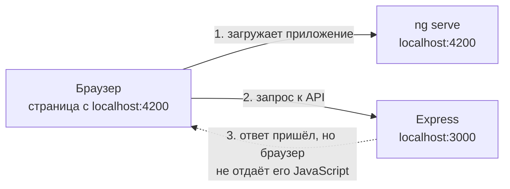
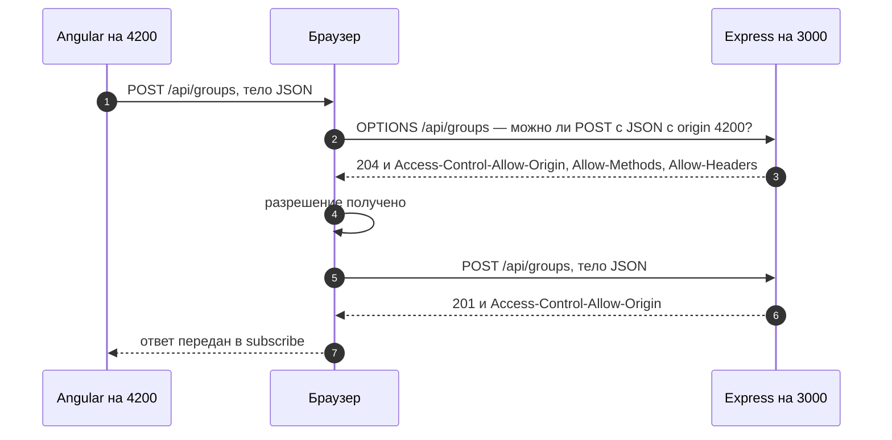
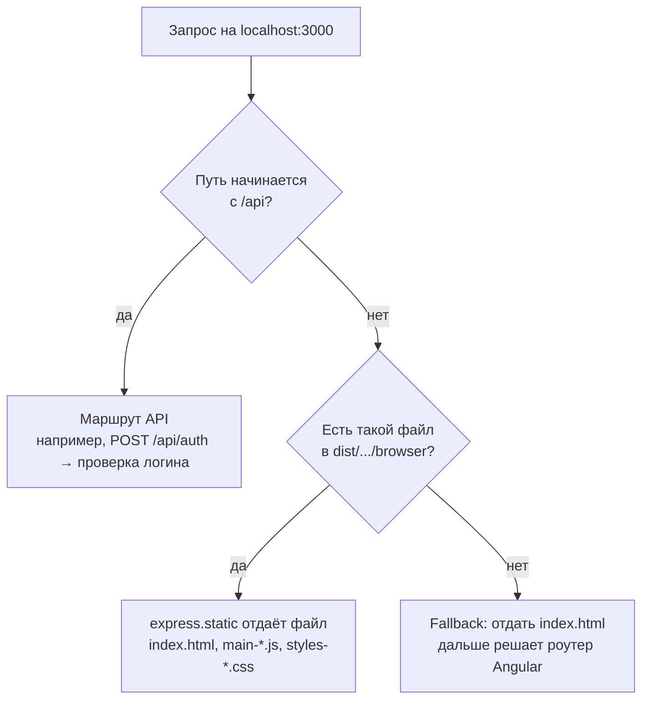

# 5_3 — Хостинг Angular на Node-сервере: конспект

**Курс:** 3813ICT, неделя 5
**Источник:** `5_3-Using_Node_Server_to_Host_Angular.pdf`
**Связанные файлы:** [поправки](5_3-node-hosting-popravki.md) · [примеры](5_3-node-hosting-primery.md) · [вопросы](5_3-node-hosting-voprosy.md) · [ответы](5_3-node-hosting-otvety.md)

> Значок **⚠** со ссылкой вида **П-N** ведёт в файл поправок. Там разобрано, где исходный материал курса расходится с тем, что написано в конспекте, и почему.

**Содержание**

1. [Проблема: два сервера — два origin](#s1): [два сервера](#s1-1) · [почему браузер блокирует](#s1-2)
2. [CORS](#s2): [что это](#s2-1) · [простые запросы и preflight](#s2-2) · [от чего защищает](#s2-3) · [CORS в Express](#s2-4) · [режим разработки](#s2-5)
3. [Single origin](#s3): [идея](#s3-1) · [ng build и dist](#s3-2) · [как один сервер отдаёт всё](#s3-3) · [пример из материала](#s3-4) · [F5 на маршруте Angular](#s3-5) · [__dirname и path.join](#s3-6)
4. [Структура проекта](#s4)
5. [Какой вариант когда](#s5)
6. [Ключевые факты](#s6)

---

<a id="s1"></a>

## 1. Проблема: два сервера — два origin

У чата две части: Angular-клиент, который видит пользователь, и Express-сервер с API и данными. Пока они работают отдельно, браузер не даёт им свободно общаться. Эта тема о том, почему так происходит и какие есть два способа это решить: разрешить общение (CORS) или сделать из двух серверов один (single origin).

<a id="s1-1"></a>

### 1.1 Два сервера во время разработки

Во время разработки обычно запущены два сервера:

- **`ng serve`** — встроенный сервер разработки Angular. Он собирает приложение, пересобирает его при каждом сохранении файла и отдаёт на `http://localhost:4200`.
- **Express** — наш Node-сервер с API на `http://localhost:3000`.

Вспомним из [темы 5_1](5_1-data-persistence-konspekt.md#s2-2): origin — это протокол + хост + порт. У `localhost:4200` и `localhost:3000` разные порты, значит, это **два разных origin**. Страница загружена с одного, а данные просит у другого:



<a id="s1-2"></a>

### 1.2 Почему браузер блокирует запрос

**Same-origin policy** (политика одного источника) — правило браузера: JavaScript на странице одного origin не может читать ответы на запросы к другому origin, если тот явно этого не разрешил.

Важная деталь: браузер блокирует **чтение ответа** кодом, а не сам факт общения. Сервер часто получает запрос и честно отвечает, но браузер не отдаёт ответ JavaScript. В консоли это выглядит так:

```
Access to XMLHttpRequest at 'http://localhost:3000/api/groups' from origin
'http://localhost:4200' has been blocked by CORS policy: No 'Access-Control-Allow-Origin'
header is present on the requested resource.
```

А Angular получит ошибку `HttpErrorResponse` со статусом `0` — так браузер сообщает «ответа нет».

**Зачем вообще такое правило?** Без него любой сайт, открытый в соседней вкладке, мог бы отправить запрос к твоей почте или банку (браузер приложил бы твои куки) и прочитать ответ — письма, баланс. Same-origin policy запрещает чужому коду читать такие ответы.

Отсюда два способа, чтобы Angular и Express всё-таки общались:

1. сервер явно разрешает чтение своих ответов другому origin — это **CORS** ([§2](#s2));
2. клиент и API отдаются одним сервером, то есть с одного origin, — это **single origin** ([§3](#s3)).

---

<a id="s2"></a>

## 2. CORS

Начнём с первого способа — он нужен во время разработки, когда удобно держать два сервера.

<a id="s2-1"></a>

### 2.1 Что такое CORS

**CORS** (Cross-Origin Resource Sharing) — стандарт, по которому сервер с помощью специальных HTTP-заголовков сообщает браузеру, каким чужим origin можно читать его ответы.

Главный заголовок — `Access-Control-Allow-Origin`. Сервер добавляет его в ответ:

```
Access-Control-Allow-Origin: http://localhost:4200    ← разрешено только этому origin
Access-Control-Allow-Origin: *                        ← разрешено всем
```

Браузер видит заголовок, сравнивает со своим origin и, если совпадает, отдаёт ответ JavaScript. Получается, что CORS — это **контролируемое ослабление** same-origin policy: сервер решает, кому можно, а браузер следит за исполнением.

Кто за что отвечает:

| Участник | Роль в CORS |
|---|---|
| Сервер | говорит заголовками, каким origin можно читать ответы |
| Браузер | проверяет заголовки и блокирует чтение, если origin не разрешён |
| Postman, curl, другой сервер | CORS не проверяют вообще: это правило только браузеров |

<a id="s2-2"></a>

### 2.2 Простые запросы и preflight

Не все запросы браузер отправляет одинаково, и это объясняет, почему иногда в Network видно два запроса вместо одного.

- **Простые запросы** — `GET`, `HEAD` и `POST` с данными формы, без своих заголовков. Браузер отправляет их сразу, а потом проверяет `Access-Control-Allow-Origin` в ответе. Если заголовка нет, сервер запрос уже обработал, но JavaScript ответа не увидит.
- **Остальные запросы** — `PUT`, `PATCH`, `DELETE`, `POST` с JSON, запросы со своими заголовками (например, `Authorization`). Перед ними браузер отправляет **preflight** — предварительный запрос `OPTIONS` с вопросом «можно ли?». Настоящий запрос уйдёт, только если сервер ответит разрешением.

Angular `HttpClient` отправляет объекты как JSON, поэтому почти каждый его `POST` вызывает preflight. Вот как это выглядит:



Пакет `cors` для Express отвечает на preflight сам — отдельный маршрут для `OPTIONS` писать не нужно.

<a id="s2-3"></a>

### 2.3 От чего защищает CORS, а от чего нет

Раз CORS разрешает, а не запрещает, полезно чётко разделить роли. ⚠ [П-1](5_3-node-hosting-popravki.md#p-1)

- **Защищает same-origin policy**: чужой сайт не может прочитать через браузер пользователя ответы твоего сервера.
- **CORS** — механизм, которым сервер ослабляет эту защиту для доверенных origin. Слишком широкая настройка (например, «разрешить всем» вместе с куками) защиту ослабляет.
- **CORS не мешает запросу дойти до сервера.** Простой `POST` с чужого сайта (скрытая форма) дойдёт, и браузер приложит куки — это атака CSRF, от неё защищают `SameSite` и CSRF-токены ([5_1 §7.2](5_1-data-persistence-konspekt.md#s7-2)).
- **CORS не действует вне браузера.** Postman, curl или чужой сервер отправят любой запрос. Поэтому сервер всегда сам проверяет, кто пришёл и что ему можно.

<a id="s2-4"></a>

### 2.4 Подключение CORS в Express

Чтобы Express добавлял нужные заголовки, используют готовый пакет `cors` — это middleware. ⚠ [П-2](5_3-node-hosting-popravki.md#p-2)

```bash
npm install cors
```

Вот пример того, как подключить его — сначала самый простой вариант, потом правильный:

```js
const express = require('express');
const cors = require('cors');
const app = express();

// Вариант 1: разрешить всем origin (Access-Control-Allow-Origin: *).
// Годится для учебного локального сервера, но не для реального
// app.use(cors());

// Вариант 2: разрешить только наш Angular в режиме разработки
app.use(cors({
  origin: 'http://localhost:4200',
  // credentials: true,   // добавить, только если клиент работает с куками (withCredentials)
}));

app.use(express.json());
// ...маршруты API — ПОСЛЕ cors, иначе их ответы уйдут без заголовков
```

Два правила:

- `cors` подключают **до** маршрутов: middleware работают по порядку.
- `credentials: true` нельзя сочетать с `origin: '*'` — браузер такой ответ отвергнет. Для кук нужен конкретный origin.

<a id="s2-5"></a>

### 2.5 Удобный режим разработки

Два сервера неудобны лишь на первый взгляд: каждый умеет перезапускаться сам. ⚠ [П-3](5_3-node-hosting-popravki.md#p-3)

- `ng serve` пересобирает Angular при каждом сохранении.
- `nodemon server.js` вместо `node server.js` следит за файлами сервера и перезапускает его при сохранении. В Node.js 18.11 и новее есть встроенная замена: `node --watch server.js`.

Есть и способ обойтись без CORS даже в режиме разработки — **прокси** в `ng serve`. Сервер разработки Angular сам пересылает запросы на `/api` в Express. Для браузера всё приходит с `localhost:4200`, то есть с одного origin:

```json
// proxy.conf.json в корне Angular-проекта
{
  "/api": {
    "target": "http://localhost:3000",
    "secure": false
  }
}
```

```bash
ng serve --proxy-config proxy.conf.json
```

Плюс прокси ещё и в том, что Angular-код везде использует адрес `/api/...`: и при разработке, и при single origin ([§3](#s3)). Полный пример — в [примерах, пример 2](5_3-node-hosting-primery.md#ex-2).

---

<a id="s3"></a>

## 3. Single origin

Теперь второй способ. Он нужен, когда приложение собрано и его показывают или сдают: одна команда, один сервер, никаких проблем с origin.

<a id="s3-1"></a>

### 3.1 Идея

Angular-приложение можно **собрать** в набор обычных статических файлов (HTML, JS, CSS). Express умеет раздавать статические файлы. Значит, один Express может отдавать и само приложение, и API — с одного порта, то есть с одного origin. CORS при этом не нужен вовсе.

<a id="s3-2"></a>

### 3.2 `ng build` и папка `dist`

Команда `ng build` компилирует TypeScript, собирает и оптимизирует код и складывает результат в папку `dist`:

```
dist/chat-app/browser/        ← Angular 17+; в более старых — dist/chat-app/
├── index.html                ← единственная HTML-страница приложения
├── main-7XQ2ZK4B.js          ← весь код приложения (хэш в имени меняется при каждой сборке)
├── polyfills-FFHMD2TL.js
├── styles-5INURTSO.css
└── favicon.ico
```

- **Подпапка `browser`.** В Angular 17 и новее сборка кладёт файлы для браузера в `dist/<проект>/browser/`. Если указать серверу просто `dist/<проект>/`, он не найдёт `index.html`. ⚠ [П-4](5_3-node-hosting-popravki.md#p-4)
- **Один HTML-файл.** В приложении Angular есть только `index.html`; все «страницы» рисует JavaScript. Сервер отдаёт `index.html` на запрос к корню сайта.
- **Пересборка.** `dist` — снимок кода на момент сборки. После изменений в Angular нужно снова запустить `ng build`. Чтобы не делать это вручную, есть `ng build --watch` — пересборка при каждом сохранении.
- **В git не коммитят.** `dist`, как и `node_modules`, собирается из исходников.

<a id="s3-3"></a>

### 3.3 Как один сервер отдаёт и приложение, и API

Когда запрос приходит на единый сервер, Express проверяет обработчики по порядку. Вот как распределяются типичные запросы:



Порядок в `server.js` повторяет эту схему: сначала маршруты API, потом `express.static`, в самом конце — fallback ([§3.5](#s3-5)).

<a id="s3-4"></a>

### 3.4 Пример из материала: `server.js`

Вот как сервер для single origin выглядит в материале курса:

```js
const express = require('express');  // Import exprerss.js
const app = express(); //The app object conventionally denotes the Express application. Create it by
                       //calling the top-level express() function exported by the Express module.

const path = require('path');
const http = require('http').Server(app);
const bodyParser = require('body-parser'); //create an instance of body-parser

app.use (bodyParser.json()); //Mounts the specified middleware function at the
                             //specified path: the middleware function is executed when the base of the
                             //requested path matches path. In this case we are using middleware to parse
                             //JSON data

app.use(express.static(path.join(__dirname, '../dist/week5tut/'))); //Serve static content for the app from the "public"
                                                                   //Target the build version of the angular app
                                                                   //created in the "dist" direcotry:

//Route for checking user credentials
require('./routes/api-login.js')(app,path);
//Start the server listening on port 3000. Output message to console once server has started.(diagnostic only)
require('./listen.js')(http);
```

**Что в нём происходит.**

- Создаётся Express-приложение и HTTP-сервер на его основе.
- `body-parser` разбирает JSON в теле запросов в `req.body`.
- `express.static` раздаёт собранное приложение из папки `dist`, путь к которой строится через модуль `path` от папки файла (`__dirname`). Так же на неделе 3 раздавалась папка `www` с `form.html`.
- Маршрут проверки логина подключается из отдельного файла: модуль экспортирует функцию, и ей передаются `app` и `path`, чтобы модуль мог повесить на `app` свой маршрут.
- Запуск сервера на порту 3000 тоже вынесен в отдельный модуль `listen.js`, которому передаётся `http`.

Идея верная, но с современным Angular и Express в этом коде три проблемы: путь к `dist` без подпапки `browser` ([П-4](5_3-node-hosting-popravki.md#p-4)), лишний пакет `body-parser` ([П-5](5_3-node-hosting-popravki.md#p-5)) и отсутствие fallback для маршрутов Angular ([П-6](5_3-node-hosting-popravki.md#p-6)).

Вот исправленная версия:

```js
// server/server.js
const express = require('express');
const path = require('path');

const app = express();
const PORT = 3000;
// __dirname — папка ЭТОГО файла (server/). '..' — на уровень выше, в корень проекта
const CLIENT_DIR = path.join(__dirname, '../dist/chat-app/browser');

app.use(express.json());                              // встроенный разбор JSON вместо body-parser

// 1. API
app.use('/api', require('./routes/auth'));            // маршруты — Express Router в отдельном файле
app.use('/api', (req, res) => {                        // неизвестный /api/... → JSON 404, не index.html
  res.status(404).json({ error: 'Not found' });
});

// 2. Статические файлы собранного Angular
app.use(express.static(CLIENT_DIR));

// 3. Fallback: любой другой GET → index.html, дальше разберётся роутер Angular.
// Express 5: '/{*splat}' — любой путь, включая корень (в Express 4 было '*')
app.get('/{*splat}', (req, res) => {
  res.sendFile(path.join(CLIENT_DIR, 'index.html'));
});

app.listen(PORT, () => console.log(`Чат: http://localhost:${PORT}`));
```

**Какая последовательность?**

1. **Сервер запускается** (`node server/server.js`).
   1. `CLIENT_DIR` вычисляется от папки файла, поэтому путь верный, откуда бы ни запустили команду.
   2. Middleware и маршруты регистрируются в том порядке, в котором написаны.
2. **Браузер открывает `http://localhost:3000/`.**
   1. Путь не начинается с `/api` — маршруты API пропускают запрос.
   2. `express.static` находит `index.html` в `CLIENT_DIR` и отдаёт его.
3. **Браузер разбирает `index.html`** и запрашивает `main-*.js`, `styles-*.css` и другие файлы.
   1. `express.static` находит каждый файл и отдаёт.
4. **Angular запускается** и отправляет `POST /api/login`.
   1. `express.json()` разбирает тело в `req.body`.
   2. Маршрут из `routes/auth.js` проверяет логин и отвечает JSON.
   3. Страница и API на одном origin — CORS не нужен.
5. **Пользователь жмёт F5 на `/groups/5`.**
   1. Путь не `/api`, файла `groups/5` в `dist` нет.
   2. Срабатывает fallback и отдаёт `index.html`.
   3. Angular запускается, роутер видит адрес `/groups/5` и показывает нужную страницу.
6. **Запрос к несуществующему `/api/unknown`** получает `404` в JSON, а не `index.html`: обработчик для `/api` стоит раньше fallback.

<a id="s3-5"></a>

### 3.5 F5 на маршруте Angular

Почему без fallback обновление страницы ломается? ⚠ [П-6](5_3-node-hosting-popravki.md#p-6)

Адрес `/groups/5` существует только внутри Angular — это маршрут роутера, а не файл на сервере. Пока пользователь переходит по ссылкам внутри приложения, запросов к серверу за страницами нет: роутер меняет адрес сам. Но при F5 (или при открытии ссылки в новой вкладке) браузер честно просит у сервера `GET /groups/5`. Файла с таким именем нет, и Express отвечает `404 Cannot GET /groups/5`.

Решение — **fallback**: на любой `GET`, который не попал в API и не нашёлся среди файлов, отдавать `index.html`. Angular загрузится, роутер прочитает адрес и покажет нужную страницу.

Синтаксис fallback зависит от версии Express (сейчас `npm install express` ставит Express 5):

| Express | Запись |
|---|---|
| 5 | `app.get('/{*splat}', handler)` |
| 4 | `app.get('*', handler)` |
| любая | `app.use(handler)` в самом конце, с проверкой `req.method === 'GET'` |

<a id="s3-6"></a>

### 3.6 `__dirname` и `path.join`

Путь к `dist` почти всегда пишут через `path.join(__dirname, ...)`. Вот почему:

- **`__dirname`** — папка, в которой лежит текущий файл. Для `server/server.js` это `.../chat-app/server`.
- **`process.cwd()`** — папка, из которой запустили `node`. Относительные пути вроде `'../dist'` без `__dirname` считаются именно от неё, и сервер ломается, если запустить его из другой папки.
- **`path.join`** склеивает части пути с правильными разделителями для любой ОС и понимает `..` («на уровень выше»).

```js
console.log(__dirname);                                   // /home/anton/chat-app/server
console.log(path.join(__dirname, '../dist/chat-app/browser'));
// /home/anton/chat-app/dist/chat-app/browser
```

Материал советует на всякий случай вывести `__dirname` в консоль, если сервер не находит файлы, — это действительно самый быстрый способ проверить путь.

---

<a id="s4"></a>

## 4. Структура проекта

Когда появляется сервер, в репозитории оказываются **два проекта**: Angular и Node. У каждого свой `package.json` и свой `node_modules`, потому что зависимости у них разные. ⚠ [П-7](5_3-node-hosting-popravki.md#p-7)

Папку сервера удобно держать внутри Angular-проекта — тогда весь чат лежит в одном репозитории. Но это не обязательно: главное, чтобы путь от сервера до `dist` был указан правильно. Вот рекомендуемая структура для Phase 2:

```
chat-app/
├── src/                          ← исходники Angular
├── angular.json
├── package.json                  ← зависимости Angular
├── proxy.conf.json               ← прокси для ng serve (по желанию)
├── dist/chat-app/browser/        ← появляется после ng build, в git не коммитится
└── server/
    ├── package.json              ← зависимости сервера: express, cors...
    ├── server.js
    ├── routes/
    │   └── auth.js
    └── data/
        └── users.json
```

Путь от `server/server.js` до собранного клиента: `path.join(__dirname, '../dist/chat-app/browser')`.

В `.gitignore` должны быть `node_modules/` (в обоих проектах) и `dist/`. Как объединить всё в одном репозитории и запускать сервер из корня — тема файла 5_6.

---

<a id="s5"></a>

## 5. Какой вариант когда

Оба способа нужны, просто на разных этапах. Вот как они сравниваются:

| | Разработка | Сборка, показ, сдача |
|---|---|---|
| Серверы | `ng serve` (4200) и Express (3000) | один Express (3000) |
| Как обойти разные origin | CORS в Express **или** прокси в `ng serve` | не нужно: origin один |
| Адрес API в Angular | `http://localhost:3000/api` (CORS) или `/api` (прокси) | `/api` |
| Обновление при изменениях | мгновенное: `ng serve` и nodemon | нужно `ng build` (или `ng build --watch`) |
| Команды | `ng serve` + `nodemon server.js` | `ng build` + `node server.js` |

Если использовать прокси при разработке, адрес API в Angular в обоих режимах один и тот же — `/api`, и код не нужно переключать.

---

<a id="s6"></a>

## 6. Ключевые факты

**Origin и same-origin policy**

- `localhost:4200` и `localhost:3000` — разные origin, потому что разные порты.
- Same-origin policy не даёт JavaScript читать ответы от другого origin без разрешения сервера.
- Браузер блокирует чтение ответа; сам запрос часто доходит до сервера. В Angular такая ошибка приходит со статусом `0`.

**CORS**

- CORS — стандарт, по которому сервер заголовком `Access-Control-Allow-Origin` разрешает другим origin читать свои ответы.
- CORS проверяет только браузер; Postman и curl его игнорируют.
- Простые запросы уходят сразу; `PUT`, `PATCH`, `DELETE`, JSON и свои заголовки требуют preflight-запроса `OPTIONS`.
- CORS — ослабление защиты, а не защита; от CSRF защищают `SameSite` и токены.
- В Express: `npm install cors`, `app.use(cors({ origin: 'http://localhost:4200' }))` до маршрутов.
- `credentials: true` нельзя сочетать с `origin: '*'`.

**Режим разработки**

- `ng serve` и `nodemon` (или `node --watch`) перезапускают клиент и сервер при сохранении.
- Прокси `ng serve` пересылает `/api` в Express и убирает проблему разных origin без CORS.

**Single origin**

- `ng build` кладёт собранное приложение в `dist/<проект>/browser/` (Angular 17+).
- Express отдаёт его через `express.static`, API — через маршруты `/api`, и всё работает с одного origin.
- Без fallback F5 на маршруте Angular даёт 404: нужно отдавать `index.html` на прочие `GET` (`'/{*splat}'` в Express 5).
- После изменений в Angular нужна новая сборка.

**Пути и структура**

- `__dirname` — папка текущего файла; `path.join` склеивает путь для любой ОС.
- Angular и сервер — два проекта со своими `package.json`; `dist` и `node_modules` в git не коммитят.
