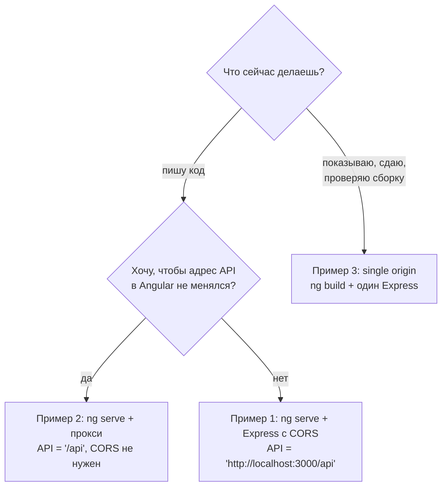
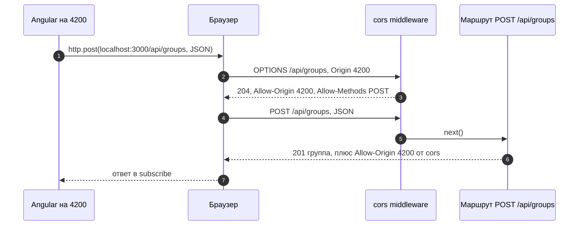
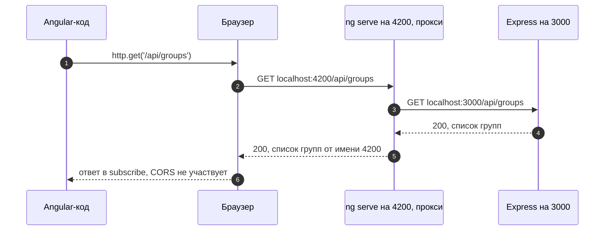
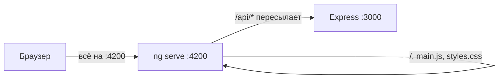
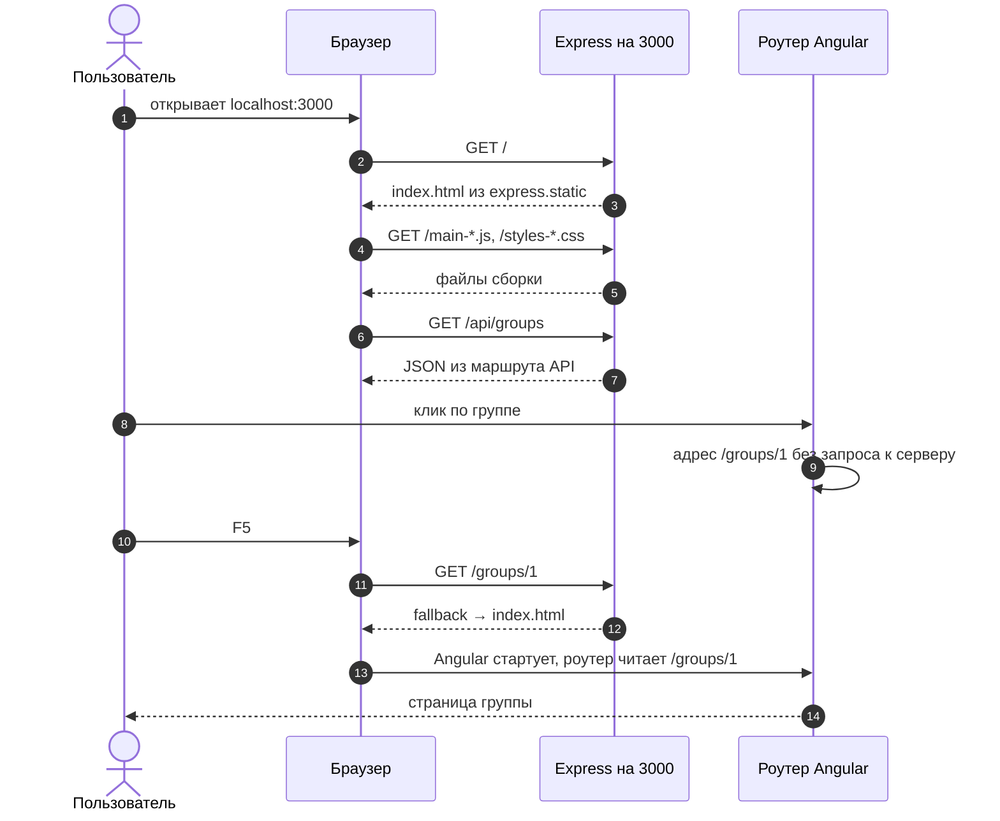

# 5_3 — Хостинг Angular на Node-сервере: примеры использования

**Курс:** 3813ICT, неделя 5
**Связанные файлы:** [конспект](5_3-node-hosting-konspekt.md) · [поправки](5_3-node-hosting-popravki.md) · [вопросы](5_3-node-hosting-voprosy.md) · [ответы](5_3-node-hosting-otvety.md)

Каждый пример — рабочая конфигурация чата Phase 2, на которую можно сослаться при разработке: один большой фрагмент кода, пошаговая последовательность и диаграммы. В конце — таблица частых ошибок и их причин.

> **Диаграммы.** В Obsidian mermaid рендерится сам. В VS Code нужно расширение **Markdown Preview Mermaid Support**.

---

<a id="ex-0"></a>

## Какой режим выбрать



| Пример | Режим | Что показывает |
|---|---|---|
| [1. Два сервера и CORS](#ex-1) | разработка | `cors` с конкретным origin, полный адрес API в Angular |
| [2. Два сервера и прокси](#ex-2) | разработка | `proxy.conf.json`, один адрес `/api` для всех режимов |
| [3. Single origin](#ex-3) | сборка и сдача | `ng build`, Express отдаёт клиент и API, fallback для F5 |
| [Частые ошибки](#errors) | — | что значит ошибка в консоли и как её исправить |

---

<a id="ex-1"></a>

## Пример 1 — Два сервера и CORS

**Когда использовать:** разработка, когда Angular запущен через `ng serve` на 4200, а Express — отдельно на 3000, и прокси настраивать не хочется.

**Где в конспекте:** [§2.1 Что такое CORS](5_3-node-hosting-konspekt.md#s2-1) · [§2.2 Preflight](5_3-node-hosting-konspekt.md#s2-2) · [§2.4 CORS в Express](5_3-node-hosting-konspekt.md#s2-4)

```ts
// ═════ server/server.js (Node + Express, JavaScript) ═════
// npm install express cors
const express = require('express');
const cors = require('cors');

const app = express();

// CORS — ДО маршрутов. Разрешаем чтение ответов только Angular-у на 4200.
// Пакет сам отвечает на preflight-запросы OPTIONS
app.use(cors({ origin: 'http://localhost:4200' }));
app.use(express.json());

let groups = [{ id: 1, name: 'General' }];

app.get('/api/groups', (req, res) => {
  res.json(groups);                          // ответ уйдёт с Access-Control-Allow-Origin: http://localhost:4200
});

app.post('/api/groups', (req, res) => {      // POST с JSON → браузер сначала пришлёт OPTIONS
  const group = { id: Date.now(), name: req.body.name };
  groups.push(group);
  res.status(201).json(group);
});

app.listen(3000, () => console.log('API: http://localhost:3000'));

// ═════ server/package.json — автоперезапуск при сохранении ═════
// "scripts": { "dev": "node --watch server.js" }

// ═════ src/app/services/group.service.ts (Angular) ═════
import { Injectable, inject } from '@angular/core';
import { HttpClient } from '@angular/common/http';
import { Observable } from 'rxjs';

export interface Group { id: number; name: string; }

@Injectable({ providedIn: 'root' })
export class GroupService {
  private http = inject(HttpClient);
  // Полный адрес: API на ДРУГОМ origin (порт 3000)
  private readonly API = 'http://localhost:3000/api/groups';

  getAll(): Observable<Group[]> {
    return this.http.get<Group[]>(this.API);
  }

  create(name: string): Observable<Group> {
    return this.http.post<Group>(this.API, { name });
  }
}

// ═════ Запуск: два терминала ═════
// терминал 1:  ng serve                         → http://localhost:4200
// терминал 2:  cd server && npm run dev         → http://localhost:3000
```

### Последовательность

1. Браузер загружает приложение с `localhost:4200`.
2. `GroupService.create('Study')` вызывает `POST http://localhost:3000/api/groups` с JSON.
3. Запрос не простой (JSON, другой origin) — браузер сначала отправляет `OPTIONS`.
4. Middleware `cors` отвечает разрешением: origin 4200 можно, метод `POST` можно, заголовок `Content-Type` можно.
5. Браузер отправляет настоящий `POST`.
6. Маршрут создаёт группу и отвечает `201`; `cors` добавляет `Access-Control-Allow-Origin`.
7. Браузер сверяет заголовок со своим origin — совпадает — и передаёт ответ в `subscribe`.



---

<a id="ex-2"></a>

## Пример 2 — Два сервера и прокси

**Когда использовать:** рекомендуемый режим разработки. Браузер видит один origin (`localhost:4200`), CORS не нужен, а Angular-код обращается к `/api` — ровно так же, как в собранном приложении (пример 3). Переключать адреса между режимами не придётся.

**Где в конспекте:** [§2.5 Режим разработки](5_3-node-hosting-konspekt.md#s2-5) · [П-3](5_3-node-hosting-popravki.md#p-3)

```ts
// ═════ proxy.conf.json (корень Angular-проекта) ═════
// {
//   "/api": {
//     "target": "http://localhost:3000",
//     "secure": false
//   }
// }
// Всё, что начинается с /api, сервер разработки Angular перешлёт на Express

// ═════ angular.json — чтобы прокси включался при каждом ng serve ═════
// "serve": {
//   "options": {
//     "proxyConfig": "proxy.conf.json"
//   }
// }

// ═════ server/server.js — CORS больше не нужен ═════
const express = require('express');
const app = express();

app.use(express.json());

let groups = [{ id: 1, name: 'General' }];

// Путь должен начинаться с /api — именно этот префикс ловит прокси
app.get('/api/groups', (req, res) => res.json(groups));
app.post('/api/groups', (req, res) => {
  const group = { id: Date.now(), name: req.body.name };
  groups.push(group);
  res.status(201).json(group);
});

app.listen(3000, () => console.log('API: http://localhost:3000'));

// ═════ src/app/services/group.service.ts ═════
import { Injectable, inject } from '@angular/core';
import { HttpClient } from '@angular/common/http';
import { Observable } from 'rxjs';

export interface Group { id: number; name: string; }

@Injectable({ providedIn: 'root' })
export class GroupService {
  private http = inject(HttpClient);
  // Относительный адрес: запрос уйдёт на тот же origin, с которого загружена страница.
  // В разработке его перехватит прокси, в single origin обработает сам Express
  private readonly API = '/api/groups';

  getAll(): Observable<Group[]> {
    return this.http.get<Group[]>(this.API);
  }

  create(name: string): Observable<Group> {
    return this.http.post<Group>(this.API, { name });
  }
}

// ═════ Запуск: два терминала ═════
// терминал 1:  ng serve                   (прокси подхватится из angular.json)
// терминал 2:  cd server && npm run dev
```

### Последовательность

1. Браузер загружает приложение с `localhost:4200`.
2. `GroupService.getAll()` запрашивает `/api/groups` — для браузера это `localhost:4200/api/groups`, тот же origin.
3. Сервер разработки Angular видит префикс `/api` и пересылает запрос на `localhost:3000/api/groups`.
4. Express отвечает списком групп.
5. Сервер разработки возвращает ответ браузеру от имени `localhost:4200`.
6. Браузер передаёт ответ в `subscribe` — проверка CORS не нужна, origin один.





---

<a id="ex-3"></a>

## Пример 3 — Single origin

**Когда использовать:** собранное приложение — для показа, проверки или сдачи. Один сервер, одна команда запуска, один origin.

**Где в конспекте:** [§3.2 ng build и dist](5_3-node-hosting-konspekt.md#s3-2) · [§3.4 Пример из материала](5_3-node-hosting-konspekt.md#s3-4) · [§3.5 F5 на маршруте Angular](5_3-node-hosting-konspekt.md#s3-5)

```ts
// ═════ server/server.js (Node + Express 5, JavaScript) ═════
const express = require('express');
const fs = require('fs');
const path = require('path');

const app = express();
const PORT = 3000;

// Путь от ЭТОГО файла до сборки Angular 17+ (подпапка browser)
const CLIENT_DIR = path.join(__dirname, '../dist/chat-app/browser');
if (!fs.existsSync(path.join(CLIENT_DIR, 'index.html'))) {
  console.warn(`index.html не найден в ${CLIENT_DIR} — сначала выполни ng build`);
}

app.use(express.json());

// ── 1. API ──
let groups = [{ id: 1, name: 'General' }];
app.get('/api/groups', (req, res) => res.json(groups));
app.post('/api/groups', (req, res) => {
  const group = { id: Date.now(), name: req.body.name };
  groups.push(group);
  res.status(201).json(group);
});
// Неизвестный /api/... → JSON 404, а не index.html (иначе клиент получит HTML вместо данных)
app.use('/api', (req, res) => res.status(404).json({ error: 'Not found' }));

// ── 2. Файлы собранного Angular: index.html, main-*.js, styles-*.css ──
app.use(express.static(CLIENT_DIR));

// ── 3. Fallback: любой другой GET → index.html, маршрут разберёт роутер Angular ──
// Express 5: '/{*splat}' — любой путь, включая '/'. В Express 4 было бы '*'
app.get('/{*splat}', (req, res) => {
  res.sendFile(path.join(CLIENT_DIR, 'index.html'));
});

app.listen(PORT, () => console.log(`Чат: http://localhost:${PORT}`));

// ═════ package.json в корне Angular-проекта — скрипты ═════
// "scripts": {
//   "start": "ng serve",                                  // разработка (пример 2)
//   "build": "ng build",
//   "build:watch": "ng build --watch",                    // пересборка при сохранении
//   "prod": "ng build && node server/server.js"           // собрать и запустить одной командой
// }
// node server/server.js можно запускать из корня: require('express') найдёт
// server/node_modules, потому что Node ищет пакеты от папки самого файла

// ═════ src/app/services/group.service.ts — без изменений по сравнению с примером 2 ═════
// private readonly API = '/api/groups';
```

### Последовательность

1. `npm run prod` собирает Angular в `dist/chat-app/browser/` и запускает сервер.
2. Браузер открывает `http://localhost:3000/`.
3. Путь не `/api`; `express.static` находит `index.html` и отдаёт его.
4. Браузер запрашивает `main-*.js` и `styles-*.css` — их тоже отдаёт `express.static`.
5. Angular стартует и вызывает `GET /api/groups` — маршрут API отвечает JSON.
6. Пользователь переходит в группу — роутер Angular меняет адрес на `/groups/1` без запроса к серверу.
7. Пользователь жмёт F5 — браузер просит `GET /groups/1`.
8. Такого API и файла нет — срабатывает fallback и отдаёт `index.html`.
9. Angular стартует заново, роутер читает `/groups/1` и показывает страницу группы.



---

<a id="errors"></a>

## Частые ошибки и что они значат

Когда что-то не работает, сообщение об ошибке обычно прямо указывает на причину. Вот самые частые случаи в этой теме:

| Что видишь | Причина | Что сделать |
|---|---|---|
| В консоли: `blocked by CORS policy: No 'Access-Control-Allow-Origin' header` | `cors` не подключён, подключён после маршрутов или разрешён другой origin | подключить `cors({ origin: 'http://localhost:4200' })` до маршрутов, либо перейти на прокси ([пример 2](#ex-2)) |
| `HttpErrorResponse` со `status: 0` | сервер не запущен или ответ заблокирован CORS | проверить, что Express запущен; посмотреть консоль браузера на CORS |
| `... must not be the wildcard '*' when the request's credentials mode is 'include'` | `withCredentials: true` на клиенте и `origin: '*'` на сервере | указать конкретный origin и `credentials: true` |
| На `localhost:3000/` — `Cannot GET /` | не выполнен `ng build` или путь к `dist` без `browser` | `ng build`; проверить `CLIENT_DIR` через `console.log` |
| После F5 на `/groups/5` — `Cannot GET /groups/5` | нет fallback | добавить `app.get('/{*splat}', ...)` последним ([пример 3](#ex-3)) |
| Сервер падает при запуске с `TypeError: Missing parameter name ...` | Express 5 и маршрут `'*'` | заменить `'*'` на `'/{*splat}'` |
| В Angular: `Unexpected token '<' ... is not valid JSON` | на запрос к API пришёл `index.html`: fallback перехватил `/api` или неверный адрес | поставить `app.use('/api', ... 404 JSON)` до fallback; проверить адрес запроса |
| Изменения в Angular не видны на `localhost:3000` | сервер отдаёт старую сборку | снова `ng build` или держать `ng build --watch` |
| Изменения в `server.js` не применяются | сервер запущен через `node` без автоперезапуска | `node --watch server.js` или nodemon |
