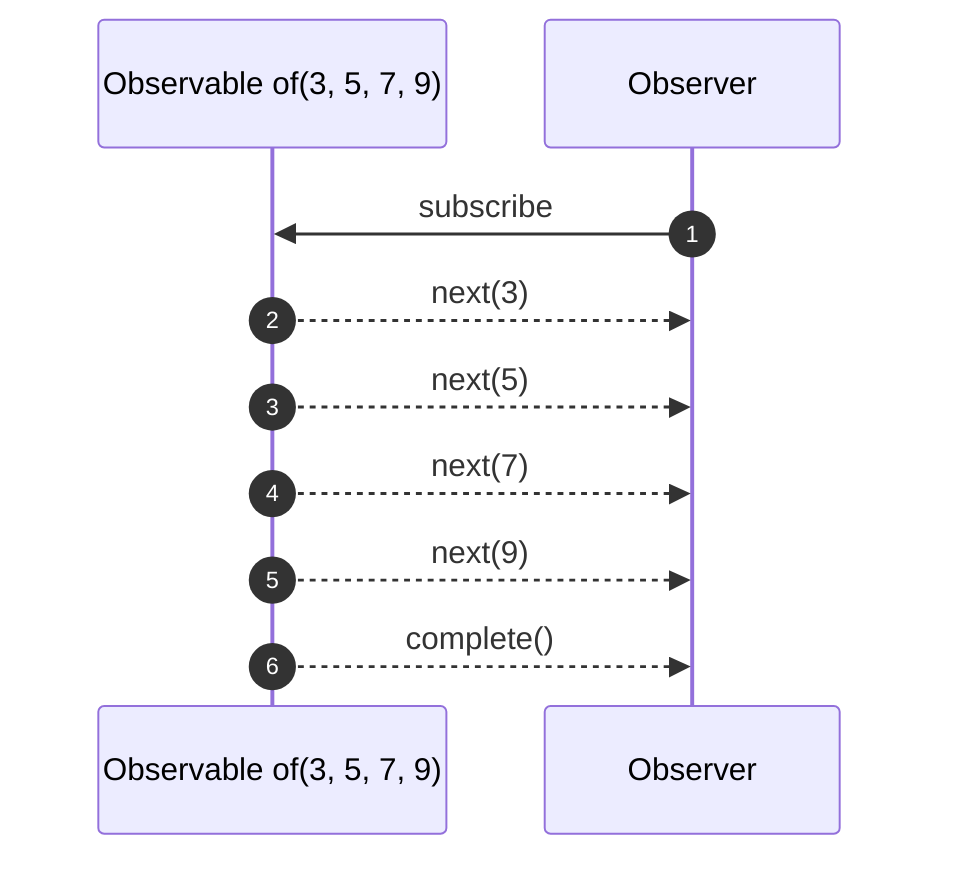
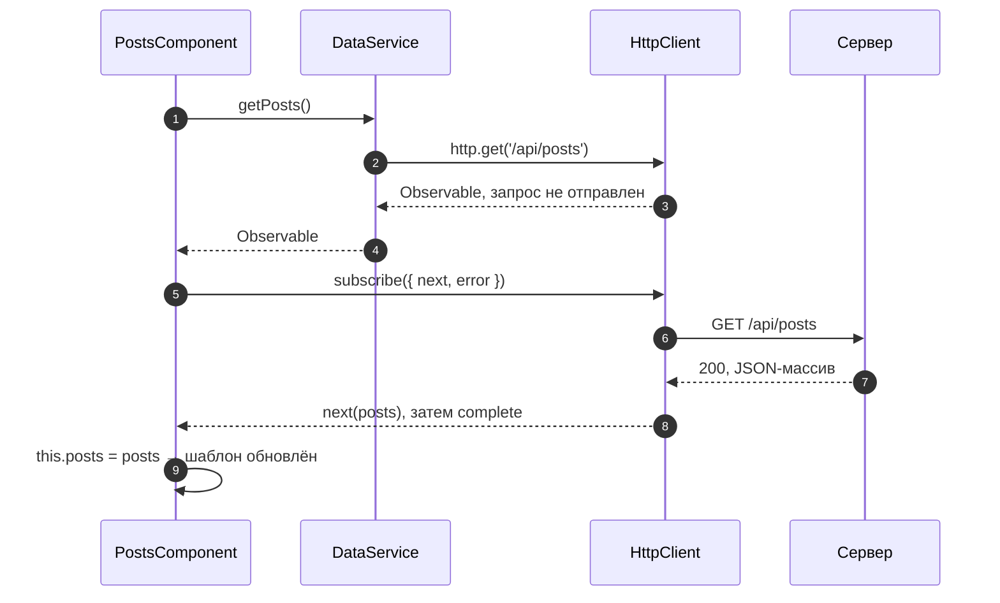

# 5_4 — HTTP-запросы: конспект

**Курс:** 3813ICT, неделя 5
**Источник:** `5_4-HTTP_Requests.pdf`
**Связанные файлы:** [поправки](5_4-http-requests-popravki.md) · [примеры](5_4-http-requests-primery.md) · [вопросы](5_4-http-requests-voprosy.md) · [ответы](5_4-http-requests-otvety.md)

> Значок **⚠** со ссылкой вида **П-N** ведёт в файл поправок. Там разобрано, где исходный материал курса расходится с тем, что написано в конспекте, и почему.

**Содержание**

1. [Как Angular разговаривает с сервером](#s1): [запрос и ответ](#s1-1) · [XMLHttpRequest, fetch, HttpClient](#s1-2)
2. [NgModule: историческая справка](#s2): [что это](#s2-1) · [import и imports](#s2-2) · [частые модули сегодня](#s2-3)
3. [Observable](#s3): [зачем](#s3-1) · [Observer и subscribe](#s3-2) · [пример из материала](#s3-3) · [особенности HTTP](#s3-4)
4. [Подключение HttpClient](#s4)
5. [GET-запрос](#s5): [пример из материала](#s5-1) · [типизация ответа](#s5-2)
6. [POST-запрос](#s6)
7. [PUT, PATCH, DELETE](#s7)
8. [Заголовки и параметры](#s8)
9. [Обработка ошибок](#s9)
10. [Пригодится в заданиях](#s10)
11. [Ключевые факты](#s11)

---

<a id="s1"></a>

## 1. Как Angular разговаривает с сервером

В темах 5_2 и 5_3 мы вынесли логику в сервисы и настроили сервер так, чтобы Angular мог к нему обращаться. Осталось главное — сами запросы: как отправить данные на сервер, как получить ответ и что делать, пока он идёт. Этим и занимается `HttpClient`.

<a id="s1-1"></a>

### 1.1 HTTP-запрос и ответ

Любое общение клиента с сервером — это пара «запрос → ответ».

**Запрос** состоит из:

- **метода** — что сделать: `GET` (получить), `POST` (создать), `PUT` (заменить целиком), `PATCH` (изменить часть), `DELETE` (удалить);
- **адреса** (URL), в том числе параметров после `?`: `/api/messages?page=2&limit=20`;
- **заголовков** — служебной информации: тип данных, авторизация;
- **тела** — данных, которые отправляются на сервер (у `POST`, `PUT`, `PATCH`).

**Ответ** состоит из:

- **кода состояния** — числа, по первой цифре которого видно результат: `1xx` информационные, `2xx` успех (`200 OK`, `201 Created`, `204 No Content`), `3xx` перенаправление, `4xx` ошибка клиента (`400`, `401`, `403`, `404`), `5xx` ошибка сервера (`500`);
- **заголовков**;
- **тела** — обычно JSON.

<a id="s1-2"></a>

### 1.2 XMLHttpRequest, fetch и HttpClient

В браузере есть два встроенных способа отправить запрос из JavaScript: старый **XMLHttpRequest** и более новый **Fetch API**. Оба низкоуровневые: нужно вручную разбирать JSON, обрабатывать ошибки, собирать параметры.

**`HttpClient`** — сервис Angular, который делает это за тебя:

- поддерживает все методы: `get`, `post`, `put`, `patch`, `delete`;
- сам превращает объекты в JSON при отправке и JSON в объекты при получении;
- считает ошибкой ответы `4xx` и `5xx`;
- возвращает результат как **Observable** ([§3](#s3)).

По умолчанию `HttpClient` работает поверх XMLHttpRequest. Его можно переключить на fetch опцией `withFetch()` — это рекомендуется для проектов с серверным рендерингом, для обычного чата разницы нет.

---

<a id="s2"></a>

## 2. NgModule: историческая справка

Материал начинает с NgModule, потому что раньше `HttpClient` подключали через модуль. Сейчас приложения строятся на standalone-компонентах, но NgModule нужно уметь узнавать: он встречается в старом коде, материалах и ответах на форумах.

<a id="s2-1"></a>

### 2.1 Что такое NgModule

**NgModule** — класс с декоратором `@NgModule`, который объединяет связанные части приложения и описывает, как они собираются вместе. В приложении на модулях есть минимум один — корневой `AppModule` в `app.module.ts`.

Вот поля декоратора:

| Поле | Что в нём |
|---|---|
| `declarations` | компоненты, директивы и пайпы, которые принадлежат модулю |
| `imports` | другие модули, возможности которых нужны этому модулю |
| `providers` | провайдеры сервисов — инструкции для инжектора, как создать зависимость ([5_2 §2.1](5_2-services-konspekt.md#s2-1)) |
| `bootstrap` | корневой компонент, который Angular создаёт и вставляет в `index.html` |

```ts
// app.module.ts — так выглядело приложение до standalone
@NgModule({
  declarations: [AppComponent, LoginComponent],
  imports: [BrowserModule, FormsModule, HttpClientModule],
  providers: [],
  bootstrap: [AppComponent],
})
export class AppModule {}
```

Standalone-компоненты (по умолчанию с Angular 19) и NgModule могут работать в одном приложении, но новые проекты модули не используют.

<a id="s2-2"></a>

### 2.2 `import` в JavaScript и `imports` в NgModule

Два похожих слова делают разное, и нужны оба:

- **`import { FormsModule } from '@angular/forms';`** в начале файла — возможность JavaScript/TypeScript: делает класс доступным в этом файле.
- **`imports: [FormsModule]`** в декораторе — сообщает Angular, что этот модуль (или standalone-компонент) использует возможности `FormsModule` в своих шаблонах.

Без первого TypeScript не знает, что такое `FormsModule`. Без второго Angular не применит его директивы в шаблоне. В standalone-компонентах поле `imports` в `@Component` работает так же ([5_2 П-9](5_2-services-popravki.md#p-9)).

<a id="s2-3"></a>

### 2.3 Частые модули и их замены сегодня

Вот модули из материала и то, чем пользуются в standalone-приложении: ⚠ [П-1](5_4-http-requests-popravki.md#p-1)

| Модуль | Для чего | Сейчас |
|---|---|---|
| `BrowserModule` | запуск приложения в браузере | не нужен: `bootstrapApplication` в `main.ts` |
| `CommonModule` | `NgIf`, `NgFor` и другие директивы | для `@if`/`@for` не нужен; `NgIf`, `NgFor` можно импортировать по отдельности |
| `FormsModule` | шаблонные формы, `ngModel` | по-прежнему в `imports` компонента |
| `ReactiveFormsModule` | реактивные формы | по-прежнему в `imports` компонента |
| `RouterModule` | `routerLink`, `forRoot()`, `forChild()` | `provideRouter(routes)` в `app.config.ts`; `RouterLink` в `imports` компонента |
| `HttpClientModule` | общение с сервером | **устарел** (с Angular 18): `provideHttpClient()` в `app.config.ts` |

---

<a id="s3"></a>

## 3. Observable

`HttpClient` возвращает не данные, а Observable. Без понимания этой идеи код с запросами выглядит магией, поэтому разберём её до самих запросов.

<a id="s3-1"></a>

### 3.1 Зачем нужен Observable

Запрос к серверу идёт по сети и отвечает не сразу — через десятки или сотни миллисекунд. Если бы метод ждал ответа, вся страница замерла бы. Поэтому метод возвращается сразу, а данные приходят **позже**. Нужен способ сказать: «когда придут данные — сделай вот это».

**Observable** — это объект, который выдаёт значения со временем, асинхронно, тем, кто на него подписался.

Удобно представить подписку на канал. Канал (Observable) публикует видео (значения), когда они готовы. Ты подписываешься (`subscribe`) и получаешь уведомления. Пока не подписался — ничего не получаешь.

Термины из материала:

- **издатель** (publisher) — источник значений, например сервис, который получает данные с сервера;
- **подписчик** (subscriber) — тот, кому эти значения нужны, например компонент, который их показывает;
- **поток** (stream) — последовательность значений, которые выдаёт Observable; значения могут быть любого типа.

Observable в Angular берутся из библиотеки **RxJS** (Reactive Extensions for JavaScript). В ней же — функции для создания Observable и работы с ними: `of`, `map`, `switchMap`, `catchError` и другие.

<a id="s3-2"></a>

### 3.2 Observer и `subscribe()`

Чтобы начать получать значения, у Observable вызывают метод **`subscribe()`** и передают ему **observer** — объект с обработчиками:

| Обработчик | Когда вызывается | Обязателен |
|---|---|---|
| `next(value)` | на каждое новое значение | да (если нужны значения) |
| `error(err)` | при ошибке; после неё значений больше не будет | нет |
| `complete()` | когда поток закончился успешно; значений больше не будет | нет |

`subscribe()` возвращает объект **Subscription** с методом `unsubscribe()` — он прекращает получение уведомлений.

```ts
const subscription = someObservable$.subscribe({
  next: (value) => console.log('значение', value),
  error: (err) => console.error('ошибка', err),
  complete: () => console.log('готово'),
});

subscription.unsubscribe();   // больше не получать уведомления
```

<a id="s3-3"></a>

### 3.3 Пример из материала: `of(3, 5, 7, 9)`

Вот как Observable показан в материале курса. Сначала — отдельный объект observer:

```ts
const myObservable = of (3, 5, 7, 9);
const myObserver = {
next: x => console.log( x),
error: err => console.log(err),
complete: () => console.log('Observer Complete'),
};

myObservable.subscribe(myObserver);
```

Затем — сокращённая запись, где три функции передаются в `subscribe` отдельными аргументами:

```ts
myObservable.subscribe(
x => console.log(x), // NEXT
err=> console.log(err), // ERROR
() => console.log(‘Observer Complete’), // COMPLETE
);
```

**Что в нём происходит.** Функция `of` создаёт Observable, который по очереди выдаёт числа 3, 5, 7, 9 и завершается. Observer выводит каждое число, а при завершении — «Observer Complete».

Первый вариант верный. Второй — передача нескольких функций отдельными аргументами — в RxJS 7 объявлен устаревшим; вместо него передают объект с `next`, `error`, `complete` ⚠ [П-2](5_4-http-requests-popravki.md#p-2). Кроме того, во втором варианте типографские кавычки.

Вот исправленная версия:

```ts
import { of } from 'rxjs';

// $ в конце имени — соглашение: «это Observable»
const numbers$ = of(3, 5, 7, 9);

numbers$.subscribe({
  next: (x) => console.log(x),
  error: (err) => console.error(err),
  complete: () => console.log('Observer Complete'),
});

// Если нужны только значения, можно передать одну функцию — это не устарело:
numbers$.subscribe((x) => console.log(x));
```

**Какая последовательность?**

1. **`of(3, 5, 7, 9)` создаёт Observable.**
   1. Пока никто не подписан, ничего не происходит: Observable «ленивый».
2. **`subscribe({...})` запускает поток.**
   1. `next(3)` → в консоли `3`.
   2. `next(5)` → `5`.
   3. `next(7)` → `7`.
   4. `next(9)` → `9`.
3. **Значения закончились — вызывается `complete()`** → в консоли `Observer Complete`.
   1. После `complete` новых значений не будет.
4. **`error` не вызывается**, потому что ошибок не было. Если бы ошибка случилась, вызвался бы `error`, а `complete` — нет: поток заканчивается либо так, либо так.



<a id="s3-4"></a>

### 3.4 Особенности Observable от `HttpClient`

Observable, которые возвращает `HttpClient`, ведут себя предсказуемо, и это стоит запомнить:

- **Ленивые.** Запрос отправляется только в момент `subscribe()`. Без подписки не уйдёт ничего.
- **Каждая подписка — новый запрос.** Подписался дважды — два запроса на сервер.
- **Одно значение и завершение.** Успешный ответ приходит одним `next`, сразу за ним `complete`.
- **Ошибка — через `error`.** Коды `4xx`, `5xx` и сетевые проблемы вызывают `error` с объектом `HttpErrorResponse` ([§9](#s9)).
- **Отписка отменяет запрос.** Если вызвать `unsubscribe()` до ответа, запрос будет отменён. Обычно отписываться от HTTP-запросов вручную не нужно: поток сам завершается после ответа.

---

<a id="s4"></a>

## 4. Подключение HttpClient

Прежде чем делать запросы, `HttpClient` нужно зарегистрировать в приложении — иначе инжектор не сможет его выдать. ⚠ [П-3](5_4-http-requests-popravki.md#p-3)

**Шаг 1.** В `app.config.ts` добавить `provideHttpClient()` в массив `providers`:

```ts
// src/app/app.config.ts
import { ApplicationConfig } from '@angular/core';
import { provideRouter } from '@angular/router';
import { provideHttpClient } from '@angular/common/http';
import { routes } from './app.routes';

export const appConfig: ApplicationConfig = {
  providers: [
    provideRouter(routes),
    provideHttpClient(),      // без этого inject(HttpClient) выдаст ошибку NullInjectorError
  ],
};
```

**Шаг 2.** В сервисе импортировать `HttpClient` и внедрить его:

```ts
import { Injectable, inject } from '@angular/core';
import { HttpClient } from '@angular/common/http';   // HttpClient — с заглавной H

@Injectable({ providedIn: 'root' })
export class DataService {
  private http = inject(HttpClient);
  // или: constructor(private http: HttpClient) {}
}
```

В приложениях на NgModule вместо шага 1 в `imports` модуля добавляли `HttpClientModule`. Сейчас этот модуль устарел.

---

<a id="s5"></a>

## 5. GET-запрос

`GET` — самый частый запрос: получить данные. На нём хорошо видно главное правило работы с `HttpClient`: сервис возвращает Observable, а подписывается тот, кому нужны данные.

<a id="s5-1"></a>

### 5.1 Пример из материала

Вот как базовый `GET` выглядит в материале курса:

```ts
import { Injectable } from '@angular/core';
// Importing HttpClient Module
import { HttpClient } from '@angular/common/http';
import { Observable} from 'rxjs';

@Injectable({
providedIn: 'root'
})
export class DataService {
url = "";
constructor(private http: HttpClient) {}
getNewData():observable {
return this.http.get(this.url).subscribe();
}
```

**Что в нём происходит.** Сервис получает `HttpClient` через конструктор. Метод `getNewData()` отправляет `GET` на адрес из поля `url`, сразу подписывается на результат и возвращает то, что вернул `subscribe()`.

Идея показать `GET` в сервисе верная, но код не скомпилируется и не даст данных: тип `observable` написан со строчной буквы, `subscribe()` внутри сервиса возвращает `Subscription`, а не данные, и не хватает закрывающей скобки класса. ⚠ [П-4](5_4-http-requests-popravki.md#p-4)

Вот исправленная версия — сервис и компонент, который им пользуется:

```ts
// ═════ src/app/services/data.service.ts ═════
import { Injectable, inject } from '@angular/core';
import { HttpClient } from '@angular/common/http';
import { Observable } from 'rxjs';

export interface Post {
  id: number;
  title: string;
  body: string;
}

@Injectable({ providedIn: 'root' })
export class DataService {
  private http = inject(HttpClient);
  private readonly url = '/api/posts';

  // Возвращаем Observable — БЕЗ subscribe. Подпишется тот, кому нужны данные
  getPosts(): Observable<Post[]> {
    return this.http.get<Post[]>(this.url);
  }
}

// ═════ src/app/pages/posts/posts.component.ts ═════
import { Component, OnInit, inject } from '@angular/core';
import { DataService, Post } from '../../services/data.service';

@Component({
  selector: 'app-posts',
  template: `
    @for (post of posts; track post.id) {
      <h3>{{ post.title }}</h3>
      <p>{{ post.body }}</p>
    }
  `,
})
export class PostsComponent implements OnInit {
  private dataService = inject(DataService);
  posts: Post[] = [];

  ngOnInit(): void {
    this.dataService.getPosts().subscribe({
      next: (posts) => (this.posts = posts),     // данные пришли — кладём в поле, шаблон обновится
      error: (err) => console.error('Не удалось загрузить', err),
    });
  }
}
```

**Какая последовательность?**

1. **Angular создаёт `PostsComponent`** и внедряет `DataService`, а в него — `HttpClient`.
2. **Angular вызывает `ngOnInit()`.**
   1. Компонент вызывает `dataService.getPosts()`.
   2. Сервис возвращает Observable. Запрос **ещё не отправлен**.
3. **Компонент подписывается** (`subscribe`).
   1. Только сейчас `HttpClient` отправляет `GET /api/posts`.
   2. Метод `ngOnInit` заканчивается, страница продолжает работать — шаблон пока показывает пустой список.
4. **Сервер отвечает `200` и JSON-массивом.**
   1. `HttpClient` превращает JSON в массив объектов.
   2. Вызывается `next(posts)` — компонент кладёт массив в поле `posts`.
   3. Сразу за `next` — `complete`: поток закончен.
5. **Angular перерисовывает шаблон** — `@for` выводит посты.
6. **При ошибке** (`404`, `500`, сервер недоступен) вместо `next` вызывается `error`.



<a id="s5-2"></a>

### 5.2 Типизация ответа через интерфейс

`HttpClient` не знает, какая форма у пришедшего JSON. Чтобы TypeScript помогал работать с ответом, форму описывают **интерфейсом** и передают его в угловых скобках.

**Интерфейс** — описание формы объекта: какие поля и каких типов. В отличие от класса, у него нет методов и он не существует во время выполнения — это только подсказка для компилятора.

Вот как это выглядит в материале курса:

```ts
interface MyData {
title: string;
body: string;
};

constructor(private http: HttpClient) {}
getData() {
this.http.get<MyData>(this.url).subscribe(res => {
this.postTitle = res.title;
});
}
```

Запись `get<MyData>` говорит: «считай, что ответ — объект `MyData`». Благодаря этому TypeScript знает, что у `res` есть поле `title`, подсказывает его и ловит опечатки.

**Важно:** это **обещание компилятору, а не проверка**. Если сервер пришлёт объект другой формы, ошибки не будет — в поле просто окажется `undefined`. Поэтому интерфейс должен совпадать с тем, что реально отдаёт сервер. ⚠ [П-6](5_4-http-requests-popravki.md#p-6)

```ts
interface Post {
  id: number;
  title: string;
  body: string;
}

this.http.get<Post>('/api/posts/1').subscribe((post) => {
  console.log(post.title);    // ✅ TypeScript знает поле title
  // console.log(post.titel); // ❌ ошибка компиляции: такого поля нет
});

this.http.get<Post[]>('/api/posts');   // массив — Post[]
```

---

<a id="s6"></a>

## 6. POST-запрос

`POST` отправляет на сервер новые данные. Отличие от `GET` одно: вторым аргументом передаётся **тело** запроса.

Вот как `POST` выглядит в материале курса:

```ts
postData() {
this.http.post<MyData>(this.url, this.bodyData).subscribe(
res => {
console.log(res);
},
(err: HttpErrorResponse) => {
console.log(err.error);
}
);
}
```

**Что в нём происходит.** Метод отправляет `this.bodyData` на `this.url`. В `subscribe` переданы две функции: первая выводит ответ сервера, вторая при ошибке выводит `err.error` — тело ответа с ошибкой. Второй аргумент `this.bodyData` — это то, что на сервере окажется в `req.body` (после `express.json()`).

Передача функций отдельными аргументами устарела ⚠ [П-2](5_4-http-requests-popravki.md#p-2), и импорт `HttpErrorResponse` не показан. Вот исправленная версия в сервисе и компоненте:

```ts
// ═════ Сервис ═════
import { HttpClient } from '@angular/common/http';

export interface NewGroup { name: string; }
export interface Group { id: number; name: string; }

@Injectable({ providedIn: 'root' })
export class GroupService {
  private http = inject(HttpClient);

  create(data: NewGroup): Observable<Group> {
    // <Group> — тип ОТВЕТА; data — тело запроса, HttpClient сам превратит его в JSON
    return this.http.post<Group>('/api/groups', data);
  }
}

// ═════ Компонент ═════
import { HttpErrorResponse } from '@angular/common/http';

save(): void {
  this.groupService.create({ name: this.name }).subscribe({
    next: (group) => console.log('Создана', group),            // сервер вернул созданную группу
    error: (err: HttpErrorResponse) => console.log(err.error), // тело ошибки от сервера
  });
}
```

**Какая последовательность?**

1. **Компонент вызывает `create({ name })`** — сервис возвращает Observable.
2. **Компонент подписывается** — `HttpClient` превращает объект в JSON и отправляет `POST /api/groups` с заголовком `Content-Type: application/json`.
3. **Сервер** разбирает тело (`express.json()` → `req.body`), создаёт группу и отвечает `201` с созданным объектом.
4. **`next(group)`** — компонент получает группу уже с `id`, который назначил сервер.
5. **При ошибке** (например, `400`, если имя пустое) вызывается `error`; в `err.error` лежит то, что сервер отправил в теле, например `{ error: 'Name is required' }`.

---

<a id="s7"></a>

## 7. PUT, PATCH, DELETE

Материал упоминает, что `HttpClient` поддерживает и другие методы. Для CRUD в чате они нужны все, поэтому вот как они выглядят рядом:

| Метод | Смысл | Вызов | Типичный ответ |
|---|---|---|---|
| `GET` | получить | `http.get<Group[]>(url)` | `200` + данные |
| `POST` | создать | `http.post<Group>(url, body)` | `201` + созданный объект |
| `PUT` | заменить целиком | `http.put<Group>(url, fullBody)` | `200` + объект |
| `PATCH` | изменить часть полей | `http.patch<Group>(url, partialBody)` | `200` + объект |
| `DELETE` | удалить | `http.delete<void>(url)` | `204` без тела |

```ts
@Injectable({ providedIn: 'root' })
export class GroupService {
  private http = inject(HttpClient);
  private readonly API = '/api/groups';

  rename(id: number, name: string): Observable<Group> {
    return this.http.patch<Group>(`${this.API}/${id}`, { name });   // меняем только name
  }

  replace(group: Group): Observable<Group> {
    return this.http.put<Group>(`${this.API}/${group.id}`, group);  // отправляем объект целиком
  }

  remove(id: number): Observable<void> {
    return this.http.delete<void>(`${this.API}/${id}`);             // тела нет
  }
}
```

Разница `PUT` и `PATCH`: `PUT` заменяет ресурс целиком — поля, которых нет в теле, пропадут; `PATCH` меняет только переданные поля.

---

<a id="s8"></a>

## 8. Заголовки и параметры

Иногда к запросу нужно добавить заголовки (например, для авторизации) или параметры в адрес (номер страницы). Для этого третьим аргументом передают объект **options**. ⚠ [П-5](5_4-http-requests-popravki.md#p-5)

- **`HttpHeaders`** — заголовки запроса.
- **`HttpParams`** — параметры после `?` в адресе; не нужно склеивать строку вручную.

Главная особенность обоих — они **неизменяемые**: `set` и `append` не меняют объект, а возвращают **новый**. Поэтому их собирают цепочкой или сохраняют результат.

Вот как это выглядит в материале курса:

```ts
import {HttpHeaders，HttpParams} from "@angular/common/http";

var myHeaders = new Headers(); // Currently empty
myHeaders.append('Content-Type', 'image/jpeg');
// Usually, it is: myHeaders.append('Content-Type', 'application/json');
myHeaders.append('Accept-Encoding', 'gzip');

const myParams = new HttpParams().set('page',"2").set('limit',"3");
// const myParams = new HttpParams({fromString: 'page=2&limit=3'});

const options = { headers: myHeaders, params: myParams};
this.httpClient.post(url, body, options);
```

**Что в нём происходит.** Создаётся объект заголовков, в него добавляются тип содержимого и допустимое сжатие; создаются параметры `page=2` и `limit=3`; всё передаётся третьим аргументом в `post`, и итоговый адрес получает `?page=2&limit=3`.

Часть с `HttpParams` верная, а часть с заголовками не заработает: в импорте полноширинная запятая, вместо `HttpHeaders` создан `Headers` из Fetch API, `Content-Type: image/jpeg` не соответствует JSON-телу, а `Accept-Encoding` браузер задать не разрешает.

Вот исправленная версия:

```ts
import { HttpHeaders, HttpParams } from '@angular/common/http';

// Заголовки: каждый set возвращает НОВЫЙ объект, поэтому — цепочка
const headers = new HttpHeaders()
  .set('x-request-source', 'chat-app');

// Параметры: ?page=2&limit=3 (числа можно передавать без кавычек)
const params = new HttpParams()
  .set('page', 2)
  .set('limit', 3);

this.http.get<Message[]>('/api/channels/5/messages', { headers, params });

// То же короче — обычными объектами, без классов:
this.http.get<Message[]>('/api/channels/5/messages', {
  headers: { 'x-request-source': 'chat-app' },
  params: { page: 2, limit: 3 },
});
```

**Какая последовательность?**

1. **Собираются заголовки** — `new HttpHeaders().set(...)` возвращает объект с одним заголовком.
2. **Собираются параметры** — два `set` подряд, каждый возвращает новый объект; в итоге `page=2&limit=3`.
3. **`get` получает options** третьим аргументом (у `get` нет тела, поэтому options — второй аргумент после адреса; у `post` — третий, после тела).
4. **При подписке** уходит `GET /api/channels/5/messages?page=2&limit=3` с заголовком `x-request-source: chat-app`.

`Content-Type` для JSON указывать не нужно: `HttpClient` ставит `application/json` сам, когда тело — объект.

---

<a id="s9"></a>

## 9. Обработка ошибок

Запросы падают: сервер выключен, данных нет, прав не хватает. Если не обработать ошибку, пользователь просто увидит, что ничего не происходит. Поэтому у каждого запроса, результат которого важен пользователю, должен быть обработчик `error`.

`HttpClient` вызывает `error` с объектом **`HttpErrorResponse`**. Его главные поля:

| Поле | Что в нём |
|---|---|
| `status` | код ответа: `400`, `401`, `404`, `500`… или `0`, если ответа нет (сервер недоступен, CORS) |
| `error` | тело ответа с ошибкой — то, что прислал сервер, например `{ error: 'Name is required' }` |
| `message` | общее описание от Angular, например «Http failure response for …: 404 Not Found» |

Вот пример того, как превратить ошибку в понятное пользователю сообщение:

```ts
import { HttpErrorResponse } from '@angular/common/http';

function describeError(err: HttpErrorResponse): string {
  if (err.status === 0) return 'Сервер недоступен';
  if (err.status === 401) return 'Нужно войти заново';
  if (err.status === 403) return 'Недостаточно прав';
  if (err.status === 404) return 'Не найдено';
  return err.error?.error ?? 'Что-то пошло не так';   // сообщение от сервера, если оно есть
}

this.groupService.create({ name: '' }).subscribe({
  next: (group) => this.groups.push(group),
  error: (err: HttpErrorResponse) => (this.errorMessage = describeError(err)),
});
```

Обработать ошибку можно и в сервисе — оператором `catchError` из RxJS, если реакция одинакова для всех компонентов. Пример — в [примерах, пример 1](5_4-http-requests-primery.md#ex-1).

---

<a id="s10"></a>

## 10. Пригодится в заданиях

<a id="s10-1"></a>

### 10.1 Где подписываться и когда отписываться

- **Сервис возвращает Observable, компонент подписывается.** Так компонент сам решает, что делать с данными и ошибкой, а сервис остаётся переиспользуемым ([П-4](5_4-http-requests-popravki.md#p-4)).
- **От HTTP-запросов отписываться обычно не нужно** — поток завершается сам после ответа.
- **Если запрос долгий, а пользователь может уйти со страницы**, подписку привязывают к жизни компонента: `pipe(takeUntilDestroyed(this.destroyRef))` из `@angular/core/rxjs-interop` отменит запрос при уничтожении компонента.

<a id="s10-2"></a>

### 10.2 Запрос, который зависит от другого

Иногда второй запрос можно отправить только после ответа на первый: например, войти, а потом загрузить группы пользователя. Подписка внутри подписки работает, но её трудно читать и нельзя отменить целиком. Для этого есть оператор `switchMap`: он превращает результат первого запроса во второй запрос. Полный пример — в [примерах, пример 2](5_4-http-requests-primery.md#ex-2).

---

<a id="s11"></a>

## 11. Ключевые факты

**HTTP и HttpClient**

- Запрос: метод, адрес, заголовки, тело. Ответ: код состояния, заголовки, тело.
- Коды: `2xx` успех, `3xx` перенаправление, `4xx` ошибка клиента, `5xx` ошибка сервера.
- `HttpClient` сам работает с JSON, считает `4xx`/`5xx` ошибкой и возвращает Observable.

**NgModule**

- NgModule — класс с `@NgModule`: `declarations`, `imports`, `providers`, `bootstrap`.
- `import` в начале файла делает класс доступным в коде; `imports` в декораторе подключает возможности в шаблоны.
- `HttpClientModule` устарел — вместо него `provideHttpClient()` в `app.config.ts`.

**Observable**

- Observable выдаёт значения асинхронно тем, кто подписался; берётся из RxJS.
- `subscribe({ next, error, complete })` запускает поток и возвращает Subscription с `unsubscribe()`.
- Передавать несколько функций в `subscribe` отдельными аргументами — устарело.
- Поток заканчивается либо `complete`, либо `error`.

**HTTP-Observable**

- Запрос уходит только при `subscribe()`; каждая подписка — новый запрос.
- Успех — один `next` и `complete`; ошибка — `error` с `HttpErrorResponse`.
- Сервис возвращает Observable без подписки; подписывается компонент.

**Запросы**

- `get<T>(url, options)`, `post<T>(url, body, options)`, `put`, `patch`, `delete`.
- `<T>` — тип ответа для компилятора, а не проверка данных.
- `PUT` заменяет целиком, `PATCH` — частично, `DELETE` обычно отвечает `204`.

**Заголовки, параметры, ошибки**

- `HttpHeaders` и `HttpParams` неизменяемы: `set` возвращает новый объект.
- Можно передавать обычными объектами: `{ headers: {...}, params: {...} }`.
- `Content-Type` для JSON `HttpClient` ставит сам.
- `HttpErrorResponse`: `status` (`0` — нет ответа), `error` (тело от сервера), `message`.
