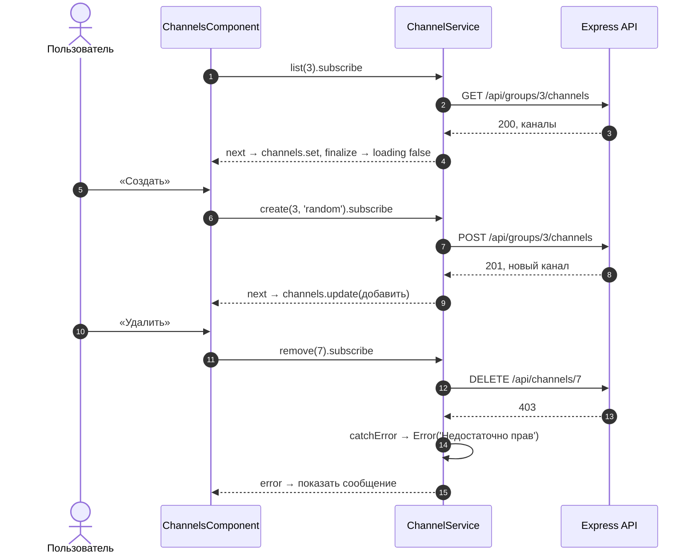
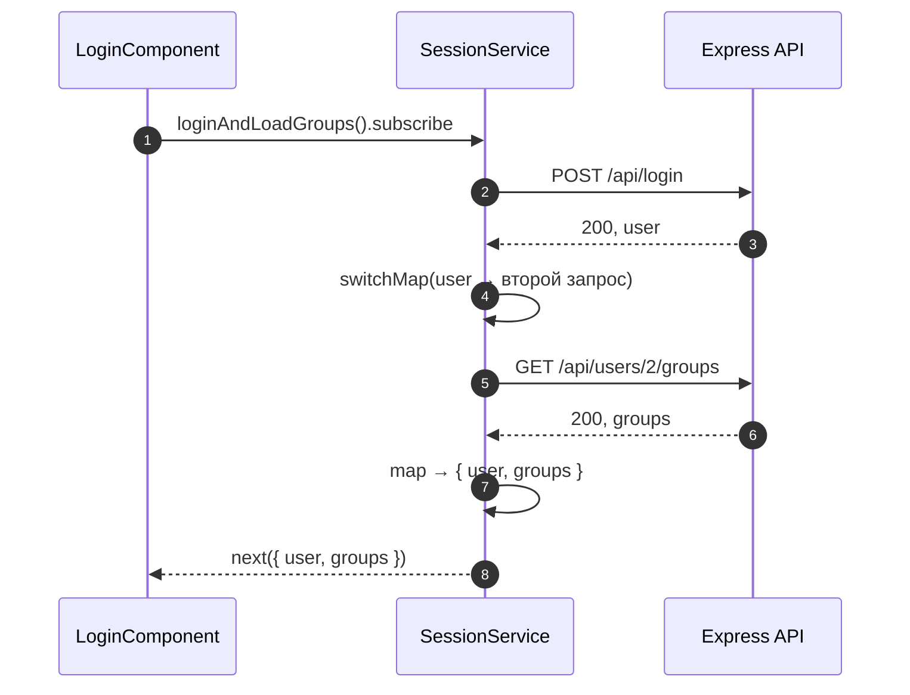
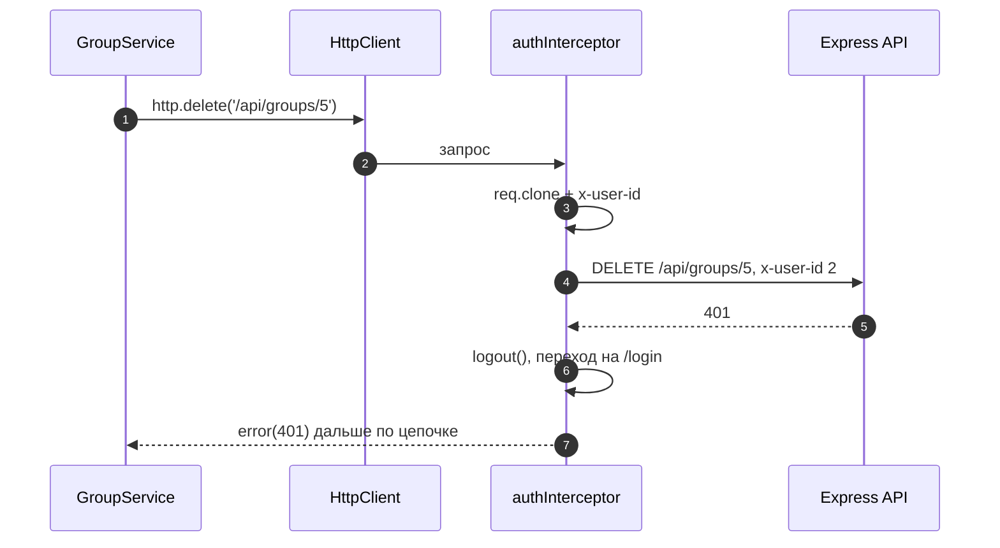
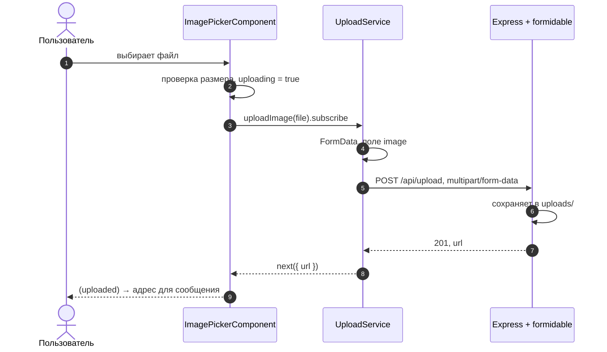

# 5_4 — HTTP-запросы: примеры использования

**Курс:** 3813ICT, неделя 5
**Связанные файлы:** [конспект](5_4-http-requests-konspekt.md) · [поправки](5_4-http-requests-popravki.md) · [вопросы](5_4-http-requests-voprosy.md) · [ответы](5_4-http-requests-otvety.md)

Каждый пример — рабочий кусок кода для чата Phase 2: один большой фрагмент, пошаговая последовательность и диаграмма. Адрес API везде `/api/...` — он работает и с прокси `ng serve`, и в single origin ([5_3](5_3-node-hosting-primery.md#ex-2)).

> **Диаграммы.** В Obsidian mermaid рендерится сам. В VS Code нужно расширение **Markdown Preview Mermaid Support**.

| Пример | Что показывает | Затрагивает темы |
|---|---|---|
| [1. ChannelService: CRUD, параметры, ошибки](#ex-1) | все методы, `HttpParams`, состояние загрузки и ошибки на сигналах, `catchError` | сервисы (5_2), `@for` (5_5) |
| [2. Запрос, зависящий от другого](#ex-2) | `switchMap` вместо подписки внутри подписки | RxJS |
| [3. Перехватчик запросов](#ex-3) | заголовок для каждого запроса и общая реакция на `401` | `provideHttpClient(withInterceptors())` |
| [4. Загрузка картинки](#ex-4) | `FormData`, `<input type="file">`, ответ с адресом файла | formidable (неделя 3) |

---

<a id="ex-1"></a>

## Пример 1 — ChannelService: CRUD, параметры, ошибки

**Когда использовать:** любой ресурс чата, который нужно получать, создавать, переименовывать и удалять. Здесь это каналы группы.

**Где в конспекте:** [§5 GET](5_4-http-requests-konspekt.md#s5) · [§7 PUT, PATCH, DELETE](5_4-http-requests-konspekt.md#s7) · [§8 Параметры](5_4-http-requests-konspekt.md#s8) · [§9 Ошибки](5_4-http-requests-konspekt.md#s9)

```ts
// ═════ src/app/models/channel.ts ═════
export interface Channel {
  id: number;
  groupId: number;
  name: string;
}

// ═════ src/app/services/channel.service.ts ═════
import { Injectable, inject } from '@angular/core';
import { HttpClient, HttpErrorResponse, HttpParams } from '@angular/common/http';
import { Observable, catchError, throwError } from 'rxjs';
import { Channel } from '../models/channel';

@Injectable({ providedIn: 'root' })
export class ChannelService {
  private http = inject(HttpClient);
  private readonly API = '/api';

  // GET /api/groups/:groupId/channels?search=...
  list(groupId: number, search = ''): Observable<Channel[]> {
    let params = new HttpParams();
    if (search) params = params.set('search', search);   // неизменяемый → сохраняем результат
    return this.http
      .get<Channel[]>(`${this.API}/groups/${groupId}/channels`, { params })
      .pipe(catchError(this.toMessage));
  }

  // POST — тело { name }, ответ 201 с созданным каналом
  create(groupId: number, name: string): Observable<Channel> {
    return this.http
      .post<Channel>(`${this.API}/groups/${groupId}/channels`, { name })
      .pipe(catchError(this.toMessage));
  }

  // PATCH — меняем только имя
  rename(channelId: number, name: string): Observable<Channel> {
    return this.http
      .patch<Channel>(`${this.API}/channels/${channelId}`, { name })
      .pipe(catchError(this.toMessage));
  }

  // DELETE — ответ 204 без тела
  remove(channelId: number): Observable<void> {
    return this.http
      .delete<void>(`${this.API}/channels/${channelId}`)
      .pipe(catchError(this.toMessage));
  }

  // Общая обработка ошибок: HttpErrorResponse → понятный текст.
  // Стрелочная функция, чтобы не терять this при передаче в catchError
  private toMessage = (err: HttpErrorResponse) => {
    const text =
      err.status === 0 ? 'Сервер недоступен' :
      err.status === 403 ? 'Недостаточно прав' :
      err.status === 404 ? 'Не найдено' :
      err.error?.error ?? 'Что-то пошло не так';        // сообщение от сервера, если есть
    return throwError(() => new Error(text));           // дальше по цепочке — уже обычная Error
  };
}

// ═════ src/app/pages/channels/channels.component.ts ═════
import { Component, Input, OnInit, inject, signal } from '@angular/core';
import { FormsModule } from '@angular/forms';
import { finalize } from 'rxjs';
import { Channel } from '../../models/channel';
import { ChannelService } from '../../services/channel.service';

@Component({
  selector: 'app-channels',
  imports: [FormsModule],
  template: `
    @if (loading()) {
      <p>Загрузка…</p>
    }
    @if (error()) {
      <p class="error">{{ error() }}</p>
    }

    <ul>
      @for (ch of channels(); track ch.id) {
        <li>
          #{{ ch.name }}
          <button (click)="rename(ch)">Переименовать</button>
          <button (click)="remove(ch.id)">Удалить</button>
        </li>
      } @empty {
        @if (!loading()) { <li>Каналов нет</li> }
      }
    </ul>

    <form (ngSubmit)="create()">
      <input [(ngModel)]="newName" name="newName" placeholder="Новый канал">
      <button type="submit" [disabled]="!newName.trim()">Создать</button>
    </form>
  `,
})
export class ChannelsComponent implements OnInit {
  @Input({ required: true }) groupId!: number;
  private channelService = inject(ChannelService);

  // Три состояния экрана: данные, загрузка, ошибка
  protected channels = signal<Channel[]>([]);
  protected loading = signal(false);
  protected error = signal('');
  newName = '';

  ngOnInit(): void {
    this.loading.set(true);
    this.channelService
      .list(this.groupId)
      // finalize срабатывает и после complete, и после error —
      // индикатор выключится в любом случае
      .pipe(finalize(() => this.loading.set(false)))
      .subscribe({
        next: (list) => this.channels.set(list),
        error: (e: Error) => this.error.set(e.message),
      });
  }

  create(): void {
    this.channelService.create(this.groupId, this.newName.trim()).subscribe({
      next: (ch) => {
        this.channels.update((list) => [...list, ch]);   // сервер вернул канал с id
        this.newName = '';
      },
      error: (e: Error) => this.error.set(e.message),
    });
  }

  rename(ch: Channel): void {
    const name = prompt('Новое имя', ch.name)?.trim();
    if (!name || name === ch.name) return;
    this.channelService.rename(ch.id, name).subscribe({
      next: (updated) => this.channels.update((list) => list.map((c) => (c.id === updated.id ? updated : c))),
      error: (e: Error) => this.error.set(e.message),
    });
  }

  remove(id: number): void {
    this.channelService.remove(id).subscribe({
      next: () => this.channels.update((list) => list.filter((c) => c.id !== id)),
      error: (e: Error) => this.error.set(e.message),
    });
  }
}
```

> **Почему `finalize`, а не `complete`.** Поток заканчивается **либо** `complete`, **либо** `error`. Если выключать индикатор в `complete`, при ошибке он так и останется крутиться. `finalize` срабатывает в обоих случаях.

### Последовательность

1. Компонент получает `groupId` и в `ngOnInit` включает `loading`.
2. Вызывает `channelService.list(groupId)` и подписывается — уходит `GET /api/groups/3/channels`.
3. Сервер отвечает массивом — `next` кладёт его в сигнал `channels`, `finalize` выключает `loading`.
4. Пользователь вводит имя и жмёт «Создать» — уходит `POST` с телом `{ name }`.
5. Сервер отвечает `201` с новым каналом — компонент добавляет его в сигнал новым массивом.
6. Пользователь удаляет канал, но у него нет прав — сервер отвечает `403`.
7. `catchError` в сервисе превращает ответ в `Error('Недостаточно прав')`.
8. Компонент получает её в `error` и показывает сообщение.



---

<a id="ex-2"></a>

## Пример 2 — Запрос, зависящий от другого

**Когда использовать:** второй запрос можно отправить только после ответа на первый. Например, войти, а потом по `id` пользователя загрузить его группы. Подписка внутри подписки тоже работает, но её трудно читать, ошибки обоих запросов приходится обрабатывать отдельно, и отменить всё целиком нельзя.

**Где в конспекте:** [§10.2 Запрос, который зависит от другого](5_4-http-requests-konspekt.md#s10-2) · [§3.2 Observer и subscribe](5_4-http-requests-konspekt.md#s3-2)

```ts
// ═════ src/app/services/session.service.ts ═════
import { Injectable, inject } from '@angular/core';
import { HttpClient } from '@angular/common/http';
import { Observable, map, switchMap } from 'rxjs';

export interface User { id: number; username: string; role: string; }
export interface Group { id: number; name: string; }

@Injectable({ providedIn: 'root' })
export class SessionService {
  private http = inject(HttpClient);

  // ❌ Подписка внутри подписки — так делать НЕ стоит:
  // loginNested(u: string, p: string) {
  //   this.http.post<User>('/api/login', { username: u, password: p }).subscribe((user) => {
  //     this.http.get<Group[]>(`/api/users/${user.id}/groups`).subscribe((groups) => { ... });
  //   });
  // }

  // ✅ Один Observable, внутри — два запроса по очереди
  loginAndLoadGroups(username: string, password: string): Observable<{ user: User; groups: Group[] }> {
    return this.http.post<User>('/api/login', { username, password }).pipe(
      // switchMap получает результат первого запроса и возвращает ВТОРОЙ Observable.
      // Наружу выйдет результат второго
      switchMap((user) =>
        this.http.get<Group[]>(`/api/users/${user.id}/groups`).pipe(
          map((groups) => ({ user, groups })),     // объединяем оба результата в один объект
        ),
      ),
    );
  }
}

// ═════ src/app/pages/login/login.component.ts ═════
import { Component, inject } from '@angular/core';
import { FormsModule } from '@angular/forms';
import { Router } from '@angular/router';
import { HttpErrorResponse } from '@angular/common/http';
import { SessionService } from '../../services/session.service';

@Component({
  selector: 'app-login',
  imports: [FormsModule],
  template: `
    <form (ngSubmit)="onSubmit()">
      <input [(ngModel)]="username" name="username" placeholder="Имя">
      <input [(ngModel)]="password" name="password" type="password" placeholder="Пароль">
      <button type="submit">Войти</button>
    </form>
    @if (error) { <p class="error">{{ error }}</p> }
  `,
})
export class LoginComponent {
  private session = inject(SessionService);
  private router = inject(Router);
  username = '';
  password = '';
  error = '';

  onSubmit(): void {
    this.error = '';
    // Одна подписка, один обработчик ошибок — для ОБОИХ запросов
    this.session.loginAndLoadGroups(this.username, this.password).subscribe({
      next: ({ user, groups }) => {
        console.log(`${user.username}: групп ${groups.length}`);
        this.router.navigateByUrl('/groups');
      },
      error: (err: HttpErrorResponse) => {
        this.error = err.status === 401 ? 'Неверное имя или пароль' : 'Не удалось войти';
      },
    });
  }
}
```

### Последовательность

1. Компонент подписывается на `loginAndLoadGroups(...)`.
2. Уходит `POST /api/login`.
3. Сервер отвечает пользователем.
4. `switchMap` получает пользователя и запускает второй запрос с его `id`.
5. Уходит `GET /api/users/2/groups`.
6. Сервер отвечает группами.
7. `map` собирает `{ user, groups }` — это и получает компонент в `next`.
8. Если **любой** из запросов вернёт ошибку (например, `401` на логин), второй не отправится, и компонент получит её в своём единственном `error`.



---

<a id="ex-3"></a>

## Пример 3 — Перехватчик запросов

**Когда использовать:** нужно что-то сделать с **каждым** запросом или ответом — добавить заголовок, записать в лог, одинаково отреагировать на `401`. Вместо того чтобы повторять это в каждом сервисе, пишут перехватчик (interceptor).

**Где в конспекте:** [§4 Подключение HttpClient](5_4-http-requests-konspekt.md#s4) · [§8 Заголовки](5_4-http-requests-konspekt.md#s8) · [П-3](5_4-http-requests-popravki.md#p-3)

```ts
// ═════ src/app/interceptors/auth.interceptor.ts ═════
import { inject } from '@angular/core';
import { HttpErrorResponse, HttpInterceptorFn } from '@angular/common/http';
import { Router } from '@angular/router';
import { catchError, throwError } from 'rxjs';
import { AuthService } from '../services/auth.service';

// Перехватчик — функция. Angular вызывает её для КАЖДОГО запроса через HttpClient
export const authInterceptor: HttpInterceptorFn = (req, next) => {
  const auth = inject(AuthService);        // перехватчик — контекст внедрения, inject работает
  const router = inject(Router);
  const user = auth.currentUser();

  // Запрос неизменяем → clone с добавленным заголовком.
  // Учебный вариант: id пользователя в заголовке ЛЕГКО ПОДДЕЛАТЬ.
  // В реальном приложении здесь был бы токен, выданный сервером
  const request = user
    ? req.clone({ setHeaders: { 'x-user-id': String(user.id) } })
    : req;

  return next(request).pipe(               // next — передать запрос дальше (следующему перехватчику или на сервер)
    catchError((err: HttpErrorResponse) => {
      if (err.status === 401) {            // сервер больше не признаёт пользователя
        auth.logout();
        router.navigateByUrl('/login');
      }
      return throwError(() => err);        // ошибку всё равно получит тот, кто подписан
    }),
  );
};

// ═════ src/app/app.config.ts ═════
import { ApplicationConfig } from '@angular/core';
import { provideRouter } from '@angular/router';
import { provideHttpClient, withInterceptors } from '@angular/common/http';
import { routes } from './app.routes';
import { authInterceptor } from './interceptors/auth.interceptor';

export const appConfig: ApplicationConfig = {
  providers: [
    provideRouter(routes),
    provideHttpClient(withInterceptors([authInterceptor])),  // перехватчики — опцией provideHttpClient
  ],
};

// ═════ Любой сервис — БЕЗ изменений ═════
// this.http.delete<void>('/api/groups/5')
// → на сервер уйдёт с заголовком x-user-id: 2, а 401 обработается централизованно
```

### Последовательность

1. `GroupService` вызывает `http.delete('/api/groups/5')`, компонент подписывается.
2. `HttpClient` передаёт запрос в `authInterceptor`.
3. Перехватчик берёт текущего пользователя из `AuthService` и клонирует запрос с заголовком `x-user-id`.
4. `next(request)` отправляет клон на сервер.
5. Сервер отвечает `401` — сессия недействительна.
6. `catchError` в перехватчике выполняет `logout()` и переход на `/login`.
7. Ошибка передаётся дальше — компонент тоже получает её в `error` (например, чтобы убрать индикатор загрузки).



---

<a id="ex-4"></a>

## Пример 4 — Загрузка картинки

**Когда использовать:** отправить на сервер файл — например, картинку в сообщение чата. Файл нельзя положить в JSON, поэтому его отправляют в формате `multipart/form-data` через объект `FormData`. На сервере такой запрос разбирает formidable (неделя 3).

**Где в конспекте:** [§6 POST](5_4-http-requests-konspekt.md#s6) · [§8 Заголовки](5_4-http-requests-konspekt.md#s8)

```ts
// ═════ src/app/services/upload.service.ts ═════
import { Injectable, inject } from '@angular/core';
import { HttpClient } from '@angular/common/http';
import { Observable } from 'rxjs';

@Injectable({ providedIn: 'root' })
export class UploadService {
  private http = inject(HttpClient);

  uploadImage(file: File): Observable<{ url: string }> {
    const form = new FormData();
    form.append('image', file);            // имя поля — то, которое ждёт сервер
    // Content-Type НЕ указываем: браузер сам поставит multipart/form-data с нужной границей (boundary).
    // Если задать его вручную, сервер не сможет разобрать тело
    return this.http.post<{ url: string }>('/api/upload', form);
  }
}

// ═════ src/app/components/image-picker/image-picker.component.ts ═════
import { Component, EventEmitter, Output, inject, signal } from '@angular/core';
import { UploadService } from '../../services/upload.service';

@Component({
  selector: 'app-image-picker',
  template: `
    <input type="file" accept="image/*" (change)="onFile($event)">
    @if (uploading()) { <span>Загрузка…</span> }
    @if (error()) { <span class="error">{{ error() }}</span> }
  `,
})
export class ImagePickerComponent {
  @Output() uploaded = new EventEmitter<string>();   // родитель получит адрес картинки
  private upload = inject(UploadService);
  protected uploading = signal(false);
  protected error = signal('');

  onFile(event: Event): void {
    const input = event.target as HTMLInputElement;
    const file = input.files?.[0];                   // выбранный файл или undefined
    if (!file) return;

    if (file.size > 5 * 1024 * 1024) {               // проверка на клиенте — для удобства, не для защиты
      this.error.set('Файл больше 5 МБ');
      return;
    }

    this.error.set('');
    this.uploading.set(true);
    this.upload.uploadImage(file).subscribe({
      next: ({ url }) => {
        this.uploaded.emit(url);                     // например, '/uploads/1727080000-cat.png'
        this.uploading.set(false);
        input.value = '';                            // чтобы можно было выбрать тот же файл снова
      },
      error: () => {
        this.error.set('Не удалось загрузить');
        this.uploading.set(false);
      },
    });
  }
}

// ═════ Сервер (Express + formidable, неделя 3) — что он должен вернуть ═════
// POST /api/upload, поле формы "image"
// → сохраняет файл в uploads/ и отвечает 201 { url: '/uploads/<имя-файла>' }
// app.use('/uploads', express.static(path.join(__dirname, 'uploads')));  // чтобы картинка открывалась
```

### Последовательность

1. Пользователь выбирает файл — срабатывает `(change)`, компонент достаёт `File` из `input.files`.
2. Компонент проверяет размер и включает индикатор.
3. Сервис кладёт файл в `FormData` под именем `image`.
4. `HttpClient` отправляет `POST /api/upload`; браузер сам ставит `Content-Type: multipart/form-data; boundary=...`.
5. Сервер (formidable) сохраняет файл и отвечает `{ url }`.
6. Компонент отдаёт адрес родителю через `(uploaded)` — например, чтобы отправить сообщение с картинкой.


