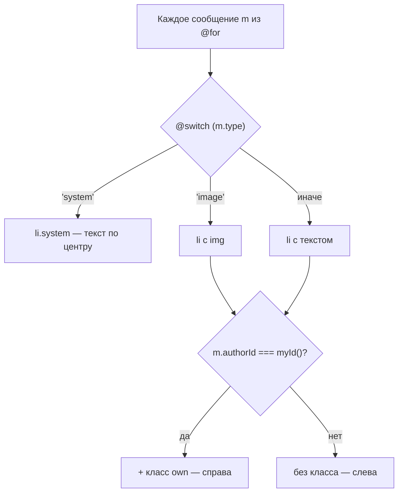
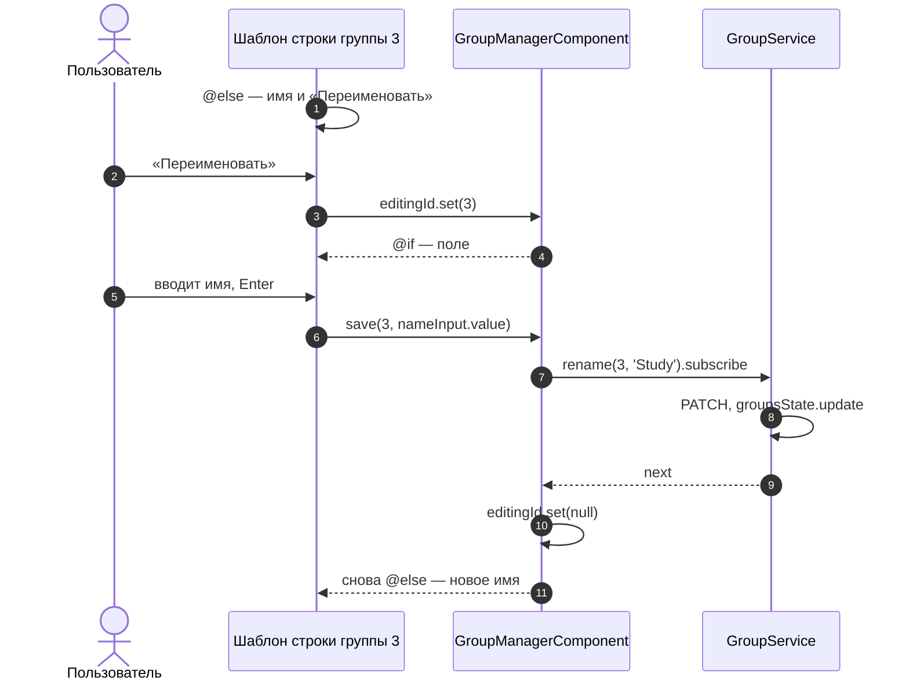
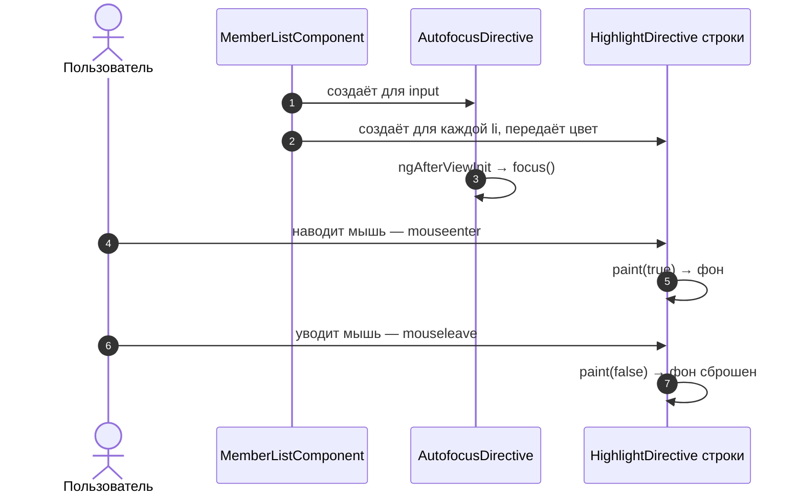
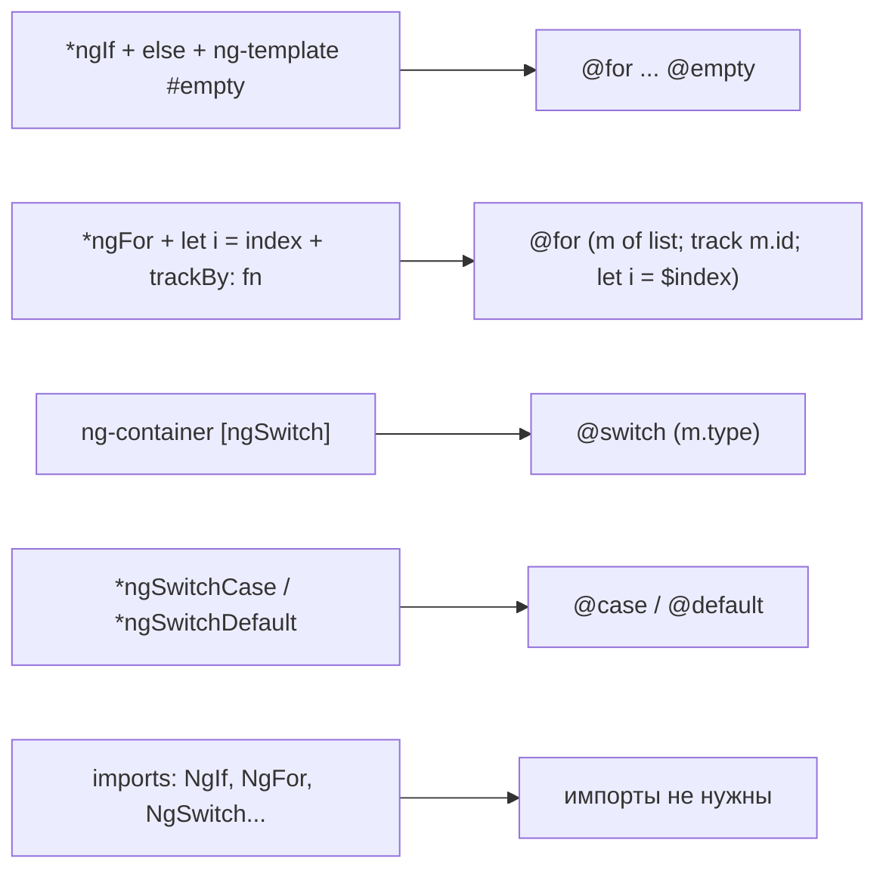

# 5_5 — Шаблоны Angular: директивы: примеры использования

**Курс:** 3813ICT, неделя 5
**Связанные файлы:** [конспект](5_5-templating-konspekt.md) · [поправки](5_5-templating-popravki.md) · [вопросы](5_5-templating-voprosy.md) · [ответы](5_5-templating-otvety.md)

Каждый пример — рабочий кусок шаблона для чата Phase 2: один большой фрагмент, пошаговая последовательность и диаграмма.

> **Диаграммы.** В Obsidian mermaid рендерится сам. В VS Code нужно расширение **Markdown Preview Mermaid Support**.

| Пример | Что показывает | Затрагивает темы |
|---|---|---|
| [1. Список сообщений канала](#ex-1) | `@for` с `track` и `$last`, `@empty`, `@switch` по типу сообщения, `[class.own]` | сигнальные `input()`, пайп `date` |
| [2. Переименование группы в списке](#ex-2) | шаблонная переменная в `@for`, `@let`, `@if`/`@else` внутри строки, события клавиш | сервисы (5_2), HttpClient (5_4) |
| [3. Свои атрибутные директивы](#ex-3) | `appAutofocus` и `appHighlight`: `ElementRef`, `host`, входной параметр | хуки жизненного цикла |
| [4. Перевод старого шаблона на новый синтаксис](#ex-4) | `*ngIf`/`*ngFor`/`ngSwitch` → `@if`/`@for`/`@switch`, автоматическая миграция | — |

---

<a id="ex-1"></a>

## Пример 1 — Список сообщений канала

**Когда использовать:** любой список, где элементы бывают разных видов и нужно отдельно обработать пустой список. В чате — лента сообщений канала: текстовые, картинки и системные («anna присоединилась»).

**Где в конспекте:** [§2.2 @for](5_5-templating-konspekt.md#s2-2) · [§2.3 @switch](5_5-templating-konspekt.md#s2-3) · [§5 Классы и стили](5_5-templating-konspekt.md#s5)

```ts
// ═════ src/app/models/message.ts ═════
export interface Message {
  id: number;
  type: 'text' | 'image' | 'system';
  authorId?: number;        // у системных сообщений автора нет
  author?: string;
  text?: string;
  imageUrl?: string;
  sentAt: string;           // дата от сервера строкой ISO: '2026-09-23T10:15:00Z'
}

// ═════ src/app/components/message-list/message-list.component.ts ═════
import { Component, input } from '@angular/core';
import { DatePipe } from '@angular/common';
import { Message } from '../../models/message';

@Component({
  selector: 'app-message-list',
  imports: [DatePipe],       // пайп date форматирует время; @for/@switch/@if импорт не нужен
  template: `
    <ul class="messages">
      @for (m of messages(); track m.id) {
        @switch (m.type) {
          @case ('system') {
            <li class="system">{{ m.text }}</li>
          }
          @case ('image') {
            <li [class.own]="m.authorId === myId()">
              <b>{{ m.author }}</b>
              
              <time>{{ m.sentAt | date: 'HH:mm' }}</time>
            </li>
          }
          @default {
            <li [class.own]="m.authorId === myId()">
              <b>{{ m.author }}</b> {{ m.text }}
              <time>{{ m.sentAt | date: 'HH:mm' }}</time>
            </li>
          }
        }
        @if ($last) {
          <li class="marker">— новых сообщений нет —</li>
        }
      } @empty {
        <li class="empty">В канале пока нет сообщений</li>
      }
    </ul>
  `,
  styles: `
    .messages { list-style: none; padding: 0; display: grid; gap: .5rem; }
    .own      { justify-self: end; background: #e0f0ff; }
    .system   { text-align: center; color: #888; font-style: italic; }
    .marker   { text-align: center; color: #bbb; font-size: .8rem; }
    img       { max-width: 240px; display: block; }
  `,
})
export class MessageListComponent {
  // Сигнальные входные параметры: родитель передаёт [messages] и [myId], читаются как messages()
  readonly messages = input.required<Message[]>();
  readonly myId = input.required<number>();
}

// ═════ Использование в странице канала ═════
// <app-message-list [messages]="messages()" [myId]="auth.currentUser()!.id" />
```

### Последовательность

1. Страница канала передаёт массив сообщений и `id` текущего пользователя.
2. `@for` проходит по сообщениям; `track m.id` запоминает, какой элемент DOM соответствует какому сообщению.
3. Для каждого сообщения `@switch` сравнивает `m.type` с вариантами: системное → курсивом по центру, картинка → ``, всё остальное → текст.
4. `[class.own]` добавляет класс `own`, если автор — текущий пользователь, и такое сообщение прижимается вправо.
5. После последнего сообщения (`$last`) выводится маркер конца.
6. Если сообщений нет, вместо всего этого срабатывает `@empty`.
7. Приходит новое сообщение, и массив заменяется новым. Благодаря `track m.id` Angular видит, что старые сообщения те же, и **добавляет только одну строку**, не пересоздавая остальные.



---

<a id="ex-2"></a>

## Пример 2 — Переименование группы в списке

**Когда использовать:** нужно ввести значение прямо в строке списка и сразу отправить его, не заводя отдельную переменную в классе под каждое поле. Шаблонная переменная внутри `@for` у каждой строки своя.

**Где в конспекте:** [§7 Шаблонные переменные](5_5-templating-konspekt.md#s7) · [§2.4 @let](5_5-templating-konspekt.md#s2-4) · [§4.3 События](5_5-templating-konspekt.md#s4-3)

```ts
// ═════ src/app/services/group.service.ts — метод rename (остальное как в 5_2, пример 1) ═════
rename(id: number, name: string): Observable<Group> {
  return this.http.patch<Group>(`${this.API}/${id}`, { name }).pipe(
    // Заменяем группу в сигнале новым массивом → все списки обновятся сами
    tap((updated) => this.groupsState.update((list) => list.map((g) => (g.id === id ? updated : g)))),
  );
}

// ═════ src/app/components/group-manager/group-manager.component.ts ═════
import { Component, inject, signal } from '@angular/core';
import { AuthService } from '../../services/auth.service';
import { GroupService } from '../../services/group.service';
import { AutofocusDirective } from '../../directives/autofocus.directive';   // из примера 3

@Component({
  selector: 'app-group-manager',
  imports: [AutofocusDirective],
  template: `
    @let canEdit = auth.hasRole('superadmin', 'groupadmin');

    <ul>
      @for (g of groupService.groups(); track g.id) {
        <li>
          @if (editingId() === g.id) {
            <!-- #nameInput — своя переменная у КАЖДОЙ строки: область видимости — этот блок -->
            <input
              #nameInput
              appAutofocus
              [value]="g.name"
              (keydown.enter)="save(g.id, nameInput.value)"
              (keydown.escape)="editingId.set(null)"
            >
            <button (click)="save(g.id, nameInput.value)">Сохранить</button>
            <button (click)="editingId.set(null)">Отмена</button>
          } @else {
            <span>{{ g.name }}</span>
            @if (canEdit) {
              <button (click)="editingId.set(g.id)">Переименовать</button>
            }
          }
        </li>
      } @empty {
        <li>Групп пока нет</li>
      }
    </ul>
    @if (error()) { <p class="error">{{ error() }}</p> }
  `,
})
export class GroupManagerComponent {
  protected auth = inject(AuthService);
  protected groupService = inject(GroupService);
  protected editingId = signal<number | null>(null);   // какая строка сейчас редактируется
  protected error = signal('');

  save(id: number, rawName: string): void {
    const name = rawName.trim();
    if (!name) return;
    this.groupService.rename(id, name).subscribe({
      next: () => this.editingId.set(null),             // выходим из режима редактирования
      error: () => this.error.set('Не удалось переименовать'),
    });
  }
}
```

### Последовательность

1. `@let canEdit` один раз вычисляет, может ли пользователь редактировать группы.
2. `@for` выводит группы; в каждой строке `editingId()` не совпадает с `g.id`, поэтому работает ветка `@else` — имя и кнопка «Переименовать» (если `canEdit`).
3. Пользователь жмёт «Переименовать» у группы 3 — `editingId` становится `3`.
4. В строке группы 3 срабатывает ветка `@if`: появляются поле ввода с переменной `#nameInput` и кнопки. Директива `appAutofocus` ставит в поле курсор.
5. Пользователь вводит новое имя и жмёт Enter — `(keydown.enter)` вызывает `save(3, nameInput.value)`: значение берётся прямо из элемента, без переменной в классе.
6. Сервис отправляет `PATCH` и заменяет группу в сигнале; список обновляется.
7. В `next` `editingId` становится `null` — строка возвращается в обычный вид.
8. Escape в любой момент отменяет редактирование.



---

<a id="ex-3"></a>

## Пример 3 — Свои атрибутные директивы

**Когда использовать:** одно и то же поведение нужно многим элементам в разных компонентах. Автофокус нужен каждому полю, которое появляется «по кнопке»; подсветка при наведении — строкам списков.

**Где в конспекте:** [§6 Своя атрибутная директива](5_5-templating-konspekt.md#s6) · [5_1 §3.5: ngAfterViewInit](5_1-data-persistence-konspekt.md#s3-5)

```ts
// ═════ src/app/directives/autofocus.directive.ts ═════
// ng g d directives/autofocus
import { AfterViewInit, Directive, ElementRef, inject } from '@angular/core';

@Directive({ selector: '[appAutofocus]' })
export class AutofocusDirective implements AfterViewInit {
  private el = inject<ElementRef<HTMLElement>>(ElementRef);   // элемент, на котором стоит директива

  // Элемент уже в DOM → можно ставить фокус (в конструкторе было бы рано)
  ngAfterViewInit(): void {
    this.el.nativeElement.focus();
  }
}

// ═════ src/app/directives/highlight.directive.ts ═════
// ng g d directives/highlight
import { Directive, ElementRef, inject, input } from '@angular/core';

@Directive({
  selector: '[appHighlight]',
  host: {                                  // события элемента-хозяина
    '(mouseenter)': 'paint(true)',
    '(mouseleave)': 'paint(false)',
  },
})
export class HighlightDirective {
  private el = inject<ElementRef<HTMLElement>>(ElementRef);

  // Параметр с именем селектора: <li [appHighlight]="'#e0f0ff'">.
  // При записи просто <li appHighlight> сюда придёт пустая строка → берём цвет по умолчанию
  readonly color = input('', { alias: 'appHighlight' });

  paint(on: boolean): void {
    this.el.nativeElement.style.backgroundColor = on ? this.color() || '#fff3c4' : '';
  }
}

// ═════ Использование: список участников группы ═════
import { Component, input } from '@angular/core';
import { AutofocusDirective } from '../../directives/autofocus.directive';
import { HighlightDirective } from '../../directives/highlight.directive';

@Component({
  selector: 'app-member-list',
  imports: [AutofocusDirective, HighlightDirective],   // без этого атрибуты молча не сработают
  template: `
    <input appAutofocus placeholder="Найти участника">
    <ul>
      @for (name of members(); track name) {
        <li [appHighlight]="name === admin() ? '#ffe0e0' : ''">{{ name }}</li>
      }
    </ul>
  `,
})
export class MemberListComponent {
  readonly members = input.required<string[]>();
  readonly admin = input('');
}
```

### Последовательность

1. Angular создаёт `MemberListComponent` и видит в шаблоне атрибуты `appAutofocus` и `appHighlight` — для каждого элемента создаётся свой экземпляр директивы.
2. Каждая директива через `inject(ElementRef)` получает ссылку на свой элемент.
3. После отрисовки шаблона `AutofocusDirective.ngAfterViewInit` ставит курсор в поле поиска.
4. У каждой строки `appHighlight` получает цвет: для администратора — розовый, для остальных — пустую строку.
5. Пользователь наводит мышь на строку — событие `mouseenter` из `host` вызывает `paint(true)`: фон строки становится её цветом или жёлтым по умолчанию.
6. Мышь уходит — `paint(false)` сбрасывает фон.



---

<a id="ex-4"></a>

## Пример 4 — Перевод старого шаблона на новый синтаксис

**Когда использовать:** в проекте или материалах встретился шаблон на `*ngIf`, `*ngFor`, `[ngSwitch]`, и его нужно понять или перевести на `@if`, `@for`, `@switch`.

**Где в конспекте:** [§3.6 Старое → новое](5_5-templating-konspekt.md#s3-6) · [П-7 Импорт старых директив](5_5-templating-popravki.md#p-7)

```ts
// ═════ БЫЛО: старые структурные директивы ═════
import { Component } from '@angular/core';
import { NgFor, NgIf, NgSwitch, NgSwitchCase, NgSwitchDefault } from '@angular/common';
import { Message } from '../../models/message';

@Component({
  selector: 'app-old-messages',
  imports: [NgIf, NgFor, NgSwitch, NgSwitchCase, NgSwitchDefault],   // каждой директиве — импорт
  template: `
    <ul *ngIf="messages.length; else empty">
      <li *ngFor="let m of messages; let i = index; trackBy: trackById">
        <ng-container [ngSwitch]="m.type">
          <em  *ngSwitchCase="'system'">{{ m.text }}</em>
          
          <span *ngSwitchDefault>{{ i + 1 }}. {{ m.text }}</span>
        </ng-container>
      </li>
    </ul>
    <ng-template #empty><p>Сообщений нет</p></ng-template>
  `,
})
export class OldMessagesComponent {
  messages: Message[] = [];
  trackById(index: number, m: Message): number {   // отдельный метод для trackBy
    return m.id;
  }
}

// ═════ СТАЛО: встроенный синтаксис ═════
@Component({
  selector: 'app-new-messages',
  // импорты директив не нужны
  template: `
    <ul>
      @for (m of messages; track m.id; let i = $index) {
        <li>
          @switch (m.type) {
            @case ('system') { <em>{{ m.text }}</em> }
            @case ('image')  {  }
            @default         { <span>{{ i + 1 }}. {{ m.text }}</span> }
          }
        </li>
      } @empty {
        <li>Сообщений нет</li>
      }
    </ul>
  `,
})
export class NewMessagesComponent {
  messages: Message[] = [];
  // trackById больше не нужен: track m.id прямо в шаблоне
}

// ═════ Автоматический перевод ═════
// ng generate @angular/core:control-flow
// CLI спросит путь (например, src/app) и перепишет шаблоны.
// После миграции проверь результат и убери ставшие ненужными импорты NgIf, NgFor...
```

### Как старое соответствует новому



### Последовательность перевода

1. `*ngIf="messages.length; else empty"` + `<ng-template #empty>` существовали только ради пустого списка — их целиком заменяет `@empty` внутри `@for`.
2. `*ngFor="let m of messages; let i = index; trackBy: trackById"` → `@for (m of messages; track m.id; let i = $index)`. Метод `trackById` удаляется: ключ пишется прямо в `track`.
3. `<ng-container [ngSwitch]>` → `@switch (m.type)`; обёртка больше не нужна.
4. Каждый `*ngSwitchCase="'x'"` → `@case ('x') { ... }`, `*ngSwitchDefault` → `@default { ... }`.
5. `<p>` для пустого списка превращается в `<li>`, потому что теперь он внутри `<ul>`.
6. Из `imports` компонента убираются `NgIf`, `NgFor`, `NgSwitch`, `NgSwitchCase`, `NgSwitchDefault`.
7. Для больших проектов то же делает команда `ng generate @angular/core:control-flow` — после неё результат просматривают вручную.
