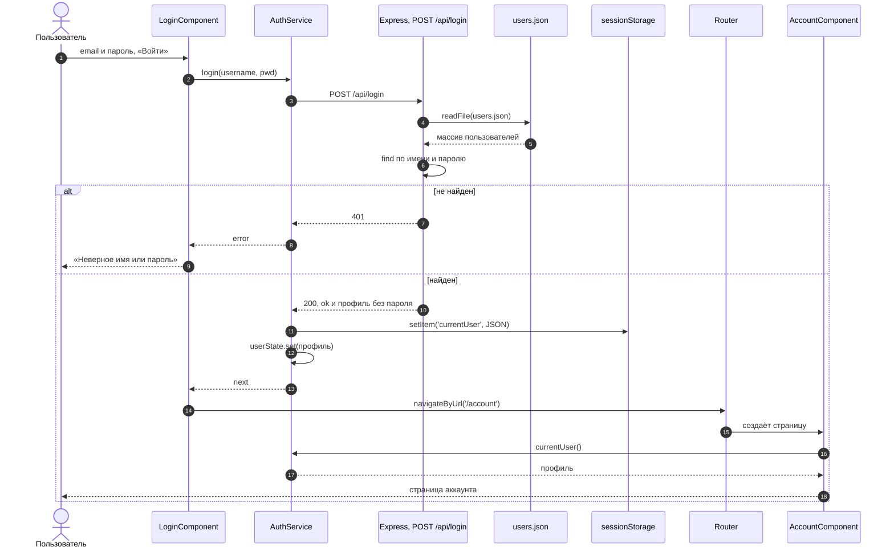

# 5_6 — Соединяем Node и Angular: конспект

**Курс:** 3813ICT, неделя 5
**Источник:** `5_6_Combine_Node_and_Angular_.pdf`
**Связанные файлы:** [поправки](5_6-node-angular-popravki.md) · [примеры](5_6-node-angular-primery.md) · [вопросы](5_6-node-angular-voprosy.md) · [ответы](5_6-node-angular-otvety.md)

> Значок **⚠** со ссылкой вида **П-N** ведёт в файл поправок. Там разобрано, где исходный материал курса расходится с тем, что написано в конспекте, и почему.

**Содержание**

1. [Что соединяем](#s1)
2. [Один репозиторий](#s2)
3. [Сервер: server.js](#s3)
4. [Маршруты в отдельных файлах](#s4): [вход](#s4-1) · [запись профиля](#s4-2) · [пути к файлам данных](#s4-3)
5. [Клиент: вход в Angular](#s5): [пример из материала](#s5-1) · [исправленная версия](#s5-2)
6. [Данные пользователя на другой странице](#s6)
7. [Весь поток целиком](#s7)
8. [Пригодится в заданиях](#s8)
9. [Ключевые факты](#s9)

---

<a id="s1"></a>

## 1. Что соединяем

Все предыдущие темы недели были частями одной задачи, и в этом файле они собираются вместе на примере входа в приложение:

- **Express-сервер** с маршрутами и JSON-файлами данных (неделя 3);
- **хостинг Angular на Node** и CORS ([5_3](5_3-node-hosting-konspekt.md));
- **`HttpClient`** — запрос из Angular на сервер ([5_4](5_4-http-requests-konspekt.md));
- **sessionStorage** — сохранение вошедшего пользователя ([5_1](5_1-data-persistence-konspekt.md));
- **сервисы** — где всё это должно жить ([5_2](5_2-services-konspekt.md)).

Результат — полноценный вход: пользователь вводит имя и пароль в Angular, сервер проверяет их по файлу, клиент запоминает пользователя и открывает страницу аккаунта. Это прямая заготовка для Phase 2.

---

<a id="s2"></a>

## 2. Один репозиторий

Клиент и сервер — два проекта, но хранить их удобно в **одном git-репозитории**: один `git push`, одна ссылка для сдачи, один `git clone` для проверяющего.

Порядок из материала:

1. Создать Angular-проект (`ng new`).
2. Внутри его папки создать папку `server` с `server.js`, маршрутами и данными.

```
my-app/
├── src/                     ← Angular
├── package.json
├── angular.json
└── server/
    ├── server.js
    ├── router/
    │   ├── postLogin.js
    │   └── postLoginafter.js
    └── data/
        ├── users.json
        └── extendedUsers.json
```

**Один `package.json` или два?** Материал предлагает вариант, при котором сервер пользуется `package.json` Angular-проекта: тогда `npm install express cors` выполняют из корня, и одна команда `npm install` ставит всё сразу. Это рабочий и простой вариант. Отдельный `package.json` в `server/` чище разделяет зависимости ([5_3 §4](5_3-node-hosting-konspekt.md#s4)). Для Phase 2 подойдут оба — главное, чтобы проверяющий мог всё установить и запустить по инструкции в README.

Если зависимости общие, инструменты разработки вроде `nodemon` ставят в `devDependencies` (`npm install -D nodemon`), а не в `dependencies`. ⚠ [П-1](5_6-node-angular-popravki.md#p-1)

---

<a id="s3"></a>

## 3. Сервер: `server.js`

Сервер собирается из уже знакомых частей: Express, CORS, разбор тела запроса, раздача собранного Angular и маршруты.

Вот как `server.js` выглядит в материале курса:

```js
var express = require('express');
var app = express();

// Cross origin resource sharing to cater for port 4200 to port 3000
var cors = require('cors');
app.use(cors());

var bodyParser = require("body-parser");
app.use(bodyParser.urlencoded({ extended: true }));
app.use(bodyParser.json());

/* Point static path to dist if you want use your own server
to serve Angular webpage */
app.use(express.static(__dirname + '/../dist/my-app'));
console.log(__dirname);

var http = require("http").Server(app);
var server = http.listen(3000, function() {
    console.log("Server listening on port: 3000");
});

app.post('/login', require('./router/postLogin'));
app.post('/loginafter', require('./router/postLoginafter'));
```

**Что в нём происходит.**

- `cors()` разрешает Angular на 4200 обращаться к серверу на 3000 ([5_3 §2](5_3-node-hosting-konspekt.md#s2)).
- `body-parser` разбирает тело запросов: и данные форм (`urlencoded`), и JSON.
- `express.static` раздаёт собранный Angular, если хочется открывать приложение с самого сервера. Материал советует для проверки вывести `__dirname` — это помогает убедиться, что путь к `dist` правильный.
- Сервер запускается на порту 3000.
- Два маршрута подключаются из отдельных файлов: первый параметр — адрес, второй — функция-обработчик, которую экспортирует модуль ([§4](#s4)).

Идея верная, но есть проблемы с современными версиями и с устройством маршрутов: путь к `dist` без `browser`, лишний `body-parser`, маршруты без префикса `/api` и без fallback для маршрутов Angular. ⚠ [П-2](5_6-node-angular-popravki.md#p-2)

Вот исправленная версия:

```js
// server/server.js
const express = require('express');
const path = require('path');
const cors = require('cors');

const app = express();
const PORT = 3000;
const CLIENT_DIR = path.join(__dirname, '../dist/my-app/browser');   // Angular 17+: подпапка browser
console.log('Сборка Angular ищется в', CLIENT_DIR);                  // та самая проверка пути

app.use(cors({ origin: 'http://localhost:4200' }));   // нужен только в режиме двух серверов
app.use(express.json());                              // вместо body-parser

// API — с префиксом /api, чтобы не пересекаться с маршрутами Angular
app.post('/api/login', require('./routes/login'));
app.patch('/api/users/:id/profile', require('./routes/update-profile'));
app.use('/api', (req, res) => res.status(404).json({ error: 'Not found' }));

// Собранный Angular и fallback для F5 на его маршрутах (5_3 §3.5)
app.use(express.static(CLIENT_DIR));
app.get('/{*splat}', (req, res) => res.sendFile(path.join(CLIENT_DIR, 'index.html')));

app.listen(PORT, () => console.log(`Server listening on port: ${PORT}`));
```

**Какая последовательность?**

1. **Сервер стартует** — вычисляется и выводится путь к сборке Angular.
2. **Подключаются middleware** по порядку: CORS, разбор JSON.
3. **Регистрируются маршруты API.**
   1. `POST /api/login` — вход ([§4.1](#s4-1)).
   2. `PATCH /api/users/:id/profile` — обновление профиля ([§4.2](#s4-2)).
   3. Всё остальное под `/api` — JSON 404.
4. **Регистрируется раздача Angular**: сначала файлы сборки, в самом конце fallback на `index.html`.
5. **Сервер слушает порт 3000.** Во время разработки Angular обращается к нему с 4200 (CORS или прокси), после `ng build` всё открывается прямо с `localhost:3000`.

---

<a id="s4"></a>

## 4. Маршруты в отдельных файлах

Когда маршрутов становится много, `server.js` разрастается. Поэтому обработчики выносят в отдельные файлы.

В материале используется простой приём: модуль экспортирует **функцию-обработчик** с параметрами `(req, res)`, а `server.js` передаёт её вторым аргументом в `app.post`:

```js
// server.js
app.post('/login', require('./router/postLogin'));

// router/postLogin.js
module.exports = function (req, res) {
  // req — данные от клиента (req.body), res — ответ клиенту (res.send / res.json)
};
```

Первый параметр маршрута — адрес, второй — функция, которая его обрабатывает; она и есть самое важное, поэтому её выносят в файл. Это вариант попроще, чем `express.Router()`: для одного обработчика на файл он удобен, для группы связанных маршрутов (`/api/groups/...`) удобнее Router.

<a id="s4-1"></a>

### 4.1 Вход: `postLogin`

Вот обработчик входа из материала:

```js
var fs = require('fs');

module.exports = function(req, res) {
    var u = req.body.username;
    var p = req.body.pwd;
    c = u + p;
    console.log(c);
    fs.readFile('./server/data/users.json', 'utf8', function(err, data) {
        // the above path is with respect to where we run server.js
        if (err) throw err;
        let userArray = JSON.parse(data);
        console.log(userArray);
        let i = userArray.findIndex(user =>
            ((user.username == u) && (user.pwd == p)));
        if (i == -1) {
            res.send({ "ok": false });
        } else {
            console.log(userArray[i]);
            res.send({ "ok": true });
        }
    });
}
```

**Что в нём происходит.**

1. Из тела запроса берутся имя (`username`) и пароль (`pwd`).
2. Они склеиваются и выводятся в консоль сервера.
3. Файл `users.json` читается асинхронно; путь указан относительно папки, из которой запущен сервер (об этом говорит комментарий).
4. Если чтение не удалось — ошибка выбрасывается.
5. Строка JSON превращается в массив пользователей и выводится в консоль.
6. `findIndex` ищет пользователя с таким именем и паролем.
7. Не нашёл — ответ `{ ok: false }`, нашёл — `{ ok: true }`.

Логика понятная, но в коде несколько опасных мест: пароль попадает в консоль, `c` становится глобальной переменной, `throw` внутри колбэка роняет весь сервер, путь зависит от места запуска, а клиент в ответ не получает ничего, кроме `ok`. ⚠ [П-3](5_6-node-angular-popravki.md#p-3)

Вот исправленная версия:

```js
// server/routes/login.js
const fs = require('fs/promises');
const path = require('path');

// Путь от папки ЭТОГО файла — работает, откуда бы ни запустили сервер
const USERS_FILE = path.join(__dirname, '../data/users.json');

module.exports = async function login(req, res) {
  const { username, pwd } = req.body ?? {};
  if (!username || !pwd) {
    return res.status(400).json({ ok: false, error: 'Username and password are required' });
  }

  try {
    const users = JSON.parse(await fs.readFile(USERS_FILE, 'utf8'));
    const user = users.find((u) => u.username === username && u.pwd === pwd);

    if (!user) {
      return res.status(401).json({ ok: false, error: 'Invalid username or password' });
    }

    const { pwd: _omit, ...profile } = user;   // профиль БЕЗ пароля
    res.json({ ok: true, user: profile });
  } catch (err) {
    // Ошибка чтения не роняет сервер: клиент получает 500, в лог — только причина
    console.error('Не удалось прочитать users.json:', err.message);
    res.status(500).json({ ok: false, error: 'Server error' });
  }
};
```

**Какая последовательность?**

1. **Express вызывает обработчик** для `POST /api/login`; `express.json()` уже положил тело в `req.body`.
2. **Проверка входных данных.**
   1. Нет имени или пароля — сразу `400`, файл даже не читается.
3. **Чтение файла** через `fs/promises` и `await`.
   1. Путь построен от `__dirname`, поэтому не зависит от места запуска.
   2. Строка превращается в массив через `JSON.parse`.
4. **Поиск пользователя** через `find` со строгим сравнением `===`.
   1. Не найден — `401` и сообщение об ошибке.
5. **Найден** — из объекта убирается пароль, клиенту уходит `{ ok: true, user: профиль }`.
6. **Если файл не прочитался** — `catch` отвечает `500`. Сервер продолжает работать и обслуживать других пользователей.

<a id="s4-2"></a>

### 4.2 Запись профиля: `postLoginafter`

Второй обработчик в материале получает от клиента данные пользователя (id, имя, дату рождения, возраст) и дописывает их в файл `extendedUsers.json`. Он показывает, как **записывать** данные в JSON-файл: прочитать файл, изменить массив, записать обратно.

```js
var fs = require('fs');

module.exports = function(req, res) {
    let userobj = {
        "userid": req.body.userid,
        "username": req.body.username,
        "userbirthdate": req.body.userbirthdate,
        "userage": req.body.userage
    }
    let uArray = [];
    fs.readFile('server/data/extendedUsers.json', 'utf8', function(err, data) {
        if (err) throw err;
        uArray = JSON.parse(data);
        uArray.push(userobj);
        console.log(userobj);

        uArrayjson = JSON.stringify(uArray);
        fs.writeFile('server/data/extendedUsers.json', uArrayjson, 'utf-8', function(err) {
            if (err) throw err;
            res.send(uArray);
        });
    });
}
```

**Что в нём происходит.**

1. Из тела запроса собирается объект пользователя.
2. Файл читается, строка превращается в массив.
3. Объект добавляется в конец массива (`push`).
4. Массив превращается обратно в строку и записывается в тот же файл.
5. Клиенту в ответ отправляется **весь** массив.

Схема «прочитать → изменить → записать» — правильная основа для работы с JSON-файлами. Но у этого обработчика серьёзные проблемы: при каждом входе добавляется новая копия пользователя, клиент получает данные всех пользователей, сервер верит любым присланным данным, а `uArrayjson` снова становится глобальной переменной. ⚠ [П-4](5_6-node-angular-popravki.md#p-4)

Смысл этого шага — сохранить дополнительные данные профиля. Правильнее сделать это как **обновление существующей записи**: `PATCH /api/users/:id/profile`. Вот исправленная версия:

```js
// server/routes/update-profile.js — PATCH /api/users/:id/profile
const fs = require('fs/promises');
const path = require('path');

const USERS_FILE = path.join(__dirname, '../data/users.json');

module.exports = async function updateProfile(req, res) {
  const id = Number(req.params.id);
  const { userbirthdate, userage } = req.body ?? {};

  if (userage !== undefined && (!Number.isInteger(userage) || userage < 0)) {
    return res.status(400).json({ error: 'userage must be a non-negative integer' });
  }

  try {
    const users = JSON.parse(await fs.readFile(USERS_FILE, 'utf8'));
    const user = users.find((u) => u.userid === id);
    if (!user) return res.status(404).json({ error: 'User not found' });

    // Меняем только переданные поля СУЩЕСТВУЮЩЕЙ записи — никаких дублей
    if (userbirthdate !== undefined) user.userbirthdate = userbirthdate;
    if (userage !== undefined) user.userage = userage;

    await fs.writeFile(USERS_FILE, JSON.stringify(users, null, 2));  // 2 — отступы, файл читаемый

    const { pwd: _omit, ...profile } = user;
    res.json(profile);                           // только этот пользователь, без пароля
  } catch (err) {
    console.error('Не удалось обновить профиль:', err.message);
    res.status(500).json({ error: 'Server error' });
  }
};
```

**Какая последовательность?**

1. **Из адреса берётся `id`** (`req.params.id` — строка, превращаем в число), из тела — новые значения.
2. **Проверка данных** — возраст должен быть целым неотрицательным числом, иначе `400`.
3. **Чтение файла** и поиск пользователя по `id`; не найден — `404`.
4. **Изменение существующей записи** — только те поля, которые пришли.
5. **Запись файла** — весь массив обратно, с отступами.
6. **Ответ** — обновлённый профиль этого пользователя без пароля.

В учебном проекте сервер верит, что запрос прислал сам этот пользователь. В реальном приложении сервер определяет пользователя по сессии (например, по куке из [5_1, пример 3](5_1-data-persistence-primery.md#ex-3)) и не даёт менять чужие профили.

<a id="s4-3"></a>

### 4.3 Пути к файлам данных

Комментарий в материале честно предупреждает: путь `./server/data/users.json` считается **от папки, из которой запущен сервер**, а не от файла с кодом. Это `process.cwd()`. Если запустить сервер как `node server/server.js` из корня проекта — путь сработает. Если перейти в `server/` и запустить `node server.js` — сервер будет искать `server/server/data/users.json` и упадёт.

Надёжный способ — строить путь от `__dirname`, папки самого файла ([5_3 §3.6](5_3-node-hosting-konspekt.md#s3-6)):

```js
// server/routes/login.js
path.join(__dirname, '../data/users.json');   // routes/ → на уровень выше → data/users.json
```

---

<a id="s5"></a>

## 5. Клиент: вход в Angular

Сервер готов принимать логин. Теперь сторона Angular: форма, запрос, сохранение пользователя, переход на другую страницу.

<a id="s5-1"></a>

### 5.1 Пример из материала

Вот компонент входа из материала курса:

```ts
import { Component, ViewChild, OnInit } from '@angular/core';
import { HttpClient, HttpHeaders } from '@angular/common/http';
const httpOptions = {
  headers: new HttpHeaders({ 'Content-Type': 'application/json' })
};
// for angular http methods
import { NgForm } from '@angular/forms';
import { Userpwd } from '../userpwd';
import { Userobj } from '../userobj';
import {Router} from '@angular/router';
import { USERPWDS} from '../mock-users';

const BACKEND_URL = 'http://localhost:3000';

@Component({
  selector: 'app-login',
  templateUrl: './login.component.html',
  styleUrls: ['./login.component.css']
})
export class LoginComponent implements OnInit {
  userpwd: Userpwd = {username: 'k.su@griffith.edu.au', pwd: '666666'};
  userobj: Userobj = {userid: 1 , username: this.userpwd.username, userbirthdate: null, userage: 100};
  constructor(private router: Router, private httpClient: HttpClient ) {}
  ngOnInit() {}
  public loginfunc() {
    this.httpClient.post(BACKEND_URL + '/login', this.userpwd,  httpOptions)
      .subscribe((data: any) => {
        alert(JSON.stringify(this.userpwd));
        if (data.ok) {
          sessionStorage.setItem('userid', this.userobj.userid.toString());
          sessionStorage.setItem('username', this.userobj.username);
          sessionStorage.setItem('userbirthdate', this.userobj.userbirthdate);
          sessionStorage.setItem('userage', this.userobj.userage.toString());
          this.httpClient.post<Userobj[]>(BACKEND_URL + '/loginafter', this.userobj,  httpOptions)
            .subscribe((m: any) => {console.log(m[0]);});
          this.router.navigateByUrl('account');
        } else {
          alert('Sorry, uername or password is not valid');
        }
      });
  }
}
```

Шаблон компонента: у каждого поля ввода `[(ngModel)]` для двусторонней связи со свойством класса, кнопка по клику вызывает `loginfunc()`:

```html
Username by email:<br>
<input type="email" [(ngModel)]="userpwd.username"> <br>
User password:<br>
<input type="password" [(ngModel)]="userpwd.pwd"> <br>
Birthdate: <br>
<input type="date" [(ngModel)]="userobj.userbirthdate"> <br>
Age: <br>
<input type="number" [(ngModel)]="userobj.userage">   <br>

<button class="log_but" value="Login" id="login"(click)="loginfunc()">Login</button>
```

**Что в нём происходит.**

1. В классе заданы два объекта: `userpwd` (имя и пароль, с заполненными по умолчанию значениями) и `userobj` (id, имя, дата рождения, возраст).
2. Поля формы связаны с ними через `[(ngModel)]`.
3. По кнопке `loginfunc()` отправляет `POST /login` с именем и паролем.
4. В ответе проверяется `data.ok`:
   1. если вход успешен — четыре поля `userobj` по отдельности кладутся в sessionStorage, затем отправляется второй запрос `/loginafter` с `userobj`, и роутер переходит на `account`;
   2. если нет — показывается `alert` об ошибке.

Поток показан правильно, но код собран из антипримеров: запросы прямо в компоненте, пароль в `alert`, заполненные учётные данные, подписка внутри подписки, нет обработки ошибок сети, `null` в `setItem` (ошибка компиляции в строгом режиме), а данные профиля приходят из формы, а не с сервера. ⚠ [П-5](5_6-node-angular-popravki.md#p-5)

<a id="s5-2"></a>

### 5.2 Исправленная версия

Работа с сервером и хранилищем переезжает в сервис ([5_2 §7](5_2-services-konspekt.md#s7)), компонент только показывает форму и реагирует на результат. Пользователь хранится **одной записью** JSON. Данные профиля берутся из ответа сервера.

```ts
// ═════ src/app/services/auth.service.ts ═════
import { Injectable, inject, signal } from '@angular/core';
import { HttpClient } from '@angular/common/http';
import { Observable, map, tap } from 'rxjs';

export interface UserProfile {
  userid: number;
  username: string;
  userbirthdate: string | null;
  userage: number | null;
}

interface LoginResponse {
  ok: boolean;
  user: UserProfile;
}

const KEY = 'currentUser';

@Injectable({ providedIn: 'root' })
export class AuthService {
  private http = inject(HttpClient);
  private readonly userState = signal<UserProfile | null>(this.read());
  readonly currentUser = this.userState.asReadonly();

  login(username: string, pwd: string): Observable<UserProfile> {
    // Адрес /api/... — работает и с прокси ng serve, и в single origin (5_3).
    // Content-Type для объекта HttpClient ставит сам
    return this.http.post<LoginResponse>('/api/login', { username, pwd }).pipe(
      map((res) => res.user),                              // профиль пришёл С СЕРВЕРА
      tap((user) => this.save(user)),
    );
  }

  updateProfile(changes: { userbirthdate?: string; userage?: number }): Observable<UserProfile> {
    const id = this.userState()?.userid;
    return this.http
      .patch<UserProfile>(`/api/users/${id}/profile`, changes)
      .pipe(tap((user) => this.save(user)));
  }

  logout(): void {
    sessionStorage.removeItem(KEY);
    this.userState.set(null);
  }

  private save(user: UserProfile): void {
    sessionStorage.setItem(KEY, JSON.stringify(user));     // одна запись вместо четырёх ключей
    this.userState.set(user);
  }

  private read(): UserProfile | null {
    try {
      const raw = sessionStorage.getItem(KEY);
      return raw ? (JSON.parse(raw) as UserProfile) : null;
    } catch {
      return null;
    }
  }
}

// ═════ src/app/pages/login/login.component.ts ═════
import { Component, inject } from '@angular/core';
import { FormsModule } from '@angular/forms';
import { Router } from '@angular/router';
import { HttpErrorResponse } from '@angular/common/http';
import { AuthService } from '../../services/auth.service';

@Component({
  selector: 'app-login',
  imports: [FormsModule],
  template: `
    <form (ngSubmit)="login()">
      <label>Email <input type="email" [(ngModel)]="username" name="username" required></label>
      <label>Пароль <input type="password" [(ngModel)]="pwd" name="pwd" required></label>
      <button type="submit" [disabled]="!username || !pwd">Войти</button>
    </form>
    @if (error) { <p class="error">{{ error }}</p> }
  `,
})
export class LoginComponent {
  private auth = inject(AuthService);
  private router = inject(Router);

  username = '';                  // пустые поля: никаких учётных данных в коде
  pwd = '';
  error = '';

  login(): void {
    this.error = '';
    this.auth.login(this.username, this.pwd).subscribe({
      next: () => this.router.navigateByUrl('/account'),
      error: (err: HttpErrorResponse) => {
        this.error =
          err.status === 401 ? 'Неверное имя или пароль' :
          err.status === 0 ? 'Сервер недоступен' :
          'Не удалось войти';
      },
    });
  }
}
```

**Какая последовательность?**

1. **Пользователь вводит email и пароль** — `[(ngModel)]` обновляет `username` и `pwd`.
2. **Отправка формы** (`ngSubmit` — работает и по Enter) вызывает `login()`.
3. **Компонент вызывает `auth.login()`** и подписывается.
   1. Сервис отправляет `POST /api/login` с `{ username, pwd }`.
4. **Сервер отвечает.**
   1. `200` — `map` достаёт профиль из ответа, `tap` сохраняет его одной JSON-записью в sessionStorage и в сигнал.
   2. Компонент получает `next` и переходит на `/account`.
5. **Если ошибка** — компонент показывает сообщение по коду: `401` — неверные данные, `0` — сервер недоступен.

---

<a id="s6"></a>

## 6. Данные пользователя на другой странице

После входа другая страница должна показать данные пользователя. В материале это компонент `Page2Component`, который читает sessionStorage прямо в полях класса:

```ts
import { Component, OnInit } from '@angular/core';
import {Router} from '@angular/router';

@Component({
  selector: 'app-page2',
  templateUrl: './page2.component.html',
  styleUrls: ['./page2.component.css']
})
export class Page2Component implements OnInit {
  userid = sessionStorage.getItem('userid');
  username = sessionStorage.getItem('username');
  birthdate = sessionStorage.getItem('userbirthdate');
  userage =  sessionStorage.getItem('userage');
  constructor() { }

  ngOnInit() {
  }
}
```

**Что в нём происходит.** При создании компонента каждое поле читает свой ключ из sessionStorage; дальше их можно вывести списком или таблицей в шаблоне.

Это работает, но каждое значение — строка или `null`, компонент сам знает, как устроено хранилище, а при открытии страницы в новой вкладке все поля будут `null`: у новой вкладки свой пустой sessionStorage ([5_1 §4](5_1-data-persistence-konspekt.md#s4)). ⚠ [П-6](5_6-node-angular-popravki.md#p-6)

Вот исправленная версия — страница аккаунта берёт пользователя из сервиса и заодно позволяет обновить профиль (то, что в материале пытался сделать `/loginafter`):

```ts
// src/app/pages/account/account.component.ts
import { Component, inject } from '@angular/core';
import { FormsModule } from '@angular/forms';
import { AuthService } from '../../services/auth.service';

@Component({
  selector: 'app-account',
  imports: [FormsModule],
  template: `
    @if (auth.currentUser(); as user) {
      <h2>{{ user.username }}</h2>
      <p>ID: {{ user.userid }}</p>
      <p>Дата рождения: {{ user.userbirthdate ?? 'не указана' }}</p>
      <p>Возраст: {{ user.userage ?? 'не указан' }}</p>

      <form (ngSubmit)="save()">
        <input type="date" [(ngModel)]="birthdate" name="birthdate">
        <input type="number" [(ngModel)]="age" name="age" min="0">
        <button type="submit">Сохранить профиль</button>
      </form>
      @if (message) { <p>{{ message }}</p> }
    } @else {
      <p>Вы не вошли. <a href="/login">Войти</a></p>
    }
  `,
})
export class AccountComponent {
  protected auth = inject(AuthService);
  birthdate = this.auth.currentUser()?.userbirthdate ?? '';
  age: number | null = this.auth.currentUser()?.userage ?? null;
  message = '';

  save(): void {
    this.auth
      .updateProfile({ userbirthdate: this.birthdate || undefined, userage: this.age ?? undefined })
      .subscribe({
        next: () => (this.message = 'Сохранено'),
        error: () => (this.message = 'Не удалось сохранить'),
      });
  }
}
```

**Какая последовательность?**

1. **Роутер открывает `/account`** и создаёт компонент.
2. **Компонент берёт пользователя из сервиса** — `auth.currentUser()`.
   1. Сервис прочитал его из sessionStorage при создании (после F5 данные на месте).
   2. В новой вкладке сигнал будет `null` — сработает ветка `@else`.
3. **Шаблон выводит профиль**; `??` подставляет текст вместо пустых полей.
4. **Пользователь меняет дату или возраст и сохраняет.**
   1. Сервис отправляет `PATCH /api/users/:id/profile` только с изменёнными полями.
   2. Сервер обновляет существующую запись и возвращает профиль.
   3. Сервис сохраняет новый профиль в sessionStorage и сигнал — шаблон обновляется сам.

---

<a id="s7"></a>

## 7. Весь поток целиком

Вот как все части работают вместе — от ввода пароля до страницы аккаунта:



---

<a id="s8"></a>

## 8. Пригодится в заданиях

Короткий чек-лист для связки клиента и сервера в Phase 2:

- **Адреса API** начинаются с `/api`; в Angular используется относительный `/api/...` и прокси при разработке ([5_3, пример 2](5_3-node-hosting-primery.md#ex-2)).
- **Запросы — в сервисах**, компонент только подписывается и показывает результат.
- **Пароль** уходит на сервер один раз при входе и больше нигде не хранится и не выводится.
- **Сервер отвечает правильными кодами**: `400` — плохие данные, `401` — неверный вход, `404` — не найдено, `500` — сбой сервера. Клиент различает их в `error`.
- **Файлы данных** читаются и пишутся через `fs/promises` с путями от `__dirname`; ошибки — в `try/catch`, а не `throw` в колбэке.
- **Запись в JSON-файл** обновляет существующие записи, а не дописывает копии; одновременные записи идут по очереди ([пример 2](5_6-node-angular-primery.md#ex-2)).
- **Пользователь** хранится на клиенте одной JSON-записью через сервис; выбор между sessionStorage и localStorage — осознанный ([П-6](5_6-node-angular-popravki.md#p-6)).

---

<a id="s9"></a>

## 9. Ключевые факты

**Структура**

- Клиент и сервер удобно держать в одном репозитории: папка `server/` внутри Angular-проекта.
- `package.json` может быть общим или отдельным для сервера; инструменты разработки — в `devDependencies`.

**Сервер**

- `server.js`: CORS (для двух серверов), `express.json()`, маршруты `/api`, раздача `dist/<проект>/browser`, fallback.
- Обработчик можно вынести в модуль, который экспортирует функцию `(req, res)`; для групп маршрутов удобнее `express.Router()`.
- Пути к файлам — от `__dirname`, а не от места запуска.
- Ошибки в асинхронном коде ловят и отвечают `500`; `throw` в колбэке роняет весь сервер.
- Пароль не пишут в лог и не отправляют клиенту.
- Запись JSON-файла: прочитать → изменить существующую запись → записать; отвечать только нужными данными.

**Клиент**

- Запросы и работа с хранилищем — в сервисе; компонент подписывается и обрабатывает `error`.
- Профиль пользователя берут из ответа сервера, а не из формы.
- Пользователя хранят одной записью JSON, а не несколькими ключами.
- sessionStorage живёт в одной вкладке: в новой вкладке пользователь «не вошёл»; localStorage — общий для вкладок.
- Страницы читают пользователя из сервиса, а не напрямую из хранилища.
