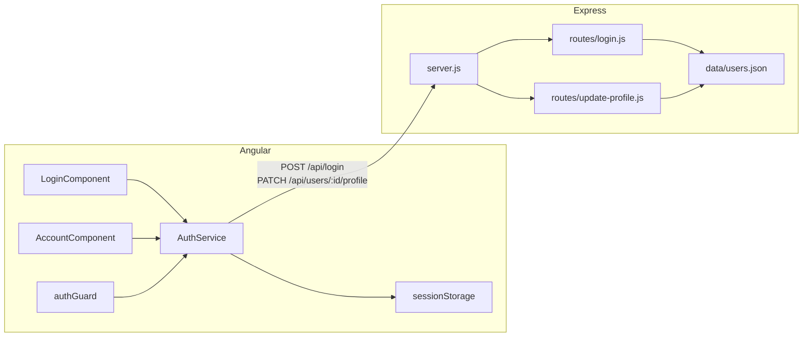
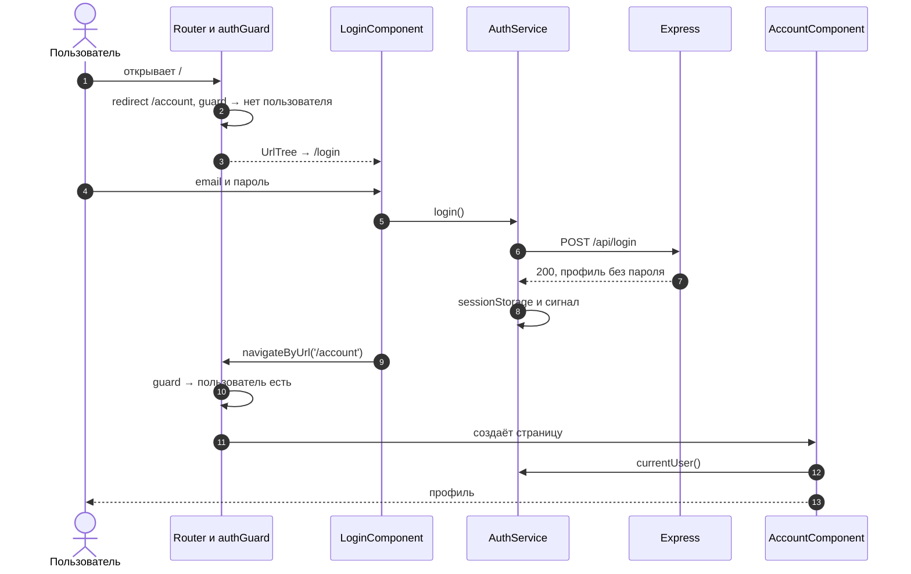
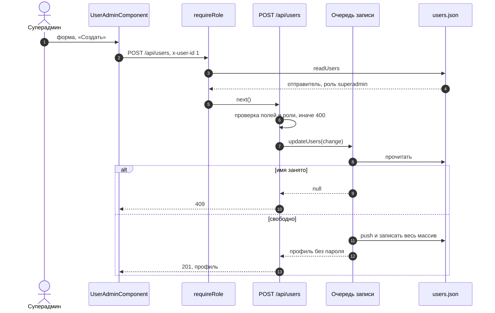
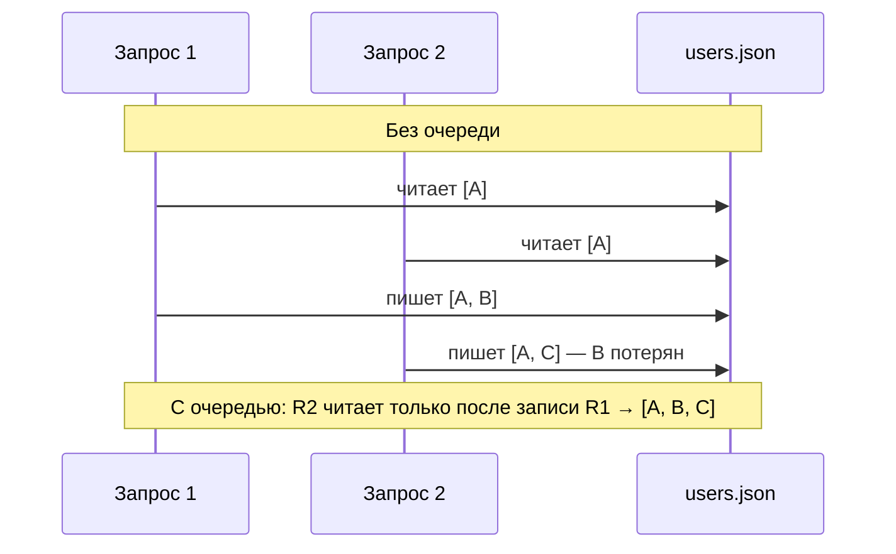

# 5_6 — Соединяем Node и Angular: примеры использования

**Курс:** 3813ICT, неделя 5
**Связанные файлы:** [конспект](5_6-node-angular-konspekt.md) · [поправки](5_6-node-angular-popravki.md) · [вопросы](5_6-node-angular-voprosy.md) · [ответы](5_6-node-angular-otvety.md)

Примеры собирают всю неделю в рабочие куски чата Phase 2. Каждый — один большой фрагмент, пошаговая последовательность и диаграмма. В конце — структура проекта и скрипты запуска.

> **Диаграммы.** В Obsidian mermaid рендерится сам. В VS Code нужно расширение **Markdown Preview Mermaid Support**.

| Пример | Что показывает | Затрагивает темы |
|---|---|---|
| [1. Вход целиком: сервер и клиент](#ex-1) | все файлы входа и связи между ними, гард, прокси | 5_1–5_5 |
| [2. Суперадмин создаёт пользователя](#ex-2) | проверка роли на сервере, валидация, `409`, безопасная запись JSON-файла по очереди | Router (неделя 3), перехватчик (5_4) |
| [Структура и запуск](#run) | дерево проекта, скрипты, README для проверяющего | — |

---

<a id="ex-1"></a>

## Пример 1 — Вход целиком: сервер и клиент

**Когда использовать:** как опорный скелет входа для Phase 2 — все файлы в одном месте, чтобы видеть, как они связаны.

**Где в конспекте:** [§3 server.js](5_6-node-angular-konspekt.md#s3) · [§4.1 Вход на сервере](5_6-node-angular-konspekt.md#s4-1) · [§5.2 Вход в Angular](5_6-node-angular-konspekt.md#s5-2) · [§7 Весь поток](5_6-node-angular-konspekt.md#s7)

```ts
// ═════ server/data/users.json ═════
// [
//   { "userid": 1, "username": "super@chat.com", "pwd": "123", "role": "superadmin",
//     "userbirthdate": null, "userage": null },
//   { "userid": 2, "username": "anna@chat.com",  "pwd": "123", "role": "groupadmin",
//     "userbirthdate": "2001-05-14", "userage": 25 }
// ]
// (учебно: пароли открытым текстом; в реальном проекте — хэш)

// ═════ server/server.js ═════
const express = require('express');
const path = require('path');

const app = express();
const CLIENT_DIR = path.join(__dirname, '../dist/my-app/browser');

app.use(express.json());
// CORS не нужен: при разработке — прокси ng serve, при сдаче — один origin

app.post('/api/login', require('./routes/login'));                          // конспект §4.1
app.patch('/api/users/:id/profile', require('./routes/update-profile'));    // конспект §4.2
app.use('/api', (req, res) => res.status(404).json({ error: 'Not found' }));

app.use(express.static(CLIENT_DIR));
app.get('/{*splat}', (req, res) => res.sendFile(path.join(CLIENT_DIR, 'index.html')));

app.listen(3000, () => console.log('http://localhost:3000'));

// ═════ server/routes/login.js ═════
const fs = require('fs/promises');
const path = require('path');
const USERS_FILE = path.join(__dirname, '../data/users.json');

module.exports = async function login(req, res) {
  const { username, pwd } = req.body ?? {};
  if (!username || !pwd) return res.status(400).json({ error: 'Username and password are required' });
  try {
    const users = JSON.parse(await fs.readFile(USERS_FILE, 'utf8'));
    const user = users.find((u) => u.username === username && u.pwd === pwd);
    if (!user) return res.status(401).json({ error: 'Invalid username or password' });
    const { pwd: _omit, ...profile } = user;           // пароль не уходит клиенту
    res.json({ ok: true, user: profile });
  } catch (err) {
    console.error('users.json:', err.message);          // без паролей в логе
    res.status(500).json({ error: 'Server error' });
  }
};

// ═════ proxy.conf.json (корень Angular-проекта) ═════
// { "/api": { "target": "http://localhost:3000", "secure": false } }
// angular.json → serve → options → "proxyConfig": "proxy.conf.json"

// ═════ src/app/services/auth.service.ts ═════
import { Injectable, computed, inject, signal } from '@angular/core';
import { HttpClient } from '@angular/common/http';
import { Observable, map, tap } from 'rxjs';

export interface UserProfile {
  userid: number;
  username: string;
  role: 'superadmin' | 'groupadmin' | 'user';
  userbirthdate: string | null;
  userage: number | null;
}

const KEY = 'currentUser';

@Injectable({ providedIn: 'root' })
export class AuthService {
  private http = inject(HttpClient);
  // Одно место выбора хранилища: sessionStorage (как в курсе) или localStorage
  private readonly storage: Storage = sessionStorage;

  private readonly userState = signal<UserProfile | null>(this.read());
  readonly currentUser = this.userState.asReadonly();
  readonly isLoggedIn = computed(() => this.userState() !== null);

  login(username: string, pwd: string): Observable<UserProfile> {
    return this.http.post<{ ok: boolean; user: UserProfile }>('/api/login', { username, pwd }).pipe(
      map((res) => res.user),                   // профиль — с сервера
      tap((user) => this.save(user)),
    );
  }

  logout(): void {
    this.storage.removeItem(KEY);
    this.userState.set(null);
  }

  private save(user: UserProfile): void {
    this.storage.setItem(KEY, JSON.stringify(user));
    this.userState.set(user);
  }

  private read(): UserProfile | null {
    try {
      const raw = this.storage.getItem(KEY);
      return raw ? (JSON.parse(raw) as UserProfile) : null;
    } catch {
      return null;
    }
  }
}

// ═════ src/app/guards/auth.guard.ts ═════
import { inject } from '@angular/core';
import { CanActivateFn, Router } from '@angular/router';

export const authGuard: CanActivateFn = () =>
  inject(AuthService).isLoggedIn() || inject(Router).createUrlTree(['/login']);

// ═════ src/app/app.routes.ts ═════
import { Routes } from '@angular/router';

export const routes: Routes = [
  { path: 'login', component: LoginComponent },                           // конспект §5.2
  { path: 'account', component: AccountComponent, canActivate: [authGuard] }, // конспект §6
  { path: '', pathMatch: 'full', redirectTo: 'account' },
];

// ═════ src/app/app.config.ts ═════
import { ApplicationConfig } from '@angular/core';
import { provideRouter } from '@angular/router';
import { provideHttpClient } from '@angular/common/http';

export const appConfig: ApplicationConfig = {
  providers: [provideRouter(routes), provideHttpClient()],
};

// LoginComponent и AccountComponent — как в конспекте §5.2 и §6
```

### Как файлы связаны



### Последовательность

1. Пользователь открывает `/` — роутер перенаправляет на `/account`.
2. `authGuard` спрашивает `isLoggedIn()` — пользователя ещё нет, гард возвращает `UrlTree` на `/login`.
3. Пользователь вводит email и пароль; `LoginComponent` вызывает `auth.login()`.
4. `AuthService` отправляет `POST /api/login` (при разработке через прокси, при сдаче — напрямую).
5. `routes/login.js` читает `users.json`, находит пользователя и отвечает профилем без пароля.
6. `AuthService` сохраняет профиль одной записью в sessionStorage и в сигнал.
7. `LoginComponent` переходит на `/account`; гард теперь пропускает.
8. `AccountComponent` читает профиль из сигнала и показывает его.
9. F5 на `/account` — сервис при создании читает профиль из sessionStorage, гард пропускает, страница на месте.



---

<a id="ex-2"></a>

## Пример 2 — Суперадмин создаёт пользователя

**Когда использовать:** в Phase 2 суперадмин создаёт пользователей, а данные хранятся в JSON-файле (до перехода на MongoDB на неделе 8). Пример показывает три вещи, которых не хватает в материале: проверку роли на сервере, валидацию с понятными кодами ответа и запись файла без потери данных при одновременных запросах.

**Где в конспекте:** [§4.2 Запись в JSON-файл](5_6-node-angular-konspekt.md#s4-2) · [П-4](5_6-node-angular-popravki.md#p-4) · [5_4, пример 3 — перехватчик](5_4-http-requests-primery.md#ex-3)

```ts
// ═════ server/data/store.js — чтение и запись users.json по очереди ═════
const fs = require('fs/promises');
const path = require('path');

const USERS_FILE = path.join(__dirname, 'users.json');

// Очередь: каждая следующая операция записи ждёт окончания предыдущей.
// Иначе два одновременных запроса прочитают старый файл, и второй затрёт изменения первого
let queue = Promise.resolve();
function exclusive(task) {
  const run = queue.then(task, task);
  queue = run.catch(() => {});             // ошибка одной операции не ломает очередь
  return run;
}

async function readUsers() {
  return JSON.parse(await fs.readFile(USERS_FILE, 'utf8'));
}

// change получает массив, меняет его и возвращает результат для ответа
function updateUsers(change) {
  return exclusive(async () => {
    const users = await readUsers();
    const result = await change(users);
    await fs.writeFile(USERS_FILE, JSON.stringify(users, null, 2));
    return result;
  });
}

module.exports = { readUsers, updateUsers };

// ═════ server/middleware/require-role.js ═════
const { readUsers } = require('../data/store');

// Учебная проверка: id пользователя приходит в заголовке x-user-id (его ставит перехватчик Angular).
// Заголовок легко подделать — в реальном проекте пользователя определяют по сессии или токену.
// Главное здесь: РОЛЬ берётся из данных сервера, а не из запроса клиента
module.exports = (...allowed) => async (req, res, next) => {
  const id = Number(req.get('x-user-id'));
  const users = await readUsers();
  const me = users.find((u) => u.userid === id);
  if (!me) return res.status(401).json({ error: 'Not logged in' });
  if (!allowed.includes(me.role)) return res.status(403).json({ error: 'Forbidden' });
  req.user = me;                            // пригодится следующему обработчику
  next();
};

// ═════ server/routes/users.js ═════
const express = require('express');
const { updateUsers } = require('../data/store');
const requireRole = require('../middleware/require-role');

const router = express.Router();
const ROLES = ['superadmin', 'groupadmin', 'user'];

router.post('/', requireRole('superadmin'), async (req, res) => {
  const { username, pwd, role = 'user' } = req.body ?? {};

  // 400 — данные неверны
  if (!username || !pwd) return res.status(400).json({ error: 'Username and password are required' });
  if (!ROLES.includes(role)) return res.status(400).json({ error: 'Unknown role' });

  try {
    const created = await updateUsers((users) => {
      if (users.some((u) => u.username === username)) return null;     // имя занято
      const userid = Math.max(0, ...users.map((u) => u.userid)) + 1;
      const user = { userid, username, pwd, role, userbirthdate: null, userage: null };
      users.push(user);                                                  // новая запись — только здесь
      const { pwd: _omit, ...profile } = user;
      return profile;
    });

    if (!created) return res.status(409).json({ error: 'Username already taken' });  // 409 — конфликт
    res.status(201).json(created);                                                    // 201 — создано
  } catch (err) {
    console.error('Создание пользователя:', err.message);
    res.status(500).json({ error: 'Server error' });
  }
});

module.exports = router;
// server.js: app.use('/api/users', require('./routes/users'));   (до app.use('/api', ... 404))

// ═════ src/app/services/user.service.ts (Angular) ═════
import { Injectable, inject } from '@angular/core';
import { HttpClient } from '@angular/common/http';
import { Observable } from 'rxjs';
import { UserProfile } from './auth.service';

@Injectable({ providedIn: 'root' })
export class UserService {
  private http = inject(HttpClient);

  create(data: { username: string; pwd: string; role: UserProfile['role'] }): Observable<UserProfile> {
    return this.http.post<UserProfile>('/api/users', data);   // x-user-id добавит перехватчик (5_4, пример 3)
  }
}

// ═════ src/app/pages/user-admin/user-admin.component.ts ═════
import { Component, inject } from '@angular/core';
import { FormsModule } from '@angular/forms';
import { HttpErrorResponse } from '@angular/common/http';
import { UserService } from '../../services/user.service';
import { UserProfile } from '../../services/auth.service';

@Component({
  selector: 'app-user-admin',
  imports: [FormsModule],
  template: `
    <form (ngSubmit)="create()">
      <input [(ngModel)]="username" name="username" type="email" placeholder="Email" required>
      <input [(ngModel)]="pwd" name="pwd" type="password" placeholder="Пароль" required>
      <select [(ngModel)]="role" name="role">
        <option value="user">user</option>
        <option value="groupadmin">groupadmin</option>
        <option value="superadmin">superadmin</option>
      </select>
      <button type="submit" [disabled]="!username || !pwd">Создать</button>
    </form>
    @if (message) { <p>{{ message }}</p> }
    <ul>
      @for (u of created; track u.userid) {
        <li>{{ u.username }} — {{ u.role }}</li>
      }
    </ul>
  `,
})
export class UserAdminComponent {
  private users = inject(UserService);
  username = '';
  pwd = '';
  role: UserProfile['role'] = 'user';
  message = '';
  created: UserProfile[] = [];

  create(): void {
    this.users.create({ username: this.username.trim(), pwd: this.pwd, role: this.role }).subscribe({
      next: (user) => {
        this.created = [...this.created, user];
        this.message = `Создан ${user.username}`;
        this.username = '';
        this.pwd = '';
      },
      error: (err: HttpErrorResponse) => {
        this.message =
          err.status === 409 ? 'Такое имя уже занято' :
          err.status === 403 ? 'Создавать пользователей может только суперадмин' :
          err.status === 400 ? err.error?.error ?? 'Проверь данные' :
          'Не удалось создать пользователя';
      },
    });
  }
}
```

### Последовательность

1. Суперадмин заполняет форму и отправляет её.
2. `UserService` отправляет `POST /api/users`; перехватчик добавляет `x-user-id`.
3. `requireRole('superadmin')` читает `users.json`, находит отправителя и проверяет его роль **по данным сервера**. Нет пользователя — `401`, не та роль — `403`.
4. Обработчик проверяет данные: пустые поля или неизвестная роль — `400`.
5. `updateUsers` ставит операцию в очередь: дождаться предыдущих записей, прочитать файл.
6. Имя уже есть — операция возвращает `null`, клиенту уходит `409`.
7. Иначе создаётся запись с новым `userid`, файл записывается целиком.
8. Клиенту уходит `201` и профиль без пароля.
9. Компонент добавляет пользователя в список или показывает сообщение по коду ошибки.



### Почему нужна очередь записи



---

<a id="run"></a>

## Структура и запуск

Вот как может выглядеть репозиторий Phase 2 после этой недели (вариант с общим `package.json`):

```
my-app/
├── README.md                     ← как установить и запустить — для проверяющего
├── package.json                  ← зависимости Angular и сервера, скрипты
├── angular.json                  ← serve.options.proxyConfig
├── proxy.conf.json               ← /api → localhost:3000
├── src/
│   └── app/
│       ├── services/             ← auth, user, group, channel ...
│       ├── guards/
│       ├── interceptors/
│       └── pages/                ← login, account, user-admin ...
└── server/
    ├── server.js
    ├── routes/                   ← login.js, update-profile.js, users.js ...
    ├── middleware/               ← require-role.js
    └── data/                     ← users.json, store.js
```

Скрипты в `package.json`:

```jsonc
"scripts": {
  "start": "ng serve",                                 // Angular с прокси — терминал 1
  "server": "node --watch server/server.js",           // сервер с автоперезапуском — терминал 2
  "build": "ng build",
  "prod": "ng build && node server/server.js"          // single origin одной командой
}
```

Раздел README для проверяющего:

```markdown
## Запуск
1. `npm install`
2. Разработка: `npm start` и в другом терминале `npm run server`, открыть http://localhost:4200
3. Собранная версия: `npm run prod`, открыть http://localhost:3000

Тестовые пользователи: super@chat.com / 123 (superadmin), anna@chat.com / 123 (groupadmin)
```
