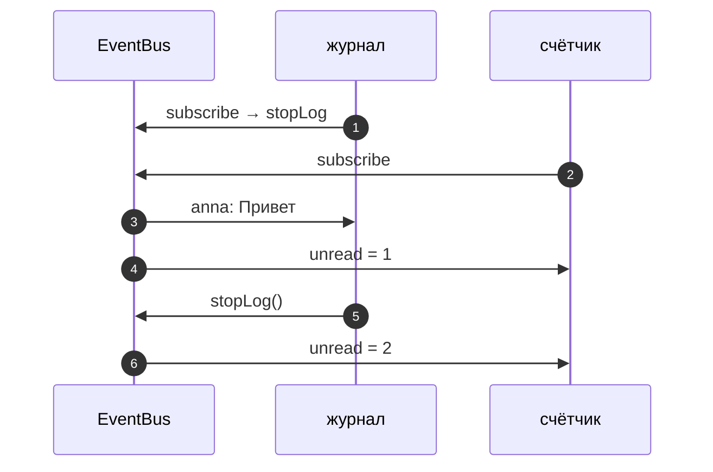
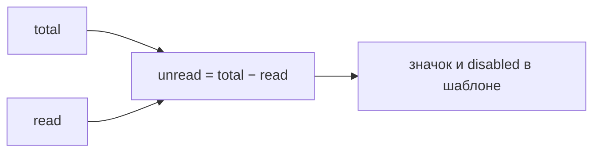

# 6_0 — Реактивное программирование: примеры использования

**Курс:** 3813ICT, неделя 6
**Связанные файлы:** [конспект](6_0-reactive-programming-konspekt.md) · [поправки](6_0-reactive-programming-popravki.md) · [вопросы](6_0-reactive-programming-voprosy.md) · [ответы](6_0-reactive-programming-otvety.md)

Примеры показывают паттерн Observer и реактивность на задачах чата: шина событий с подпиской и отпиской и счётчик непрочитанных, который пересчитывается сам.

> **Диаграммы.** В Obsidian mermaid рендерится сам. В VS Code нужно расширение **Markdown Preview Mermaid Support**.

---

<a id="ex-0"></a>

## Где в проекте встречается Observer

| Место | Субъект | Наблюдатель | Подписка / отписка |
|---|---|---|---|
| `(click)="save()"` в шаблоне | кнопка | метод компонента | Angular сам |
| `http.get(...).subscribe(...)` | Observable запроса | функция `next` | `subscribe` / завершается сам |
| `socket.on('message', h)` | сокет | обработчик `h` | `on` / `off` |
| `computed(() => ...)` | сигналы-источники | вычисляемый сигнал | Angular отслеживает сам |
| своя шина событий | `EventBus` | любые обработчики | `subscribe` возвращает функцию отписки |

| Пример | Что показывает |
|---|---|
| [1. Типизированная шина событий](#ex-1) | Observer с generics, интерфейсом и отпиской |
| [2. Счётчик непрочитанных на сигналах](#ex-2) | реактивное `a = b + c` в Angular |

---

<a id="ex-1"></a>

## Пример 1 — Типизированная шина событий

**Когда использовать:** несколько частей приложения должны узнавать об одном событии (новое сообщение, выход пользователя), не зная друг о друге. Это паттерн Observer из 6_0, доведённый до рабочего вида: типы, интерфейс, отписка.

**Где в конспекте:** [§5 Observer на TypeScript](6_0-reactive-programming-konspekt.md#s5) · [§6 Интерфейсы](6_0-reactive-programming-konspekt.md#s6) · [П-1, П-2](6_0-reactive-programming-popravki.md#p-1)

```ts
// ═════ event-bus.ts ═════
export interface Listener<T> {
  (event: T): void;                                 // интерфейс функции-наблюдателя
}

export class EventBus<T> {
  private listeners: Listener<T>[] = [];            // тип элементов указан явно

  subscribe(listener: Listener<T>): () => void {
    this.listeners.push(listener);
    return () => {                                  // функция отписки именно этого наблюдателя
      this.listeners = this.listeners.filter((l) => l !== listener);
    };
  }

  emit(event: T): void {
    for (const listener of [...this.listeners]) {   // копия: наблюдатель может отписаться во время рассылки
      listener(event);
    }
  }

  get size(): number { return this.listeners.length; }
}

// ═════ demo.ts ═════
interface ChatMessage { channel: string; author: string; text: string; }

const messages = new EventBus<ChatMessage>();
let unread = 0;
const log: string[] = [];

const stopLog = messages.subscribe((m) => log.push(`${m.author}: ${m.text}`));
messages.subscribe(() => unread++);

messages.emit({ channel: 'general', author: 'anna', text: 'Привет' });
stopLog();                                          // журнал больше не нужен
messages.emit({ channel: 'general', author: 'ben', text: 'Как дела?' });

console.log(log);        // [ 'anna: Привет' ]
console.log(unread);     // 2
console.log(messages.size); // 1
```

### Последовательность

1. Шина создаётся с типом события `ChatMessage` — `emit` не примет объект другой формы.
2. Подписываются два наблюдателя: журнал (его функция отписки сохранена) и счётчик.
3. Первое событие получают оба: запись в журнале, `unread = 1`.
4. `stopLog()` убирает только журнал.
5. Второе событие получает только счётчик: `unread = 2`, журнал не изменился.
6. Рассылка идёт по копии списка — если наблюдатель отпишется прямо внутри обработчика, цикл не пропустит соседа.



---

<a id="ex-2"></a>

## Пример 2 — Счётчик непрочитанных на сигналах

**Когда использовать:** значение зависит от других значений — «непрочитано = всего − прочитано», «кнопка активна = форма заполнена». Вместо ручного обновления во всех местах описывают зависимость один раз.

**Где в конспекте:** [§2 Реактивное программирование](6_0-reactive-programming-konspekt.md#s2) · [П-3](6_0-reactive-programming-popravki.md#p-3)

```ts
// ═════ src/app/chat/unread-badge.component.ts ═════
import { Component, computed, signal } from '@angular/core';

@Component({
  selector: 'app-unread-badge',
  template: `
    <p>Всего: {{ total() }}, прочитано: {{ read() }}</p>
    @if (unread() > 0) {
      <span class="badge">{{ unread() }} новых</span>
    }
    <button (click)="receive()">Пришло сообщение</button>
    <button (click)="markAllRead()" [disabled]="unread() === 0">Прочитать все</button>
  `,
})
export class UnreadBadgeComponent {
  protected total = signal(0);
  protected read = signal(0);
  protected unread = computed(() => this.total() - this.read());   // реактивное a = b − c

  protected receive(): void { this.total.update((n) => n + 1); }
  protected markAllRead(): void { this.read.set(this.total()); }
}
```

### Последовательность

1. `total` и `read` — сигналы-источники, `unread` — вычисляемый сигнал.
2. «Пришло сообщение» увеличивает `total`; `unread` пересчитывается сам, значок и кнопка обновляются.
3. «Прочитать все» приравнивает `read` к `total`; `unread` становится 0, значок исчезает, кнопка блокируется.
4. Нигде нет строки «обновить счётчик» — зависимость описана один раз в `computed`.


