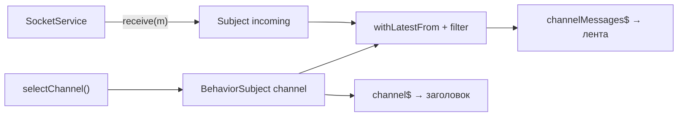
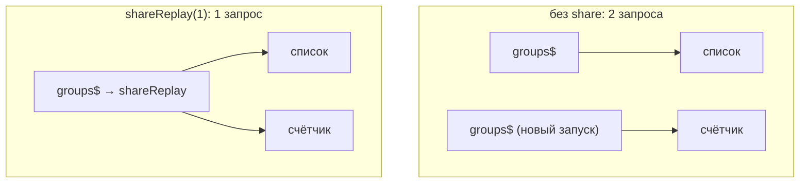

# 6_1 — Observables: примеры использования

**Курс:** 3813ICT, неделя 6
**Связанные файлы:** [конспект](6_1-observables-konspekt.md) · [поправки](6_1-observables-popravki.md) · [вопросы](6_1-observables-voprosy.md) · [ответы](6_1-observables-otvety.md)

Примеры показывают, где в чате нужен Subject, где BehaviorSubject и как одному источнику обслужить нескольких подписчиков без повторных запросов.

> **Диаграммы.** В Obsidian mermaid рендерится сам. В VS Code нужно расширение **Markdown Preview Mermaid Support**.

---

<a id="ex-0"></a>

## Какой источник выбрать

| Нужно | Выбор | Почему |
|---|---|---|
| уведомлять о событиях: «пришло сообщение» | `Subject` | новым подписчикам прошлые события не нужны |
| хранить текущее значение: «выбранный канал» | `BehaviorSubject` (или сигнал) | новый подписчик сразу получает текущее |
| показать последние N событий опоздавшим | `ReplaySubject(N)` | повторяет N последних |
| один запрос для нескольких подписчиков | `share()` / `shareReplay(1)` | делает unicast-источник общим |

| Пример | Что показывает |
|---|---|
| [1. Состояние чата: Subject и BehaviorSubject](#ex-1) | события и текущее значение, только чтение наружу |
| [2. Один источник — много подписчиков](#ex-2) | unicast против multicast, `shareReplay` |

---

<a id="ex-1"></a>

## Пример 1 — Состояние чата: Subject и BehaviorSubject

**Когда использовать:** несколько компонентов (заголовок, список, лента) должны знать выбранный канал и получать новые сообщения. Сервис хранит источники, а наружу отдаёт только Observable — отправлять значения может только он сам.

**Где в конспекте:** [§6 Subject в RxJS](6_1-observables-konspekt.md#s6) · [§7 Разновидности Subject](6_1-observables-konspekt.md#s7)

```ts
// ═════ src/app/services/chat-state.service.ts ═════
import { Injectable } from '@angular/core';
import { BehaviorSubject, Observable, Subject, filter, withLatestFrom, map } from 'rxjs';

export interface ChatMessage { channel: string; author: string; text: string; }

@Injectable({ providedIn: 'root' })
export class ChatStateService {
  private readonly channel = new BehaviorSubject<string>('general');   // текущее значение
  private readonly incoming = new Subject<ChatMessage>();              // поток событий

  // Наружу — только чтение: компоненты не могут вызвать next()
  readonly channel$: Observable<string> = this.channel.asObservable();

  // Сообщения только текущего канала
  readonly channelMessages$: Observable<ChatMessage> = this.incoming.pipe(
    withLatestFrom(this.channel),
    filter(([m, current]) => m.channel === current),
    map(([m]) => m),
  );

  selectChannel(name: string): void { this.channel.next(name); }
  receive(m: ChatMessage): void { this.incoming.next(m); }             // вызывает, например, SocketService
}

// ═════ проверка без Angular ═════
// const state = new ChatStateService();
// const seen: string[] = [];
// state.channel$.subscribe((c) => seen.push('channel:' + c));          // сразу 'channel:general'
// state.channelMessages$.subscribe((m) => seen.push(m.text));
// state.receive({ channel: 'general', author: 'anna', text: 'hi' });   // попадёт
// state.receive({ channel: 'random', author: 'ben', text: 'x' });      // отфильтровано
// state.selectChannel('random');                                       // 'channel:random'
// state.receive({ channel: 'random', author: 'ben', text: 'y' });      // попадёт
// console.log(seen);  // [ 'channel:general', 'hi', 'channel:random', 'y' ]
```

### Последовательность

1. `BehaviorSubject('general')` хранит текущий канал; подписчик `channel$` сразу получает `'general'`.
2. `Subject` сообщений не хранит прошлое: подписчик получит только то, что придёт после подписки.
3. `asObservable()` скрывает `next()` — изменить состояние можно только методами сервиса.
4. `withLatestFrom(this.channel)` к каждому сообщению добавляет текущий канал, `filter` отбрасывает чужие.
5. После `selectChannel('random')` сообщения `random` проходят, а `general` — нет.



---

<a id="ex-2"></a>

## Пример 2 — Один источник — много подписчиков

**Когда использовать:** на данные одного запроса подписаны несколько частей страницы (список и счётчик). Обычный Observable — unicast: каждая подписка запускает источник заново, то есть два запроса. `shareReplay(1)` делает один запрос и раздаёт результат всем, включая опоздавших.

**Где в конспекте:** [§6.2 Subject и обычный Observable](6_1-observables-konspekt.md#s6-2) · [П-2](6_1-observables-popravki.md#p-2)

```ts
import { Observable, shareReplay } from 'rxjs';

let requests = 0;
// Имитация HTTP-запроса: каждая подписка запускает функцию заново
const groups$ = new Observable<string[]>((subscriber) => {
  requests++;
  subscriber.next(['Study', 'Random']);
  subscriber.complete();
});

groups$.subscribe((g) => console.log('список', g.length));
groups$.subscribe((g) => console.log('счётчик', g.length));
console.log('запросов без share:', requests);             // 2

requests = 0;
const shared$ = groups$.pipe(shareReplay(1));             // один запуск, последний результат хранится
shared$.subscribe((g) => console.log('список', g.length));
shared$.subscribe((g) => console.log('счётчик', g.length));
console.log('запросов с shareReplay:', requests);         // 1

// В Angular-сервисе:
// readonly groups$ = this.http.get<Group[]>('/api/groups').pipe(shareReplay(1));
```

### Последовательность

1. Две подписки на `groups$` дважды выполняют функцию-источник — два «запроса».
2. `shareReplay(1)` при первой подписке запускает источник и запоминает последнее значение.
3. Вторая подписка получает сохранённое значение — источник не запускается снова.
4. Итого один запрос на всю страницу.


