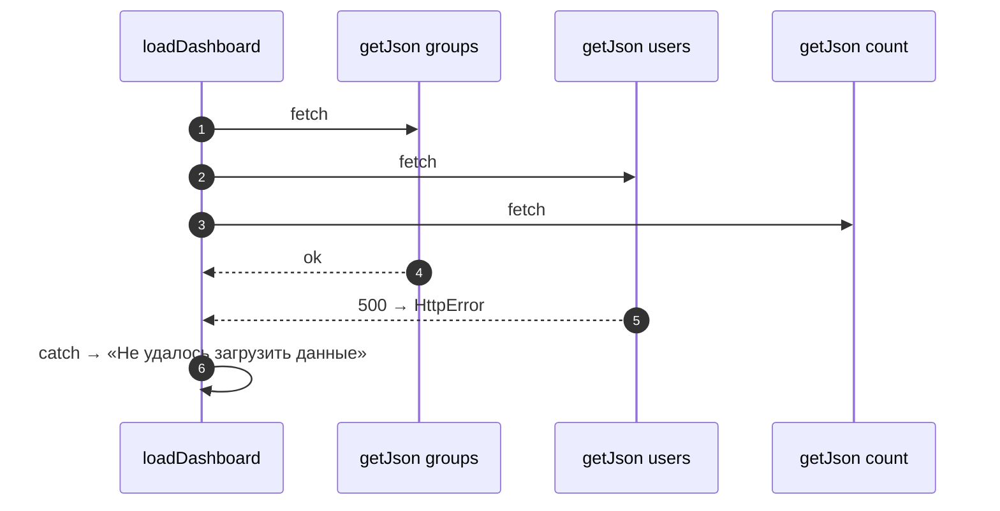
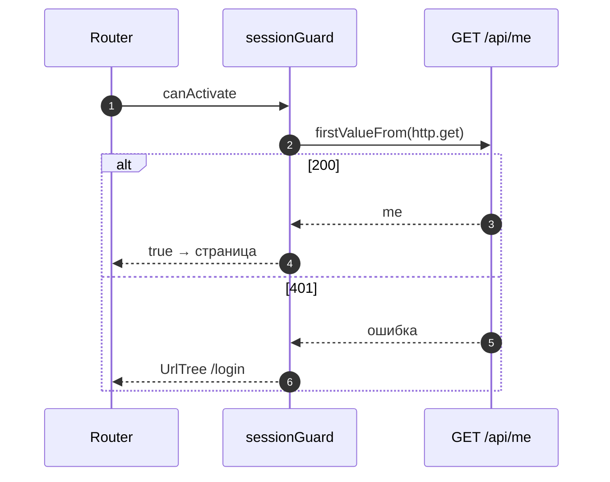

# 6_2 — Promises и async-функции: примеры использования

**Курс:** 3813ICT, неделя 6
**Связанные файлы:** [конспект](6_2-promises-async-konspekt.md) · [поправки](6_2-promises-async-popravki.md) · [вопросы](6_2-promises-async-voprosy.md) · [ответы](6_2-promises-async-otvety.md)

Примеры — два приёма, которые постоянно нужны в итоговом проекте: надёжная обёртка над `fetch` с параллельной загрузкой и мост из Observable в `async`-код Angular.

> **Диаграммы.** В Obsidian mermaid рендерится сам. В VS Code нужно расширение **Markdown Preview Mermaid Support**.

---

<a id="ex-0"></a>

## Что выбрать

| Задача | Инструмент |
|---|---|
| один ответ на сервере Node.js (файл, запрос к базе) | `async`/`await` + `try/catch` |
| несколько независимых запросов сразу | `Promise.all` |
| несколько запросов, часть может упасть | `Promise.allSettled` |
| запрос из браузера без Angular | `fetch` + проверка `response.ok` |
| запрос в Angular | `HttpClient` (Observable) |
| одно значение Observable в `async`-коде | `firstValueFrom` |

| Пример | Что показывает |
|---|---|
| [1. Надёжный `getJson` и параллельная загрузка](#ex-1) | проверка статуса, своя ошибка, `Promise.all` и `allSettled` |
| [2. `firstValueFrom` в гарде Angular](#ex-2) | асинхронная проверка сессии перед открытием страницы |

---

<a id="ex-1"></a>

## Пример 1 — Надёжный `getJson` и параллельная загрузка

**Когда использовать:** код на `fetch` (скрипт, Node.js, страница без Angular). Обёртка превращает ответы 4xx/5xx в ошибку с кодом, а `Promise.all` загружает независимые данные одновременно.

**Где в конспекте:** [§4 fetch](6_2-promises-async-konspekt.md#s4) · [§6.4 Ошибки и параллельность](6_2-promises-async-konspekt.md#s6-4) · [П-2, П-3](6_2-promises-async-popravki.md#p-2)

```js
// ═════ get-json.mjs ═════
export class HttpError extends Error {
  constructor(status, url) {
    super(`HTTP ${status} for ${url}`);
    this.status = status;                               // код доступен тому, кто поймал ошибку
  }
}

export async function getJson(url) {
  const response = await fetch(url);                    // отклоняется только при сетевой ошибке
  if (!response.ok) throw new HttpError(response.status, url);   // 404/500 → ошибка
  return response.json();                               // тело — через json(), не response.body
}

// ═════ dashboard.mjs ═════
import { getJson, HttpError } from './get-json.mjs';

const API = 'http://localhost:3000/api';

export async function loadDashboard() {
  try {
    // Три независимых запроса — одновременно: время = самый долгий, а не сумма
    const [groups, users, count] = await Promise.all([
      getJson(`${API}/groups`),
      getJson(`${API}/users`),
      getJson(`${API}/products/count`),
    ]);
    return { groups, users, count: count.count };
  } catch (err) {
    if (err instanceof HttpError && err.status === 401) return { error: 'Войдите снова' };
    return { error: 'Не удалось загрузить данные' };    // сеть недоступна или другой код
  }
}

// Вариант, когда часть данных может не загрузиться, но показать остальное нужно:
export async function loadDashboardPartial() {
  const [groups, users] = await Promise.allSettled([getJson(`${API}/groups`), getJson(`${API}/users`)]);
  return {
    groups: groups.status === 'fulfilled' ? groups.value : [],
    users: users.status === 'fulfilled' ? users.value : [],
  };
}
```

### Последовательность

1. `getJson` ждёт ответ; при сбое сети `fetch` отклоняется сам.
2. Если сервер ответил не 2xx, `getJson` бросает `HttpError` с кодом.
3. `Promise.all` запускает три запроса сразу и ждёт все; если любой упал — весь `await` бросает первую ошибку.
4. `catch` различает ошибки: `401` — просьба войти, остальное — общее сообщение.
5. `Promise.allSettled` ждёт все запросы и никогда не бросает: для каждого известно, выполнен он или отклонён, — так можно показать то, что загрузилось.



---

<a id="ex-2"></a>

## Пример 2 — `firstValueFrom` в гарде Angular

**Когда использовать:** перед открытием страницы нужно спросить сервер, действительна ли сессия. Гард может быть `async`-функцией; `firstValueFrom` превращает запрос `HttpClient` в Promise.

**Где в конспекте:** [§8 Из Promise в Observable и обратно](6_2-promises-async-konspekt.md#s8) · [П-6](6_2-promises-async-popravki.md#p-6)

```ts
// ═════ src/app/guards/session.guard.ts ═════
import { inject } from '@angular/core';
import { CanActivateFn, Router } from '@angular/router';
import { HttpClient } from '@angular/common/http';
import { firstValueFrom } from 'rxjs';

interface Me { id: number; username: string; role: string; }

export const sessionGuard: CanActivateFn = async () => {
  const http = inject(HttpClient);                     // inject — в начале, до первого await
  const router = inject(Router);

  try {
    await firstValueFrom(http.get<Me>('/api/me'));     // первое значение → Promise
    return true;                                       // сессия действительна
  } catch {
    return router.createUrlTree(['/login']);           // 401 или сеть — на страницу входа
  }
};

// app.routes.ts: { path: 'channels', component: ChannelsComponent, canActivate: [sessionGuard] }
```

### Последовательность

1. Роутер вызывает гард перед открытием `/channels`.
2. `inject` вызывается в начале функции — пока идёт контекст внедрения; после `await` вызывать `inject` нельзя.
3. `firstValueFrom` подписывается на запрос и возвращает Promise с первым значением.
4. Ответ 2xx — гард возвращает `true`, страница открывается.
5. Ответ 401 или сетевая ошибка — Promise отклоняется, `catch` возвращает `UrlTree` на `/login`.


