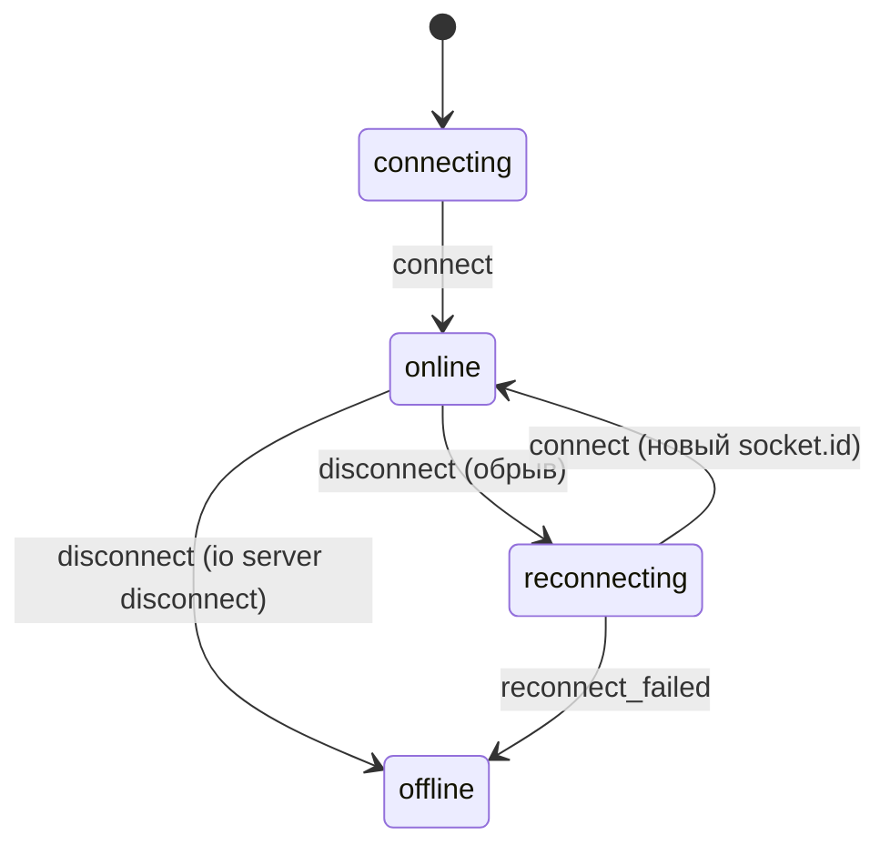
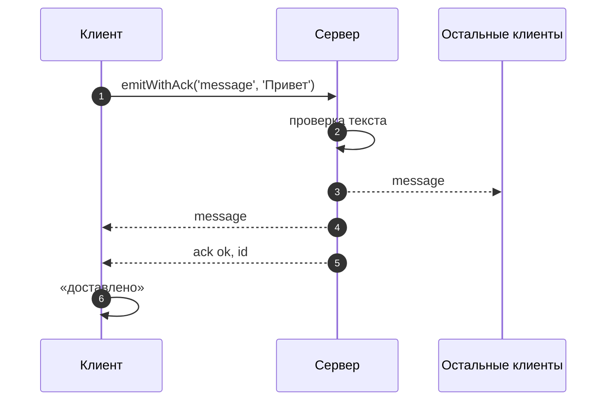

# 6_3 — Сокеты: примеры использования

**Курс:** 3813ICT, неделя 6
**Связанные файлы:** [конспект](6_3-sockets-konspekt.md) · [поправки](6_3-sockets-popravki.md) · [вопросы](6_3-sockets-voprosy.md) · [ответы](6_3-sockets-otvety.md)

Примеры — два кирпичика Socket.IO, которые понадобятся в чате: жизненный цикл соединения (подключение, обрыв, переподключение) и подтверждения — ответ сервера на конкретное событие.

> **Диаграммы.** В Obsidian mermaid рендерится сам. В VS Code нужно расширение **Markdown Preview Mermaid Support**.

---

<a id="ex-0"></a>

## HTTP, WebSocket или Socket.IO

| Задача в чате | Чем делать | Почему |
|---|---|---|
| загрузить историю сообщений, список групп | HTTP (`HttpClient`) | один запрос — один ответ |
| получать новые сообщения сразу | Socket.IO | сервер сам отправляет события |
| «сообщение доставлено» | подтверждение Socket.IO | ответ на конкретный `emit` |
| связь с чужим сервисом на чистом WebSocket | браузерный `WebSocket` | Socket.IO к нему не подключится |

| Пример | Что показывает |
|---|---|
| [1. Жизненный цикл соединения](#ex-1) | события `connect`, `disconnect`, `connect_error`, переподключение, статус в интерфейсе |
| [2. Подтверждения](#ex-2) | ответ сервера на `emit`, таймаут, проверка на сервере |

---

<a id="ex-1"></a>

## Пример 1 — Жизненный цикл соединения

**Когда использовать:** в интерфейсе чата нужно показывать «в сети / переподключение / нет связи» и не терять понимание, что происходит с соединением. Socket.IO сам переподключается — задача кода только в том, чтобы слушать события.

**Где в конспекте:** [§5 Socket.IO](6_3-sockets-konspekt.md#s5) · [§6 Две стороны кода](6_3-sockets-konspekt.md#s6)

```js
// ═════ server/server.js ═════
const { createServer } = require('http');
const { Server } = require('socket.io');

const httpServer = createServer();
const io = new Server(httpServer, { cors: { origin: 'http://localhost:4200' } });

io.on('connection', (socket) => {
  console.log('+', socket.id, 'транспорт:', socket.conn.transport.name);   // сначала обычно polling
  socket.conn.once('upgrade', () => console.log('↑', socket.id, 'перешёл на', socket.conn.transport.name));
  socket.on('disconnect', (reason) => console.log('-', socket.id, reason));
});

httpServer.listen(3000);

// ═════ src/app/services/socket-status.ts (клиент) ═════
import { io } from 'socket.io-client';
import { signal } from '@angular/core';

export type Status = 'connecting' | 'online' | 'reconnecting' | 'offline';
export const status = signal<Status>('connecting');

const socket = io('http://localhost:3000');       // переподключение включено по умолчанию

socket.on('connect', () => status.set('online'));
socket.on('disconnect', (reason) => {
  // 'io server disconnect' — сервер отключил сам: автоматического переподключения не будет
  if (reason === 'io server disconnect') { status.set('offline'); }
  else { status.set('reconnecting'); }             // обрыв сети, перезапуск сервера — Socket.IO попробует снова
});
socket.on('connect_error', () => status.set('reconnecting'));   // сервер недоступен, попытки продолжаются
socket.io.on('reconnect_failed', () => status.set('offline'));  // исчерпаны попытки (если задан лимит)

// В шаблоне: @switch (status()) { @case ('online') { В сети } @case ('reconnecting') { Переподключение… } ... }
```

### Последовательность

1. Клиент вызывает `io(url)` — статус «connecting».
2. Соединение установлено: сервер пишет `+ id`, клиент получает `connect` — «online».
3. Обычно соединение начинается с HTTP long-polling и затем переходит на WebSocket (событие `upgrade`).
4. Сервер перезапустили: клиент получает `disconnect` с причиной `transport close` — «reconnecting»; Socket.IO сам пробует подключиться с растущей паузой.
5. Сервер снова работает — `connect`, «online». У сокета новый `socket.id`.
6. Если сервер разорвал соединение сам (`socket.disconnect()` на сервере), причина — `io server disconnect`, и клиент не переподключается без явного `socket.connect()`.



---

<a id="ex-2"></a>

## Пример 2 — Подтверждения

**Когда использовать:** клиенту важно знать, что сервер **принял** конкретное событие — например, показать у сообщения галочку «доставлено» или сообщить об ошибке проверки. В Socket.IO последним аргументом `emit` передают функцию, которую сервер вызывает с ответом.

**Где в конспекте:** [§5.2 Что Socket.IO добавляет](6_3-sockets-konspekt.md#s5-2) · [§5.3 События](6_3-sockets-konspekt.md#s5-3)

```js
// ═════ server/socket.js ═════
io.on('connection', (socket) => {
  socket.on('message', (text, ack) => {
    if (typeof ack !== 'function') return;                         // клиент без подтверждения — игнорируем
    if (typeof text !== 'string' || !text.trim()) {
      return ack({ ok: false, error: 'Пустое сообщение' });        // ответ именно этому клиенту
    }
    const message = { id: Date.now(), text: text.trim(), sentAt: new Date().toISOString() };
    io.emit('message', message);                                    // рассылка всем
    ack({ ok: true, id: message.id });                              // подтверждение отправителю
  });
});

// ═════ клиент ═════
async function send(socket, text) {
  try {
    // emitWithAck возвращает Promise; timeout — если сервер не ответит за 5 с, будет ошибка
    const res = await socket.timeout(5000).emitWithAck('message', text);
    return res.ok ? `доставлено #${res.id}` : `ошибка: ${res.error}`;
  } catch {
    return 'сервер не ответил';
  }
}
```

### Последовательность

1. Клиент вызывает `emitWithAck('message', text)` с таймаутом 5 секунд — получает Promise.
2. Сервер получает событие и функцию `ack` последним аргументом.
3. Пустой текст — сервер вызывает `ack({ ok: false, ... })`, Promise клиента выполняется с ошибкой проверки.
4. Верный текст — сервер рассылает сообщение всем и вызывает `ack({ ok: true, id })` только для отправителя.
5. Если сервер не ответил за 5 секунд (упал, событие потерялось), Promise отклоняется, и клиент показывает «сервер не ответил».


