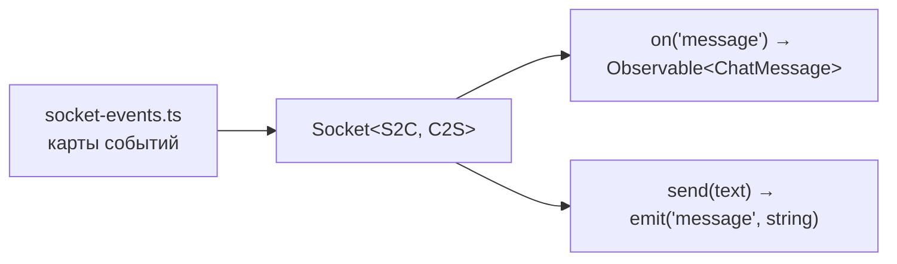
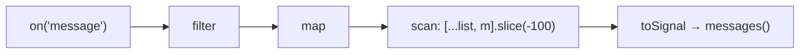

# 6_4 — Сокет и Observable в Angular: примеры использования

**Курс:** 3813ICT, неделя 6
**Связанные файлы:** [конспект](6_4-socket-observable-konspekt.md) · [поправки](6_4-socket-observable-popravki.md) · [вопросы](6_4-socket-observable-voprosy.md) · [ответы](6_4-socket-observable-otvety.md)

Примеры развивают сервис сокета из конспекта: типизированные события для всего приложения и лента сообщений, собранная операторами в сигнал.

> **Диаграммы.** В Obsidian mermaid рендерится сам. В VS Code нужно расширение **Markdown Preview Mermaid Support**.

---

<a id="ex-0"></a>

## Три способа принять событие сокета в компоненте

| Способ | Отписка | Когда |
|---|---|---|
| `socket.on(e, cb)` в компоненте | вручную `socket.off(e, cb)` в `ngOnDestroy` | не рекомендуется: легко забыть |
| `Observable` из сервиса + `takeUntilDestroyed()` | автоматически | основной способ |
| `toSignal(observable$)` | автоматически при уничтожении | когда в шаблоне нужно значение |

| Пример | Что показывает |
|---|---|
| [1. Типизированные события](#ex-1) | одна карта событий для клиента, общий метод `on<E>()` с функцией очистки |
| [2. Лента в сигнале через `scan`](#ex-2) | накопление сообщений операторами, `toSignal`, ограничение длины |

---

<a id="ex-1"></a>

## Пример 1 — Типизированные события

**Когда использовать:** событий становится больше (`message`, `typing`, `system`), и ошибка в имени или форме данных не должна проходить молча. Socket.IO принимает карты событий как параметры типа: компилятор проверит имена и данные.

**Где в конспекте:** [§5.3 Исправленный сервис](6_4-socket-observable-konspekt.md#s5-3) · [П-2](6_4-socket-observable-popravki.md#p-2) · [П-5](6_4-socket-observable-popravki.md#p-5)

```ts
// ═════ src/app/services/socket-events.ts — один источник правды для имён и данных ═════
export interface ChatMessage { id: number; author: string; text: string; sentAt: string; }

export interface ServerToClientEvents {
  message: (m: ChatMessage) => void;
  typing: (username: string) => void;
  system: (text: string) => void;
}

export interface ClientToServerEvents {
  message: (text: string) => void;
  typing: () => void;
  'join-channel': (channel: string) => void;
}

// ═════ src/app/services/socket.service.ts ═════
import { Injectable } from '@angular/core';
import { Observable } from 'rxjs';
import { io, Socket } from 'socket.io-client';
import { ClientToServerEvents, ServerToClientEvents } from './socket-events';

type ChatSocket = Socket<ServerToClientEvents, ClientToServerEvents>;

@Injectable({ providedIn: 'root' })
export class SocketService {
  private socket: ChatSocket = io('http://localhost:3000', { autoConnect: false });

  connect(): void {
    if (!this.socket.connected) this.socket.connect();
  }

  // Любое событие сервера как Observable; при отписке снимается именно этот обработчик
  on<E extends keyof ServerToClientEvents>(event: E): Observable<Parameters<ServerToClientEvents[E]>[0]> {
    return new Observable((subscriber) => {
      const handler = ((data: Parameters<ServerToClientEvents[E]>[0]) => subscriber.next(data)) as ServerToClientEvents[E];
      this.socket.on(event, handler as any);
      return () => { this.socket.off(event, handler as any); };
    });
  }

  send(text: string): void { this.socket.emit('message', text); }
  typing(): void { this.socket.emit('typing'); }
  join(channel: string): void { this.socket.emit('join-channel', channel); }
}

// Использование:
// this.socketService.on('message')   // Observable<ChatMessage>
// this.socketService.on('typing')    // Observable<string>
// this.socketService.on('mesage')    // ❌ ошибка компиляции — опечатка в имени
// this.socket.emit('message', 42)    // ❌ ошибка компиляции — ждём строку
```

### Последовательность

1. Карты событий описывают, какие события шлёт сервер и какие — клиент, и что в них лежит.
2. `Socket<ServerToClientEvents, ClientToServerEvents>` — сокет с этими картами; `emit` и `on` проверяются компилятором.
3. `on<E>()` принимает только имена из карты и возвращает Observable с правильным типом данных.
4. При подписке вешается обработчик, при отписке снимается именно он — утечки из [6_4 П-5](6_4-socket-observable-popravki.md#p-5) нет.
5. `autoConnect: false` + `connect()` — соединение открывается, когда оно действительно нужно (например, после входа).



---

<a id="ex-2"></a>

## Пример 2 — Лента в сигнале через `scan`

**Когда использовать:** в шаблоне нужна лента, которая растёт с каждым сообщением, но не бесконечно. Вместо ручного `messages.update(...)` в подписке ленту собирает оператор `scan`, а `toSignal` сам отписывается при уничтожении компонента.

**Где в конспекте:** [§5.4 Подписка в компоненте](6_4-socket-observable-konspekt.md#s5-4) · [§6 Операторы](6_4-socket-observable-konspekt.md#s6)

```ts
// ═════ src/app/chat/feed.component.ts ═════
import { Component, inject } from '@angular/core';
import { toSignal } from '@angular/core/rxjs-interop';
import { scan, filter, map } from 'rxjs';
import { SocketService } from '../services/socket.service';
import { ChatMessage } from '../services/socket-events';

const MAX = 100;                                     // держим в памяти последние 100

@Component({
  selector: 'app-feed',
  template: `
    <ul>
      @for (m of messages(); track m.id) {
        <li><b>{{ m.author }}</b>: {{ m.text }}</li>
      } @empty {
        <li>Сообщений пока нет</li>
      }
    </ul>
  `,
})
export class FeedComponent {
  private socketService = inject(SocketService);

  protected messages = toSignal(
    this.socketService.on('message').pipe(
      filter((m) => m.text.trim().length > 0),                                    // пустые не показываем
      map((m) => ({ ...m, text: m.text.trim() })),
      scan((list: ChatMessage[], m) => [...list, m].slice(-MAX), [] as ChatMessage[]),   // накопить, обрезать
    ),
    { initialValue: [] as ChatMessage[] },
  );

  constructor() {
    this.socketService.connect();
  }
}
```

### Последовательность

1. `toSignal` подписывается на поток при создании компонента и отпишется при его уничтожении — `takeUntilDestroyed` не нужен.
2. Каждое сообщение проходит `filter` и `map`.
3. `scan` получает предыдущий массив и новое сообщение, возвращает **новый** массив и обрезает его до 100 последних.
4. Сигнал получает новый массив — `@for` с `track m.id` дорисовывает только новую строку.
5. При уничтожении компонента отписка снимает обработчик с сокета (функция очистки из примера 1).


