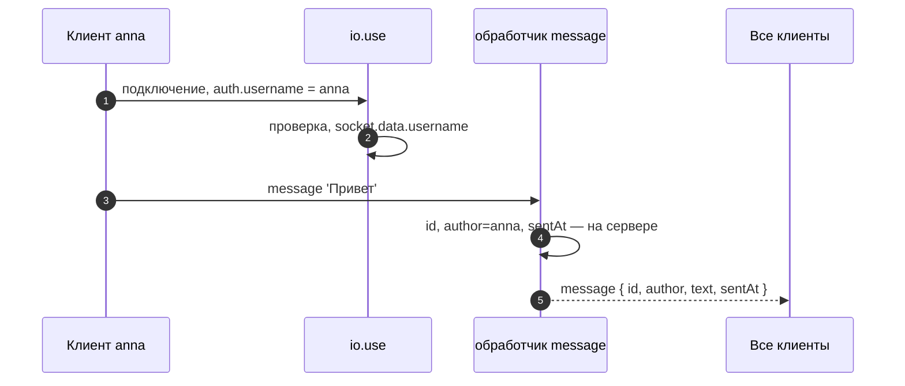
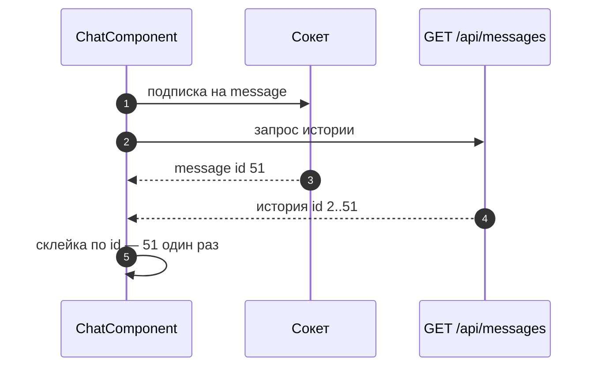

# 6_5 — Чат на Socket.IO, Node и Angular: примеры использования

**Курс:** 3813ICT, неделя 6
**Связанные файлы:** [конспект](6_5-socket-chat-konspekt.md) · [поправки](6_5-socket-chat-popravki.md) · [вопросы](6_5-socket-chat-voprosy.md) · [ответы](6_5-socket-chat-otvety.md)

Чат из конспекта пересылает голые строки. Примеры делают из него основу Phase 2: сообщение с автором и временем, которые задаёт сервер, и лента, где история загружается по HTTP, а новые сообщения приходят по сокету.

> **Диаграммы.** В Obsidian mermaid рендерится сам. В VS Code нужно расширение **Markdown Preview Mermaid Support**.

---

<a id="ex-0"></a>

## Что решает клиент, а что — сервер

| Поле сообщения | Кто задаёт | Почему |
|---|---|---|
| `text` | клиент (сервер проверяет и обрезает) | это ввод пользователя |
| `author` | **сервер** | клиент может подставить чужое имя |
| `sentAt` | **сервер** | часы клиента могут врать |
| `id` | **сервер** (или база) | уникальность и порядок |

| Пример | Что показывает |
|---|---|
| [1. Сообщение-объект, собранное сервером](#ex-1) | имя из рукопожатия, проверка, `id` и время на сервере |
| [2. История по HTTP и новые по сокету](#ex-2) | порядок загрузки, склейка без дублей |

---

<a id="ex-1"></a>

## Пример 1 — Сообщение-объект, собранное сервером

**Когда использовать:** в ленте нужно показывать автора и время. Если брать их из того, что прислал клиент, любой может написать от чужого имени. Сервер берёт имя из данных подключения, время — свои часы.

**Где в конспекте:** [§3.2 Исправленный сервер](6_5-socket-chat-konspekt.md#s3-2) · [П-6](6_5-socket-chat-popravki.md#p-6)

```js
// ═════ server/socket.js ═════
let nextId = 1;
const history = [];                                   // учебное хранилище; в Phase 2 — MongoDB (неделя 8–9)

module.exports = {
  connect(io) {
    // Проверка при подключении: без имени сокет не подключится
    io.use((socket, next) => {
      const username = socket.handshake.auth?.username;
      if (typeof username !== 'string' || !username.trim()) return next(new Error('username required'));
      socket.data.username = username.trim();         // данные сокета, доступны во всех обработчиках
      next();
    });

    io.on('connection', (socket) => {
      socket.on('message', (text) => {
        if (typeof text !== 'string') return;
        const clean = text.trim().slice(0, 1000);
        if (!clean) return;

        const message = {
          id: nextId++,                               // сервер
          author: socket.data.username,               // сервер — из подключения, не из события
          text: clean,                                // клиент, проверено
          sentAt: new Date().toISOString(),           // сервер
        };
        history.push(message);
        if (history.length > 200) history.shift();
        io.emit('message', message);
      });
    });
  },
  history,
};

// ═════ клиент ═════
// const socket = io('http://localhost:3000', { auth: { username: currentUser.username } });
// socket.on('connect_error', (err) => console.log(err.message));   // 'username required'
// socket.emit('message', 'Привет');                                 // автора не передаём
```

### Последовательность

1. Клиент подключается с `auth: { username }` — эти данные приходят в `socket.handshake.auth`.
2. Промежуточная функция `io.use` проверяет имя; без него подключение отклоняется, клиент получает `connect_error`.
3. Имя сохраняется в `socket.data` и доступно всем обработчикам этого сокета.
4. Клиент отправляет только текст; сервер проверяет его и собирает объект: `id`, автор из `socket.data`, время сервера.
5. Сообщение сохраняется в истории (последние 200) и рассылается всем.



(В учебном примере имя берётся из `auth` без пароля. В Phase 2 сервер должен проверять, что пользователь действительно вошёл, — например, по сессии или токену, выданному при входе.)

---

<a id="ex-2"></a>

## Пример 2 — История по HTTP и новые по сокету

**Когда использовать:** при открытии чата нужно показать последние сообщения, а потом — новые в реальном времени. Историю отдаёт HTTP-маршрут, новые — сокет. Важно не потерять сообщения, пришедшие во время загрузки истории, и не показать одно сообщение дважды.

**Где в конспекте:** [§5 SocketService](6_5-socket-chat-konspekt.md#s5) · [§6.2 Исправленный компонент](6_5-socket-chat-konspekt.md#s6-2)

```js
// ═════ server/server.js (фрагмент) ═════
// const { history } = require('./socket');
// app.get('/api/messages', (req, res) => res.json(history.slice(-50)));
```

```ts
// ═════ src/app/chat/chat.component.ts (фрагмент) ═════
import { Component, inject, signal } from '@angular/core';
import { HttpClient } from '@angular/common/http';
import { takeUntilDestroyed } from '@angular/core/rxjs-interop';
import { SocketService } from '../services/socket.service';
import { ChatMessage } from '../services/socket-events';

@Component({
  selector: 'app-chat',
  template: `@for (m of messages(); track m.id) { <p><b>{{ m.author }}</b> {{ m.text }}</p> }`,
})
export class ChatComponent {
  private http = inject(HttpClient);
  private socketService = inject(SocketService);
  protected messages = signal<ChatMessage[]>([]);

  constructor() {
    // 1) сначала подписка на новые — ничего не потеряется, пока грузится история
    this.socketService.on('message')
      .pipe(takeUntilDestroyed())
      .subscribe((m) => this.add([m]));

    // 2) затем история
    this.http.get<ChatMessage[]>('/api/messages').subscribe((list) => this.add(list));

    this.socketService.connect();
  }

  // Склейка без дублей и по порядку id
  private add(incoming: ChatMessage[]): void {
    this.messages.update((list) => {
      const byId = new Map(list.map((m) => [m.id, m]));
      for (const m of incoming) byId.set(m.id, m);
      return [...byId.values()].sort((a, b) => a.id - b.id);
    });
  }
}
```

### Последовательность

1. Компонент **сначала** подписывается на новые сообщения сокета.
2. Затем запрашивает историю `GET /api/messages`.
3. Если новое сообщение пришло, пока грузилась история, оно уже добавлено.
4. История приходит и может содержать это же сообщение — `Map` по `id` оставляет одну копию.
5. Список сортируется по `id` — порядок правильный, даже если ответы пришли в другом порядке.


