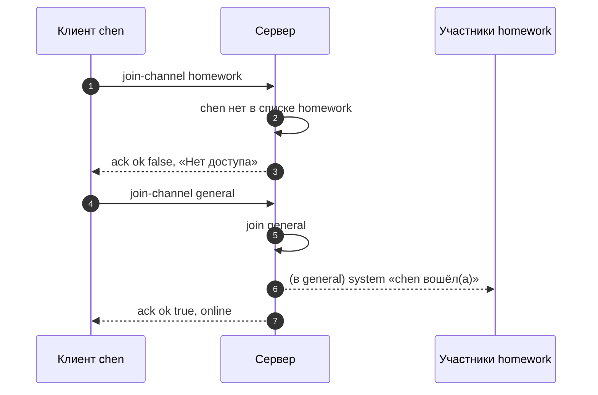
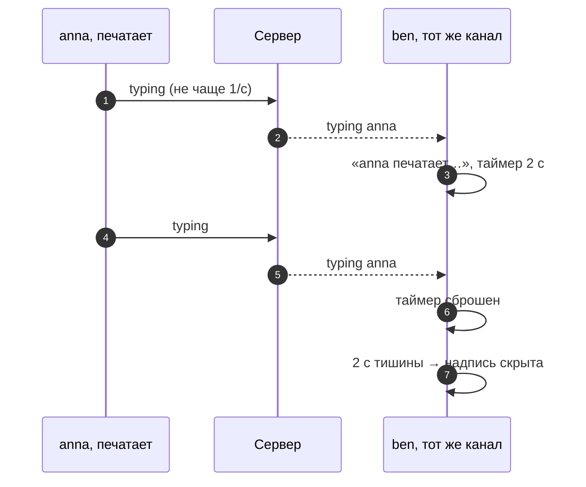

# 6_6 — Socket.IO: пространства имён и комнаты: примеры использования

**Курс:** 3813ICT, неделя 6
**Связанные файлы:** [конспект](6_6-socket-rooms-konspekt.md) · [поправки](6_6-socket-rooms-popravki.md) · [вопросы](6_6-socket-rooms-voprosy.md) · [ответы](6_6-socket-rooms-otvety.md)

Примеры — две части каналов Phase 2: вход в канал с проверкой прав и ответом клиенту и индикатор «печатает…», который не видит сам печатающий.

> **Диаграммы.** В Obsidian mermaid рендерится сам. В VS Code нужно расширение **Markdown Preview Mermaid Support**.

---

<a id="ex-0"></a>

## Какая рассылка для какого события

| Событие в чате | Вызов на сервере | Кто получит |
|---|---|---|
| сообщение в канал | `io.to(room).emit('message', m)` | все в канале, включая отправителя |
| «печатает…» | `socket.to(room).emit('typing', name)` | все в канале, кроме печатающего |
| «anna вошла» | `socket.to(room).emit('system', text)` | все в канале, кроме вошедшей |
| ответ на вход в канал | подтверждение `ack({...})` | только этот сокет |
| личное уведомление | `io.to('user:2').emit(...)` | все вкладки пользователя 2 |

| Пример | Что показывает |
|---|---|
| [1. Вход в канал с проверкой прав](#ex-1) | `join` по просьбе клиента, отказ, число участников в ответе |
| [2. «Печатает…»](#ex-2) | `socket.to`, ограничение частоты на клиенте, автоскрытие |

---

<a id="ex-1"></a>

## Пример 1 — Вход в канал с проверкой прав

**Когда использовать:** пользователь выбирает канал. Сервер решает, пускать ли его: канал должен существовать, а пользователь — состоять в группе. Клиент получает ответ через подтверждение — вошёл ли и сколько людей в канале.

**Где в конспекте:** [§3.2 Вход и выход](6_6-socket-rooms-konspekt.md#s3-2) · [§5.2 Как на самом деле](6_6-socket-rooms-konspekt.md#s5-2) · [П-4](6_6-socket-rooms-popravki.md#p-4)

```js
// ═════ server/socket.js ═════
// Учебные данные: какие каналы есть и кто в них может входить (в Phase 2 — из базы)
const channels = {
  general: ['anna', 'ben', 'chen'],
  homework: ['anna', 'ben'],
};

module.exports = function registerRooms(io) {
  io.on('connection', (socket) => {
    const username = socket.data.username;              // задано при подключении (6_5, пример 1)
    let current = null;                                 // текущий канал этого сокета

    socket.on('join-channel', async (name, ack) => {
      if (typeof ack !== 'function') return;
      const members = channels[name];
      if (!members) return ack({ ok: false, error: 'Нет такого канала' });
      if (!members.includes(username)) return ack({ ok: false, error: 'Нет доступа' });

      if (current) {
        socket.to(current).emit('system', `${username} вышел(а)`);
        socket.leave(current);
      }
      current = name;
      socket.join(name);                                // учёт — работа адаптера
      socket.to(name).emit('system', `${username} вошёл(а)`);

      const online = (await io.in(name).fetchSockets()).length;   // сколько сокетов сейчас в комнате
      ack({ ok: true, channel: name, online });
    });

    socket.on('message', (text) => {
      if (!current || typeof text !== 'string' || !text.trim()) return;
      io.to(current).emit('message', { author: username, text: text.trim(), channel: current });
    });
  });
};

// ═════ клиент ═════
// const res = await socket.timeout(5000).emitWithAck('join-channel', 'homework');
// if (!res.ok) showError(res.error); else showOnline(res.online);
```

### Последовательность

1. Клиент просит войти в канал и ждёт подтверждения.
2. Сервер проверяет, что канал существует и пользователь в нём состоит; иначе отвечает `ok: false` с причиной — клиент показывает её.
3. Если сокет был в другом канале — остальные там получают «вышел», сокет выходит из комнаты.
4. `socket.join(name)` — адаптер Socket.IO запоминает участника.
5. Участники нового канала получают «вошёл» — `socket.to` не отправляет это самому вошедшему.
6. `io.in(name).fetchSockets()` считает сокеты в комнате; число уходит в подтверждении.
7. Сообщения этого сокета теперь уходят только в его текущий канал.



---

<a id="ex-2"></a>

## Пример 2 — «Печатает…»

**Когда использовать:** участники канала видят, что кто-то набирает сообщение. Самому печатающему надпись не нужна, отправлять событие на каждую клавишу — лишняя нагрузка, а надпись должна исчезать, когда человек перестал печатать.

**Где в конспекте:** [§4 Кому уходит сообщение](6_6-socket-rooms-konspekt.md#s4) · [П-3](6_6-socket-rooms-popravki.md#p-3)

```js
// ═════ server/socket.js — внутри io.on('connection') из примера 1 ═════
socket.on('typing', () => {
  if (current) socket.to(current).emit('typing', username);   // всем в канале, кроме печатающего
});
```

```ts
// ═════ src/app/chat/typing.ts — клиентская часть ═════
import { signal } from '@angular/core';
import { Observable, Subject, merge, of, switchMap, throttleTime, timer, map, startWith } from 'rxjs';

// Отправка: не чаще раза в секунду, как бы быстро ни печатали
export function typingSender(send: () => void) {
  const keys = new Subject<void>();
  keys.pipe(throttleTime(1000)).subscribe(() => send());
  return () => keys.next();                          // вызывать на каждое событие input
}

// Показ: имя появляется и исчезает через 2 с без новых событий
export function typingLabel(typing$: Observable<string>): Observable<string> {
  return typing$.pipe(
    switchMap((name) => timer(2000).pipe(           // новое событие сбрасывает таймер
      map(() => ''),
      startWith(`${name} печатает…`),
    )),
    startWith(''),
  );
}

// В компоненте:
// private notify = typingSender(() => this.socketService.typing());
// protected typing = toSignal(typingLabel(this.socketService.on('typing')), { initialValue: '' });
// шаблон: <input (input)="notify()"> … @if (typing()) { <small>{{ typing() }}</small> }
```

### Последовательность

1. Пользователь печатает — каждое `input` вызывает `notify()`.
2. `throttleTime(1000)` пропускает не больше одного события в секунду — на сервер уходит `typing`.
3. Сервер пересылает имя всем в канале, кроме печатающего (`socket.to`).
4. У остальных `switchMap` показывает «anna печатает…» и запускает таймер 2 секунды.
5. Новое событие `typing` отменяет прежний таймер и запускает новый — надпись не мигает.
6. Через 2 секунды тишины таймер выдаёт пустую строку — надпись исчезает.


