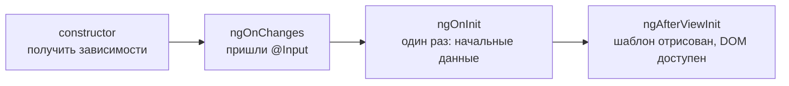
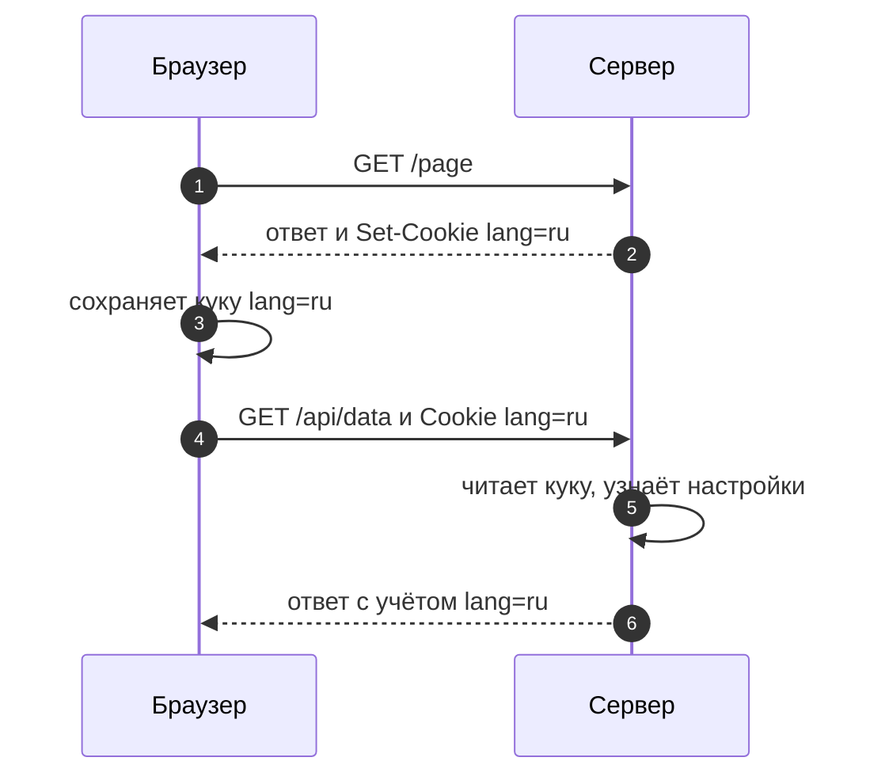

# 5_1 — Data Persistence: конспект

**Курс:** 3813ICT, неделя 5
**Источник:** `5_1-Data-persistence.pdf`
**Связанные файлы:** [поправки](5_1-data-persistence-popravki.md) · [примеры](5_1-data-persistence-primery.md) · [вопросы](5_1-data-persistence-voprosy.md) · [ответы](5_1-data-persistence-otvety.md)

> Значок **⚠** со ссылкой вида **П-N** ведёт в файл поправок. Там разобрано, где исходный материал курса расходится с тем, что написано в конспекте, и почему.

**Содержание**

1. [Что такое data persistence](#s1)
2. [Четыре хранилища браузера](#s2): [коротко о каждом](#s2-1) · [origin](#s2-2) · [сравнение](#s2-3) · [как выбрать](#s2-4)
3. [localStorage](#s3): [что это](#s3-1) · [особенности](#s3-2) · [методы](#s3-3) · [JSON](#s3-4) · [пример в Angular](#s3-5) · [DevTools](#s3-6) · [когда использовать](#s3-7)
4. [sessionStorage](#s4): [что это](#s4-1) · [сессия страницы](#s4-2) · [отличия](#s4-3) · [пример](#s4-4) · [когда использовать](#s4-5)
5. [Cookies](#s5): [зачем](#s5-1) · [что это](#s5-2) · [путь куки](#s5-3) · [применение](#s5-4) · [атрибуты](#s5-5) · [сессионные и постоянные](#s5-6) · [JavaScript](#s5-7) · [когда использовать](#s5-8)
6. [IndexedDB](#s6): [что это](#s6-1) · [особенности](#s6-2) · [как устроена](#s6-3) · [когда использовать](#s6-4)
7. [Безопасность](#s7): [главное правило](#s7-1) · [откуда угроза](#s7-2) · [правила для чата](#s7-3)
8. [Пригодится в заданиях](#s8)
9. [Ключевые факты](#s9)

---

<a id="s1"></a>

## 1. Что такое data persistence

Прежде чем говорить о хранилищах, разберёмся, какую проблему они решают. Представь: ты залогинился в чате, открыл канал и начал печатать сообщение. Потом случайно нажал F5 — и оказался на странице входа, а набранный текст исчез. Эта тема о том, почему так происходит и как сделать, чтобы так не было.

**Data persistence** (сохраняемость данных) — это сохранение состояния приложения так, чтобы оно пережило перезагрузку страницы, закрытие вкладки или повторный визит.

**Почему состояние теряется.** Angular-приложение — это SPA (single page application): браузер загружает одну HTML-страницу, а всё остальное — кто залогинен, какой канал открыт, что набрано в поле — хранится в переменных JavaScript, то есть в оперативной памяти вкладки. При перезагрузке эта память очищается целиком, и приложение стартует с нуля, ничего не помня.

**Где можно сохранить состояние.** Мест два:

- **на клиенте**, то есть в самом браузере пользователя, — этому посвящена эта тема;
- **на сервере**, в базе данных, — это следующие недели курса (MongoDB — неделя 8).

**А зачем хранить что-то в браузере, если есть сервер?** Не всё стоит отправлять на сервер. Черновик в одной вкладке, выбранная тема оформления, данные вошедшего пользователя, которые нужны интерфейсу сразу при загрузке, — всё это удобнее держать рядом, в браузере, без лишних запросов. А данные, которые должны быть доступны с любого устройства и другим пользователям (сообщения, группы, каналы), хранятся на сервере.

Браузер предлагает для этого четыре хранилища. Сначала познакомимся со всеми, а потом разберём каждое подробно.

---

<a id="s2"></a>

## 2. Четыре хранилища браузера

Хранилищ четыре, потому что у них разные задачи. Одни живут бессрочно, другие — пока открыта вкладка. Одни видит только браузер, другие автоматически уходят на сервер. Одни рассчитаны на пару строк, другие — на сотни мегабайт. Сначала коротко опишем каждое, затем разберём общее для всех понятие origin и сведём различия в таблицу.

<a id="s2-1"></a>

### 2.1 Коротко о каждом

- **localStorage** — постоянное хранилище пар «ключ → значение», где и ключ, и значение — строки. Данные живут, пока их не удалят, и видны во всех вкладках сайта. Самый частый выбор для настроек и данных вошедшего пользователя. Подробно — [§3](#s3).
- **sessionStorage** — такое же хранилище, но привязанное к одной вкладке: у каждой вкладки своё, и оно исчезает при её закрытии. Подходит для временных данных вроде черновика. Подробно — [§4](#s4).
- **Cookies (куки)** — маленькие записи «имя=значение», которые браузер хранит и **сам прикладывает к каждому запросу** на сервер. Нужны, когда данные должен получать сервер, например, чтобы узнать пользователя. Подробно — [§5](#s5).
- **IndexedDB** — полноценная база данных в браузере: хранит объекты, работает асинхронно, вмещает большие объёмы. Для офлайн-режима и больших наборов данных. Подробно — [§6](#s6).

**Про термины.** localStorage и sessionStorage вместе называют **Web Storage API**: у них общий набор методов. Куки — отдельный механизм протокола HTTP, IndexedDB — отдельный API. Общее название для всех четырёх — **клиентское хранение данных** (client-side storage). ⚠ [П-12](5_1-data-persistence-popravki.md#p-12)

<a id="s2-2"></a>

### 2.2 Ключевое понятие: origin

Во всех следующих разделах будет встречаться слово **origin**: от него зависит, какие данные видит страница. Поэтому разберёмся с ним сразу.

**Origin** — это «адрес сайта» с точки зрения браузера, составленный из трёх частей: **протокол + хост + порт**. Путь (всё, что после порта: `/groups`, `/api/users`) в origin не входит.

```
http://localhost:4200/groups/5
└┬─┘   └───┬───┘ └┬─┘└───┬───┘
протокол  хост  порт   путь (в origin не входит)
```

Два адреса имеют один origin, только если совпадают все три части. Вот как это выглядит на примерах:

| Адрес | Тот же origin, что `http://localhost:4200`? | Почему |
|---|---|---|
| `http://localhost:4200/login` | да | отличается только путь |
| `http://localhost:3000` | нет | другой порт |
| `https://localhost:4200` | нет | другой протокол |
| `http://127.0.0.1:4200` | нет | другой хост: для браузера это разные строки |

**Зачем это знать.** localStorage, sessionStorage и IndexedDB у каждого origin свои, и другие origin их не видят. Это защита: чужой сайт не может прочитать твои данные.

Но есть и практическое следствие для Phase 2. Во время разработки Angular работает на `localhost:4200` (`ng serve`), а Express — на `localhost:3000`. Это **два разных origin**, и у каждого свой localStorage. Если залогиниться на 4200, то на 3000 пользователь окажется незалогиненным. Это не баг кода, а устройство браузера. ⚠ [П-3](5_1-data-persistence-popravki.md#p-3)

У кук правило другое: они привязаны к домену и пути, но **не к порту**. Об этом — в [§5.2](#s5-2).

<a id="s2-3"></a>

### 2.3 Сравнение

Теперь, когда все четыре хранилища знакомы, сведём их различия в одну таблицу. Это итог того, что описано выше; каждая строка подробно разобрана в разделах 3–6.

| | localStorage | sessionStorage | Cookies | IndexedDB |
|---|---|---|---|---|
| **Что хранит** | строки | строки | строки (плюс атрибуты) | объекты, массивы, даты, файлы |
| **Объём** | ~5 МБ на origin | ~5 МБ на origin | ~4 КБ на одну куку | сотни МБ и больше |
| **Срок жизни** | бессрочно, пока не удалят | пока открыта вкладка | сессионная — до закрытия браузера; постоянная — до указанного срока | бессрочно, пока не удалят |
| **Область видимости** | origin, общая для всех вкладок | origin + одна вкладка | домен + путь, порт не учитывается | origin |
| **Уходит на сервер** | нет | нет | да, автоматически с каждым запросом | нет |
| **Кто имеет доступ** | JS на странице | JS на странице | JS (кроме `HttpOnly`) и сервер | JS на странице |
| **API** | синхронный | синхронный | строка `document.cookie` и HTTP-заголовки | асинхронный |

**Как читать строки таблицы:**

- **Область видимости** — какие страницы видят данные. «Origin» означает все страницы с тем же протоколом, хостом и портом ([§2.2](#s2-2)).
- **Уходит на сервер** — отправляет ли браузер данные сам, без участия твоего кода.
- **Синхронный API** — операция выполняется сразу и блокирует остальной код, пока не закончится. **Асинхронный** — результат приходит позже, а страница в это время продолжает работать.

<a id="s2-4"></a>

### 2.4 Как выбрать хранилище

Чтобы выбрать подходящее хранилище, нужно определиться с целью данных и их особенностями: кто должен их читать, сколько они должны жить, где их должно быть видно и сколько их. Удобно задать себе четыре вопроса по порядку:

1. **Должен ли сервер получать эти данные с каждым запросом?** Если да — кука. Если при этом JavaScript не должен её видеть — кука с `HttpOnly`.
2. **Данных много, нужны объекты, поиск или работа офлайн?** Если да — IndexedDB.
3. **Данные нужны только в этой вкладке?** Если да — sessionStorage.
4. **Во всех остальных случаях** — localStorage.

Отдельное правило, которое стоит над этой схемой: пароли и секретные данные не хранят в браузере вообще ([§7](#s7)).

Наглядная схема выбора — в [примерах](5_1-data-persistence-primery.md#ex-0).

---

<a id="s3"></a>

## 3. localStorage

Начнём с localStorage — самого простого и самого используемого хранилища. Разобравшись с ним, ты почти автоматически поймёшь sessionStorage: у них один и тот же набор методов.

<a id="s3-1"></a>

### 3.1 Что такое localStorage

**localStorage** — это постоянное хранилище браузера, в котором сайт сохраняет пары «ключ → значение» в виде строк. Данные остаются после перезагрузки, закрытия вкладки и даже перезапуска браузера, пока их явно не удалят.

Удобно представлять localStorage как словарь, привязанный к сайту:

```
localStorage (для http://localhost:4200)
├── "theme"       → "dark"
├── "currentUser" → "{\"id\":2,\"username\":\"anna\",\"role\":\"groupadmin\"}"
└── "lastChannel" → "5"
```

Ключи и значения — всегда строки. Даже пользователь хранится как строка в формате JSON; как это делается — в [§3.4](#s3-4).

<a id="s3-2"></a>

### 3.2 Особенности localStorage

У localStorage есть несколько особенностей, которые определяют, что в нём можно хранить и как с ним работать.

- **Бессрочное хранение.** Срока истечения нет: данные живут, пока их не удалит твой код или пользователь (очисткой данных сайта или через DevTools). Гарантии вечного хранения всё же нет: при острой нехватке места на диске браузер может удалить данные сайтов.
- **Общий для всех вкладок одного origin.** Записал в одной вкладке — прочитал в другой. Другой origin, в том числе тот же хост на другом порту, это хранилище не видит ([§2.2](#s2-2)).
- **Объём около 5 МБ на origin.** Точного значения стандарт не задаёт, оно зависит от браузера. Для настроек и данных пользователя этого с запасом, для тысяч сообщений — нет (для этого IndexedDB, [§6](#s6)).
- **Только строки.** Всё, что кладёшь, хранится как строка. Объекты, числа и булевы значения требуют преобразования — подробно в [§3.4](#s3-4).
- **Синхронный API.** Каждая операция выполняется сразу и блокирует остальной код, пока не закончится. Для одной записи это незаметно, но большие объёмы или тысячи операций подряд заставят страницу подвисать.
- **Доступ только из JavaScript в браузере.** На сервер localStorage сам по себе не отправляется. Если серверу нужно значение, твой код должен явно отправить его в запросе. В этом главное отличие от кук ([§5](#s5)).
- **Не для секретов.** Любой скрипт, выполняющийся на странице, может прочитать всё содержимое. Пароли и токены здесь не хранят ([§7](#s7)).

Как же работать с этим хранилищем из кода? Для этого у него есть небольшой набор методов.

<a id="s3-3"></a>

### 3.3 Методы

Вот какими методами обладает localStorage. Точно такие же есть у sessionStorage: оба реализуют один и тот же Web Storage API, поэтому всё, что ниже, работает и для него.

| Действие | Код | Что стало в хранилище | Что возвращает |
|---|---|---|---|
| Записать строку | `localStorage.setItem('theme', 'dark')` | появилась запись `theme → "dark"` | `undefined` |
| Перезаписать | `localStorage.setItem('theme', 'light')` | значение `theme` заменено на `"light"` | `undefined` |
| Записать объект | `localStorage.setItem('user', JSON.stringify(user))` | лежит строка `'{"id":2,"username":"anna"}'` | `undefined` |
| Прочитать | `localStorage.getItem('theme')` | без изменений | `"light"` |
| Прочитать несуществующий ключ | `localStorage.getItem('nope')` | без изменений | `null` |
| Прочитать объект | `JSON.parse(localStorage.getItem('user'))` | без изменений | объект `{ id: 2, username: 'anna' }` |
| Удалить запись | `localStorage.removeItem('theme')` | записи `theme` больше нет | `undefined` |
| Очистить всё | `localStorage.clear()` | все записи этого origin удалены | `undefined` |
| Узнать количество | `localStorage.length` | без изменений | число записей, например `2` |
| Ключ по номеру | `localStorage.key(0)` | без изменений | имя ключа или `null` |

Обрати внимание: отдельного метода «изменить» нет. Запись и перезапись — это один и тот же `setItem`, хранилище не различает, был ключ раньше или нет.

**Особенности имён методов.** Все имена пишутся в camelCase, с заглавной `I` в слове `Item`: `setItem`, `getItem`, `removeItem`. JavaScript чувствителен к регистру, поэтому `setitem` — несуществующий метод, и вызов упадёт с ошибкой `TypeError: localStorage.setitem is not a function`. Код со слайдов PDF лучше набирать руками: при копировании вместе с ним переносятся типографские кавычки `“ ”`, которые JavaScript не считает кавычками. ⚠ [П-1](5_1-data-persistence-popravki.md#p-1)

Вот пример того, как выглядит полный цикл работы с хранилищем: запись, перезапись, чтение, перебор и удаление.

```js
// Запись: в хранилище появляется theme → "dark"
localStorage.setItem('theme', 'dark');

// Перезапись: тот же метод, значение заменено на "light"
localStorage.setItem('theme', 'light');

// Чтение: строка, если ключ есть, и null, если нет
const theme = localStorage.getItem('theme');   // 'light'
const nothing = localStorage.getItem('nope');  // null

// Перебор всех записей через length и key(i)
for (let i = 0; i < localStorage.length; i++) {
  const key = localStorage.key(i);
  console.log(key, '→', localStorage.getItem(key));
}

// Удаление одной записи
localStorage.removeItem('theme');

// Полная очистка: удаляет ВСЁ, что этот origin хранил в localStorage.
// В реальном коде обычно удаляют конкретные ключи через removeItem
localStorage.clear();
```

<a id="s3-4"></a>

### 3.4 Объекты, числа и булевы значения: работа через JSON

Мы уже упоминали, что localStorage хранит только строки. Разберём, что это значит на практике: это самая частая ловушка при работе с ним.

**Что происходит с не-строкой.** Если передать в `setItem` не строку, браузер не выдаст ошибку, а молча превратит значение в строку. Результат часто не тот, которого ждёшь:

| Что передали | Что сохранилось | Что вернёт `getItem` |
|---|---|---|
| `{ id: 2, username: 'anna' }` | `"[object Object]"` | `"[object Object]"` — данные потеряны |
| `[1, 2, 3]` | `"1,2,3"` | строка, а не массив |
| `42` | `"42"` | строка `"42"`, а не число |
| `false` | `"false"` | строка `"false"`, которая в `if` считается истиной |
| `null` | `"null"` | строка `"null"`, а не `null` |

**Как на это реагирует TypeScript.** В TypeScript `setItem` принимает только `string`, поэтому передать объект не даст сам компилятор — ошибка появится ещё до запуска. В обычном JavaScript (или если тип обойдён через `any`) данные испортятся без предупреждения. ⚠ [П-2](5_1-data-persistence-popravki.md#p-2)

**Как хранить объект правильно.** Объект превращают в строку формата JSON при записи и обратно в объект при чтении:

- запись: `JSON.stringify(объект)` → строка `'{"id":2,…}'`;
- чтение: `JSON.parse(строка)` → снова объект.

**А почему localStorage не умеет хранить объекты сразу?** Web Storage задуман как простое строковое хранилище «ключ → значение». Для хранения объектов «как есть» существует IndexedDB ([§6](#s6)).

**Две ситуации, которые нужно учесть при чтении:**

- ключа может не быть — `getItem` вернёт `null`;
- строку могли испортить, например, отредактировав руками в DevTools, — тогда `JSON.parse` бросит исключение.

Вот пример того, как безопасно сохранить и прочитать пользователя, а заодно правильно работать с числами и булевыми значениями:

```ts
interface User {
  id: number;
  username: string;
  role: 'superadmin' | 'groupadmin' | 'user';
}

const user: User = { id: 2, username: 'anna', role: 'groupadmin' };

// Запись: объект → JSON-строка
localStorage.setItem('user', JSON.stringify(user));
// в хранилище: '{"id":2,"username":"anna","role":"groupadmin"}'

// Чтение: строка → объект, с двумя проверками
function readUser(): User | null {
  const raw = localStorage.getItem('user');
  if (raw === null) return null;           // 1) ключа нет
  try {
    return JSON.parse(raw) as User;
  } catch {
    localStorage.removeItem('user');       // 2) строка испорчена — удаляем
    return null;
  }
}

// Числа: при записи String(), при чтении Number()
localStorage.setItem('unreadCount', String(5));
const unread = Number(localStorage.getItem('unreadCount') ?? 0); // 5 — число

// Булевы: сравниваем со строкой 'true'
localStorage.setItem('muted', String(false));
const muted = localStorage.getItem('muted') === 'true';         // false
// ❌ if (localStorage.getItem('muted')) { ... } — ошибка: строка "false" считается истиной
```

Одно уточнение про `as User`: это не проверка данных, а подсказка компилятору, какой тип ожидать. Если в хранилище окажется объект другой формы, TypeScript этого не заметит.

<a id="s3-5"></a>

### 3.5 Пример из материала: localStorage в Angular-компоненте

Теперь посмотрим, как localStorage используют внутри Angular-приложения. Вот как пример выглядит в материале курса:

```ts
import { Component,OnInit } from '@angular/core';

@Component({
  selector: 'app-root',
  templateUrl: './app.component.html',
  styleUrls: ['./app.component.css']
})
export class AppComponent implements OnInit{
  title = 'datapersistence';

  ngOnInit(){
    console.log("Testing if DOM is ready");

    if (typeof(Storage) !== "undefined"){
      console.log('Storage ready');
      localStorage.setItem("lastname","Smith");
      console.log(localStorage.getItem("lastname"));
    }else{
      console.log("No storage Support");
    }
  }
}
```

**Что в нём происходит.** Компонент `AppComponent` реализует интерфейс `OnInit`, поэтому Angular вызывает его метод `ngOnInit()`. Внутри метод выводит в консоль сообщение, проверяет, определён ли в браузере объект `Storage`, и если да — записывает строку `Smith` под ключом `lastname`, читает её обратно и выводит. В консоли появляются три строки: `Testing if DOM is ready`, `Storage ready` и `Smith`.

Чтобы понять, почему работа с хранилищем находится именно в `ngOnInit`, и чем отличается исправленная версия ниже, сначала разберёмся, что такое `ngOnInit`.

**А что такое ngOnInit и почему не constructor?** У каждого компонента Angular есть жизненный цикл: Angular создаёт его, передаёт входные данные, отрисовывает шаблон, обновляет и в конце уничтожает. На ключевых этапах Angular вызывает специальные методы компонента — **хуки жизненного цикла** (lifecycle hooks). Вот первые из них по порядку:



- **`constructor`** — создание объекта. Здесь только получают зависимости (сервисы).
- **`ngOnInit`** — вызывается один раз, после того как Angular установил входные свойства компонента (`@Input`). Шаблон в этот момент ещё **не** отрисован. Это место для начальной загрузки данных: чтения хранилища, запросов на сервер. ⚠ [П-4](5_1-data-persistence-popravki.md#p-4)
- **`ngAfterViewInit`** — вызывается после первой отрисовки шаблона. Только здесь доступны его элементы, например чтобы поставить фокус в поле ввода.

Для localStorage шаблон не нужен: хранилище — это API браузера, а не часть страницы. Поэтому работа с ним естественно ложится в `ngOnInit`.

Вот исправленная версия примера:

```ts
import { Component, OnInit } from '@angular/core';

@Component({
  selector: 'app-root',
  templateUrl: './app.component.html',
  styleUrl: './app.component.css', // Angular 17+: один файл стилей; styleUrls: [...] тоже работает
})
export class AppComponent implements OnInit {
  title = 'datapersistence';

  ngOnInit(): void {
    try {
      localStorage.setItem('lastname', 'Smith');
      const lastname = localStorage.getItem('lastname');
      console.log(lastname); // Smith
    } catch (e) {
      // Место закончилось или пользователь запретил сайтам хранить данные
      console.warn('Хранилище недоступно', e);
    }
  }
}
```

**Какая последовательность?**

1. **Angular создаёт компонент** `AppComponent` — вызывает `constructor`.
   1. Конструктор нужен только для получения зависимостей. У этого компонента их нет, поэтому конструктор не написан.
2. **Angular устанавливает входные свойства** (`@Input`).
   1. У корневого компонента их нет, поэтому шаг проходит незаметно.
3. **Angular вызывает `ngOnInit()`** — один раз за всю жизнь компонента.
   1. Шаблон `app.component.html` ещё не отрисован.
   2. Для localStorage это неважно: хранилище доступно всё время, пока открыта страница.
4. **Блок `try`** — основная работа с хранилищем.
   1. `setItem('lastname', 'Smith')` — в localStorage текущего origin появляется запись `lastname → "Smith"`. Если такой ключ уже был, значение перезаписывается.
   2. `getItem('lastname')` — возвращает строку `"Smith"`.
   3. `console.log` выводит `Smith`.
5. **Блок `catch`** — срабатывает только при сбое.
   1. `QuotaExceededError` — в хранилище закончилось место.
   2. `SecurityError` — пользователь запретил сайтам хранить данные.
   3. Приложение не падает: ошибка перехвачена, в консоль уходит предупреждение.
6. **Angular отрисовывает шаблон** и продолжает работу. Запись осталась в хранилище и переживёт F5 — её видно в DevTools ([§3.6](#s3-6)).

**Чем исправленная версия отличается от исходной:**

- проверка `typeof(Storage)` заменена на `try/catch`: Web Storage поддерживают все браузеры, а реальные сбои — это исключения при записи ⚠ [П-5](5_1-data-persistence-popravki.md#p-5);
- `styleUrls` (массив) заменён на `styleUrl` — сокращённую форму для одного файла стилей в Angular 17+;
- добавлен тип возвращаемого значения `: void` и приведены к единому стилю кавычки.

Если проект создан с серверным рендерингом (SSR), на сервере localStorage нет, и понадобится ещё проверка платформы — как это сделать, показано в [П-5](5_1-data-persistence-popravki.md#p-5).

<a id="s3-6"></a>

### 3.6 Где посмотреть содержимое

Чтобы проверить, что на самом деле лежит в хранилище, не нужно писать код: всё видно в инструментах разработчика. Открой DevTools → вкладка **Application** → раздел **Storage** → **Local Storage** → нужный origin. Там можно смотреть, редактировать и удалять записи вручную — это удобно при отладке.

<a id="s3-7"></a>

### 3.7 Когда использовать

localStorage подходит для данных, которые должны пережить закрытие браузера и быть одинаковыми во всех вкладках сайта:

- данные вошедшего пользователя (`id`, `username`, `role`, но не пароль);
- настройки интерфейса: тема, язык, свёрнутые панели;
- последнее открытое место, например последний канал чата;
- небольшой кэш, который не страшно потерять.

И не подходит для:

- паролей и секретных токенов ([§7](#s7));
- больших объёмов данных ([§6](#s6));
- данных, которые сервер должен получать сам ([§5](#s5)).

---

<a id="s4"></a>

## 4. sessionStorage

localStorage хранит данные бессрочно и показывает их всем вкладкам. Но бывают данные, которые нужны только «здесь и сейчас», например черновик сообщения в одной вкладке. Если положить его в localStorage, он появится во всех вкладках и останется навсегда. Для таких случаев есть sessionStorage.

<a id="s4-1"></a>

### 4.1 Что такое sessionStorage

**sessionStorage** — хранилище браузера с тем же API, что у localStorage, но его данные привязаны к одной вкладке и живут, пока длится сессия страницы в этой вкладке.

Всё, что сказано в [§3.2](#s3-2) про строки, объём, синхронность и безопасность, верно и для sessionStorage. Отличаются только срок жизни и область видимости, и чтобы их понять, нужно разобраться, что такое «сессия страницы».

<a id="s4-2"></a>

### 4.2 Что такое «сессия страницы»

**Сессия страницы** — это время жизни одной вкладки браузера на одном origin: она начинается, когда вкладка открывает сайт, и заканчивается, когда эту вкладку закрывают.

Из этого определения следует, как sessionStorage ведёт себя в разных ситуациях:

- **перезагрузка (F5)** и переходы по страницам того же сайта в этой вкладке — сессия продолжается, данные на месте;
- **закрытие вкладки** — сессия заканчивается, данные удаляются, даже если браузер остался открыт ⚠ [П-6](5_1-data-persistence-popravki.md#p-6);
- **новая вкладка или окно**, открытые вручную, — начинают новую, пустую сессию;
- **ссылка, открытая в новой вкладке**, в современных браузерах, как правило, тоже получает пустую сессию;
- **«Дублировать вкладку»** — новая вкладка получает **копию** данных на момент дублирования, дальше копии живут независимо;
- **восстановление закрытой вкладки** (Ctrl+Shift+T) или сессии браузера после перезапуска — данные могут вернуться.

<a id="s4-3"></a>

### 4.3 Важные отличия sessionStorage от localStorage

У sessionStorage и localStorage один API, поэтому отличий всего два, но оба принципиальные:

1. **Срок жизни.** localStorage хранит данные бессрочно, sessionStorage — пока открыта вкладка.
2. **Область видимости.** localStorage общий для всех вкладок одного origin, а у каждой вкладки свой sessionStorage.

Вот как эти отличия проявляются в разных ситуациях:

| Ситуация | localStorage | sessionStorage |
|---|---|---|
| Другая вкладка того же сайта | видит те же данные | своё, пустое хранилище |
| Перезагрузка (F5) | данные на месте | данные на месте |
| Закрытие вкладки | данные на месте | удалены |
| Закрытие браузера | данные на месте | удалены (если сессия не восстанавливается) |
| Дублирование вкладки | видит те же данные | копия на момент дублирования |

<a id="s4-4"></a>

### 4.4 Методы и пример

Методы у sessionStorage те же, что у localStorage ([§3.3](#s3-3)): `setItem`, `getItem`, `removeItem`, `clear`, `length`, `key`. Правило про строки и JSON ([§3.4](#s3-4)) тоже действует.

Вот пример того, как sessionStorage и localStorage ведут себя в двух вкладках одного сайта:

```js
// ── Вкладка A (http://localhost:4200) ──
sessionStorage.setItem('draft:1', 'Привет, как дела');
localStorage.setItem('theme', 'dark');

// ── Вкладка B: открыли вручную тот же адрес ──
sessionStorage.getItem('draft:1'); // null — у вкладки B своё хранилище
localStorage.getItem('theme');     // 'dark' — localStorage общий для всех вкладок

// ── Вкладка A: нажали F5 ──
sessionStorage.getItem('draft:1'); // 'Привет, как дела' — пережило перезагрузку

// ── Вкладку A закрыли, браузер открыт ──
// черновик вкладки A удалён, 'theme' в localStorage на месте
```

<a id="s4-5"></a>

### 4.5 Когда использовать

sessionStorage подходит для всего, что относится только к текущей вкладке и может исчезнуть вместе с ней:

- черновик сообщения в канале (у каждой вкладки свой);
- наполовину заполненная форма, которую жалко потерять при случайном F5;
- текущий шаг многошагового мастера;
- временный выбор фильтра или сортировки на странице.

Полный пример с черновиками для чата — в [примерах, пример 2](5_1-data-persistence-primery.md#ex-2).

---

<a id="s5"></a>

## 5. Cookies

localStorage и sessionStorage живут только в браузере: сервер о них ничего не знает, пока твой код сам не отправит ему данные. Но есть задача, для которой нужно, чтобы данные уходили на сервер **автоматически**: сервер должен узнавать пользователя при каждом запросе. Для этого существуют куки. Чтобы понять, зачем они вообще появились, начнём с того, как устроен HTTP.

<a id="s5-1"></a>

### 5.1 Зачем появились куки

HTTP — протокол **без состояния** (stateless). Это значит, что каждый запрос обрабатывается сам по себе: сервер ответил, соединение закрылось, и сервер «забыл» клиента. Следующий запрос от того же человека для сервера — запрос от незнакомца.

Представь гардероб, где гардеробщик никого не запоминает в лицо. Чтобы забрать куртку, ты показываешь номерок, который он тебе выдал. Куки работают так же: сервер выдаёт браузеру «номерок», браузер хранит его и показывает при каждом следующем запросе, и сервер понимает, кто пришёл.

Именно эту задачу — «как узнать пользователя при следующем запросе» — куки и решают. Раньше их использовали и как общее клиентское хранилище, но сейчас для этого предпочитают localStorage, sessionStorage и IndexedDB: куки уходят с каждым запросом и создают лишний трафик.

<a id="s5-2"></a>

### 5.2 Что такое кука

**Кука (cookie)** — это небольшая запись «имя=значение», которую браузер хранит для сайта и автоматически прикладывает к каждому подходящему запросу на этот сайт.

Главные особенности куки:

- **Маленький размер** — до ~4 КБ на одну куку, считая имя, значение и атрибуты. Слишком большую куку браузер молча не сохранит. ⚠ [П-8](5_1-data-persistence-popravki.md#p-8)
- **Отправляется автоматически** с каждым подходящим запросом — к API, картинкам, стилям. Поэтому куки держат маленькими: каждый лишний байт умножается на каждый запрос.
- **Создать может сервер или JavaScript.** Сервер — заголовком ответа `Set-Cookie`, JavaScript на странице — через `document.cookie`, если сервер не запретил JS доступ атрибутом `HttpOnly`.
- **Хранит браузер** — во внутренней базе своего профиля.
- **Область — домен и путь, но не порт.** Кука, поставленная для `localhost`, видна на любом порту `localhost`. Этим куки отличаются от localStorage и sessionStorage, которые привязаны к origin целиком ([§2.2](#s2-2)).

<a id="s5-3"></a>

### 5.3 Как куки путешествуют между сервером и браузером

Теперь посмотрим, как кука попадает в браузер и возвращается на сервер. Обмен идёт через два HTTP-заголовка:

1. Браузер отправляет запрос на сервер.
2. Сервер отвечает и добавляет к ответу заголовок `Set-Cookie` — «сохрани эту куку».
3. Браузер сохраняет куку.
4. Во всех следующих подходящих запросах браузер сам добавляет заголовок `Cookie` с сохранёнными куками. Твой код для этого ничего не делает.

Вот как это выглядит на уровне заголовков:

```
← ответ сервера:    Set-Cookie: lang=ru; Max-Age=604800; Path=/; SameSite=Lax
→ следующий запрос: Cookie: lang=ru
```

И то же самое на схеме:



Как сервер ставит куки на Express, показано в [примерах, пример 3](5_1-data-persistence-primery.md#ex-3).

<a id="s5-4"></a>

### 5.4 Для чего используют куки

Благодаря тому, что кука сама уходит на сервер, у неё три основных применения:

- **Управление сессией** — всё, что сервер должен помнить о пользователе между запросами: вход в аккаунт, корзина покупок. Обычно в куке лежит только идентификатор сессии, а сами данные — на сервере.
- **Персонализация** — настройки, которые сервер учитывает при ответе: язык, тема оформления.
- **Трекинг** — аналитика и реклама: запись того, как пользователь перемещается по сайтам.

<a id="s5-5"></a>

### 5.5 Атрибуты

Кука — это не только имя и значение. После них через точку с запятой можно указать **атрибуты**: они задают, сколько кука живёт, куда отправляется и кто может её читать.

```
theme=dark; Max-Age=604800; Path=/; Secure; HttpOnly; SameSite=Lax
└───┬────┘  └────────────────────── атрибуты ─────────────────────┘
имя=значение
```

Вот что делает каждый атрибут: ⚠ [П-10](5_1-data-persistence-popravki.md#p-10)

| Атрибут | Что делает | Кто может поставить |
|---|---|---|
| `Expires` | дата, после которой кука удаляется | сервер и JS |
| `Max-Age` | срок жизни в секундах; важнее `Expires`, если указаны оба | сервер и JS |
| `Secure` | кука передаётся только по HTTPS | сервер и JS (на https-странице) |
| `HttpOnly` | кука не видна JavaScript | только сервер |
| `Domain` | расширяет область на домен и все его поддомены | сервер и JS |
| `Path` | ограничивает пути, на которые уходит кука | сервер и JS |
| `SameSite` | уходит ли кука с запросами, которые инициировал другой сайт | сервер и JS |

Три группы атрибутов стоит разобрать подробнее.

**Срок жизни: `Expires` и `Max-Age`.** `Expires` задаёт точную дату удаления, `Max-Age` — срок в секундах от текущего момента. Если указаны оба, действует `Max-Age`. Браузеры ограничивают максимальный срок: например, Chrome — 400 днями. Без обоих атрибутов кука становится сессионной ([§5.6](#s5-6)).

**Куда уходит кука: `Domain` и `Path`.**

- Без `Domain` кука отправляется только на тот хост, который её поставил. С `Domain=example.com` — на `example.com` **и все его поддомены**. То есть `Domain` расширяет область, а не сужает её.
- `Path` сопоставляется по началу пути: `Path=/api` отправит куку на `/api` и `/api/users`, но не на `/apix` и не на `/`. Если `Path` не указан, браузер берёт «папку» текущего адреса, поэтому обычно явно пишут `Path=/`.

**Безопасность: `Secure`, `HttpOnly`, `SameSite`.**

- `Secure` — кука передаётся только по HTTPS, её нельзя перехватить в незашифрованном канале.
- `HttpOnly` — JavaScript не видит куку вообще, поэтому вредоносный скрипт на странице не может её украсть ([§7](#s7)). Поставить такую куку может только сервер.
- `SameSite` отвечает на вопрос «отправлять ли куку с запросом, который инициировал другой сайт»:
  - `Strict` — только с запросами, инициированными этим же сайтом;
  - `Lax` — плюс обычный переход по ссылке с чужого сайта;
  - `None` — всегда, включая запросы с чужих сайтов; обязательно вместе с `Secure`.

  Chrome и Edge считают куку без `SameSite` как `Lax`; в других браузерах поведение по умолчанию может отличаться, поэтому атрибут лучше указывать явно. Зачем он нужен — в [§7.2](#s7-2) (CSRF).

<a id="s5-6"></a>

### 5.6 Сессионные и постоянные куки

По сроку жизни куки делятся на два вида, и от этого зависит, переживёт ли кука закрытие браузера.

- **Сессионная кука** (session cookie) — кука без `Expires` и `Max-Age`. Живёт до конца **сеанса браузера**, то есть до закрытия браузера целиком. Закрытие вкладки её **не** удаляет. Если в браузере включено «Продолжить с того же места», он может сохранять сессионные куки и между перезапусками. ⚠ [П-7](5_1-data-persistence-popravki.md#p-7)
- **Постоянная кука** (persistent cookie) — кука с `Expires` или `Max-Age`. Живёт до указанного срока и переживает закрытие браузера.

Иногда отдельно называют **безопасную куку** (secure cookie) — это не отдельный срок жизни, а кука с атрибутом `Secure`. Она бывает и сессионной, и постоянной.

**Почему и sessionStorage, и сессионная кука называются «session», если ведут себя по-разному?** Потому что слово «сессия» в них означает разное: у sessionStorage это жизнь одной вкладки, у сессионной куки — сеанс всего браузера. Вот как они сравниваются:

| | sessionStorage | Сессионная кука |
|---|---|---|
| Что такое «сессия» | жизнь одной вкладки | сеанс всего браузера |
| Закрыли вкладку | удалено | **осталась** |
| Закрыли браузер | удалено | удалена (если сеанс не восстанавливается) |
| Видна другим вкладкам | нет | да |
| Уходит на сервер | нет | да, с каждым запросом |

<a id="s5-7"></a>

### 5.7 Работа с куками из JavaScript

Из JavaScript с куками работают через свойство `document.cookie`. Оно устроено непривычно: запись и чтение ведут себя по-разному.

- **Запись.** Присваивание `document.cookie = 'имя=значение; атрибуты'` добавляет или обновляет **одну** куку. Остальные куки не трогаются, хотя по синтаксису это похоже на перезапись.
- **Чтение.** `document.cookie` возвращает одну строку со всеми доступными куками вида `"lang=ru; theme=dark"` — только имена и значения, без атрибутов. Её нужно разбирать самому. Куки с `HttpOnly` в этой строке не появляются.
- **Удаление.** Отдельного метода нет. Нужно записать ту же куку с истёкшим сроком (`max-age=0`) и **тем же `path`** (и `domain`, если он был), что при создании. Иначе браузер сочтёт это другой кукой.
- **Спецсимволы.** Пробел, `;`, `=` и кириллица ломают строку куки, поэтому значение кодируют через `encodeURIComponent`, а при чтении декодируют.

Вот пример того, как записать, прочитать и удалить куки из JavaScript: ⚠ [П-9](5_1-data-persistence-popravki.md#p-9)

```js
// Сессионная кука: без срока, удалится при закрытии браузера
document.cookie = 'lang=ru; path=/';

// Постоянная кука на 7 дней: max-age в секундах
document.cookie = `theme=dark; max-age=${60 * 60 * 24 * 7}; path=/; SameSite=Lax`;

// То же через expires: дату вычисляем в коде, а не пишем руками
const expires = new Date(Date.now() + 7 * 24 * 60 * 60 * 1000).toUTCString();
document.cookie = `theme=dark; expires=${expires}; path=/; SameSite=Lax`;

// Значение со спецсимволами кодируем
document.cookie = `nick=${encodeURIComponent('Антон; admin')}; path=/`;

// Чтение: одна строка со всеми куками, без атрибутов
console.log(document.cookie); // "lang=ru; theme=dark; nick=%D0%90..."

// Функция чтения одной куки по имени
function getCookie(name) {
  const pair = document.cookie
    .split('; ')                                // ['lang=ru', 'theme=dark', ...]
    .find((row) => row.startsWith(name + '=')); // нужная пара или undefined
  return pair ? decodeURIComponent(pair.slice(name.length + 1)) : null;
}
getCookie('nick'); // 'Антон; admin'
getCookie('nope'); // null

// Удаление: max-age=0 и ТОТ ЖЕ path, что при создании
document.cookie = 'theme=; max-age=0; path=/';
```

Для Angular есть сторонняя библиотека `ngx-cookie-service` — обёртка над `document.cookie` с методами `get`, `set`, `check` и `delete`. Встроенного сервиса для кук в Angular нет. Пример с ней — в [примерах, пример 4](5_1-data-persistence-primery.md#ex-4).

<a id="s5-8"></a>

### 5.8 Когда использовать

Куки выбирают, когда значение должен получать **сервер**, причём без участия твоего кода:

- идентификатор сессии, по которому сервер узнаёт пользователя (кука с `HttpOnly`, `Secure` и `SameSite`);
- настройки, от которых зависит ответ сервера: язык, тема.

Если серверу значение не нужно, лучше localStorage или sessionStorage: кука будет зря уходить с каждым запросом.

---

<a id="s6"></a>

## 6. IndexedDB

Все хранилища выше рассчитаны на небольшие данные: строки, несколько мегабайт, синхронный доступ. Но что если приложению нужно хранить тысячи сообщений, чтобы чат открывался мгновенно и работал без интернета? Строковое хранилище на 5 МБ для этого не годится. Для таких задач в браузере есть настоящая база данных — IndexedDB.

<a id="s6-1"></a>

### 6.1 Что такое IndexedDB

**IndexedDB** — это встроенная в браузер NoSQL-база данных для больших объёмов структурированных данных: она хранит JavaScript-объекты по ключу и работает асинхронно.

«NoSQL» означает, что здесь нет таблиц и SQL-запросов, как в MySQL. Вместо таблиц — хранилища объектов (object stores), а вместо строк таблицы — сами объекты.

<a id="s6-2"></a>

### 6.2 Особенности IndexedDB

Вот чем IndexedDB отличается от localStorage и почему она подходит для больших данных:

- **Хранит объекты как есть** — массивы, даты, файлы, вложенные структуры — без `JSON.stringify`. Дата, сохранённая как `Date`, и прочитается как `Date`.
- **Асинхронная.** Операции не блокируют страницу: запрос отправлен, страница работает дальше, результат приходит позже через событие или промис.
- **Большой объём** — сотни мегабайт и больше, ограничен в основном свободным местом на диске.
- **Транзакции** — несколько операций выполняются как одно целое: либо все, либо ни одна.
- **Индексы** — искать объекты можно не только по ключу, но и по другим полям (например, все сообщения канала 3).
- **Привязана к origin**, как localStorage: другие сайты доступа к базе не имеют. ⚠ [П-12](5_1-data-persistence-popravki.md#p-12)

<a id="s6-3"></a>

### 6.3 Как устроена работа с IndexedDB

Чтобы читать код, работающий с IndexedDB, нужно знать пять понятий:

- **База данных** — открывается по имени, например `'NotesDB'`. У одного origin может быть несколько баз.
- **Версия** — число. Структуру базы (какие хранилища и индексы в ней есть) можно менять только при повышении версии.
- **Хранилище объектов** (object store) — аналог таблицы, например `notes` или `messages`.
- **Ключ** — уникальный идентификатор объекта в хранилище. Часто это поле `id` самого объекта (`keyPath: 'id'`); с `autoIncrement: true` его назначает сама база.
- **Транзакция** — рамка, внутри которой выполняются операции чтения и записи.

Встроенный API IndexedDB работает на событиях и довольно многословен (его пример есть в [П-12](5_1-data-persistence-popravki.md#p-12)). Поэтому часто используют небольшую стороннюю библиотеку `idb` (`npm install idb`), которая переводит его на промисы. Вот пример того, как с её помощью открыть базу, добавить объект и прочитать все объекты (код выполняется внутри `async`-функции):

```ts
import { openDB } from 'idb';

// Открыть базу "NotesDB" версии 1. upgrade вызывается только при создании базы
// или при повышении версии — и только в нём можно создавать хранилища
const db = await openDB('NotesDB', 1, {
  upgrade(db) {
    db.createObjectStore('notes', { keyPath: 'id', autoIncrement: true });
  },
});

// Добавить объект как есть — без JSON.stringify. База вернёт назначенный id
const id = await db.add('notes', { text: 'Купить молоко', createdAt: new Date() });

// Прочитать все объекты хранилища
const notes = await db.getAll('notes');
console.log(notes[0].createdAt instanceof Date); // true — тип Date сохранился
```

Полный пример сервиса и компонента на Angular — в [примерах, пример 5](5_1-data-persistence-primery.md#ex-5).

<a id="s6-4"></a>

### 6.4 Когда использовать

IndexedDB выбирают, когда данных много или приложение должно работать без сервера:

- офлайн-кэш сообщений, чтобы чат открывался мгновенно;
- большие наборы структурированных данных с поиском по полям;
- файлы и изображения, которые нужно хранить на клиенте;
- приложения, которые должны работать без интернета.

Для пары настроек IndexedDB избыточна — там проще localStorage.

---

<a id="s7"></a>

## 7. Безопасность

Мы разобрались, где хранить данные. Осталось понять, что хранить **нельзя** и почему: иначе удобное хранилище превращается в дыру в безопасности. Для этого нужно понимать, откуда вообще может прийти угроза.

<a id="s7-1"></a>

### 7.1 Главное правило

**Пароли, секретные токены и чувствительные данные (личные данные пользователей, данные из базы) не хранят ни в одном клиентском хранилище.**

Причина простая: всё, что лежит в браузере, доступно пользователю этого браузера (через DevTools) и любому скрипту, который выполняется на странице. Браузер — это территория пользователя, а не твоя.

<a id="s7-2"></a>

### 7.2 Откуда берётся угроза

Частое заблуждение — будто данные из localStorage могут «украсть другие сайты». Разберём, как обстоит дело на самом деле. ⚠ [П-11](5_1-data-persistence-popravki.md#p-11)

- **Same-origin policy** (политика одного источника) — встроенная защита браузера: страница одного origin не может прочитать хранилища и куки другого origin. Поэтому чужой сайт, открытый в соседней вкладке, **не может** напрямую прочитать твой localStorage.
- **XSS** (межсайтовый скриптинг) — главная реальная угроза для всех хранилищ. Это ситуация, когда чужой скрипт выполняется **внутри твоего** origin. Для браузера он «свой», поэтому видит localStorage, sessionStorage, IndexedDB и все куки без `HttpOnly` — и может отправить их куда угодно. Типичные пути:
  - пользовательский текст (например, сообщение в чате) вставлен на страницу как HTML, и в нём оказался `<script>` или обработчик событий;
  - взломана сторонняя библиотека, подключённая к сайту.
- **CSRF** (межсайтовая подделка запроса) — угроза только для кук. Чужой сайт не читает твои куки, но может заставить браузер **отправить** запрос на твой сервер, например скрытой формой. Браузер сам приложит куки, и сервер примет запрос за действие пользователя. Защита — атрибут `SameSite` ([§5.5](#s5-5)) и CSRF-токены. localStorage этой угрозе не подвержен: браузер никогда не отправляет его сам.
- **Общий компьютер** — всё содержимое хранилищ видно в DevTools любому, кто сядет за этот браузер.

Вот как эти угрозы соотносятся с хранилищами:

| | localStorage, sessionStorage, IndexedDB | Кука без `HttpOnly` | Кука с `HttpOnly` |
|---|---|---|---|
| Чужой сайт читает напрямую | нет (same-origin policy) | нет | нет |
| XSS-скрипт читает | да | да | **нет** |
| CSRF использует | нет | да, если нет `SameSite` | да, если нет `SameSite` |

<a id="s7-3"></a>

### 7.3 Практические правила для чата

Из этого складываются конкретные правила для Phase 2:

- **Пароль** уходит на сервер при логине и больше нигде в браузере не хранится. После входа в localStorage лежат только `id`, `username` и `role`.
- **Роль в браузере** используется только для интерфейса: показать или скрыть кнопки. Её легко подменить в DevTools, поэтому права на каждое действие проверяет **сервер** по своим данным.
- **Текст сообщений** выводится через интерполяцию `{{ }}`: Angular экранирует HTML, и `<script>` в сообщении покажется как обычный текст. Отключать эту защиту (`bypassSecurityTrustHtml`) для пользовательского текста нельзя.
- **Токен сессии**, если он есть, хранят в куке с `HttpOnly`, `Secure` и `SameSite`.

---

<a id="s8"></a>

## 8. Пригодится в заданиях

Два приёма, которые понадобятся при работе над чатом.

<a id="s8-1"></a>

### 8.1 Событие `storage`

Когда localStorage меняется в **другой** вкладке того же origin, в текущей срабатывает событие `storage`. Во вкладке, которая сделала изменение, оно не срабатывает. Так можно синхронизировать выход из аккаунта между вкладками.

```ts
window.addEventListener('storage', (event) => {
  // event.key — какой ключ изменился (null, если вызвали clear())
  // event.newValue — новое значение (null, если ключ удалён)
  if (event.key === 'user' && event.newValue === null) {
    location.reload(); // в другой вкладке сделали logout → обновляем эту
  }
});
```

<a id="s8-2"></a>

### 8.2 Что где хранить в чат-приложении

| Данные | Где | Почему |
|---|---|---|
| Залогиненный пользователь (`id`, `username`, `role`) | localStorage | должен пережить закрытие браузера и быть виден во всех вкладках |
| Черновик сообщения в канале | sessionStorage | нужен только в этой вкладке |
| Идентификатор сессии, выданный сервером | кука `HttpOnly` | сервер получает его автоматически, JS не может его украсть |
| Офлайн-кэш тысяч сообщений | IndexedDB | большой объём, объекты, поиск |
| Пароль | нигде в браузере | — |

---

<a id="s9"></a>

## 9. Ключевые факты

Короткая выжимка для повторения и сверки, сгруппированная по темам.

**Общее**

- Data persistence — сохранение состояния приложения между его использованиями: после F5, закрытия вкладки, повторного визита.
- SPA хранит состояние в памяти JS, а F5 эту память очищает.
- Клиентских хранилищ четыре: localStorage, sessionStorage, cookies, IndexedDB. Web Storage API — только первые два.

**Origin**

- Origin = протокол + хост + порт; путь в него не входит.
- localStorage, sessionStorage и IndexedDB у каждого origin свои. `localhost:4200` и `localhost:3000` — разные origin.
- Куки привязаны к домену и пути, но не к порту.

**localStorage**

- Бессрочный, общий для всех вкладок origin, около 5 МБ, синхронный, хранит только строки, на сервер сам не уходит.
- Методы: `setItem`, `getItem`, `removeItem`, `clear`, а также `length` и `key(i)`. Имена в camelCase.
- `getItem` для отсутствующего ключа возвращает `null`.
- Объекты — через `JSON.stringify` и `JSON.parse`, иначе сохранится `"[object Object]"`. Числа и булевы значения возвращаются строками; строка `"false"` в `if` — истина.

**sessionStorage**

- Тот же API, но данные привязаны к вкладке и живут, пока она открыта.
- Переживает F5; новая вкладка — новая пустая сессия; дублирование вкладки — копия данных.
- Два отличия от localStorage: срок жизни и область видимости.

**Хуки Angular**

- `constructor` — только получение зависимостей.
- `ngOnInit` — один раз после установки `@Input`, шаблон ещё не отрисован; место для загрузки данных, в том числе из хранилища.
- `ngAfterViewInit` — шаблон отрисован, его элементы доступны.
- Реальные сбои хранилища (`QuotaExceededError`, `SecurityError`) перехватывают через `try/catch`.

**Cookies**

- HTTP не хранит состояние; куки позволяют серверу узнавать пользователя.
- Кука — до ~4 КБ, уходит с каждым подходящим запросом автоматически.
- Сервер ставит куку заголовком `Set-Cookie`, браузер возвращает её в заголовке `Cookie`. JS работает с куками через `document.cookie`, кроме `HttpOnly`.
- Применения: управление сессией, персонализация, трекинг.
- Атрибуты: `Expires`, `Max-Age`, `Secure`, `HttpOnly`, `Domain`, `Path`, `SameSite`.
- `Domain` расширяет область на поддомены; `Path` сопоставляется по началу пути; `SameSite` защищает от CSRF.
- Сессионная кука (без срока) живёт до закрытия браузера, а не вкладки; постоянная — до указанного срока.
- Запись в `document.cookie` добавляет одну куку; чтение возвращает строку без атрибутов; удаление — `max-age=0` с тем же `path`.

**IndexedDB**

- NoSQL-база в браузере: объекты по ключу, асинхронная, транзакции, индексы, большой объём, привязана к origin.
- Структуру базы меняют только в `upgrade` при повышении версии.

**Безопасность**

- Пароли и секреты в браузере не хранят.
- Чужие сайты не читают твои хранилища напрямую — это запрещает same-origin policy.
- XSS читает всё, кроме `HttpOnly`-кук; CSRF использует куки, защита — `SameSite`.
- Роль в браузере — только для интерфейса; права проверяет сервер.
