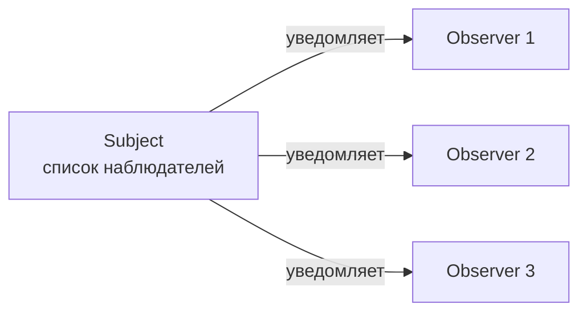
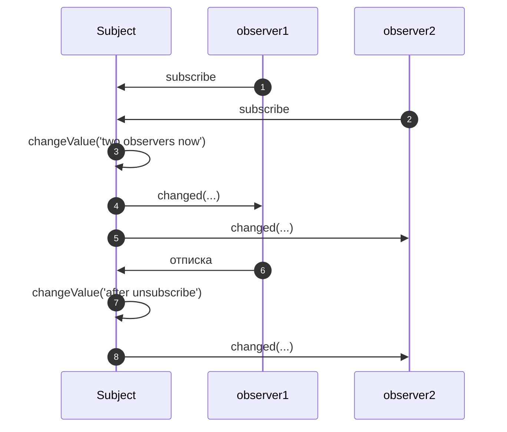
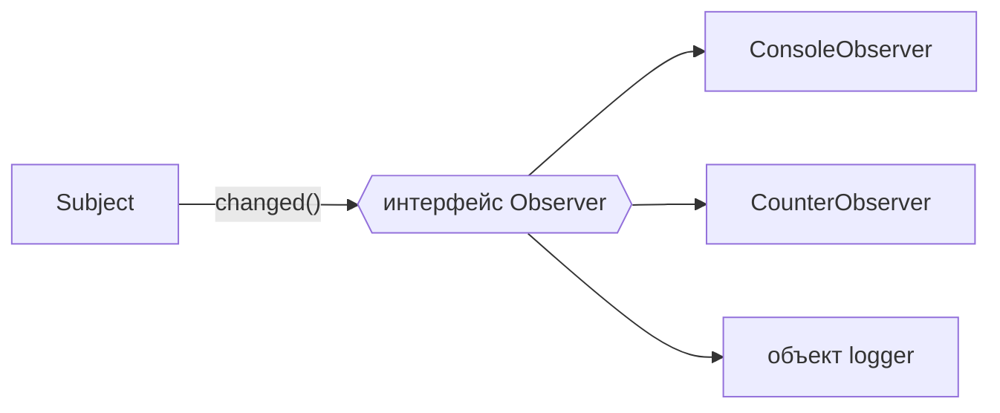

# 6_0 — Реактивное программирование: конспект

**Курс:** 3813ICT, неделя 6
**Источник:** `6_0_-_Reactive_Programming.pdf`
**Связанные файлы:** [поправки](6_0-reactive-programming-popravki.md) · [дальше: 6_1 Observables](6_1-observables-konspekt.md)

> Значок **⚠** со ссылкой вида **П-N** ведёт в файл поправок. Там разобрано, где исходный материал курса расходится с официальной документацией, со ссылкой на источник.

**Содержание**

1. [Как программы взаимодействуют с пользователем](#s1): [консоль](#s1-1) · [цикл событий](#s1-2) · [обработчики событий](#s1-3)
2. [Реактивное программирование](#s2): [зачем](#s2-1) · [что это](#s2-2) · [в Angular](#s2-3)
3. [Паттерны проектирования](#s3)
4. [Паттерн Observer](#s4)
5. [Observer на TypeScript: пример из материала](#s5)
6. [Интерфейсы](#s6): [что это](#s6-1) · [Observer как интерфейс](#s6-2) · [несколько интерфейсов](#s6-3)
7. [Как это связано с RxJS и Angular](#s7)
8. [Ключевые факты](#s8)

---

<a id="s1"></a>

## 1. Как программы взаимодействуют с пользователем

Неделя 6 посвящена чату в реальном времени: сообщение, отправленное одним пользователем, должно сразу появиться у всех остальных. Программа не знает заранее, когда придёт следующее сообщение или нажатие, — она должна **реагировать** на события. Чтобы понять, откуда взялся такой стиль программирования, материал начинает с короткой истории: как программы ждали действий пользователя раньше и как ждут сейчас.

| Период | Подход | Синхронный или асинхронный |
|---|---|---|
| 1970-е | консольные программы | синхронный |
| 1980-е | опрос событий GUI в цикле | синхронный |
| 1990-е | обработчики событий | асинхронный |
| 2010-е | реактивное программирование | асинхронный |

<a id="s1-1"></a>

### 1.1 Консоль: синхронное ожидание

**Синхронная** программа останавливается там, где ждёт ввода, и продолжает только после того, как пользователь ответил. Вот как это выглядит в материале (псевдокод):

```
print("Enter your name: ");
name = readLine();          // программа ждёт
print("Enter your age: ");
age = readLine();           // программа снова ждёт
print(name + " is " + age);
```

Такой код прост и предсказуем: пока пользователь думает, ничего не выполняется, и программа стоит ровно в той строке, где запросила ввод. Никаких дополнительных конструкций не нужно.

<a id="s1-2"></a>

### 1.2 Графический интерфейс и цикл событий

Графический интерфейс **многомодальный**: пользователь может нажать любую кнопку, печатать в любом поле, переключить окно. Программа не может ждать один конкретный ввод — вариантов много. Первым решением был **цикл событий** (event loop): программа бесконечно спрашивает «что произошло?» и сама вызывает нужную обработку.

```
while (true) {
  event = getNextEvent();
  switch (event) {
    case mouseButton: processMouseButton(); break;
    case textEntered: processTextEntered(); break;
  }
}
```

Программа всё ещё полностью управляет ходом выполнения, и каждое событие обрабатывается синхронно.

<a id="s1-3"></a>

### 1.3 Обработчики событий: асинхронность

Раз цикл событий нужен всем, его спрятали внутрь фреймворка. Программа только **регистрирует обработчики** — функции, которые нужно вызвать при событии, — а фреймворк сам крутит цикл, определяет, с каким элементом взаимодействовал пользователь, и вызывает зарегистрированный обработчик.

Это **асинхронный** подход: между вызовами обработчиков ход выполнения контролирует уже не твой код, а фреймворк.

**А где это в нашем коде?** Везде. В браузере и в Node.js встроен свой цикл событий, а мы только регистрируем обработчики:

```ts
button.addEventListener('click', () => save());   // браузер вызовет save() по клику
socket.on('message', (m) => show(m));             // Socket.IO вызовет show() при сообщении (6_4)
```

В шаблоне Angular `(click)="save()"` — то же самое: Angular регистрирует обработчик за тебя.

---

<a id="s2"></a>

## 2. Реактивное программирование

Обработчики событий решили проблему «много источников ввода», но принесли новую: когда независимых обработчиков много, данные и интерфейс легко рассинхронизируются.

<a id="s2-1"></a>

### 2.1 Зачем

Асинхронный код сложнее синхронного. Одна из главных проблем — **согласованность состояния**. Представь: один обработчик добавил сообщение в список, а другой, который обновляет счётчик непрочитанных, об этом не узнал. Интерфейс показывает одно, данные говорят другое.

Реактивное программирование — концептуальный подход, который упрощает асинхронное программирование и снимает часть таких проблем: вместо того чтобы вручную обновлять всё, что зависит от изменения, мы **описываем зависимости**, а обновления происходят сами.

<a id="s2-2"></a>

### 2.2 Что это

Разницу проще всего увидеть на одной строке `a = b + c`:

- **императивно** — сумма вычисляется один раз в момент выполнения строки; если потом `b` или `c` изменятся, `a` останется прежним, пока строку не выполнят снова;
- **реактивно** — `a` пересчитывается сам каждый раз, когда меняется `b` или `c`.

**Реактивное программирование** — подход, при котором значения описываются через зависимости от других значений и автоматически обновляются, когда меняются их источники.

<a id="s2-3"></a>

### 2.3 Реактивность в Angular

Ты уже пользовался реактивностью, даже не называя её так. **Привязка** в шаблоне — пример реактивного программирования: `{{ a + b }}` перерисуется сам, когда изменится `a` или `b`.

Ещё ближе к определению из §2.2 — **сигналы**, которые ты использовал в неделях 4–5. Запись с `computed` — буквально «реактивное `a = b + c`»: ⚠ [П-3](6_0-reactive-programming-popravki.md#p-3)

```ts
import { signal, computed } from '@angular/core';

const b = signal(2);
const c = signal(3);
const a = computed(() => b() + c());   // описали зависимость один раз

console.log(a());   // 5
b.set(10);
console.log(a());   // 13 — пересчитался сам
```

---

<a id="s3"></a>

## 3. Паттерны проектирования

Реактивность держится на идее «кто-то меняется — заинтересованные узнают». Эта идея давно оформлена как **паттерн** — поэтому сначала о том, что такое паттерны вообще.

**Паттерн проектирования** (software design pattern) — многократно используемое решение часто встречающейся задачи проектирования. Он похож на алгоритм, но описывает не последовательность шагов, а устройство частей программы и их связи.

Паттерны популяризировала «Банда четырёх» (Gang of Four, GoF) — Гамма, Хелм, Джонсон и Влиссидес — в книге *Design Patterns* 1994 года. Среди описанных там паттернов:

- **Factory Method** — создание объектов через специальный метод, а не напрямую через `new`;
- **Singleton** — единственный экземпляр класса (так работают сервисы Angular с `providedIn: 'root'`, [5_2 §5](5_2-services-konspekt.md#s5)).

---

<a id="s4"></a>

## 4. Паттерн Observer

**Observer** («наблюдатель») — паттерн, в котором один объект (**subject**, «субъект») хранит список заинтересованных объектов (**observers**, «наблюдателей») и сам уведомляет их всех, когда в нём что-то меняется.

Как это работает:

1. наблюдатель **подписывается** у субъекта;
2. субъект добавляет его в свой список;
3. когда происходит изменение, субъект отправляет каждому наблюдателю сообщение с информацией о нём;
4. наблюдатель может **отписаться** — субъект удалит его из списка ⚠ [П-2](6_0-reactive-programming-popravki.md#p-2).



**Почему это полезно.** Паттерн даёт **слабую связанность** (low coupling): субъект не знает, что именно делают наблюдатели, — он просто вызывает у них один и тот же метод. Можно добавить новый вид наблюдателя, не меняя субъект.

Observer родственен паттерну **publish/subscribe** («издатель/подписчик»). Разница в том, что в классическом Observer субъект знает своих наблюдателей напрямую, а в publish/subscribe между издателем и подписчиками обычно стоит посредник — канал или брокер сообщений. Socket.IO (6_3–6_6) ближе ко второму: сервер рассылает событие по имени, а клиенты подписываются на это имя.

---

<a id="s5"></a>

## 5. Observer на TypeScript: пример из материала

Материал реализует паттерн вручную: класс `Subject` со списком наблюдателей и значением и класс `Observer`, который выводит полученное значение. Вот код из материала:

```ts
class Subject {
    observers = [];

    value = "";

    subscribe(observer: Observer) {
        this.observers.push(observer);
    }

    changeValue(newValue) {
        console.log("subscriber: changeValue: " + newValue);

        this.value = newValue;

        // Notify all observers of the change
        for (let i = 0; i < this.observers.length; i++) {
            this.observers[i].changed(this.value);
        }
    }
}

class Observer {
    constructor(public name) {
    }

    changed(newValue) {
        // Print out our name and the new changed value
        console.log(`${this.name}: ${newValue}`);
    }
}
```

И использование:

```ts
let subject = new Subject();
subject.changeValue("initial value");

let observer1 = new Observer("observer1");
let observer2 = new Observer("observer2");

subject.subscribe(observer1);
subject.subscribe(observer2);

subject.changeValue("two observers now");

let observer3 = new Observer("observer3");
subject.subscribe(observer3);

subject.changeValue("a third observer");
```

**Что в нём происходит.** `Subject` хранит массив наблюдателей. `subscribe` добавляет наблюдателя в массив, `changeValue` меняет значение и в цикле вызывает у каждого наблюдателя `changed`. `Observer` запоминает своё имя (запись `public name` в конструкторе сразу создаёт поле класса) и выводит «имя: значение». В выводе видно: первое значение не получил никто, второе — два наблюдателя, третье — три.

Идея показана верно, но в Angular-проекте этот код не скомпилируется: в строгом режиме TypeScript пустой массив `observers = []` получает тип «массив из ничего», а параметры без типов запрещены. Кроме того, у субъекта нет отписки. ⚠ [П-1](6_0-reactive-programming-popravki.md#p-1) ⚠ [П-2](6_0-reactive-programming-popravki.md#p-2)

Вот исправленная версия:

```ts
class Subject {
  private observers: Observer[] = [];   // тип массива указан явно
  private value = '';

  // Возвращает функцию отписки — так наблюдатель сможет уйти
  subscribe(observer: Observer): () => void {
    this.observers.push(observer);
    return () => {
      this.observers = this.observers.filter((o) => o !== observer);
    };
  }

  changeValue(newValue: string): void {
    console.log('subject: changeValue: ' + newValue);
    this.value = newValue;
    for (const observer of this.observers) {
      observer.changed(this.value);         // уведомляем каждого
    }
  }
}

class Observer {
  constructor(public name: string) {}       // public name → поле this.name

  changed(newValue: string): void {
    console.log(`${this.name}: ${newValue}`);
  }
}

const subject = new Subject();
subject.changeValue('initial value');       // никто не подписан — никто не узнает

const unsubscribe1 = subject.subscribe(new Observer('observer1'));
subject.subscribe(new Observer('observer2'));
subject.changeValue('two observers now');   // observer1, observer2

unsubscribe1();                             // observer1 ушёл
subject.changeValue('after unsubscribe');   // только observer2
```

**Какая последовательность?**

1. **Создаётся субъект** с пустым списком наблюдателей.
2. **`changeValue('initial value')`** — значение меняется, но список пуст, поэтому никто ничего не выводит.
3. **Два наблюдателя подписываются.**
   1. `subscribe` добавляет каждого в список.
   2. Для первого сохраняется функция отписки.
4. **`changeValue('two observers now')`** — цикл вызывает `changed` у обоих: в консоли `observer1: …` и `observer2: …`.
5. **`unsubscribe1()`** — функция отписки создаёт новый список без `observer1`.
6. **`changeValue('after unsubscribe')`** — уведомление получает только `observer2`.



---

<a id="s6"></a>

## 6. Интерфейсы

В примере выше все наблюдатели одинаковые: один класс, один метод `changed`. В реальности наблюдатели разные: один показывает сообщение, другой увеличивает счётчик, третий пишет в журнал. Как дать субъекту работать с любыми из них? Через интерфейс.

<a id="s6-1"></a>

### 6.1 Что такое интерфейс

**Интерфейс** — описание того, какие методы и поля должен иметь объект, без реализации. Класс, который **реализует** (`implements`) интерфейс, обязан предоставить все описанные в нём методы.

Интерфейс — это тип: его можно использовать везде, где используют класс, например как тип параметра. Объекты могут быть разными, а «разъём», через который код с ними работает, — одинаковым.

В TypeScript совместимость проверяется **по форме** (структурная типизация): объект подходит под интерфейс, если у него есть нужные методы, даже без слова `implements`. `implements` полезен как проверка: если класс забудет метод, компилятор сразу укажет на ошибку. ⚠ [П-4](6_0-reactive-programming-popravki.md#p-4)

<a id="s6-2"></a>

### 6.2 Observer как интерфейс

Вот как это выглядит в материале. Интерфейс:

```ts
interface Observer {
    changed(newValue);
}
```

Три разных наблюдателя:

```ts
class Observer1 implements Observer {
    changed(newValue) {
        console.log("Observer1: " + newValue);
    }
}

class Observer2 implements Observer {
    changed(newValue) {
        console.log("Observer2 is doing something different: " + newValue);
    }
}

class Observer3 implements Observer {
    changed(newValue) {
        console.log("Observer3 is also different: " + newValue);
    }
}
```

Класс `Subject` при этом **не меняется**: он работает с типом `Observer` и не знает, какой конкретно класс ему передали.

**Что в нём происходит.** Каждый класс по-своему реагирует на `changed`, но все подходят под интерфейс, поэтому субъект вызывает у них один и тот же метод. Как и в §5, без типов у параметров этот код не пройдёт строгую проверку. ⚠ [П-1](6_0-reactive-programming-popravki.md#p-1)

Вот исправленная версия — с типами и наблюдателями, которые делают действительно разное:

```ts
interface Observer {
  changed(newValue: string): void;
}

class ConsoleObserver implements Observer {
  changed(newValue: string): void {
    console.log('Новое значение: ' + newValue);
  }
}

class CounterObserver implements Observer {
  count = 0;
  changed(): void {                 // параметр можно не объявлять, если он не нужен
    this.count++;
  }
}

// Объект без класса тоже подходит — у него есть метод changed нужной формы
const logger: Observer = {
  changed: (v) => console.log(`[log] ${v}`),
};

// Subject из §5 работает со всеми тремя без изменений
const subject = new Subject();
const counter = new CounterObserver();
subject.subscribe(new ConsoleObserver());
subject.subscribe(counter);
subject.subscribe(logger);
subject.changeValue('hello');       // вывод в консоль, count = 1, запись в журнал
```



<a id="s6-3"></a>

### 6.3 Несколько интерфейсов

Класс может реализовать несколько интерфейсов сразу — их перечисляют через запятую. Если он не реализует хотя бы один метод какого-то интерфейса, будет ошибка компиляции. Вот пример из материала:

```ts
interface Add {
    add(a, b);
}

interface Subtract {
    subtract(a, b);
}

class Arithmetic implements Add, Subtract {
    add(a, b) {
        return a + b;
    }
    subtract(a, b) {
        return a – b;
    }
}
```

И ошибка, если метод `subtract` не написан: «Class 'Arithmetic' incorrectly implements interface 'Subtract'. Property 'subtract' is missing…».

В строке `a – b` стоит типографское тире вместо минуса, а параметры без типов — код не скомпилируется. ⚠ [П-5](6_0-reactive-programming-popravki.md#p-5) Исправленная версия:

```ts
interface Add {
  add(a: number, b: number): number;
}

interface Subtract {
  subtract(a: number, b: number): number;
}

class Arithmetic implements Add, Subtract {
  add(a: number, b: number): number {
    return a + b;
  }
  subtract(a: number, b: number): number {
    return a - b;                     // обычный минус
  }
}
```

---

<a id="s7"></a>

## 7. Как это связано с RxJS и Angular

Всё, что ты написал вручную, уже есть в готовом виде — в библиотеке **RxJS**, которой пользуется Angular (тема 6_1):

| Наш пример | RxJS |
|---|---|
| класс `Subject` со списком наблюдателей | класс `Subject` |
| интерфейс `Observer` с методом `changed` | интерфейс `Observer` с методами `next`, `error`, `complete` |
| функция отписки из `subscribe` | объект `Subscription` с методом `unsubscribe()` |

Ты уже встречал этот паттерн в Angular: `HttpClient` возвращает Observable, `@Output()` с `EventEmitter` уведомляет родителя, `router.events` сообщает о навигации. А в темах 6_3–6_6 тот же подход применяется к сообщениям, которые приходят с сервера по сокету.

---

<a id="s8"></a>

## 8. Ключевые факты

**История и асинхронность**

- Синхронная программа останавливается и ждёт ввода; асинхронная регистрирует обработчики, а вызывает их фреймворк.
- Цикл событий — бесконечный цикл «получить событие → обработать»; в браузере и Node.js он встроен.

**Реактивное программирование**

- Реактивно `a = b + c` означает, что `a` пересчитывается сам при изменении `b` или `c`.
- Привязка `{{ a + b }}` и `computed(() => b() + c())` в Angular — примеры реактивности.
- Главная польза — согласованность данных и интерфейса без ручных обновлений.

**Паттерны**

- Паттерн — повторно используемое решение задачи проектирования; популяризированы GoF в 1994 году.
- Observer: субъект хранит список наблюдателей и уведомляет их об изменениях; наблюдатели подписываются и отписываются.
- Паттерн даёт слабую связанность: субъект не знает, что делают наблюдатели.

**TypeScript**

- `public name` в параметре конструктора создаёт поле класса.
- В строгом режиме у параметров нужны типы, а у пустого массива — явный тип элементов.
- Интерфейс описывает методы без реализации; класс может реализовать несколько интерфейсов.
- Совместимость в TypeScript структурная; `implements` проверяет, что класс ничего не забыл.
