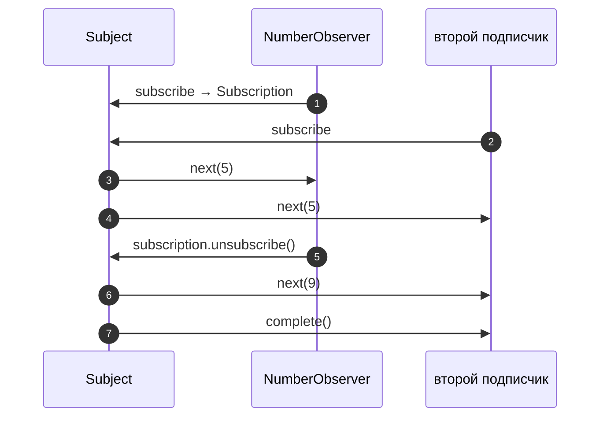

# 6_1 — Observables: конспект

**Курс:** 3813ICT, неделя 6
**Источник:** `6_1_-_Observables.pdf`
**Связанные файлы:** [поправки](6_1-observables-popravki.md) · [назад: 6_0 Реактивное программирование](6_0-reactive-programming-konspekt.md) · [дальше: 6_2 Promises и async](6_2-promises-async-konspekt.md)

> Значок **⚠** со ссылкой вида **П-N** ведёт в файл поправок. Там разобрано, где исходный материал курса расходится с официальной документацией, со ссылкой на источник.

**Содержание**

1. [ReactiveX и RxJS](#s1)
2. [От самодельного Subject к RxJS](#s2)
3. [Generics](#s3)
4. [Функции как тип: интерфейс Observer](#s4)
5. [Свой Observer](#s5)
6. [Subject в RxJS](#s6): [что это](#s6-1) · [Subject и Observable](#s6-2) · [пример из материала](#s6-3)
7. [Разновидности Subject](#s7)
8. [Ключевые факты](#s8)

---

<a id="s1"></a>

## 1. ReactiveX и RxJS

В 6_0 ты написал паттерн Observer вручную. Писать его заново в каждом проекте незачем: есть готовая, проверенная реализация. Эта тема о ней — о библиотеке, которую Angular использует повсюду.

**ReactiveX** — стандартный подход к реализации Observable, одинаковый во многих языках: RxJava для Java, Rx.NET для C#, RxPY для Python, RxSwift для Swift и другие. Выучив идею в одном языке, легко читать код в другом.

**RxJS** (Reactive Extensions for JavaScript) — реализация ReactiveX для JavaScript и TypeScript. Angular использует её в `HttpClient`, в событиях роутера, в реактивных формах — ты уже встречал её в 5_4.

---

<a id="s2"></a>

## 2. От самодельного Subject к RxJS

Класс `Subject` из 6_0 был источником событий для наблюдателей — это паттерн Observer из книги «Банды четырёх». На его UML-схеме у субъекта три операции: зарегистрировать наблюдателя, удалить наблюдателя и уведомить всех; у наблюдателя — одна: получить уведомление.

RxJS даёт готовые части того же паттерна, только богаче:

| Паттерн / 6_0 | RxJS | Что это |
|---|---|---|
| `Observer` с методом `changed` | интерфейс **`Observer<T>`** | получатель значений: `next`, `error`, `complete` |
| — | класс **`Observable<T>`** | источник значений, на который подписываются |
| класс `Subject` со списком | класс **`Subject<T>`** | Observable, который сам рассылает значения всем подписчикам |
| функция отписки | класс **`Subscription`** | результат `subscribe()`, у него есть `unsubscribe()` |

Чтобы читать код RxJS, нужны две возможности TypeScript: generics и функции как тип. Разберём их по очереди.

---

<a id="s3"></a>

## 3. Generics

**Generics** (обобщённые типы) — способ написать функцию или класс один раз для любого типа, сохранив при этом проверку типов. Тип становится параметром, который обычно называют `T`.

Вот функция из материала, которая применяет `fn` к каждому элементу массива:

```ts
function every<T>(array: Array<T>, fn: (x: T) => T): void {
    for (let i = 0; i < array.length; i++) {
        array[i] = fn(array[i]);
    }
}
```

- `<T>` после имени функции объявляет параметр типа.
- `array: Array<T>` — массив элементов типа `T`.
- `fn: (x: T) => T` — функция, которая принимает `T` и возвращает `T`.

Когда ты вызываешь `every([1, 2, 3], (x) => x * 2)`, TypeScript подставляет `T = number` и проверяет, что `fn` работает с числами. С массивом строк `T` станет `string`. Без generics пришлось бы писать отдельную функцию для каждого типа или терять проверку через `any`.

Функция из материала меняет исходный массив на месте. Обычно удобнее не портить исходные данные и возвращать новый массив — так работает встроенный `map`: ⚠ [П-4](6_1-observables-popravki.md#p-4)

```ts
function mapAll<T>(array: T[], fn: (x: T) => T): T[] {
  return array.map(fn);          // исходный массив не меняется
}

mapAll([1, 2, 3], (x) => x * 2);               // [2, 4, 6] — T = number
mapAll(['a', 'b'], (s) => s.toUpperCase());    // ['A', 'B'] — T = string
```

Ты уже пользовался generics: `signal<number>(0)`, `http.get<Group[]>(url)`, `Observable<Message>`.

---

<a id="s4"></a>

## 4. Функции как тип: интерфейс Observer

В RxJS наблюдатель описан интерфейсом с generics. Вот как он записан в текущей версии RxJS 7: ⚠ [П-1](6_1-observables-popravki.md#p-1)

```ts
interface Observer<T> {
  next: (value: T) => void;
  error: (err: any) => void;
  complete: () => void;
}
```

Запись `next: (value: T) => void` читается так: `next` — поле, в котором лежит **функция**, принимающая значение типа `T` и ничего не возвращающая. Все три поля — **колбэки**: их вызывает не твой код, а источник значений.

| Колбэк | Когда вызывается | Аналог из 6_0 |
|---|---|---|
| `next(value)` | на каждое новое значение, сколько угодно раз | `changed(newValue)` |
| `error(err)` | при ошибке в источнике; после неё значений больше не будет | — |
| `complete()` | когда источник закончил работу и больше ничего не отправит | — |

Правило, на котором держится вся RxJS: поток выдаёт **ноль или больше** `next`, а потом **ровно одно** из двух — `error` или `complete` — либо не заканчивается никогда. После `error` или `complete` ничего не приходит.

Часто нужен только `next`, поэтому при подписке можно передать объект лишь с нужными полями или одну функцию для `next` ([5_4 §3.2](5_4-http-requests-konspekt.md#s3-2)).

---

<a id="s5"></a>

## 5. Свой Observer

Раз `Observer<T>` — интерфейс, его можно реализовать классом. Вот пример из материала — наблюдатель, который ждёт чисел:

```ts
class NumberObserver implements Observer<number> {
    next(value: number): void {
        console.log("Next number: " + value);
    }
    error(err: any): void {
        console.log("Error: " + err);
    }
    complete(): void {
        console.log("We are finished!");
    }
}
```

`implements Observer<number>` подставляет `T = number`, поэтому `next` обязан принимать число. Пример верный.

На практике отдельный класс пишут редко. Обычно наблюдателя передают объектом прямо в `subscribe` — TypeScript проверит его форму без `implements` ([6_0 §6.1](6_0-reactive-programming-konspekt.md#s6-1)):

```ts
numbers$.subscribe({
  next: (n) => console.log('Next number: ' + n),
  complete: () => console.log('We are finished!'),
});
```

---

<a id="s6"></a>

## 6. Subject в RxJS

<a id="s6-1"></a>

### 6.1 Что такое Subject

**Subject** в RxJS — особый Observable, который рассылает каждое значение **всем** своим подписчикам одновременно (multicast). При этом он ещё и Observer: у него есть методы `next`, `error` и `complete`, через которые в него «вталкивают» значения. ⚠ [П-2](6_1-observables-popravki.md#p-2)

Это ровно наш самодельный `Subject` из 6_0: внутри — список подписчиков, `subscribe` добавляет в него, `next` уведомляет всех.

<a id="s6-2"></a>

### 6.2 Subject и обычный Observable

Здесь главное отличие, которое материал формулирует неточно. У обычного Observable **каждый подписчик получает собственное выполнение**: при каждой подписке функция-источник запускается заново. Такой Observable называют **unicast**. У Subject выполнение **одно на всех** — подписчики получают одни и те же значения. Это **multicast**.

Вот пример, который это показывает:

```ts
import { Observable, Subject } from 'rxjs';

// Обычный Observable: каждый подписчик запускает источник заново
const random$ = new Observable<number>((subscriber) => {
  subscriber.next(Math.random());
});
random$.subscribe((v) => console.log('A', v));   // A 0.12…
random$.subscribe((v) => console.log('B', v));   // B 0.87… — другое число

// Subject: одно значение уходит всем
const subject = new Subject<number>();
subject.subscribe((v) => console.log('A', v));
subject.subscribe((v) => console.log('B', v));
subject.next(Math.random());                     // A 0.45…, B 0.45… — одно и то же
```

HTTP-запрос из 5_4 — обычный Observable: две подписки дают два запроса, потому что источник запускается дважды. Сообщения чата, которые приходят по сокету, — наоборот, одни на всех слушателей.

<a id="s6-3"></a>

### 6.3 Пример из материала

Вот как Subject показан в материале курса:

```ts
let observer = new NumberObserver();
let subject = new Subject<number>();

// Add observer to the list of observers
subject.subscribe(observer);

// Notify all observers of the following two numbers
subject.next(5);
subject.next(7);

// Remove observer from the list of observers
subject.unsubscribe(observer);
```

**Что в нём происходит.** Создаётся наблюдатель и субъект чисел. Наблюдатель подписывается, субъект отправляет 5 и 7 — наблюдатель выводит оба числа. Последней строкой материал пытается удалить наблюдателя из списка.

Последняя строка неверна: `Subject.unsubscribe()` не принимает аргументов (компилятор выдаёт «Expected 0 arguments, but got 1») и делает совсем другое — закрывает весь субъект для всех. Чтобы отписать одного наблюдателя, нужно вызвать `unsubscribe()` у **подписки**, которую вернул `subscribe()`. ⚠ [П-3](6_1-observables-popravki.md#p-3)

Вот исправленная версия:

```ts
import { Subject, Subscription } from 'rxjs';

const subject = new Subject<number>();

// subscribe возвращает Subscription — «квитанцию» об этой подписке
const subscription: Subscription = subject.subscribe(new NumberObserver());
subject.subscribe((n) => console.log('второй подписчик:', n));

subject.next(5);            // оба получают 5
subject.next(7);            // оба получают 7

subscription.unsubscribe(); // отписан только NumberObserver
subject.next(9);            // получает только второй

subject.complete();         // субъект завершён: второй подписчик получит complete
subject.next(11);           // после complete значения никто не получит
```

**Какая последовательность?**

1. **Создаётся `Subject<number>`** — пустой список подписчиков.
2. **Подписываются двое.**
   1. `NumberObserver` — его `Subscription` сохраняется в переменную.
   2. Второй подписчик — функция для `next`.
3. **`next(5)` и `next(7)`** — Subject по очереди вызывает `next` у обоих подписчиков.
4. **`subscription.unsubscribe()`** — из списка удаляется только `NumberObserver`.
5. **`next(9)`** — значение получает только второй подписчик.
6. **`complete()`** — второй подписчик получает сигнал завершения; дальнейшие `next` игнорируются.



---

<a id="s7"></a>

## 7. Разновидности Subject

У Subject есть три специализированных варианта. В материале их нет, но они часто встречаются в Angular-коде, поэтому полезно знать, чем они отличаются:

| Класс | Что получает новый подписчик | Когда нужен |
|---|---|---|
| `Subject` | только значения, отправленные **после** подписки | события: «пришло сообщение», «нажали кнопку» |
| `BehaviorSubject` | сразу **текущее** значение, затем новые; требует начальное значение | состояние: «текущий пользователь», «выбранный канал» |
| `ReplaySubject` | последние N значений, затем новые | «покажи последние 10 сообщений тому, кто подключился позже» |
| `AsyncSubject` | только последнее значение и только после `complete` | редко: результат, который известен в конце |

```ts
import { BehaviorSubject } from 'rxjs';

const currentChannel = new BehaviorSubject<string>('general');
currentChannel.subscribe((c) => console.log('A видит', c)); // A видит general — сразу
currentChannel.next('random');                              // A видит random
currentChannel.subscribe((c) => console.log('B видит', c)); // B видит random — текущее
```

Для состояния внутри Angular сейчас обычно используют сигналы ([5_2 §6.3](5_2-services-konspekt.md#s6-3)), а Subject — для потоков событий, например сообщений из сокета (6_4).

---

<a id="s8"></a>

## 8. Ключевые факты

**RxJS**

- ReactiveX — единый подход к Observable во многих языках; RxJS — его версия для JavaScript, используется в Angular.
- Части RxJS: `Observable` (источник), `Observer` (получатель), `Subject` (источник с рассылкой всем), `Subscription` (результат подписки).

**Generics и функции как тип**

- `<T>` делает функцию или класс пригодными для любого типа с сохранением проверки.
- `next: (value: T) => void` — поле, в котором лежит функция.

**Observer**

- В RxJS 7 `Observer<T>` содержит `next`, `error`, `complete`.
- Поток: ноль или больше `next`, затем одно из `error` или `complete` (или бесконечность); после конца ничего не приходит.
- Наблюдателя обычно передают объектом, отдельный класс не обязателен.

**Subject**

- Subject — Observable, который рассылает одно и то же значение всем подписчикам (multicast), и одновременно Observer с `next`, `error`, `complete`.
- Обычный Observable — unicast: каждая подписка запускает источник заново.
- Отписать одного подписчика — `subscription.unsubscribe()`; `subject.unsubscribe()` без аргументов закрывает весь Subject.
- `BehaviorSubject` хранит текущее значение и сразу отдаёт его новым подписчикам.
