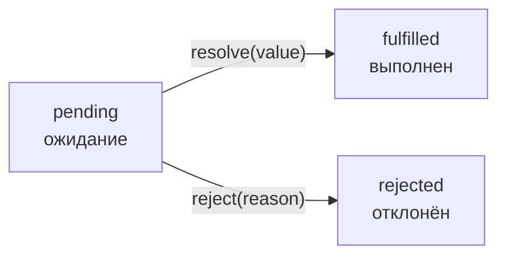
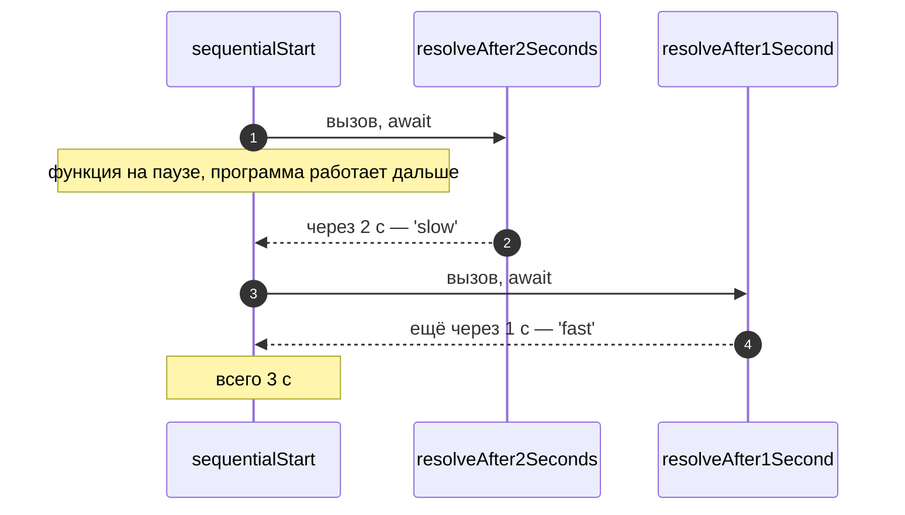

# 6_2 — Promises и async-функции: конспект

**Курс:** 3813ICT, неделя 6
**Источник:** `6_2-promises_and_async_functions.pdf`
**Связанные файлы:** [поправки](6_2-promises-async-popravki.md) · [назад: 6_1 Observables](6_1-observables-konspekt.md) · [дальше: 6_3 Сокеты](6_3-sockets-konspekt.md)

> Значок **⚠** со ссылкой вида **П-N** ведёт в файл поправок. Там разобрано, где исходный материал курса расходится с официальной документацией, со ссылкой на источник.

**Содержание**

1. [Promise и Observable](#s1)
2. [Создание Promise](#s2)
3. [then, catch, finally](#s3)
4. [fetch()](#s4)
5. [Цепочки Promise](#s5)
6. [async и await](#s6): [что это](#s6-1) · [пример из материала](#s6-2) · [правила await](#s6-3) · [ошибки и параллельность](#s6-4)
7. [Что возвращает async-функция](#s7)
8. [Из Promise в Observable и обратно](#s8)
9. [Ключевые факты](#s9)

---

<a id="s1"></a>

## 1. Promise и Observable

Observable из 6_1 — не единственный способ работать с асинхронностью. В самом JavaScript есть более простой инструмент — **Promise**. Его нужно знать по двум причинам: на нём построены `fetch`, `async`/`await` и многие библиотеки, а на сервере Node.js промисы встречаются чаще, чем Observable (например, `fs/promises` из 5_6).

**Promise** («обещание») — объект, который представляет значение, которое появится позже: результат асинхронной операции. Функция может вернуть Promise сразу, а само значение «материализуется» потом.

Promise встроен в JavaScript и не требует библиотек. Главные отличия от Observable:

| | Promise | Observable (RxJS) |
|---|---|---|
| Сколько значений | одно (или ошибка) | ноль, одно или много, со временем |
| Когда начинает работу | сразу при создании | только при подписке (ленивый) |
| Можно ли отменить | нет | да, `unsubscribe()` |
| Откуда берётся | встроен в JavaScript | библиотека RxJS |
| Типичное применение | один запрос, чтение файла | поток событий: сообщения, клики, сокет |

Для чата это значит: загрузить историю сообщений — задача на один ответ (Promise или HTTP-Observable); получать новые сообщения из сокета — поток (Observable).

---

<a id="s2"></a>

## 2. Создание Promise

Чтобы функция работала асинхронно, она возвращает Promise. Вот пример из материала, который оборачивает старый `XMLHttpRequest` в Promise:

```ts
function openURL(url) {
    return new Promise((resolve, reject) => {
        const xhr = new XMLHttpRequest();
        xhr.open("GET", url);
        xhr.onload = () => resolve(xhr.responseText);
        xhr.onerror = () => reject(xhr.statusText);
        xhr.send();
    });
}
```

**Как это устроено.** В `new Promise(...)` передают функцию-исполнитель (executor). JavaScript сразу вызывает её и передаёт две функции:

- **`resolve(value)`** — вызвать, когда результат готов: Promise становится **выполненным** (fulfilled) с этим значением;
- **`reject(reason)`** — вызвать при ошибке: Promise становится **отклонённым** (rejected).

До этого Promise находится в состоянии **ожидания** (pending). Перейти из него он может только один раз.



В примере `onload` срабатывает, когда сервер ответил — **любым** кодом, в том числе 404, а `onerror` — только при сетевой ошибке. Эту же особенность мы встретим у `fetch` ([§4](#s4)). Для строгой проверки типов параметру `url` нужен тип `string`.

---

<a id="s3"></a>

## 3. then, catch, finally

Получить значение из Promise можно, передав ему обработчики. Материал называет два колбэка `then` функциями `resolve` и `reject` — это не так: `resolve` и `reject` принадлежат создателю промиса, а в `then` передают **обработчики** результата. ⚠ [П-1](6_2-promises-async-popravki.md#p-1)

- **`then(onFulfilled, onRejected)`** — первый обработчик получает значение при успехе, второй (необязательный) — причину при ошибке;
- **`catch(onRejected)`** — то же, что `then(undefined, onRejected)`: обработать ошибку;
- **`finally(onFinally)`** — выполнится в любом случае, как `finalize` в RxJS (5_4).

Вот пример из материала — обработан только успех:

```ts
let data = openURL("example.com");

data.then(data => {
    console.log("Data received: " + data);
});
```

И тот же код с обработкой ошибки и финальным действием:

```ts
openURL('https://example.com/api/groups')
  .then((text) => console.log('Получено:', text))
  .catch((err) => console.error('Ошибка:', err))
  .finally(() => console.log('Запрос завершён'));
```

Если ошибку не обработать, браузер или Node.js сообщит о «unhandled promise rejection».

---

<a id="s4"></a>

## 4. fetch()

**`fetch()`** — встроенная функция браузера (и Node.js 18+) для HTTP-запросов, основанная на Promise. Она проще `XMLHttpRequest`, и промис-обёртку писать не нужно — `fetch` сам возвращает Promise.

Вот как `fetch` показан в материале:

```ts
let response = fetch("example.com");

response.then(response => {
    console.log("Data received: " + response.body);
});
```

**Что в нём происходит.** `fetch` возвращает Promise с объектом `Response` — не сами данные, а ответ целиком: статус, заголовки, тело. Материал говорит, что в свойстве `body` лежат данные тела.

Здесь две серьёзные неточности. Во-первых, `response.body` — это не данные, а поток (`ReadableStream`); чтобы получить JSON или текст, вызывают `response.json()` или `response.text()`, и они тоже возвращают Promise. ⚠ [П-2](6_2-promises-async-popravki.md#p-2) Во-вторых, `fetch` **не отклоняет** Promise при ответах 404 или 500 — только при сетевой ошибке; код ответа нужно проверять самому через `response.ok`. ⚠ [П-3](6_2-promises-async-popravki.md#p-3)

Вот правильная версия:

```ts
fetch('/api/groups')                              // относительный адрес; 'example.com' без https:// тоже был бы относительным
  .then((response) => {
    if (!response.ok) {                           // ok — true для кодов 200–299
      throw new Error(`HTTP ${response.status}`); // превращаем 404/500 в ошибку
    }
    return response.json();                       // тело как JSON — ещё один Promise
  })
  .then((groups) => console.log(groups))
  .catch((err) => console.error('Не удалось загрузить:', err));
```

**Какая последовательность?**

1. **`fetch` отправляет запрос** и сразу возвращает Promise.
2. **Сервер ответил** — Promise выполняется с объектом `Response`, даже если код 404.
   1. Первый `then` проверяет `response.ok`.
   2. Если код не 2xx — бросает ошибку, и управление переходит в `catch`.
3. **`response.json()`** читает поток тела и разбирает JSON — возвращает новый Promise.
4. **Второй `then`** получает готовый массив групп.
5. **`catch`** ловит всё: сетевую ошибку, «плохой» статус и некорректный JSON.

В Angular вместо `fetch` обычно используют `HttpClient` (5_4): он сам разбирает JSON и считает 4xx/5xx ошибкой.

---

<a id="s5"></a>

## 5. Цепочки Promise

`then` всегда возвращает **новый** Promise. Если обработчик вернул значение — следующий `then` получит его; если вернул Promise — следующий `then` дождётся его результата. Так строятся **цепочки**. Вот пример из материала:

```ts
fetch('http://example.com/movies.json')
    .then(function(response) {
        return response.json();          // возвращает ещё один Promise
    })
    .then(function(myJson) {             // получает результат этого Promise
        console.log(JSON.stringify(myJson));
    });
```

Цепочка позволяет писать код, который **выглядит последовательным**: каждый шаг выполняется асинхронно и ждёт предыдущий, но остальная программа в это время не блокируется. В этом примере не хватает проверки `response.ok` и `catch` ([§4](#s4)).

---

<a id="s6"></a>

## 6. async и await

<a id="s6-1"></a>

### 6.1 Что это

Цепочки `then` удобнее колбэков, но при нескольких шагах всё равно читаются тяжело. Поэтому в JavaScript появились `async` и `await` — способ писать асинхронный код так, будто он синхронный.

- **`async`** перед функцией делает её асинхронной: она всегда возвращает Promise.
- **`await`** внутри такой функции приостанавливает её выполнение, пока Promise не выполнится, и возвращает его значение. Остальная программа при этом продолжает работать.

<a id="s6-2"></a>

### 6.2 Пример из материала

```js
var resolveAfter2Seconds = function() {
  console.log("starting slow promise");
  return new Promise(resolve => {
    setTimeout(function() {
      resolve("slow");
      console.log("slow promise is done");
    }, 2000);
  });
};

var resolveAfter1Second = function() {
  console.log("starting fast promise");
  return new Promise(resolve => {
    setTimeout(function() {
      resolve("fast");
      console.log("fast promise is done");
    }, 1000);
  });
};

var sequentialStart = async function() {
  console.log('==SEQUENTIAL START==');

  // 1. Execution gets here almost instantly
  const slow = await resolveAfter2Seconds();
  console.log(slow); // 2. this runs 2 seconds after 1.

  const fast = await resolveAfter1Second();
  console.log(fast); // 3. this runs 3 seconds after 1.
}
```

**Что в нём происходит.** Обе функции возвращают Promise, который выполнится через 2 и 1 секунду. В `sequentialStart` первый `await` ждёт 2 секунды, и только потом **запускается** второй запрос, который ждёт ещё секунду. Итог — 3 секунды. Пример верный; он хорошо показывает, что `await` подряд выполняет операции **последовательно**.

Материал объясняет, что два `await` равносильны цепочке `then`. На слайде с этой цепочкой вторая функция названа `resolveAfter1Seconds` — в коде выше она называется `resolveAfter1Second`, суть не меняется:

```js
resolveAfter2Seconds().then((val) => {
  const slow = val;
  console.log(slow);
  return resolveAfter1Second();
}).then((val) => {
  const fast = val;
  console.log(fast);
});
```



<a id="s6-3"></a>

### 6.3 Правила await

Материал формулирует правила жёстче, чем они есть. ⚠ [П-4](6_2-promises-async-popravki.md#p-4) Вот как на самом деле:

- `await` работает внутри `async`-функций **и на верхнем уровне модулей** (top-level await). Файлы Angular — модули, но в коде компонентов его обычно не используют.
- `await` можно применить к **любому** значению: если это не Promise, оно просто возвращается (`await 42` даст `42`). Смысл он имеет, конечно, только для Promise.
- `await` не «вызывает `then`» буквально, но результат эквивалентен: функция продолжится со значением выполненного Promise, а при отклонении `await` **бросит исключение**.

<a id="s6-4"></a>

### 6.4 Ошибки и параллельность

Двух вещей в материале нет, но без них `async`/`await` используют неправильно.

**Ошибки** ловят обычным `try/catch` — именно так в 5_6 обрабатывалось чтение файла:

```ts
async function loadGroups(): Promise<Group[]> {
  try {
    const response = await fetch('/api/groups');
    if (!response.ok) throw new Error(`HTTP ${response.status}`);
    return await response.json();
  } catch (err) {
    console.error('Не удалось загрузить группы:', err);
    return [];
  }
}
```

**Параллельность.** Два `await` подряд выполняются последовательно (3 секунды в примере выше). Если запросы не зависят друг от друга, их запускают одновременно и ждут вместе через `Promise.all` — это займёт время самого долгого (2 секунды):

```js
const concurrentStart = async function () {
  const [slow, fast] = await Promise.all([resolveAfter2Seconds(), resolveAfter1Second()]);
  console.log(slow, fast);   // через 2 секунды, а не 3
};
```

---

<a id="s7"></a>

## 7. Что возвращает async-функция

`async`-функция **всегда** возвращает Promise: если внутри написано `return true`, снаружи придёт `Promise<boolean>`. Вот пример из материала:

```ts
async userExists(email: string): Promise<boolean> {
  const response = await fetch(`http://localhost:3000/user_exists/${email}`);
  const json = await response.json();
  return json.userExists == true;       // returns a boolean
}

success: boolean = await userExists("j.faichney@griffith.edu.au");
```

**Что в нём происходит.** Метод отправляет запрос, ждёт ответ, разбирает JSON и возвращает `true` или `false` — а снаружи получается `Promise<boolean>`. Вызывающий код ждёт его через `await` и получает обычное `boolean`.

Идея верная, но у примера несколько недочётов: нет проверки `response.ok`, email подставлен в адрес без кодирования, `==` вместо `===`, а последняя строка должна находиться внутри `async`-функции. ⚠ [П-5](6_2-promises-async-popravki.md#p-5) Исправленная версия:

```ts
async function userExists(email: string): Promise<boolean> {
  const url = `/api/users/exists/${encodeURIComponent(email)}`; // @ и точки безопасно в адресе
  const response = await fetch(url);
  if (!response.ok) throw new Error(`HTTP ${response.status}`);
  const json: { userExists: boolean } = await response.json();
  return json.userExists === true;
}

async function register(email: string): Promise<void> {
  const taken: boolean = await userExists(email);   // await — внутри async-функции
  console.log(taken ? 'Email занят' : 'Можно регистрировать');
}
```

---

<a id="s8"></a>

## 8. Из Promise в Observable и обратно

Иногда один API возвращает Promise, а код вокруг построен на Observable (или наоборот). RxJS умеет превращать одно в другое.

**Promise → Observable.** Функция `from` превращает в Observable многое: массив (каждый элемент станет отдельным `next`), Promise, итерируемые объекты. Вот пример из материала:

```ts
const data = from(fetch('/api/endpoint'));

data.subscribe({
    next(response) {
        console.log(response);
    },
    error(err) {
        console.error('Error: ' + err);
    },
    complete() {
        console.log('Completed');
    }
});
```

Промис превращается в Observable, который выдаст одно значение (`Response`) и завершится. Пример рабочий, но есть тонкость: `fetch` запускается **сразу**, в момент вызова `from(fetch(...))`, а не при подписке — Observable перестаёт быть ленивым. Если нужен запуск именно при подписке, используют `defer`. ⚠ [П-6](6_2-promises-async-popravki.md#p-6)

```ts
import { defer, from } from 'rxjs';

const eager$ = from(fetch('/api/groups'));         // запрос уже ушёл
const lazy$ = defer(() => fetch('/api/groups'));   // запрос уйдёт при subscribe — и при каждом новом
```

**Observable → Promise.** Метод `toPromise()` устарел; вместо него есть две функции:

- `firstValueFrom(obs$)` — Promise с **первым** значением (затем отписка);
- `lastValueFrom(obs$)` — Promise с **последним** значением после завершения потока.

```ts
import { Injectable, inject } from '@angular/core';
import { HttpClient } from '@angular/common/http';
import { firstValueFrom } from 'rxjs';

@Injectable({ providedIn: 'root' })
export class GroupService {
  private http = inject(HttpClient);

  async loadGroups(): Promise<Group[]> {
    return firstValueFrom(this.http.get<Group[]>('/api/groups'));  // HttpClient → Promise
  }
}
```

В Angular чаще остаются в мире Observable, но `firstValueFrom` удобен, когда нужно одно значение внутри `async`-кода.

---

<a id="s9"></a>

## 9. Ключевые факты

**Promise**

- Promise — объект для значения, которое появится позже; встроен в JavaScript.
- Состояния: pending → fulfilled (`resolve`) или rejected (`reject`), переход один раз.
- Promise — одно значение, запускается сразу, не отменяется; Observable — много значений, ленивый, отменяется.
- `then(onFulfilled, onRejected)`, `catch`, `finally`; `then` возвращает новый Promise, из них строятся цепочки.

**fetch**

- `fetch` возвращает Promise с `Response`; данные — через `response.json()` или `response.text()`.
- `fetch` отклоняется только при сетевой ошибке; 404 и 500 проверяют через `response.ok` или `response.status`.

**async / await**

- `async`-функция всегда возвращает Promise.
- `await` ждёт Promise и возвращает его значение; при отклонении бросает исключение — ловят `try/catch`.
- `await` работает в `async`-функциях и на верхнем уровне модулей; к не-Promise просто возвращает значение.
- `await` подряд — последовательно; независимые операции — через `Promise.all`.

**Связь с RxJS**

- `from(promise)` — Observable из Promise, но запрос уже запущен; `defer(() => ...)` запускает при подписке.
- `toPromise()` устарел; вместо него `firstValueFrom` и `lastValueFrom`.
