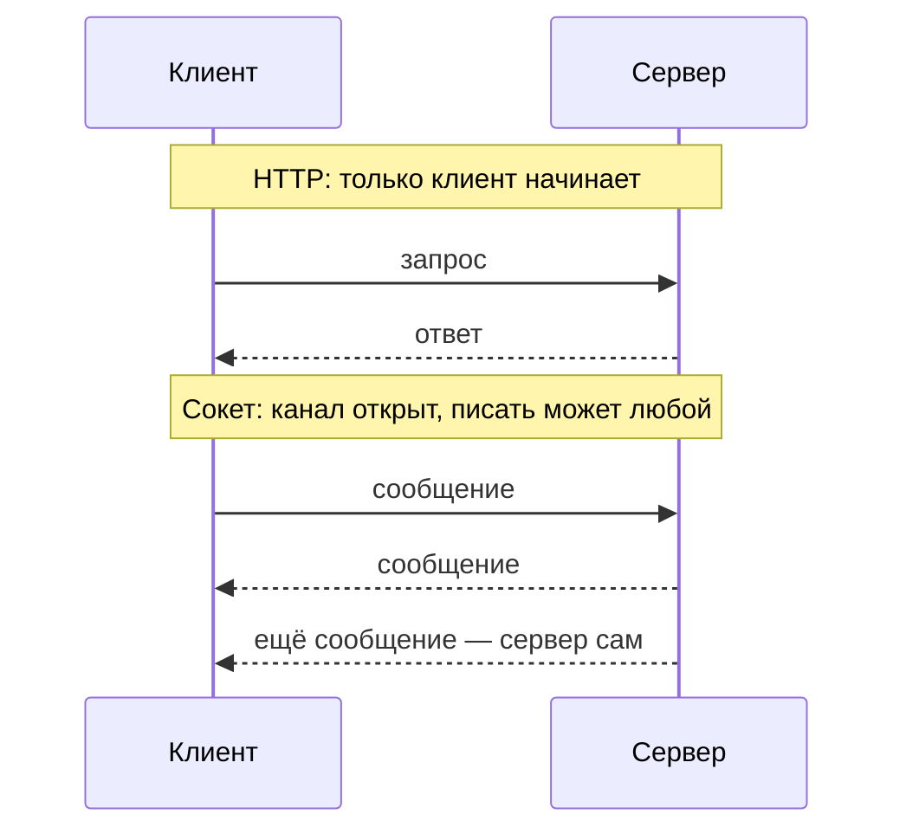
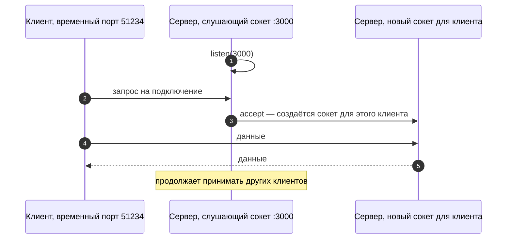
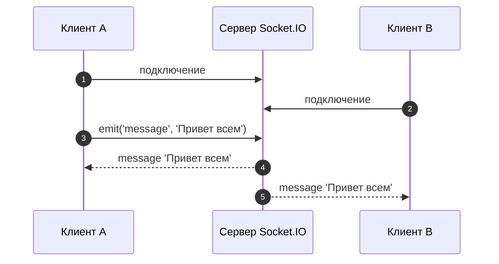

# 6_3 — Сокеты: конспект

**Курс:** 3813ICT, неделя 6
**Источник:** `6_3-Sockets.pdf`
**Связанные файлы:** [поправки](6_3-sockets-popravki.md) · [назад: 6_2 Promises и async](6_2-promises-async-konspekt.md) · [дальше: 6_4 Сокет и Observable](6_4-socket-observable-konspekt.md)

> Значок **⚠** со ссылкой вида **П-N** ведёт в файл поправок. Там разобрано, где исходный материал курса расходится с официальной документацией, со ссылкой на источник.

**Содержание**

1. [Зачем чату сокеты](#s1)
2. [Почему Node.js подходит для реального времени](#s2)
3. [Сокет: базовое понятие](#s3)
4. [WebSocket](#s4)
5. [Socket.IO](#s5): [что это](#s5-1) · [что он добавляет](#s5-2) · [события](#s5-3)
6. [Две стороны кода](#s6)
7. [Ключевые факты](#s7)

---

<a id="s1"></a>

## 1. Зачем чату сокеты

До сих пор общение клиента с сервером было устроено одинаково: **клиент спрашивает — сервер отвечает** (5_4). Для списка групп этого достаточно. Но в чате сообщение от anna должно появиться у ben **само**, без того чтобы ben что-то нажимал. По обычному HTTP сервер не может «позвонить» клиенту первым: он только отвечает на запросы.

Можно, конечно, опрашивать сервер каждую секунду — «есть новые сообщения?». Но это лишние запросы, задержка и нагрузка. Нужен канал, который остаётся открытым, и по которому **обе стороны** могут отправлять данные в любой момент. Такой канал дают сокеты, и эта тема объясняет, как они устроены.



---

<a id="s2"></a>

## 2. Почему Node.js подходит для реального времени

Чат держит открытыми сотни соединений одновременно, и большую часть времени они просто ждут. Материал объясняет, почему Node.js хорошо справляется с такой нагрузкой. ⚠ [П-1](6_3-sockets-popravki.md#p-1)

- **Один поток для JavaScript и цикл событий.** Код приложения выполняется в одном потоке; цикл событий (как в [6_0 §1.2](6_0-reactive-programming-konspekt.md#s1-2)) по очереди вызывает обработчики. Не нужно создавать отдельный поток на каждое соединение, как в классической модели «поток на запрос»: меньше переключений процессора и расхода памяти.
- **Неблокирующий ввод-вывод.** Пока идёт чтение файла, запрос к базе или ожидание данных из сети, поток не простаивает: Node.js передаёт операцию системе (или своему внутреннему пулу потоков) и обрабатывает другие события, а по готовности вызывает колбэк или выполняет Promise.
- **Следствие для чата.** Тысячи соединений, которые почти всё время ждут, стоят дёшево — поэтому Node.js популярен для приложений реального времени.

У этой модели есть обратная сторона: **долгое вычисление в обработчике блокирует всех**. Пока один обработчик считает что-то тяжёлое, цикл событий стоит, и остальные клиенты ждут.

---

<a id="s3"></a>

## 3. Сокет: базовое понятие

Материал начинает с определения сокета на уровне сети — его стоит знать, потому что всё остальное строится поверх. Это определение относится к **TCP-сокету**, а не к WebSocket — о различии в следующем разделе. ⚠ [П-2](6_3-sockets-popravki.md#p-2)

**Сокет** — одна из двух конечных точек двустороннего соединения между программами в сети. Он привязан к номеру порта, чтобы транспортный уровень (TCP) знал, какому приложению доставлять данные.

**Конечная точка** (endpoint) — пара «IP-адрес + порт». Каждое TCP-соединение однозначно определяется двумя конечными точками — клиента и сервера. Поэтому между одним клиентом и сервером может быть несколько соединений: у каждого свой порт на стороне клиента.

Как устанавливается соединение:

1. сервер создаёт сокет, привязанный к известному порту (например, 3000), и **слушает** — ждёт запросов на подключение;
2. клиент знает адрес сервера и порт и отправляет запрос на подключение; для себя он получает от системы временный локальный порт;
3. сервер **принимает** соединение и получает **новый** сокет для общения с этим клиентом — а исходный продолжает слушать, чтобы принимать других.



---

<a id="s4"></a>

## 4. WebSocket

Браузер не даёт JavaScript открывать «голые» TCP-сокеты — это было бы небезопасно. Для веба придуман отдельный протокол поверх TCP.

**WebSocket** — протокол для постоянного двустороннего обмена сообщениями между браузером и сервером по одному соединению. Он начинается как обычный HTTP-запрос с просьбой «переключить протокол» (`Upgrade: websocket`); сервер отвечает `101 Switching Protocols`, и дальше по тому же соединению обе стороны отправляют сообщения в любой момент. Адреса выглядят как `ws://` или `wss://` (зашифрованный).

В браузере для этого есть встроенный API:

```js
const ws = new WebSocket('wss://example.com/chat');
ws.addEventListener('open', () => ws.send('Привет'));             // соединение открыто
ws.addEventListener('message', (e) => console.log('пришло:', e.data));
ws.addEventListener('close', () => console.log('закрыто'));
```

Вот как отличаются подходы:

| | HTTP-запрос | WebSocket |
|---|---|---|
| Кто начинает обмен | только клиент | любая сторона |
| Соединение | на время запроса | остаётся открытым |
| Формат | запрос → ответ | поток сообщений в обе стороны |
| Подходит для | загрузки данных, CRUD | чата, уведомлений, игр |

В Node.js WebSocket-сервера «из коробки» нет: его делают библиотекой, например `ws`.

---

<a id="s5"></a>

## 5. Socket.IO

<a id="s5-1"></a>

### 5.1 Что это

Работать с «сырым» WebSocket неудобно: нужно самому переподключаться после обрыва, придумывать формат сообщений, рассылать сообщения группам. Эти задачи решает библиотека Socket.IO — её и используют в курсе.

**Socket.IO** — библиотека для двустороннего обмена **событиями** между клиентом и сервером в реальном времени. Состоит из двух пакетов: `socket.io` для сервера на Node.js и `socket.io-client` для клиента. Текущая версия — 4.x.

Важно: **Socket.IO — не реализация WebSocket.** Он использует WebSocket как транспорт, когда это возможно, но добавляет к каждому пакету свои служебные данные. Поэтому обычный WebSocket-клиент не может подключиться к серверу Socket.IO, а клиент Socket.IO — к обычному WebSocket-серверу. С обеих сторон должен быть Socket.IO. ⚠ [П-3](6_3-sockets-popravki.md#p-3)

<a id="s5-2"></a>

### 5.2 Что он добавляет поверх WebSocket

- **Запасной транспорт.** Если WebSocket недоступен (например, мешает прокси), соединение работает через HTTP long-polling.
- **Автоматическое переподключение** после обрыва связи.
- **Буферизация**: события, отправленные во время разрыва, уйдут после переподключения.
- **Подтверждения** (acknowledgements): можно получить ответ на конкретное событие.
- **Комнаты** (rooms) — рассылка группе сокетов (6_6).
- **Пространства имён** (namespaces) — несколько логических каналов в одном соединении (6_6).

<a id="s5-3"></a>

### 5.3 События

Обмен в Socket.IO построен на **именованных событиях**: одна сторона отправляет событие с данными через `emit`, другая слушает событие с тем же именем через `on`. Имена событий придумываешь ты: `'message'`, `'join'`, `'typing'`. Это тот же паттерн Observer из 6_0: `on` — подписка, `emit` — уведомление.

```js
socket.emit('message', { text: 'Привет' });           // отправить событие
socket.on('message', (msg) => console.log(msg.text)); // слушать событие
```

Имена `connect`, `disconnect`, `connect_error` и некоторые другие зарезервированы библиотекой — свои события так называть нельзя.

---

<a id="s6"></a>

## 6. Две стороны кода

Чтобы сокеты заработали, нужен код с двух сторон:

- **сервер** на Node.js ждёт подключений и только после этого может получать и отправлять данные;
- **клиент** подключается к серверу, чтобы отправлять и получать данные.

Вот минимальный пример того, как это выглядит в Socket.IO (подробно — в 6_4 и 6_5):

```js
// ═════ сервер: server.js ═════
const { createServer } = require('http');
const { Server } = require('socket.io');

const httpServer = createServer();
const io = new Server(httpServer, { cors: { origin: 'http://localhost:4200' } });

io.on('connection', (socket) => {                 // новый клиент подключился
  console.log('подключился', socket.id);
  socket.on('message', (text) => {
    io.emit('message', text);                     // разослать всем, включая отправителя
  });
  socket.on('disconnect', () => console.log('отключился', socket.id));
});

httpServer.listen(3000);

// ═════ клиент (Angular-сервис или браузер) ═════
import { io } from 'socket.io-client';

const socket = io('http://localhost:3000');
socket.on('message', (text) => console.log('пришло:', text));
socket.emit('message', 'Привет всем');
```



---

<a id="s7"></a>

## 7. Ключевые факты

**Зачем сокеты**

- По HTTP сервер не может начать обмен сам; сокет держит соединение открытым для обеих сторон.

**Node.js**

- JavaScript выполняется в одном потоке, цикл событий вызывает обработчики, ввод-вывод неблокирующий.
- Много ожидающих соединений обходятся дёшево; тяжёлые вычисления в обработчике блокируют всех.

**Сокет и WebSocket**

- TCP-сокет — конечная точка соединения; конечная точка — IP + порт; соединение определяется двумя конечными точками.
- Сервер слушает порт и для каждого принятого клиента получает новый сокет.
- WebSocket — протокол поверх TCP: начинается с HTTP-запроса `Upgrade`, ответ `101`, затем сообщения в обе стороны; адреса `ws://` и `wss://`.

**Socket.IO**

- Библиотека событий в реальном времени: пакеты `socket.io` (сервер) и `socket.io-client` (клиент).
- Не реализация WebSocket: обычный WebSocket-клиент к нему не подключится.
- Добавляет запасной транспорт, переподключение, буферизацию, подтверждения, комнаты и пространства имён.
- Обмен событиями: `emit` отправляет, `on` слушает; имена событий должны совпадать.
