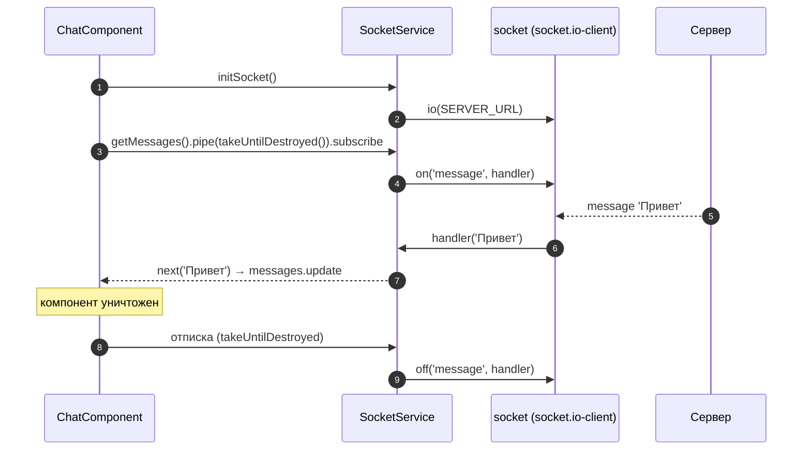

# 6_4 — Сокет и Observable в Angular: конспект

**Курс:** 3813ICT, неделя 6
**Источник:** `6_4-socket-and-observable.pdf`
**Связанные файлы:** [поправки](6_4-socket-observable-popravki.md) · [назад: 6_3 Сокеты](6_3-sockets-konspekt.md) · [дальше: 6_5 Чат на сокетах](6_5-socket-chat-konspekt.md)

> Значок **⚠** со ссылкой вида **П-N** ведёт в файл поправок. Там разобрано, где исходный материал курса расходится с официальной документацией, со ссылкой на источник.

> Проверка: код скомпилирован TypeScript 5.9 в строгом режиме и запущен с `socket.io` / `socket.io-client` 4.8 и RxJS 7.8.

**Содержание**

1. [Сокет на клиенте](#s1)
2. [Сокет в сервисе](#s2)
3. [Приём сообщений через колбэк](#s3)
4. [Отправка сообщений](#s4)
5. [Приём сообщений как Observable](#s5): [пример из материала](#s5-1) · [отписка и teardown](#s5-2) · [исправленный сервис](#s5-3) · [подписка в компоненте](#s5-4)
6. [Зачем Observable: операторы](#s6)
7. [Ключевые факты](#s7)

---

<a id="s1"></a>

## 1. Сокет на клиенте

В 6_3 мы разобрали, что такое сокет и Socket.IO. Теперь — как с ним работать из Angular. Здесь сойдутся три темы: сервисы (5_2), Observable (6_1) и сокеты (6_3). Итог — сервис, через который любой компонент может отправлять сообщения и получать их потоком.

Сокет даёт двусторонний канал: сервер может реагировать на события клиента и сам **отправлять** (`emit`) сообщения всем подключённым клиентам.

На клиенте соединение создаёт функция `io()` из пакета `socket.io-client`. Вот как это показано в материале:

```ts
import * as io from ‘socket.io-client’;

this.socket = io(this.url);
this.socket.on(‘new-messages’, m =>{alert(m);});
```

**Что в нём происходит.** `io(url)` подключается к серверу и возвращает объект сокета. `socket.on('new-messages', ...)` подписывается на событие с этим именем: каждый раз, когда сервер его отправит, выполнится колбэк — здесь `alert` с сообщением.

В этом коде три проблемы. Импорт `import * as io` в Socket.IO v4 даёт объект модуля, а не функцию, поэтому `io(this.url)` не скомпилируется; правильный импорт — `import { io } from 'socket.io-client'`. ⚠ [П-1](6_4-socket-observable-popravki.md#p-1) Имя события в коде (`'new-messages'`) не совпадает с тем, что написано в объяснении (`'new-message'`), а имена должны совпадать с сервером **в точности**. ⚠ [П-2](6_4-socket-observable-popravki.md#p-2) И кавычки типографские.

```ts
import { io, Socket } from 'socket.io-client';

const socket: Socket = io('http://localhost:3000');
socket.on('message', (m: string) => alert(m));   // имя — ровно как на сервере
```

---

<a id="s2"></a>

## 2. Сокет в сервисе

Работа с сервером должна жить в **сервисе**, а не в компоненте ([5_2 §7](5_2-services-konspekt.md#s7)). Так представление отделено от данных (как в MVC), а соединение одно и доступно любому компоненту.

Сервису сокета нужны три метода:

1. **инициализировать** соединение;
2. **получать** сообщения;
3. **отправлять** сообщения.

Чтобы отправлять и получать, сервис хранит ссылку на сокет в приватном поле. Вот как это в материале:

```ts
private socket;

initSocket(){
    this.socket = io(SERVER_URL);
}
```

Поле `private socket;` без типа в строгом режиме — ошибка компиляции («Member 'socket' implicitly has an 'any' type»). Тип сокета экспортирует сам пакет: `Socket` из `socket.io-client`. ⚠ [П-3](6_4-socket-observable-popravki.md#p-3)

```ts
import { io, Socket } from 'socket.io-client';

private socket?: Socket;          // ? — пока initSocket не вызван, сокета нет

initSocket(): void {
  this.socket = io(SERVER_URL);
}
```

---

<a id="s3"></a>

## 3. Приём сообщений через колбэк

Сообщения, которые сервер «проталкивает» клиенту, нужно как-то передать компоненту. Первый вариант в материале — метод, который принимает функцию-колбэк:

```ts
getMessage(next){
    this.socket.on(‘message’,message=>next(message));
}

// Использование в компоненте:
this.socketservice.getMessage((m)=>{alert(m)});
// или
this.socketservice.getMessage((m)=>{this.messages.push(m)});
```

**Что в нём происходит.** Сервис подписывается на событие `message` и при каждом сообщении вызывает переданную функцию `next`. Компонент сам решает, что делать с сообщением: показать `alert` или добавить в список.

Идея удачная: связь с сервером спрятана в сервисе, а **реакцию** определяет компонент. Материал справедливо замечает, что это та же идея, что у Observable. Но у колбэк-версии есть недостаток: **остановить** прослушивание нельзя. Если компонент уничтожен и создан заново, каждый вызов `getMessage` добавит ещё одного слушателя, и сообщения начнут приходить по несколько раз. Observable решает это отпиской ([§5.2](#s5-2)).

---

<a id="s4"></a>

## 4. Отправка сообщений

Чтобы отправить сообщение на сервер, вызывают `emit` у сокета: первым аргументом — имя события, дальше — данные. Вот пример из материала, он верный:

```ts
send(message: string): void {
    this.socket.emit('message', message);
}

// В компоненте:
this.socketservice.send(this.messagecontent);   // messagecontent связан с полем ввода
```

---

<a id="s5"></a>

## 5. Приём сообщений как Observable

<a id="s5-1"></a>

### 5.1 Пример из материала

Колбэк из §3 превращается в Observable: сервис возвращает поток сообщений, а компонент на него подписывается. Материал показывает два варианта записи:

```ts
// Вариант 1: Observable.create из 'rxjs/Observable'
getMessages(){
    return Observable.create((observer) => {
        this.socket.on('new-message', (message) => {
            observer.next(message);
        });
    });
}

// Вариант 2: new Observable
getMessages() {
    return new Observable((observer) => {
        this.socket.on('new-message', (message) => {
            observer.next(message);
        });
    });
}

// Использование в компоненте:
this.socketService.getMessages().subscribe(m => {
    this.messages.push(m);
});
```

**Что в нём происходит.** Функция внутри `new Observable` выполняется при подписке: она вешает на сокет слушателя, который передаёт каждое сообщение подписчику через `observer.next`. Компонент подписывается и добавляет сообщения в массив.

Первый вариант устарел: путь `rxjs/Observable` не существует с RxJS 6, а `Observable.create` объявлен устаревшим — используют `new Observable`. ⚠ [П-4](6_4-socket-observable-popravki.md#p-4) Но главная проблема у **обоих** вариантов — нет отписки.

<a id="s5-2"></a>

### 5.2 Отписка и teardown

Когда подписчик отписывается, Observable должен убрать то, что поставил при подписке. Для этого функция внутри `new Observable` **возвращает функцию очистки** (teardown). RxJS вызовет её при `unsubscribe()`.

В примере из материала функции очистки нет, поэтому слушатель на сокете остаётся навсегда. Проверено запуском: если трижды подписаться и отписаться (как при трёх переходах на страницу чата), на сокете остаётся **три** слушателя, и каждое сообщение обрабатывается трижды; с функцией очистки — **ноль**. ⚠ [П-5](6_4-socket-observable-popravki.md#p-5)

```ts
getMessages(): Observable<string> {
  return new Observable<string>((subscriber) => {
    const handler = (message: string) => subscriber.next(message);
    this.socket!.on('message', handler);           // при подписке — повесить слушателя
    return () => this.socket!.off('message', handler); // при отписке — снять ЭТОГО слушателя
  });
}
```

То же самое делает функция `fromEvent` из RxJS — она умеет работать с объектами, у которых есть методы `on` и `off`, как у сокета Socket.IO: `fromEvent<string>(socket, 'message')`.

<a id="s5-3"></a>

### 5.3 Исправленный сервис

Вот сервис целиком — с типами, правильным импортом и функцией очистки:

```ts
// src/app/services/socket.service.ts
import { Injectable } from '@angular/core';
import { Observable } from 'rxjs';
import { io, Socket } from 'socket.io-client';

const SERVER_URL = 'http://localhost:3000';

@Injectable({ providedIn: 'root' })
export class SocketService {
  private socket?: Socket;

  initSocket(): void {
    if (this.socket) return;                  // одно соединение на всё приложение
    this.socket = io(SERVER_URL);
  }

  send(message: string): void {
    this.socket?.emit('message', message);
  }

  getMessages(): Observable<string> {
    return new Observable<string>((subscriber) => {
      const socket = this.socket;
      if (!socket) {
        subscriber.error(new Error('Сначала вызовите initSocket()'));
        return;
      }
      const handler = (message: string) => subscriber.next(message);
      socket.on('message', handler);
      return () => socket.off('message', handler);   // teardown
    });
  }

  disconnect(): void {
    this.socket?.disconnect();
    this.socket = undefined;
  }
}
```

<a id="s5-4"></a>

### 5.4 Подписка в компоненте

Отписка должна происходить, когда компонент уничтожается. В Angular для этого есть оператор `takeUntilDestroyed` из `@angular/core/rxjs-interop`: он сам завершит подписку при уничтожении компонента. ⚠ [П-6](6_4-socket-observable-popravki.md#p-6)

```ts
// src/app/components/chat/chat.component.ts
import { Component, inject, signal } from '@angular/core';
import { takeUntilDestroyed } from '@angular/core/rxjs-interop';
import { SocketService } from '../../services/socket.service';

@Component({
  selector: 'app-chat',
  template: `
    <ul>
      @for (m of messages(); track $index) {
        <li>{{ m }}</li>
      }
    </ul>
  `,
})
export class ChatComponent {
  private socketService = inject(SocketService);
  protected messages = signal<string[]>([]);

  constructor() {
    this.socketService.initSocket();
    this.socketService
      .getMessages()
      .pipe(takeUntilDestroyed())             // в конструкторе — контекст внедрения, DestroyRef найдётся сам
      .subscribe((m) => this.messages.update((list) => [...list, m]));
  }
}
```

**Какая последовательность?**

1. **Angular создаёт `ChatComponent`** и в конструкторе вызывает `initSocket()`.
   1. Если соединения ещё нет — `io(SERVER_URL)` подключается к серверу.
2. **Компонент подписывается на `getMessages()`.**
   1. Выполняется функция внутри `new Observable`: на сокет вешается слушатель `handler`.
   2. `takeUntilDestroyed()` запоминает, что подписку нужно завершить при уничтожении компонента.
3. **Сервер присылает событие `message`.**
   1. Сокет вызывает `handler`, тот — `subscriber.next(message)`.
   2. Компонент добавляет сообщение в сигнал новым массивом, `@for` дорисовывает строку.
4. **Пользователь уходит со страницы чата — компонент уничтожается.**
   1. `takeUntilDestroyed` завершает подписку.
   2. RxJS вызывает функцию очистки: `socket.off('message', handler)` снимает слушателя.
5. **Пользователь возвращается** — создаётся новый компонент и **один** новый слушатель. Сообщения не дублируются.



---

<a id="s6"></a>

## 6. Зачем Observable: операторы

Колбэк из §3 тоже работал. Зачем обёртка в Observable? Кроме отписки, ради **операторов** RxJS — функций, которые преобразуют поток: отфильтровать, преобразовать, объединить с другим потоком. Операторов больше сотни, и они позволяют описывать сложную асинхронную логику декларативно — короткими цепочками.

Материал верно подчёркивает важное свойство: оператор **не меняет** исходный Observable, а возвращает **новый**, подписка на который строится на основе первого. Это «чистая» операция — исходный поток остаётся прежним.

Материал называет операторы в стиле `.map(...)`, `.filter(...)`, `.merge(...)` — цепочкой через точку. Так было в RxJS 5; сейчас операторы передают в метод `pipe`. ⚠ [П-7](6_4-socket-observable-popravki.md#p-7) Вот пример для чата:

```ts
import { filter, map, scan } from 'rxjs';

interface ChatMessage { channelId: number; author: string; text: string; }

// Только сообщения текущего канала, с обрезанным текстом
const channelMessages$ = messages$.pipe(
  filter((m: ChatMessage) => m.channelId === currentChannelId),
  map((m) => ({ ...m, text: m.text.trim() })),
);

// Счётчик полученных сообщений
const count$ = messages$.pipe(scan((count) => count + 1, 0));
```

| Оператор | Что делает |
|---|---|
| `map` | преобразует каждое значение |
| `filter` | пропускает только подходящие значения |
| `scan` | накапливает результат, как `reduce`, но выдаёт каждый промежуточный |
| `merge` (функция) | объединяет несколько потоков в один |
| `takeUntilDestroyed` | завершает поток при уничтожении компонента (Angular) |

---

<a id="s7"></a>

## 7. Ключевые факты

**Клиент Socket.IO**

- Пакет `socket.io-client`; импорт `import { io, Socket } from 'socket.io-client'`.
- `io(url)` подключается и возвращает сокет; `socket.on(имя, колбэк)` — слушать, `socket.emit(имя, данные)` — отправить.
- Имена событий на клиенте и сервере должны совпадать в точности.

**Сервис**

- Работа с сокетом — в сервисе: инициализация, отправка, получение.
- Поле сокета типизируют `Socket`; одно соединение на приложение.

**Observable из сокета**

- `new Observable(subscriber => { ... return teardown; })`: при подписке вешаем слушателя, в функции очистки снимаем его через `socket.off`.
- Без функции очистки слушатели копятся, и сообщения дублируются.
- Альтернатива — `fromEvent(socket, 'message')`.
- `Observable.create` и путь `rxjs/Observable` устарели.

**Компонент**

- Подписку завершают при уничтожении компонента: `pipe(takeUntilDestroyed())` в конструкторе (или с явным `DestroyRef`).

**Операторы**

- Операторы возвращают новый Observable, исходный не меняется.
- Операторы передают в `pipe(...)`: `map`, `filter`, `scan` и другие.
