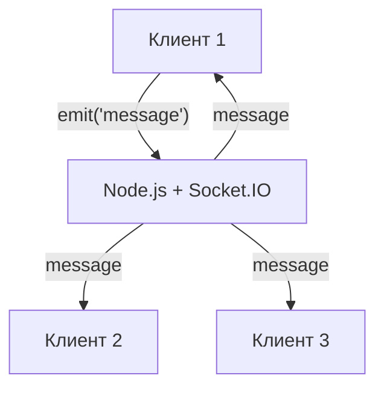
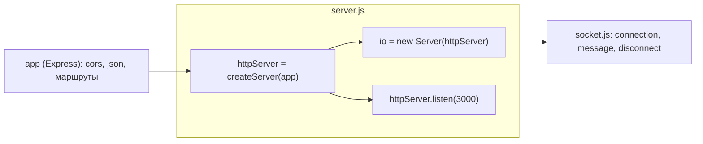
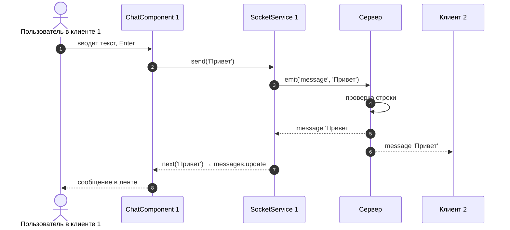

# 6_5 — Чат на Socket.IO, Node и Angular: конспект

**Курс:** 3813ICT, неделя 6
**Источник:** `6_5-sockets-coding-example.pdf`
**Связанные файлы:** [поправки](6_5-socket-chat-popravki.md) · [назад: 6_4 Сокет и Observable](6_4-socket-observable-konspekt.md) · [дальше: 6_6 Пространства имён и комнаты](6_6-socket-rooms-konspekt.md)

> Значок **⚠** со ссылкой вида **П-N** ведёт в файл поправок. Там разобрано, где исходный материал курса расходится с официальной документацией, со ссылкой на источник.

> Проверка: серверный код запущен с `socket.io` 4.8.3 и Express 5; рассылка сообщений проверена тремя настоящими клиентами `socket.io-client`.

**Содержание**

1. [Что строим](#s1)
2. [Пакеты](#s2)
3. [Сервер](#s3): [пример из материала](#s3-1) · [исправленная версия](#s3-2)
4. [Клиент: проект и форма](#s4)
5. [SocketService](#s5)
6. [ChatComponent](#s6): [пример из материала](#s6-1) · [исправленная версия](#s6-2)
7. [Запуск и проверка](#s7)
8. [Ключевые факты](#s8)

---

<a id="s1"></a>

## 1. Что строим

В 6_3 и 6_4 мы разобрали сокеты и то, как обернуть их в сервис с Observable. Этот файл собирает всё в работающий чат: сервер на Node.js и клиент на Angular. Здесь впервые видно, как одно сообщение за доли секунды оказывается у всех.

**Сценарий.** Клиенты 1, 2 и 3 подключаются к серверу по сокету. Когда клиент 1 отправляет сообщение, сервер пересылает его всем подключённым клиентам. Это и есть основа чата в реальном времени.



---

<a id="s2"></a>

## 2. Пакеты

Для сервера и клиента нужны **разные** пакеты — это важно, в материале здесь ошибка. ⚠ [П-1](6_5-socket-chat-popravki.md#p-1)

| Где | Пакет | Зачем |
|---|---|---|
| сервер | `express` | HTTP-сервер и маршруты |
| сервер | `cors` | CORS для HTTP-маршрутов Express |
| сервер | `socket.io` | **серверная** часть Socket.IO |
| клиент | `socket.io-client` | **клиентская** часть Socket.IO |
| клиент | `bootstrap` | готовые стили для формы |

```bash
# В папке сервера
npm init -y
npm install express cors socket.io

# В папке Angular-проекта
npm install socket.io-client bootstrap
```

Флаг `--save` не нужен — npm с версии 5 сохраняет зависимости сам. В материале он записан длинным тире (`–save`), с которым команда не сработает.

---

<a id="s3"></a>

## 3. Сервер

<a id="s3-1"></a>

### 3.1 Пример из материала

Материал разбивает сервер на три файла, чтобы его было проще сопровождать: `server.js` — основной, `socket.js` — логика сокетов, `listen.js` — запуск. Вот они:

```js
// ═════ server.js ═════
const express = require('express')
const app = express();
const cors = require('cors');
const http = require('http').Server(app);
const io = require('socket.io')(http,{
    cors: {
        origin: "http://localhost:4200",
        methods: ["GET", "POST"],
    }
});
const sockets = require('./socket.js');
const server = require('./listen.js');

//Define port used for the server
const PORT = 3000;

//Apply express middleware
app.use(cors());

//setup Socket
sockets.connect(io, PORT);

//Start server listening for requests.
server.listen(http,PORT);

// ═════ socket.js ═════
module.exports = {
    connect: function(io, PORT){
        io.on('connection',(socket) => {
            // When a connection request comes in output to the server console
            console.log('user connection on port '+ PORT + ' : '+ socket.id);

            // When a message comes in emit it back to all sockets with the message.
            socket.on('message',(message)=>{
                io.emit('message', message);
            })
        });
    }
}

// ═════ listen.js ═════
module.exports = {
    listen: function(app, PORT){
        app.listen(PORT,()=>{
            let d = new Date();
            let h = d.getHours();
            let m = d.getMinutes();
            console.log('Server has been started on port ' + PORT + ' at ' + h + ':' +m);
        });
    }
}
```

**Что в нём происходит.**

1. `server.js` создаёт Express-приложение, HTTP-сервер на его основе и сервер Socket.IO, привязанный к этому HTTP-серверу. В настройках Socket.IO разрешён CORS для Angular на `localhost:4200`.
2. `sockets.connect(io, PORT)` вешает обработчик подключения: при каждом новом клиенте в консоль выводится его `socket.id`, и начинается прослушивание события `message`.
3. Когда от клиента приходит `message`, сервер через `io.emit` рассылает его **всем** подключённым клиентам.
4. `server.listen(http, PORT)` запускает HTTP-сервер на порту 3000 и выводит время запуска.

Код работает — проверено запуском. Но в нём есть две ловушки, которые легко превратить в ошибку:

- В `listen.js` параметр назван `app`, хотя передаётся HTTP-сервер. Если «по названию» передать туда Express-приложение, `app.listen` создаст **новый** HTTP-сервер, к которому Socket.IO не привязан, и клиенты не смогут подключиться. Проверено: с `httpServer.listen` клиент подключается, с `app.listen` — ошибка `xhr poll error`. ⚠ [П-2](6_5-socket-chat-popravki.md#p-2)
- Материал пишет, что `io.emit` рассылает сообщение «всем **другим** клиентам». На самом деле `io.emit` отправляет **всем, включая отправителя**; без отправителя — `socket.broadcast.emit`. Для чата `io.emit` как раз подходит: отправитель тоже видит своё сообщение в ленте. ⚠ [П-3](6_5-socket-chat-popravki.md#p-3)

<a id="s3-2"></a>

### 3.2 Исправленная версия

Вот тот же сервер в стиле текущей документации Socket.IO v4: сервер создаётся через `new Server(httpServer, ...)`, слушает именно `httpServer`, а сообщения проверяются перед рассылкой. ⚠ [П-6](6_5-socket-chat-popravki.md#p-6)

```js
// ═════ server/server.js ═════
const express = require('express');
const cors = require('cors');
const { createServer } = require('http');
const { Server } = require('socket.io');
const sockets = require('./socket');

const PORT = 3000;
const CLIENT_ORIGIN = 'http://localhost:4200';

const app = express();
const httpServer = createServer(app);           // один HTTP-сервер для Express и Socket.IO
const io = new Server(httpServer, {
  cors: { origin: CLIENT_ORIGIN },              // CORS для Socket.IO — отдельная настройка
});

app.use(cors({ origin: CLIENT_ORIGIN }));       // CORS для HTTP-маршрутов Express
app.use(express.json());

sockets.connect(io);

// ВАЖНО: слушает httpServer, а не app — иначе Socket.IO останется без сервера
httpServer.listen(PORT, () => {
  console.log(`Server started on port ${PORT} at ${new Date().toLocaleTimeString()}`);
});

// ═════ server/socket.js ═════
module.exports = {
  connect(io) {
    io.on('connection', (socket) => {
      console.log('connected:', socket.id);

      socket.on('message', (message) => {
        // Сервер не доверяет клиенту: проверяем, что пришла непустая строка
        if (typeof message !== 'string' || !message.trim()) return;
        io.emit('message', message.trim());    // всем, включая отправителя
      });

      socket.on('disconnect', (reason) => {
        console.log('disconnected:', socket.id, reason);
      });
    });
  },
};
```

**Какая последовательность?**

1. **Сервер стартует.**
   1. Создаётся один HTTP-сервер для Express и Socket.IO.
   2. Socket.IO получает свою настройку CORS для `localhost:4200`, Express — свою.
   3. `httpServer.listen(3000)` начинает принимать подключения.
2. **Клиент подключается** — срабатывает `connection`, в консоли его `socket.id`.
3. **Клиент отправляет `message`.**
   1. Сервер проверяет, что это непустая строка; иначе сообщение молча отбрасывается.
   2. `io.emit('message', ...)` отправляет его всем подключённым клиентам, включая отправителя.
4. **Клиент закрывает вкладку** — срабатывает `disconnect` с причиной.



---

<a id="s4"></a>

## 4. Клиент: проект и форма

Клиентская часть в материале собирается так:

1. `ng new chat` — новый проект;
2. установить `socket.io-client` и `bootstrap` ([§2](#s2));
3. подключить Bootstrap — добавить `node_modules/bootstrap/dist/css/bootstrap.min.css` в массив `styles` в `angular.json`;
4. создать компонент чата — `ng generate component chat`;
5. создать сервис сокета — `ng generate service services/socket`;
6. в `chat.component.html` сделать форму: поле ввода, связанное с `messagecontent` через `[(ngModel)]`, и кнопку, по клику вызывающую `chat()`;
7. в `app.component.html` оставить заголовок и `<router-outlet>`;
8. вывести сообщения списком через `*ngFor`.

Материал настраивает всё через `app.module.ts`: подключает `FormsModule` (для `ngModel`), `CommonModule` (для `*ngFor`) и добавляет `SocketService` в `providers`. Так делали в приложениях на NgModule. В standalone-проекте (по умолчанию с Angular 19) каждый компонент сам указывает `imports`, `@for` не требует `CommonModule`, а сервис с `providedIn: 'root'` не нужно добавлять в `providers`. ⚠ [П-4](6_5-socket-chat-popravki.md#p-4)

Вот как выглядит маршрут, чтобы чат открывался на главной странице:

```ts
// src/app/app.routes.ts
import { Routes } from '@angular/router';
import { ChatComponent } from './chat/chat.component';

export const routes: Routes = [{ path: '', component: ChatComponent }];
```

---

<a id="s5"></a>

## 5. SocketService

Код сокета выносится в сервис, чтобы его можно было использовать в разных компонентах без дублирования. У сервиса три метода: инициализировать сокет, отправить сообщение, получать сообщения. Вот версия из материала:

```ts
import { Injectable } from '@angular/core';
import {Observable} from 'rxjs';
import io from 'socket.io-client';
const SERVER_URL = 'http://localhost:3000';
@Injectable({
  providedIn: 'root'
})
export class SocketService {
  private socket;
  constructor() { }

  //Setup Connection to socket server
  initSocket(){
    this.socket = io(SERVER_URL);
    return ()=>{this.socket.disconnect();}
  }

  //Emit a message to the socket server
  send(message: string){
    this.socket.emit('message', message);
  }

  //Listen for "message" events from the socket server
  getMessage(){
    return new Observable(observer=>{
      this.socket.on('message', (data) => {observer.next(data)
      });
    });
  }
}
```

**Что в нём происходит.** `initSocket` подключается к серверу и возвращает функцию для отключения. `send` отправляет событие `message`. `getMessage` возвращает Observable, который при подписке вешает на сокет слушателя и передаёт каждое сообщение подписчику.

Проблемы здесь те же, что разобраны в 6_4: поле `socket` без типа не компилируется в строгом режиме ([6_4 П-3](6_4-socket-observable-popravki.md#p-3)), а у Observable нет функции очистки, поэтому слушатели копятся ([6_4 П-5](6_4-socket-observable-popravki.md#p-5)). Функция отключения из `initSocket` нигде не используется. Импорт по умолчанию `import io from 'socket.io-client'` в v4 компилируется, но документация использует `import { io }`.

Исправленный сервис — тот же, что в [6_4 §5.3](6_4-socket-observable-konspekt.md#s5-3): `import { io, Socket }`, поле `socket?: Socket`, Observable с функцией очистки `socket.off('message', handler)` и метод `disconnect()`.

---

<a id="s6"></a>

## 6. ChatComponent

<a id="s6-1"></a>

### 6.1 Пример из материала

Компонент при загрузке инициализирует сокет, подписывается на поток сообщений и складывает их в массив; по кнопке отправляет текст из поля ввода. Вот код из материала:

```ts
import { Component, OnInit } from '@angular/core';
import {SocketService} from '../services/socket.service';
import {FormsModule} from '@angular/forms';
@Component({
  selector: 'app-chat',
  templateUrl: './chat.component.html',
  styleUrls: ['./chat.component.css']
})
export class ChatComponent implements OnInit {

  messagecontent:string="";
  messages:string[] = [];
  ioConnection:any;

  constructor(private socketService:SocketService) { }

  ngOnInit() {
    this.initIoConnection();
  }
  private initIoConnection(){
    this.socketService.initSocket();
    this.ioConnection = this.socketService.onMessage()
      .subscribe((message:string) => {
        //add new message to the messages array.
        this.messages.push(message);
      });
  }
  private chat(){
    if(this.messagecontent){
      //chek there is a message to send
      this.socketService.send(this.messagecontent);
      this.messagecontent=null;
    }else{
      console.log("no message");
    }
  }
}
```

```html
<div class="container">
  <form>
    <div class="form-group">
      <label for="messagecontent"> New Message</label>
      <input type="text" [(ngModel)]="messagecontent" name="messagecontent" id="messagecontent" class="form-control" />
    </div>
    <div class="form-group">
      <button (click)="chat()" class="btn btn-primary"> Send </button>
    </div>
  </form>
</div>
<li *ngFor="let  m of messages">{{m}}</li>
```

**Что в нём происходит.** В `ngOnInit` компонент подключает сокет и подписывается на сообщения; каждое новое сообщение добавляется в массив `messages`, и `*ngFor` выводит его пунктом списка. По кнопке `chat()` проверяет, что поле не пустое, отправляет текст через сервис и очищает поле.

В таком виде компонент не соберётся и будет «течь»: ⚠ [П-5](6_5-socket-chat-popravki.md#p-5)

- компонент вызывает `onMessage()`, а в сервисе метод называется `getMessage()`;
- `chat()` объявлен `private`, но вызывается из шаблона — шаблону `private`-члены недоступны ([5_2 §4.4](5_2-services-konspekt.md#s4-4));
- `this.messagecontent = null` — в строгом режиме `null` нельзя присвоить полю типа `string`;
- подписка (`ioConnection: any`) нигде не отменяется, сокет не отключается — после каждого перехода на страницу чата сообщения будут дублироваться;
- `<li>` стоит вне `<ul>` и вне контейнера.

<a id="s6-2"></a>

### 6.2 Исправленная версия

```ts
// src/app/chat/chat.component.ts
import { Component, inject, signal } from '@angular/core';
import { FormsModule } from '@angular/forms';
import { takeUntilDestroyed } from '@angular/core/rxjs-interop';
import { SocketService } from '../services/socket.service';

@Component({
  selector: 'app-chat',
  imports: [FormsModule],                        // для ngModel и ngSubmit
  template: `
    <div class="container">
      <h1>Chat</h1>
      <form (ngSubmit)="chat()">                 <!-- отправка и по кнопке, и по Enter -->
        <div class="mb-3">
          <label for="messagecontent" class="form-label">New Message</label>
          <input id="messagecontent" name="messagecontent" class="form-control"
                 [(ngModel)]="messagecontent" autocomplete="off" />
        </div>
        <button type="submit" class="btn btn-primary" [disabled]="!messagecontent.trim()">Send</button>
      </form>

      <h2 class="h5 mt-4">Chat Messages</h2>
      <ul>
        @for (m of messages(); track $index) {
          <li>{{ m }}</li>
        } @empty {
          <li class="text-muted">Сообщений пока нет</li>
        }
      </ul>
    </div>
  `,
})
export class ChatComponent {
  private socketService = inject(SocketService);

  messagecontent = '';                           // поле формы — строка, никогда не null
  protected messages = signal<string[]>([]);

  constructor() {
    this.socketService.initSocket();
    this.socketService
      .getMessages()
      .pipe(takeUntilDestroyed())                // отписка при уничтожении компонента
      .subscribe((message) => this.messages.update((list) => [...list, message]));
  }

  protected chat(): void {                       // protected — доступен шаблону
    const text = this.messagecontent.trim();
    if (!text) return;
    this.socketService.send(text);
    this.messagecontent = '';                    // пустая строка вместо null
  }
}
```

**Какая последовательность?**

1. **Роутер открывает `/`** и создаёт `ChatComponent`.
2. **Конструктор подключает сокет и подписывается на сообщения.**
   1. `initSocket()` создаёт соединение, если его ещё нет.
   2. `getMessages()` вешает слушателя на событие `message`; `takeUntilDestroyed` запомнит, что подписку нужно снять.
3. **Пользователь печатает** — `[(ngModel)]` обновляет `messagecontent`; кнопка активна, когда текст не пустой.
4. **Отправка (кнопка или Enter)** — `ngSubmit` вызывает `chat()`.
   1. Текст обрезается и отправляется через `socketService.send`.
   2. Поле очищается.
5. **Сервер рассылает сообщение всем**, в том числе этому клиенту.
   1. Слушатель в сервисе передаёт его в `next`.
   2. Компонент добавляет сообщение в сигнал новым массивом, `@for` дорисовывает строку.
6. **Пользователь уходит со страницы** — подписка завершается, слушатель снимается с сокета.



---

<a id="s7"></a>

## 7. Запуск и проверка

1. Сервер: `node server.js` (или `node --watch server.js`) — порт 3000.
2. Клиент: `ng serve` — порт 4200.
3. Открой `http://localhost:4200` в двух-трёх вкладках или разных браузерах.
4. Отправь сообщение в одной — оно появится во всех.
5. В DevTools → Network → фильтр **WS** видно соединение Socket.IO и сообщения в нём.

**Если используешь прокси `ng serve`** (как в практике недели 5, [5_3 §2.5](5_3-node-hosting-konspekt.md#s2-5)), добавь в `proxy.conf.json` запись для пути Socket.IO с поддержкой WebSocket, а в клиенте подключайся без адреса — `io()`:

```json
{
  "/api": { "target": "http://localhost:3000", "secure": false },
  "/socket.io": { "target": "http://localhost:3000", "ws": true }
}
```

---

<a id="s8"></a>

## 8. Ключевые факты

**Пакеты**

- Сервер: `express`, `cors`, `socket.io`. Клиент: `socket.io-client` (не `socket.io`!).

**Сервер**

- Express и Socket.IO работают на одном HTTP-сервере: `const httpServer = createServer(app); const io = new Server(httpServer, { cors })`.
- Слушать нужно `httpServer.listen(...)`; `app.listen(...)` создаёт другой сервер, и Socket.IO не заработает.
- CORS для Socket.IO задаётся в опциях `new Server`, для HTTP-маршрутов — пакетом `cors`.
- `io.emit` — всем, включая отправителя; `socket.broadcast.emit` — всем, кроме отправителя.
- Данные от клиента сервер проверяет перед рассылкой.

**Клиент**

- Сервис: `initSocket`, `send`, `getMessages` (Observable с функцией очистки), `disconnect`.
- Компонент: подписка с `takeUntilDestroyed`, список в сигнале, форма с `ngSubmit`.
- Методы, которые вызывает шаблон, не могут быть `private`.
- Для прокси `ng serve` путь `/socket.io` добавляют с `"ws": true`.
