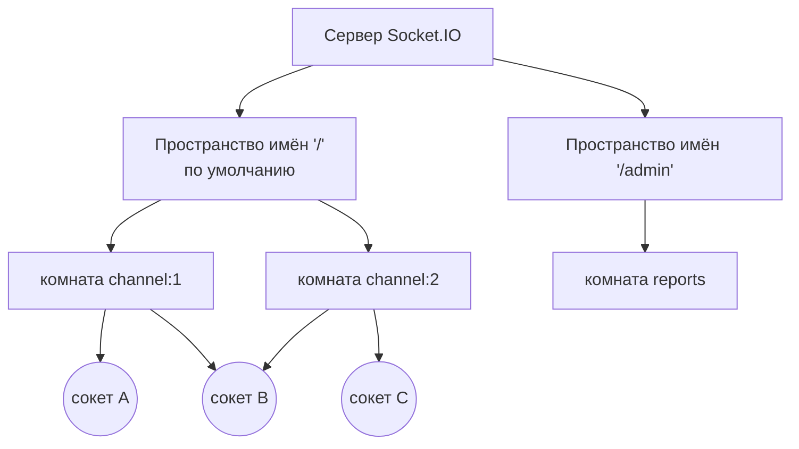
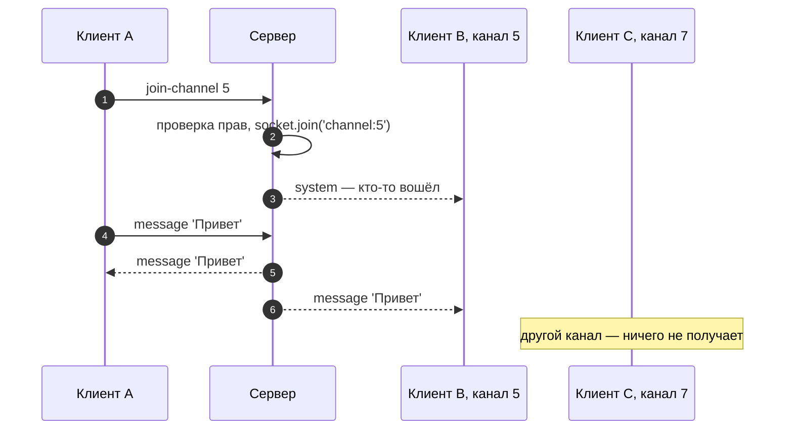

# 6_6 — Socket.IO: пространства имён и комнаты: конспект

**Курс:** 3813ICT, неделя 6
**Источник:** `6_6_socket_io_rooms.pdf`
**Связанные файлы:** [поправки](6_6-socket-rooms-popravki.md) · [назад: 6_5 Чат на сокетах](6_5-socket-chat-konspekt.md)

> Значок **⚠** со ссылкой вида **П-N** ведёт в файл поправок. Там разобрано, где исходный материал курса расходится с официальной документацией, со ссылкой на источник.

> Проверка: поведение пространств имён, комнат и рассылок проверено запуском `socket.io` 4.8.3 с несколькими клиентами `socket.io-client`.

**Содержание**

1. [Зачем группировать сокеты](#s1)
2. [Пространства имён](#s2)
3. [Комнаты](#s3): [что это](#s3-1) · [вход и выход](#s3-2) · [socket.id и личная комната](#s3-3)
4. [Кому уходит сообщение](#s4)
5. [Рабочий процесс комнат](#s5): [схема из материала](#s5-1) · [как на самом деле](#s5-2)
6. [Комнаты в чате Phase 2](#s6)
7. [Ключевые факты](#s7)

---

<a id="s1"></a>

## 1. Зачем группировать сокеты

Чат из 6_5 рассылает каждое сообщение **всем** подключённым. В Phase 2 так нельзя: у чата есть группы и каналы, и сообщение из канала `#homework` должны получить только те, кто в нём, а не все пользователи сервера. Нужно уметь отправлять сообщение **группе** сокетов.

Socket.IO даёт для этого два уровня группировки:

- **пространства имён** (namespaces) — крупное деление: отдельные «точки входа» с собственными событиями;
- **комнаты** (rooms) — мелкое деление внутри пространства имён: произвольные группы, в которые сокеты входят и из которых выходят.



---

<a id="s2"></a>

## 2. Пространства имён

**Пространство имён** (namespace) — отдельный канал связи с собственным путём, обработчиками подключения и событиями. Все пространства имён работают поверх **одного** низкоуровневого соединения (это называют мультиплексированием).

- Пространство имён по умолчанию — `'/'`; к нему относится всё, что мы писали через `io.on('connection', ...)`.
- У каждого пространства имён своё событие `connection`, поэтому несколько пространств могут работать одновременно, и набор событий в них может различаться.
- Новое пространство имён создаётся методом `of`.

Вот пример того, как пространство имён выглядит на сервере и на клиенте:

```js
// ═════ сервер ═════
const adminNsp = io.of('/admin');                   // пространство имён /admin

adminNsp.on('connection', (socket) => {
  socket.on('ban-user', (userId) => { /* ... */ });  // события только этого пространства
});

// ═════ клиент ═════
import { io } from 'socket.io-client';
const adminSocket = io('http://localhost:3000/admin');   // путь после адреса — пространство имён
```

Подключение к `/admin` не подключает клиента к `'/'` — это отдельные подключения (проверено: срабатывает только обработчик `/admin`).

**Когда использовать.** Пространства имён удобны, чтобы разделить **части приложения** с разными событиями и правами: например, обычный чат и панель администратора. Для деления **пользователей** на группы (каналы, чаты) используют комнаты.

Ссылка на документацию в материале устарела; актуальные страницы — [Namespaces](https://socket.io/docs/v4/namespaces/) и [Rooms](https://socket.io/docs/v4/rooms/). ⚠ [П-1](6_6-socket-rooms-popravki.md#p-1)

---

<a id="s3"></a>

## 3. Комнаты

<a id="s3-1"></a>

### 3.1 Что такое комната

**Комната** (room) — произвольная группа сокетов внутри одного пространства имён, которой можно разослать событие. Имя комнаты — любая строка: `'channel:5'`, `'group:2'`, `'room1'`.

Комнаты — **чисто серверное понятие**: клиент не знает, в каких он комнатах, и не может войти в комнату сам. Он может только **попросить** сервер (отправив событие), а решает и выполняет сервер.

<a id="s3-2"></a>

### 3.2 Вход и выход

На сервере сокет входит в комнату методом `join` и выходит методом `leave`:

```js
io.on('connection', (socket) => {
  socket.on('join-channel', (channelId) => {
    socket.join(`channel:${channelId}`);            // вошёл
  });

  socket.on('leave-channel', (channelId) => {
    socket.leave(`channel:${channelId}`);           // вышел
  });
});
```

При отключении сокет **автоматически** выходит из всех комнат — вручную ничего делать не нужно. Проверено: в комнате был 1 сокет, после отключения — 0. ⚠ [П-2](6_6-socket-rooms-popravki.md#p-2)

<a id="s3-3"></a>

### 3.3 socket.id и личная комната

У каждого подключённого сокета есть случайный уникальный идентификатор `socket.id`. Кроме того, каждый сокет **сразу при подключении** входит в комнату, названную его `id`. Поэтому отправить сообщение конкретному сокету можно как в комнату: `io.to(socketId).emit(...)`. Список комнат сокета — в `socket.rooms` (проверено: после входа в `room1` там две комнаты — своя и `room1`). ⚠ [П-2](6_6-socket-rooms-popravki.md#p-2)

Важная деталь: `socket.id` **меняется** при каждом переподключении (обрыв сети, перезагрузка страницы). Поэтому хранить его как «идентификатор пользователя» нельзя. Для личных сообщений документация советует комнату по **id пользователя**: при подключении сокет входит в `user:42`, и сообщение для пользователя уходит в эту комнату — во все его вкладки и устройства.

---

<a id="s4"></a>

## 4. Кому уходит сообщение

Для комнат есть два похожих вызова, и разница между ними важна: один **исключает** отправителя, другой — нет. ⚠ [П-3](6_6-socket-rooms-popravki.md#p-3) Вот полная таблица (проверено тремя клиентами A, B, C, где A и B в комнате `r1`, а событие инициировал A):

| Вызов на сервере | Кто получит | В проверке |
|---|---|---|
| `socket.emit(...)` | только этот клиент | A |
| `io.emit(...)` | все клиенты пространства имён, включая отправителя | A, B, C |
| `socket.broadcast.emit(...)` | все, кроме отправителя | B, C |
| `socket.to('r1').emit(...)` | все в комнате, **кроме отправителя** | B |
| `io.to('r1').emit(...)` | все в комнате, **включая отправителя** | A, B |
| `io.to(socketId).emit(...)` | один конкретный сокет | — |

Материал показывает `socket.to(roomid).emit(...)` — это рассылка без отправителя. Для чата, где отправитель должен увидеть своё сообщение из сервера, нужен `io.to(room).emit(...)`.

---

<a id="s5"></a>

## 5. Рабочий процесс комнат

<a id="s5-1"></a>

### 5.1 Схема из материала

Материал описывает работу с комнатами шестью шагами:

1. клиент подключается — возникает событие `connection` и создаётся `socket.id`;
2. клиент отправляет событие «войти в комнату», передавая имя комнаты строкой;
3. сервер хранит запись о том, какие `socket.id` вошли в какую комнату;
4. клиент отправляет событие с сообщением;
5. сервер отправляет сообщение каждому `socket.id`, записанному в комнате;
6. клиент показывает или использует полученное сообщение.

Там же сказано, что сообщения, проходящие через сервер, «сначала должны проверить, в какой они комнате, и отправляться только в неё».

Схема верно передаёт идею: вход в комнату и рассылка — на сервере. Но шаги 3 и 5 создают впечатление, что учёт участников и рассылку по списку нужно писать самому. Это делает Socket.IO: список участников каждой комнаты хранит его **адаптер**, а `io.to(room).emit` сам отправляет всем участникам. Документация прямо говорит, что эти внутренние структуры нельзя менять напрямую — только через `join` и `leave`. ⚠ [П-4](6_6-socket-rooms-popravki.md#p-4)

<a id="s5-2"></a>

### 5.2 Как на самом деле

Своя работа сервера — не учёт, а **проверка прав**: пускать ли этого пользователя в эту комнату и можно ли ему писать в неё. Вот пример того, как это выглядит:

```js
// ═════ server/socket.js ═════
module.exports = {
  connect(io) {
    io.on('connection', (socket) => {
      // Какой канал сейчас открыт у этого сокета — нужно, чтобы знать, куда слать его сообщения
      let currentRoom = null;

      socket.on('join-channel', (channelId) => {
        // Здесь проверка прав: состоит ли пользователь в группе этого канала (учебно — пропущено)
        if (currentRoom) socket.leave(currentRoom);          // из прошлого канала — выйти
        currentRoom = `channel:${channelId}`;
        socket.join(currentRoom);                            // адаптер запомнит участника сам
        socket.to(currentRoom).emit('system', 'Кто-то вошёл в канал');   // всем, кроме вошедшего
      });

      socket.on('message', (text) => {
        if (!currentRoom || typeof text !== 'string' || !text.trim()) return;
        io.to(currentRoom).emit('message', text.trim());    // всем в канале, включая отправителя
      });
      // при disconnect сокет сам покинет все комнаты
    });
  },
};
```

```ts
// ═════ клиент: SocketService (фрагмент) ═════
joinChannel(channelId: number): void {
  this.socket?.emit('join-channel', channelId);     // просьба — решает сервер
}
```

**Какая последовательность?**

1. **Клиент подключается** — у сокета появляется `socket.id`, он сразу в своей личной комнате.
2. **Клиент открывает канал 5** и отправляет `join-channel` с `5`.
   1. Сервер (в реальном приложении) проверяет, можно ли пользователю в этот канал.
   2. Если сокет был в другом канале — выходит из него.
   3. `socket.join('channel:5')` — адаптер добавляет сокет в комнату.
   4. Остальные участники канала получают системное сообщение (`socket.to` — без вошедшего).
3. **Клиент отправляет `message`.**
   1. Сервер проверяет, что сокет в канале и текст не пустой.
   2. `io.to('channel:5').emit(...)` — сообщение получают все участники комнаты, включая отправителя.
4. **Клиенты в других каналах** сообщение не получают.
5. **Клиент закрывает вкладку** — сокет автоматически выходит из всех комнат.



---

<a id="s6"></a>

## 6. Комнаты в чате Phase 2

Для чата с группами и каналами удобно такое соответствие:

| Что в чате | Что в Socket.IO |
|---|---|
| всё приложение чата | пространство имён `'/'` |
| канал группы | комната `channel:<id>` |
| личные уведомления пользователю | комната `user:<id>` (сокет входит в неё при подключении) |
| панель администратора, если нужны отдельные события | пространство имён `'/admin'` (по желанию) |

И правила, которые из этого следуют:

- **сервер решает, кого впустить в комнату**: клиент только просит, сервер проверяет права;
- **при смене канала** сокет выходит из прежней комнаты и входит в новую;
- **рассылку сообщения канала** делают через `io.to(room)`, чтобы отправитель тоже увидел его;
- **`socket.id` не сохраняют** как идентификатор пользователя — он меняется при переподключении.

---

<a id="s7"></a>

## 7. Ключевые факты

**Пространства имён**

- Namespace — отдельный канал с собственным путём и событиями поверх одного соединения; по умолчанию `'/'`.
- На сервере `io.of('/admin')`, на клиенте `io('http://host/admin')`.
- Подключение к одному пространству имён не подключает к другому.

**Комнаты**

- Room — группа сокетов внутри пространства имён; только серверное понятие.
- `socket.join(room)` и `socket.leave(room)` вызывает сервер; клиент может только попросить событием.
- При отключении сокет автоматически покидает все комнаты.
- Каждый сокет сразу состоит в комнате с именем своего `socket.id`; список — в `socket.rooms`.
- `socket.id` меняется при переподключении; для пользователя — комната `user:<id>`.
- Учёт участников комнат ведёт адаптер Socket.IO; менять его структуры напрямую нельзя.

**Рассылка**

- `socket.to(room).emit` — в комнату без отправителя; `io.to(room).emit` — в комнату с отправителем.
- `io.emit` — всем; `socket.broadcast.emit` — всем, кроме отправителя; `io.to(socketId).emit` — одному сокету.
