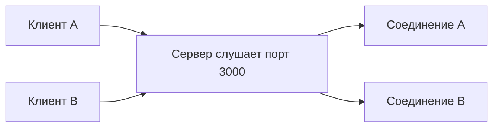
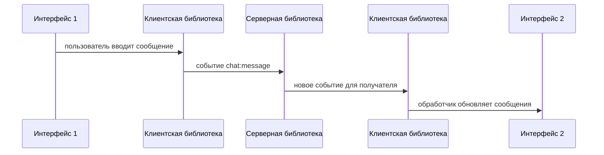

# 6_3 — Sockets: примеры и разбор

**Курс:** 3813ICT, неделя 6  
**Источник:** `6.3-Sockets.pdf`  
**Связанные файлы:** [конспект](6_3-sockets-konspekt.md) · [вопросы](6_3-sockets-voprosy.md) · [ответы](6_3-sockets-otvety.md) · [поправки](6_3-sockets-popravki.md)

## Пример 1. Читаем TCP-адрес

Сначала потренируемся читать адрес из схемы, прежде чем переходить к коду. Так легче увидеть, что клиент и сервер используют разные локальные порты.

```text
Клиент 192.0.2.24:53120 → Сервер 198.51.100.8:3000
```

Здесь сервер ждёт подключения на порту `3000`. Порт `53120` — локальная сторона клиента в этой условной записи; обычно её назначает операционная система. Вместе обе стороны описывают TCP-соединение. Порт сам по себе не является адресом компьютера — его нужно понимать вместе с IP.

## Пример 2. Почему слушающий порт не занят одним клиентом

Представь службу справочной линии: номер остаётся доступен для новых звонков, а уже принятый звонок получает отдельный разговор. Слушающий сокет играет роль номера, который принимает запросы; принятый сокет — отдельное соединение с одним клиентом.



На практике конкретный API организует это по-своему. В Node.js `net.createServer()` сообщает о новом соединении событием `connection`; сервер продолжает принимать следующие соединения. Эта TCP-демонстрация объясняет схему слайдов 4–5, но не является примером Socket.IO.

## Пример 3. Событие чата — путь от транспорта до приложения

Допустим, один пользователь отправляет сообщение `"Привет"`, а второй должен увидеть его сразу. Свяжем это с пройденными моделями: клиент отправляет сетевые данные через соединение, библиотека восстанавливает событие приложения, а обработчик интерфейса обновляет экран.



Из [6.1](6_1-observables-konspekt.md#s1) знакома идея «событие пришло — обработчик отреагировал». Но здесь сетевой протокол и библиотека должны ещё доставить данные между программами. Observable может описывать события внутри приложения; TCP-сокет обеспечивает сетевое соединение. Это связанные уровни, а не одно и то же.

## Пример 4. Не путай WebSocket и Socket.IO

Оба варианта могут поддерживать двунаправленный обмен, но протоколы не совпадают. Если сервер поднят как Socket.IO, браузерный `WebSocket` нельзя автоматически подключить к нему напрямую. Нужно использовать совместимый Socket.IO-клиент. Если сервер обычный WebSocket, Socket.IO-клиент также не подойдёт.

Socket.IO может выбрать WebSocket или HTTP long-polling как транспорт. Эта деталь полезна при диагностике соединения; приложению обычно достаточно работать с событиями библиотеки. ⚠ [П-3](6_3-sockets-popravki.md#p-3)

## Пример 5. Почему медленный обработчик мешает другим

Node.js умеет координировать множество соединений, пока обработчики быстро отдают управление циклу событий. Если обработчик одного сообщения выполняет тяжёлый синхронный цикл, пока он не закончится, цикл не сможет обработать другие готовые события.

```text
событие A → долгий синхронный расчёт ─────────────→ готово
события B и C ждут в очереди ────────────────────→ обработка
```

Поэтому из тезиса «много sockets» не следует «любая программа масштабируется сама». Следи за блокирующими операциями; для тяжёлых задач выбирай подходящий механизм, например асинхронный API или worker threads. Подробнее границы исходного утверждения разобраны в [П-1](6_3-sockets-popravki.md#p-1).

## Самопроверка

1. Что такое порт сервера в примере `198.51.100.8:3000`?
2. Почему после принятия клиента сервер сохраняет слушающий сокет?
3. На каком уровне находятся события `chat:message`?
4. Может ли Socket.IO использовать транспорт, отличный от WebSocket?
5. Почему долгий синхронный обработчик опасен для Node.js-сервера с множеством соединений?

Ответы и объяснения — в [файле ответов](6_3-sockets-otvety.md).
