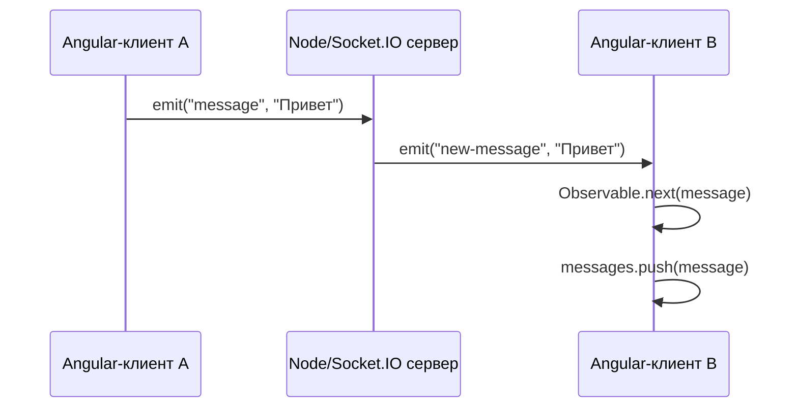

# 6_5 — Socket.IO: примеры и разбор

**Курс:** 3813ICT, неделя 6  
**Источник:** `6.5-sockets-coding-example.pdf`  
**Связанные файлы:** [конспект](6_5-sockets-coding-konspekt.md) · [вопросы](6_5-sockets-coding-voprosy.md) · [ответы](6_5-sockets-coding-otvety.md) · [поправки](6_5-sockets-coding-popravki.md)

## Пример 1. Вся цепочка сообщения

Чтобы понять, как части соединяются, проследим одно сообщение `"Привет"` от отправителя к списку сообщений:



В [6.4](6_4-socket-observable-konspekt.md#s1) мы уже отделили Socket.IO событие от Observable. Здесь серверное событие пересекает сеть, затем клиентская обёртка передаёт данные подписчику.

## Пример 2. Рассылка всем или остальным

У сервера есть два распространённых варианта рассылки:

```js
// Включая клиента, который отправил сообщение
io.emit('new-message', message);

// Всем, кроме клиента, чей socket обрабатывает сообщение
socket.broadcast.emit('new-message', message);
```

Если отправитель отображает сообщение немедленно локально, обычно удобнее сообщать сервером остальным. Если интерфейс ждёт подтверждённую сервером копию, рассылка всем тоже может быть уместна. Решение зависит от того, как устроена клиентская логика. ⚠ [П-1](6_5-sockets-coding-popravki.md#p-1)

## Пример 3. Сервис и Observable

Пример упрощён до ключевых частей сервиса:

```ts
import { Injectable } from '@angular/core';
import { Observable } from 'rxjs';
import { io, Socket } from 'socket.io-client';

@Injectable({ providedIn: 'root' })
export class SocketService {
  private socket: Socket = io('http://localhost:3000');

  sendMessage(message: string): void {
    this.socket.emit('message', message);
  }

  getMessages(): Observable<string> {
    return new Observable((observer) => {
      const handler = (message: string) => observer.next(message);
      this.socket.on('new-message', handler);
      return () => this.socket.off('new-message', handler);
    });
  }
}
```

Teardown здесь важен: если компонент больше не показывает чат, его подписка удаляет listener. Для приложения с несколькими экранами также нужно решить, когда соединение подключать и отключать.

## Пример 4. Клиент отображает список

Компонент держит сообщения и подписку:

```ts
messages: string[] = [];
private subscription?: Subscription;

ngOnInit(): void {
  this.subscription = this.socketService.getMessages().subscribe((message) => {
    this.messages.push(message);
  });
}

ngOnDestroy(): void {
  this.subscription?.unsubscribe();
}
```

В шаблоне массив можно показать через `*ngFor` в традиционном NgModule-проекте или современный `@for` в новых версиях Angular. Для `[(ngModel)]` импортируй `FormsModule` в правильный Angular scope.

## Пример 5. Что означает origin

`http://localhost:4200` и `http://localhost:3000` имеют одинаковую схему и хост, но разные порты, поэтому это разные origin. Серверная конфигурация должна разрешить ожидаемый origin для соединения. Это не заменяет аутентификацию: CORS определяет браузерное междоменно-доступное поведение, а не право пользователя читать конкретную комнату.

## Самопроверка

1. Кто получает событие от `io.emit`?
2. Как направить событие всем, кроме текущего отправителя?
3. Почему Angular-клиенту нужен `socket.io-client`?
4. Что делает teardown Observable?
5. Разрешает ли CORS-настройка пользователю доступ к закрытым данным?

Ответы — в [файле ответов](6_5-sockets-coding-otvety.md).
