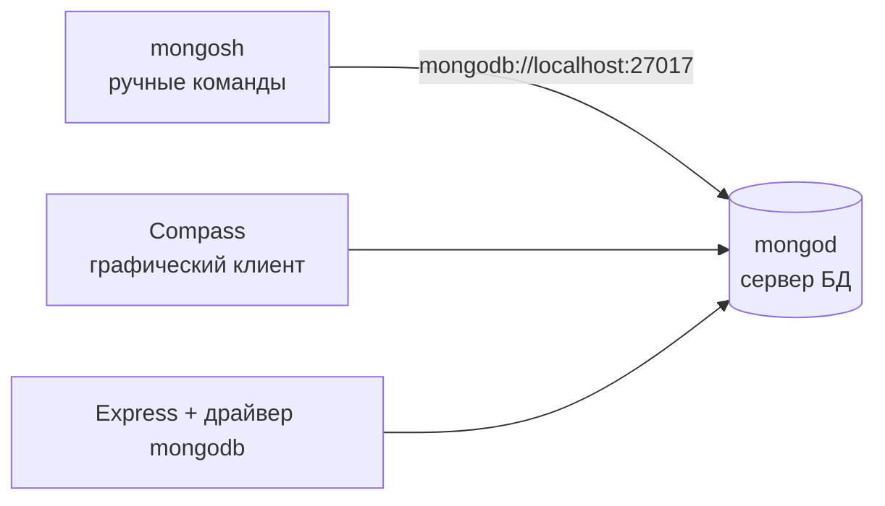

# 8_2 — MongoDB: установка, оболочка и запросы: конспект

**Курс:** 3813ICT, неделя 8
**Источник:** `8_2_-_MongoDB.pdf` (41 слайд)
**Связанные файлы:** [поправки](8_2-mongodb-popravki.md) · [примеры](8_2-mongodb-primery.md) · [вопросы](8_2-mongodb-voprosy.md) · [ответы](8_2-mongodb-otvety.md) · назад: [8_1 NoSQL](8_1-nosql-konspekt.md)

> Значок **⚠** со ссылкой вида **П-N** ведёт в файл поправок. Там разобрано, где исходный материал курса расходится с официальной документацией MongoDB, со ссылкой на источник.

> Проверка: команды сверены с документацией MongoDB 8.0 и `mongosh`. Скриншоты в исходнике сделаны на MongoDB 3.4.9 со старой оболочкой `mongo` (2018 год) — поэтому часть команд устарела.

**Содержание**

1. [Где работает MongoDB](#s1): [варианты развёртывания](#s1-1) · [mongod и mongosh](#s1-2)
2. [Установка и запуск](#s2): [macOS](#s2-1) · [Windows](#s2-2) · [запуск сервера и оболочки](#s2-3)
3. [Документ и `_id`](#s3)
4. [Базы и коллекции](#s4): [use и db](#s4-1) · [удаление базы](#s4-2) · [коллекции](#s4-3)
5. [Создание документов](#s5)
6. [Чтение: find](#s6): [запрос и проекция](#s6-1) · [равенство и AND](#s6-2) · [сравнение](#s6-3) · [логические операторы](#s6-4)
7. [Сортировка, limit, skip, подсчёт](#s7): [сортировка](#s7-1) · [limit и skip](#s7-2) · [пагинация](#s7-3) · [подсчёт](#s7-4)
8. [Изменение и удаление](#s8): [обновление](#s8-1) · [удаление](#s8-2) · [безопасный фильтр](#s8-3)
9. [Вложенные документы и ссылки](#s9)
10. [Шпаргалка](#s10)
11. [Ключевые факты](#s11)

---

<a id="s1"></a>

## 1. Где работает MongoDB

В 8_1 мы разобрались, почему для итогового проекта выбрана документная база и как устроены документы и коллекции. Теперь от идей переходим к рукам: установим MongoDB, подключимся к ней и научимся создавать, искать, менять и удалять документы. Все команды этой темы потом почти без изменений перейдут в код сервера на Node.js.

<a id="s1-1"></a>

### 1.1 Варианты развёртывания

MongoDB можно запустить двумя способами:

- **MongoDB Atlas** — MongoDB в облаке, которую полностью обслуживает компания MongoDB. Нужен аккаунт на mongodb.com; есть бесплатный уровень для учёбы. Ничего не нужно устанавливать.
- **MongoDB Community Edition** — бесплатная версия для запуска на своём компьютере или в Docker.

Дополнительно есть **MongoDB Compass** — графическая программа, в которой можно смотреть базы, коллекции и документы, выполнять запросы мышкой и открыть встроенную оболочку.

<a id="s1-2"></a>

### 1.2 mongod и mongosh

После установки у тебя появляются две программы, и важно не путать их роли:

- **`mongod`** — сам **сервер** базы данных (daemon). Он хранит данные на диске и принимает запросы, по умолчанию на порту `27017`.
- **`mongosh`** — **оболочка** (shell), клиент командной строки. Она подключается к `mongod` и отправляет ему команды. Удобна для проверки запросов и ручной работы с данными.

Сервер на Node.js подключается к `mongod` не через `mongosh`, а через **драйвер** — npm-пакет `mongodb`, который устанавливают в проект сервера.



---

<a id="s2"></a>

## 2. Установка и запуск

Правильная команда установки зависит от операционной системы и версии MongoDB, а инструкции в интернете быстро устаревают. Поэтому главный источник — официальная страница [Install MongoDB](https://www.mongodb.com/docs/manual/installation/) для твоей платформы; ссылку на неё даёт и материал.

<a id="s2-1"></a>

### 2.1 macOS

Вот как установка на macOS выглядит в материале курса:

```
brew install mongodb

sudo chown -R $(whoami) /usr/local/share/man/man5
/usr/local/share/man/man7
And chmod u+w /usr/local/share/man/man5 /usr/local/share/man/man7

sudo chown -R `id –un` /data/db

mongod
```

**Что в нём происходит.** Homebrew устанавливает MongoDB; затем текущему пользователю отдаются права на папки справочных страниц; создаётся каталог данных `/data/db` с правами на запись; сервер запускается командой `mongod`.

Эта инструкция устарела: формулы `mongodb` в основном репозитории Homebrew больше нет, менять владельца системных папок не нужно, а корневой каталог `/data` на современных macOS защищён от записи. В команде `id –un` к тому же стоит длинное тире вместо дефиса. ⚠ [П-1](8_2-mongodb-popravki.md#p-1)

Вот как это делается сейчас по официальной инструкции:

```bash
brew tap mongodb/brew                          # подключить официальный репозиторий MongoDB
brew update
brew install mongodb-community@8.0             # сервер, mongosh и Database Tools

brew services start mongodb-community@8.0      # запустить mongod как фоновую службу
brew services list                             # проверить, что служба работает

mongosh                                        # подключиться к localhost:27017
```

**Какая последовательность?**

1. **`brew tap mongodb/brew`** подключает официальный репозиторий формул MongoDB.
2. **`brew install mongodb-community@8.0`** устанавливает сервер `mongod`, оболочку `mongosh` и инструменты.
   1. Каталог данных и файл настроек Homebrew создаёт сам: на Apple Silicon — в `/opt/homebrew/var/mongodb` и `/opt/homebrew/etc/mongod.conf`, на Intel — в `/usr/local/...`.
   2. Никаких `sudo chown` не требуется.
3. **`brew services start ...`** запускает `mongod` в фоне; он будет стартовать и после перезагрузки. Остановить — `brew services stop mongodb-community@8.0`.
4. **`mongosh`** подключается к серверу на `localhost:27017`.

<a id="s2-2"></a>

### 2.2 Windows

На Windows `mongod` обычно устанавливается как служба и запускается сам. Оболочку `mongosh` материал предлагает поставить отдельно и добавить её папку (`C:\Program Files\mongosh`) в системную переменную `PATH`, чтобы запускать `mongosh` из любой папки. Это верно. Оболочка есть и внутри Compass.

<a id="s2-3"></a>

### 2.3 Запуск сервера и оболочки

Если `mongod` установлен как служба, он уже работает. Иначе его запускают вручную командой `mongod` (с указанием каталога данных или файла настроек). Затем в другом терминале — `mongosh`.

На скриншотах материала — старая оболочка `mongo` версии 3.4.9. Её объявили устаревшей в MongoDB 5.0 и **удалили** в 6.0; сейчас используют только `mongosh`. Ссылка на документацию «mongo shell» на слайде 8 тоже ведёт на старую версию. ⚠ [П-2](8_2-mongodb-popravki.md#p-2)

На скриншотах видно предупреждение **«Access control is not enabled»**: сервер работает без логина и пароля. Для локальной учёбы это нормально, пока `mongod` слушает только `localhost` (так он настроен по умолчанию); открывать такой сервер в сеть нельзя.

---

<a id="s3"></a>

## 3. Документ и `_id`

**Документ** — одна запись в MongoDB: набор пар «поле — значение», похожий на объект JSON. Значением поля может быть другой документ, массив или массив документов. Вот пример из материала:

```js
{
  id: 1,
  name: ‘the best of databases’,
  status: ‘active’,
  categories:[‘database’,’programming’]
}
```

**Что в нём происходит.** Документ описывает одну запись: числовой `id`, строки `name` и `status` и массив строк `categories`.

В примере типографские кавычки — в `mongosh` это синтаксическая ошибка. И важнее: поле `id` — это **обычное** поле, а не идентификатор документа. У каждого документа MongoDB есть обязательное поле **`_id`** с подчёркиванием. ⚠ [П-6](8_2-mongodb-popravki.md#p-6)

- `_id` уникален в пределах коллекции и не меняется после вставки;
- если его не указать, MongoDB сама создаст `_id` типа `ObjectId`;
- свой идентификатор можно положить прямо в `_id` — тогда отдельное поле `id` не нужно.

```js
{
  _id: 1,                                         // свой идентификатор — сразу в _id
  name: 'the best of databases',
  status: 'active',
  categories: ['database', 'programming'],
}
```

Документы хранятся в формате BSON, поэтому кроме типов JSON в них есть `ObjectId`, `Date`, разные числовые типы ([8_1 §5.2](8_1-nosql-konspekt.md#s5-2)).

---

<a id="s4"></a>

## 4. Базы и коллекции

Документы лежат в **коллекциях**, коллекции — в **базах данных**. Начнём сверху.

<a id="s4-1"></a>

### 4.1 use и db

Команда **`use <имя>`** делает базу текущей. Вот как это в материале:

```
MongoDB Enterprise > use test
switched to db test
```

Материал говорит, что `use` создаёт базу, если её нет. Точнее так: `use` только **переключает** оболочку на базу с этим именем, а на диске база появится, когда в неё впервые что-то запишут — вставят документ или создадут коллекцию. Пустая база не видна в `show dbs`. ⚠ [П-3](8_2-mongodb-popravki.md#p-3)

```js
use bookStore      // switched to db bookStore — пока только имя
db                 // bookStore — текущая база
show dbs           // bookStore в списке нет: в ней ещё ничего не записано
db.books.insertOne({ title: 'Learning Node.js' })
show dbs           // теперь bookStore есть
```

<a id="s4-2"></a>

### 4.2 Удаление базы

Вот как удаление базы показано в материале:

```
MongoDB Enterprise > use test
switched to db test
MongoDB Enterprise > db.dropDatabse
test.dropDatabse
```

**Что в нём происходит.** Слайд утверждает, что база удалена. На самом деле на скриншоте опечатка: `dropDatabse` вместо `dropDatabase`, и нет скобок вызова. Оболочка восприняла `db.dropDatabse` как обращение к **коллекции** с таким именем и просто вывела её полное имя `test.dropDatabse`. База **не** удалена. ⚠ [П-4](8_2-mongodb-popravki.md#p-4)

Правильная команда — `db.dropDatabase()`. Она необратимо удаляет **текущую** базу со всеми коллекциями, поэтому перед ней всегда проверяют, в какой базе находятся:

```js
db                    // убедиться, что это нужная база, а не рабочая!
db.dropDatabase()     // { ok: 1, dropped: 'test' }
```

<a id="s4-3"></a>

### 4.3 Коллекции

**Коллекция** — группа документов внутри базы; ближайший аналог — таблица в реляционной базе. Материал создаёт её явно и выводит список:

```
MongoDB Enterprise > db.createCollection('collectionName')
{ "ok" : 1 }
MongoDB Enterprise > show collections
TC
TCC
collectionName
```

Обе команды верны. Но явно создавать коллекцию обычно не нужно: MongoDB создаёт её **сама** при первой вставке документа. `createCollection` нужен, когда коллекции задают параметры, например правила валидации ([8_1 §5.3](8_1-nosql-konspekt.md#s5-3)). И помни, что имена методов чувствительны к регистру: в шпаргалке материала написано `db.createcollection` со строчной `c` — такой вызов завершится ошибкой. ⚠ [П-5](8_2-mongodb-popravki.md#p-5)

---

<a id="s5"></a>

## 5. Создание документов

Для вставки есть два метода: `insertOne` — один документ, `insertMany` — массив документов. Вот примеры из материала:

```
MongoDB Enterprise > db.collectionName.insertOne({test:"data", "id":1})
{
        "acknowledged" : true,
        "insertedId" : ObjectId("5b0cfa9071bfb59ce955dc01")
}
MongoDB Enterprise > db.collectionName.insertMany([{test:"data","id":2},{test:"data", id:3}])
{
        "acknowledged" : true,
        "insertedIds" : [
                ObjectId("5b0d07fa28c6c4c14bf599f1"),
                ObjectId("5b0d07fa28c6c4c14bf599f2")
        ]
}
```

**Что в нём происходит.** В коллекцию `collectionName` вставляется документ с полями `test` и `id`, затем ещё два. В ответе `acknowledged: true` — сервер подтвердил запись, а `insertedId` / `insertedIds` — созданные MongoDB значения `_id`.

Команды верные. Слайд с `insertMany` озаглавлен «Inserting Multiple Collections Into a Document» — наоборот: несколько **документов** вставляются в **коллекцию**. ⚠ [П-6](8_2-mongodb-popravki.md#p-6)

Вот та же вставка на данных каталога книг, с которым мы будем работать дальше:

```js
use bookStore

db.books.insertMany([
  { _id: 1, title: 'Learning Node.js', price: 42.5, category: 'programming', stock: 3 },
  { _id: 2, title: 'JavaScript in Practice', price: 35, category: 'programming', stock: 0 },
  { _id: 3, title: 'Computer Networks', price: 59, category: 'networking', stock: 5 },
  { _id: 4, title: 'Modern Web Design', price: 48, category: 'webdesign', stock: 2 },
  { _id: 5, title: 'Database Systems', price: 64, category: 'databases', stock: 7 },
]);
// { acknowledged: true, insertedIds: { '0': 1, '1': 2, '2': 3, '3': 4, '4': 5 } }
```

Если вставить документ с уже существующим `_id`, будет ошибка `E11000 duplicate key error`: `_id` уникален.

---

<a id="s6"></a>

## 6. Чтение: find

Данные есть — теперь их нужно находить. Почти всё чтение в MongoDB делается одним методом `find`, и вся гибкость — в его аргументах.

<a id="s6-1"></a>

### 6.1 Запрос и проекция

**`find(query, projection)`** принимает два необязательных аргумента:

- **query** (фильтр) — объект с условиями: какие документы вернуть;
- **projection** (проекция) — объект с перечнем полей: какие поля этих документов вернуть. Меньше полей — меньше данных гоняется между сервером и клиентом.

`find()` без аргументов или с пустым объектом `find({})` возвращает все документы коллекции. Результат — **курсор**: `mongosh` сам показывает первые 20 документов, а в Node.js курсор превращают в массив через `toArray()`.

Вот пример проекции из материала:

```
MongoDB Enterprise > db.collectionName.find({},{id:1,data:1})
{ "_id" : ObjectId("5b0cfa9071bfb59ce955dc01"), "id" : 1 }
{ "_id" : ObjectId("5b0d07fa28c6c4c14bf599f1"), "id" : 2 }
{ "_id" : ObjectId("5b0d07fa28c6c4c14bf599f2"), "id" : 3 }
```

**Что в нём происходит.** Проекция просит поля `id` и `data`. Поля `data` в документах нет (они содержат `test`), поэтому оно просто не появилось — без ошибки. А `_id` появился, хотя его не просили. ⚠ [П-8](8_2-mongodb-popravki.md#p-8)

Правила проекции:

- `1` — включить поле, `0` — исключить;
- **`_id` включается по умолчанию** — чтобы убрать, пишут `_id: 0`;
- включение и исключение **обычных** полей в одной проекции смешивать нельзя (исключение — `_id`);
- несуществующие поля молча игнорируются — опечатку в имени поля легко не заметить.

```js
db.books.find({}, { title: 1, price: 1, _id: 0 })   // только title и price
db.books.find({}, { stock: 0 })                      // все поля, кроме stock
// db.books.find({}, { title: 1, stock: 0 })         // ❌ ошибка: смешаны включение и исключение
```

<a id="s6-2"></a>

### 6.2 Равенство и AND

Простое условие «поле равно значению» записывается парой `поле: значение`. Если пар несколько, документ должен подходить под **все** — это AND. Вот пример из материала:

```
MongoDB Enterprise > db.collectionName.find({id:1,test:"data"})
{ "_id" : ObjectId("5b0cfa9071bfb59ce955dc01"), "test" : "data", "id" : 1 }
```

То есть `{ id: 1, test: "data" }` означает «`id = 1` и `test = "data"`». Пример верный.

```js
db.books.find({ category: 'programming', stock: 0 })   // программирование И нет на складе
```

<a id="s6-3"></a>

### 6.3 Операторы сравнения

Для условий «больше», «меньше» и других используют **операторы** — ключи со знаком `$` внутри условия поля:

| Оператор | Значение | Пример |
|---|---|---|
| `$eq` | равно | `{ price: { $eq: 35 } }` (то же, что `{ price: 35 }`) |
| `$ne` | не равно | `{ category: { $ne: 'programming' } }` |
| `$gt` / `$gte` | больше / больше или равно | `{ price: { $gt: 50 } }` |
| `$lt` / `$lte` | меньше / меньше или равно | `{ stock: { $lte: 2 } }` |
| `$in` / `$nin` | в списке / не в списке | `{ category: { $in: ['programming', 'databases'] } }` |

Вот примеры из материала:

```
MongoDB Enterprise > db.collectionName.find({id:{$gt:2}})
{ "_id" : ObjectId("5b0d07fa28c6c4c14bf599f2"), "test" : "data", "id" : 3 }
MongoDB Enterprise > db.collectionName.find({id:{$gte:2}})
{ ... "id" : 2 }
{ ... "id" : 3 }
MongoDB Enterprise > db.collectionName.find({id:{$lt:2}})
{ ... "id" : 1 }
MongoDB Enterprise > db.collectionName.find({id:{$lte:2}})
{ ... "id" : 1 }
{ ... "id" : 2 }
```

Примеры верные и хорошо показывают разницу строгого и нестрогого сравнения. Материал добавляет, что эти операторы работают со строками, числами и датами. Это так, но с важной оговоркой: сравниваются только значения **одного типа**. Если в поле число, а в запросе строка (`{ price: { $gt: '40' } }`), документ не найдётся. Строки сравниваются посимвольно, поэтому `'10' < '9'`. ⚠ [П-9](8_2-mongodb-popravki.md#p-9)

<a id="s6-4"></a>

### 6.4 Логические операторы

Когда нужно «или», «не» или сложная комбинация, используют логические операторы:

- **`$or: [условие1, условие2]`** — документ подходит, если выполнено **хотя бы одно** условие;
- **`$and: [условие1, условие2]`** — должны выполняться **все**; нужен редко, потому что пары в одном объекте и так означают AND. Нужен, когда два условия относятся к одному полю или в запросе несколько `$or`;
- **`$nor: [условие1, условие2]`** — не выполнено **ни одно**;
- **`$not`** — отрицание **оператора** для конкретного поля: `{ price: { $not: { $gt: 50 } } }`.

Вот пример `$or` из материала:

```
MongoDB Enterprise > db.collectionName.find({$or:[{id:1},{id:2}]})
{ ... "id" : 1 }
{ ... "id" : 2 }
MongoDB Enterprise > db.collectionName.find({$or:[{id:1},{id:2},{id:3}]})
{ ... "id" : 1 }
{ ... "id" : 2 }
{ ... "id" : 3 }
```

Пример верный. А вот в шпаргалке на последнем слайде подписи перепутаны: `$or` назван AND, а `$and` — OR. Кроме того, `$not` записан как самостоятельный оператор верхнего уровня, хотя он ставится внутри условия поля, а в строке с `$nor` лишняя скобка. ⚠ [П-12](8_2-mongodb-popravki.md#p-12)

```js
// Программирование ИЛИ дешевле 40
db.books.find({ $or: [{ category: 'programming' }, { price: { $lt: 40 } }] })

// Цена НЕ больше 50 (в том числе документы без поля price)
db.books.find({ price: { $not: { $gt: 50 } } })

// Ни программирование, ни сети
db.books.find({ $nor: [{ category: 'programming' }, { category: 'networking' }] })
```

Если нужно «одно из нескольких значений одного поля», короче `$in`: `{ category: { $in: ['programming', 'networking'] } }`.

---

<a id="s7"></a>

## 7. Сортировка, limit, skip, подсчёт

`find` возвращает курсор, и к нему можно цепочкой добавить методы, которые меняют результат: отсортировать, ограничить, пропустить. Так строятся «топ-5», «самая дорогая книга» и постраничная загрузка.

<a id="s7-1"></a>

### 7.1 Сортировка

`sort({ поле: 1 })` — по возрастанию, `sort({ поле: -1 })` — по убыванию. Вот примеры из материала:

```
MongoDB Enterprise > db.collectionName.find().sort({"id":1})
{ ... "id" : 1 }
{ ... "id" : 2 }
{ ... "id" : 3 }
MongoDB Enterprise > db.collectionName.find().sort({"id":-1})
{ ... "id" : 3 }
{ ... "id" : 2 }
{ ... "id" : 1 }
```

Примеры верные. Аргумент `sort` — всегда **объект**; в шпаргалке материала он записан как `sort(<field:value>)` без фигурных скобок. ⚠ [П-11](8_2-mongodb-popravki.md#p-11)

Можно сортировать по нескольким полям: `sort({ category: 1, price: -1 })` — сначала по категории, внутри категории от дорогих к дешёвым.

<a id="s7-2"></a>

### 7.2 limit и skip

- **`limit(n)`** — вернуть не больше `n` документов;
- **`skip(n)`** — пропустить первые `n` документов.

Вот примеры из материала:

```
MongoDB Enterprise > db.collectionName.find({test:"data"}).limit(1)
{ ... "id" : 1 }
MongoDB Enterprise > db.collectionName.find({test:"data"}).skip(2)
{ ... "id" : 3 }
```

Команды верные, но в них скрыта ловушка: **без `sort` порядок документов не гарантирован**. Здесь вернулся документ с `id: 1` просто потому, что он вставлен первым; после обновлений и удалений порядок может измениться. «Первый» и «пропустить два» имеют смысл только вместе с сортировкой. ⚠ [П-10](8_2-mongodb-popravki.md#p-10)

Поэтому «самую дорогую книгу» ищут так:

```js
db.books.find().sort({ price: -1 }).limit(1)
```

<a id="s7-3"></a>

### 7.3 Пагинация

**Пагинация** — выдача результатов страницами. Материал строит её из `skip` и `limit`:

```
find().skip(no_documents_on_page*page_number)
.limit(no_documents_on_page)
```

```
MongoDB Enterprise > db.collectionName.find({test:"data"}).skip(2).limit(1)
{ ... "id" : 3 }
```

Идея верная, но есть три уточнения. ⚠ [П-10](8_2-mongodb-popravki.md#p-10)

1. Формула `skip(size * page)` верна, только если страницы считают **с нуля**. Если первая страница — `1`, то `skip(size * (page - 1))`.
2. Нужна сортировка по полю с уникальными значениями (или с добавлением `_id`), иначе документы могут повторяться и пропадать между страницами.
3. Большой `skip` медленный: серверу всё равно приходится пройти все пропущенные документы. Для лент вроде сообщений чата используют пагинацию **по ключу**: «20 документов старше последнего показанного» ([примеры, пример 2](8_2-mongodb-primery.md#ex-2)).

```js
const size = 2, page = 2;                  // вторая страница, если нумерация с 1
db.books.find().sort({ title: 1, _id: 1 }).skip(size * (page - 1)).limit(size)
```

<a id="s7-4"></a>

### 7.4 Подсчёт

Чтобы узнать, сколько документов подходит под фильтр, используют **`countDocuments(фильтр)`**:

```js
db.books.countDocuments({})                           // все книги
db.books.countDocuments({ category: 'programming' })  // книги по программированию
db.books.estimatedDocumentCount()                     // быстрая оценка размера всей коллекции
```

В шпаргалке материала подсчёт записан как `find().count` — без скобок это не вызов, а сама функция, а метод `count()` в `mongosh` объявлен устаревшим. ⚠ [П-11](8_2-mongodb-popravki.md#p-11)

---

<a id="s8"></a>

## 8. Изменение и удаление

Изменение и удаление — единственные команды этой темы, которые могут испортить данные. Поэтому, кроме синтаксиса, здесь важна привычка проверять фильтр до записи.

<a id="s8-1"></a>

### 8.1 Обновление

Вот как обновление показано в материале:

```
db.<collection>.update(<query>,{$set:{field:value}})

db.<collection>.findOneAndUpdate(filter,update,options)
```

**Что в нём происходит.** `update` находит документы по запросу и через оператор `$set` задаёт полю новое значение; `findOneAndUpdate` обновляет один документ по фильтру.

Метод `update()` в `mongosh` объявлен устаревшим; вместо него — `updateOne` и `updateMany`, у которых из названия видно, сколько документов изменится. `findOneAndUpdate` работает, но с нюансом: по умолчанию он возвращает документ **до** изменения. ⚠ [П-7](8_2-mongodb-popravki.md#p-7)

Вот современные варианты:

```js
// Изменить поле у одного документа
db.books.updateOne({ _id: 4 }, { $set: { price: 45 } })
// { acknowledged: true, matchedCount: 1, modifiedCount: 1, ... }

// Изменить у всех подходящих — поднять цену книг по сетям на 10%
db.books.updateMany({ category: 'networking' }, { $mul: { price: 1.1 } })

// Уменьшить остаток на 1, но только если книга есть на складе
db.books.updateOne({ _id: 1, stock: { $gt: 0 } }, { $inc: { stock: -1 } })

// Изменить и сразу получить НОВУЮ версию документа
db.books.findOneAndUpdate({ _id: 4 }, { $set: { price: 44 } }, { returnDocument: 'after' })
```

Главные операторы обновления:

| Оператор | Что делает |
|---|---|
| `$set` | задать значение поля (создаст поле, если его нет) |
| `$unset` | удалить поле |
| `$inc` | прибавить число (отрицательное — отнять) |
| `$mul` | умножить |
| `$push` / `$pull` | добавить в массив / убрать из массива |

Без оператора (`updateOne({ _id: 4 }, { price: 45 })`) `mongosh` выдаст ошибку: для замены документа целиком есть отдельный метод `replaceOne`.

Ответ `matchedCount` показывает, сколько документов нашлось, а `modifiedCount` — сколько реально изменилось. Если `matchedCount: 0`, фильтр ничего не нашёл — в сервере это обычно повод ответить `404`.

<a id="s8-2"></a>

### 8.2 Удаление

Вот как удаление показано в материале:

```
db.<collection>.remove(<query>)

db.<collection>.remove({})                   // удалить все документы
db.<collection>.remove(<query>,{justOne:true})   // удалить один
```

`remove()` тоже устарел; вместо него:

```js
db.books.deleteOne({ _id: 2 })                   // не больше одного документа
db.books.deleteMany({ stock: 0 })                 // все подходящие
db.books.deleteMany({})                           // ⚠ ВСЕ документы коллекции
```

<a id="s8-3"></a>

### 8.3 Безопасный фильтр

Пустой фильтр `{}` подходит под **все** документы: `deleteMany({})` очистит коллекцию, `updateMany({}, ...)` изменит всё. Даже `deleteOne` с неточным фильтром удалит не тот документ. Вот привычка, которая защищает от таких ошибок:

1. **Сначала `find`** с тем же фильтром — посмотреть, что именно подходит.
2. **Точный фильтр** — по `_id`, если нужен один конкретный документ.
3. **Проверить ответ** — `matchedCount`, `modifiedCount`, `deletedCount`.

```js
db.books.find({ _id: 2 })          // 1. это та книга?
db.books.deleteOne({ _id: 2 })     // 2. удалить по _id
// { acknowledged: true, deletedCount: 1 }   // 3. удалилась ровно одна
```

---

<a id="s9"></a>

## 9. Вложенные документы и ссылки

В 8_1 мы выяснили, что связи в MongoDB моделируют встраиванием или ссылками ([8_1 §6](8_1-nosql-konspekt.md#s6)). Материал показывает, как это выглядит в командах, но делает при этом неверные выводы.

**Вложенный документ** создаётся так: значением поля становится объект. Вот пример из материала:

```
MongoDB Enterprise > db.parent.insertOne({"data":{"child":"data"},"id":1})
```

**Ссылка** — поле хранит `_id` другого документа:

```
MongoDB Enterprise > db.parent.insertOne({"data":{"child":ObjectId("5b0e5a19be60db679ff7abb4")},"id":1})
```

**Поиск по вложенному документу** в материале записан так:

```
MongoDB Enterprise > db.parent.find({data:{"child":"data"}})
{ "_id" : ObjectId("5b0e5a19be60db679ff7abb4"), "data" : { "child" : "data" }, "id" : 1 }
```

**Что в нём происходит.** Первая команда создаёт документ, у которого поле `data` — вложенный документ. Вторая сохраняет в поле ссылку на `_id` (здесь — документа из той же коллекции `parent`). Третья находит документ, у которого `data` равно `{ child: "data" }`.

Третий запрос работает, но требует **точного совпадения всего вложенного документа**, включая набор полей и их порядок: если у `data` появится второе поле, документ перестанет находиться. Обычно ищут по конкретному вложенному полю через **точечную нотацию** — `'data.child'` (в кавычках). ⚠ [П-13](8_2-mongodb-popravki.md#p-13)

```js
db.parent.find({ 'data.child': 'data' })    // ✅ по полю, независимо от остальных полей data
db.users.find({ 'profile.age': { $gte: 18 } })
```

А вот выводы материала неверны. На слайдах сказано, что частое использование вложенных документов означает, что нужна реляционная база, а соединять коллекции придётся вручную рекурсивной функцией в Node.js, что это «x2-проблема», которая «логарифмически замедляется», и поэтому для соединений нужна SQL-база. На деле встраивание — **основной рекомендуемый** способ моделирования в MongoDB, а соединять коллекции на сервере позволяет стадия агрегации **`$lookup`** (есть с версии 3.2). Утверждение про сложность внутренне противоречиво и ничем не подкреплено. ⚠ [П-14](8_2-mongodb-popravki.md#p-14)

```js
// Сообщения канала вместе с автором — одним запросом на сервере
db.messages.aggregate([
  { $match: { channelId: 2 } },
  { $lookup: { from: 'users', localField: 'authorId', foreignField: '_id', as: 'author' } },
]);
```

---

<a id="s10"></a>

## 10. Шпаргалка

Материал заканчивается шпаргалкой команд. Вот её исправленная версия для `mongosh`:

| Задача | Команда |
|---|---|
| Подключиться к `localhost:27017` | `mongosh` |
| Подключиться к другому серверу | `mongosh "mongodb://host:port"` или `mongosh --host host --port port` |
| Текущая база / сменить базу | `db` / `use <имя>` |
| Удалить текущую базу | `db` (проверить!), затем `db.dropDatabase()` |
| Создать коллекцию с параметрами | `db.createCollection('<имя>', { ... })` |
| Базы / коллекции / пользователи / роли | `show dbs` / `show collections` / `show users` / `show roles` |
| Вставить | `db.<coll>.insertOne(doc)` / `db.<coll>.insertMany([doc, doc])` |
| Найти | `db.<coll>.find(filter, projection)` / `db.<coll>.findOne(filter)` |
| Обновить | `db.<coll>.updateOne(filter, { $set: {...} })` / `updateMany(...)` |
| Удалить | `db.<coll>.deleteOne(filter)` / `deleteMany(filter)` |
| Посчитать | `db.<coll>.countDocuments(filter)` |
| Сортировать / ограничить / пропустить | `.sort({ field: 1 })` / `.limit(n)` / `.skip(n)` |
| Сравнение | `$eq` `$ne` `$gt` `$gte` `$lt` `$lte` `$in` `$nin` |
| Логика | `$and: [...]` — все; `$or: [...]` — хотя бы одно; `$nor: [...]` — ни одно; `{ field: { $not: { $gt: 5 } } }` |
| Справка | `help`, `db.<coll>.help()` |

---

<a id="s11"></a>

## 11. Ключевые факты

**Установка и инструменты**

- Atlas — MongoDB в облаке; Community Edition — локально; Compass — графический клиент.
- `mongod` — сервер (порт 27017); `mongosh` — оболочка; Node.js подключается через драйвер `mongodb`.
- На macOS: `brew tap mongodb/brew`, `brew install mongodb-community@8.0`, `brew services start …`; никаких `sudo chown`.
- Старая оболочка `mongo` удалена в MongoDB 6.0 — только `mongosh`.

**Базы, коллекции, документы**

- `use` переключает базу; на диске она появляется при первой записи.
- `db.dropDatabase()` необратимо удаляет текущую базу — сначала проверить `db`.
- Коллекция создаётся сама при первой вставке; `createCollection` — для параметров.
- У каждого документа есть уникальный `_id`; поле `id` — обычное поле.

**Чтение**

- `find(filter, projection)` возвращает курсор; `{}` — все документы.
- Несколько пар в фильтре — AND; `$or` — хотя бы одно условие; `$not` — внутри условия поля.
- Операторы сравнения сравнивают значения одного типа; строки — посимвольно.
- Проекция: `_id` включён по умолчанию; включение и исключение обычных полей не смешивают; несуществующие поля игнорируются.
- Без `sort` порядок не гарантирован; `limit`/`skip` — только вместе с сортировкой.
- Пагинация `skip(size * (page - 1)).limit(size)` с сортировкой по уникальному полю; для лент — по ключу.
- Подсчёт — `countDocuments(filter)`; `count()` устарел.

**Изменение**

- `updateOne`/`updateMany` с операторами `$set`, `$inc`, `$push`…; `update()` и `remove()` устарели.
- `findOneAndUpdate` по умолчанию возвращает документ до изменения; `returnDocument: 'after'` — после.
- `deleteOne`/`deleteMany`; пустой фильтр затрагивает все документы — сначала `find` с тем же фильтром.

**Связи**

- Поиск по вложенному полю — точечная нотация `'поле.вложенное'`; сравнение целого вложенного документа требует точного совпадения.
- Встраивание — нормальный способ моделирования; соединение коллекций — `$lookup`.
