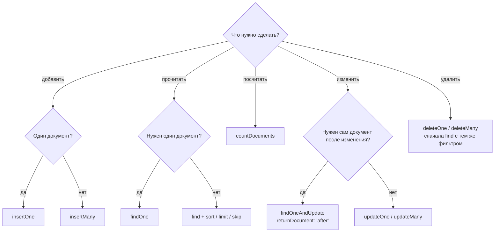
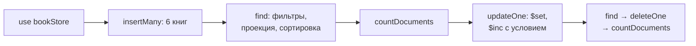
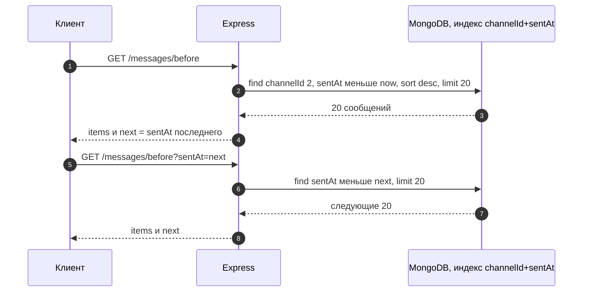
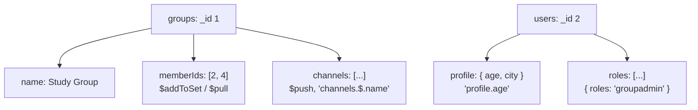
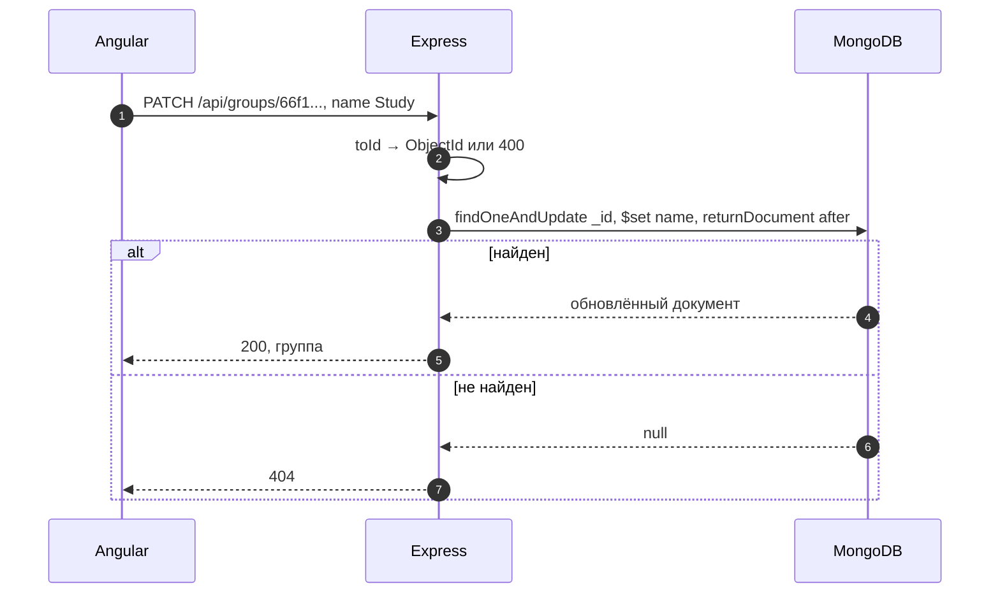

# 8_2 — MongoDB: примеры использования

**Курс:** 3813ICT, неделя 8
**Связанные файлы:** [конспект](8_2-mongodb-konspekt.md) · [поправки](8_2-mongodb-popravki.md) · [вопросы](8_2-mongodb-voprosy.md) · [ответы](8_2-mongodb-otvety.md)

Каждый пример — рабочий кусок кода, на который можно сослаться при разработке: один большой фрагмент, пошаговая последовательность и диаграмма. Примеры 1 и 3 выполняются в `mongosh`, примеры 2 и 4 — на сервере Express 5 с официальным драйвером `mongodb` (`npm install mongodb`).

> **Диаграммы.** В Obsidian mermaid рендерится сам. В VS Code нужно расширение **Markdown Preview Mermaid Support**.

---

<a id="ex-0"></a>

## Какой метод выбрать



| Пример | Что показывает |
|---|---|
| [1. Каталог книг: от пустой базы до отчёта](#ex-1) | вставка, фильтры, проекция, сортировка, подсчёт, безопасные изменения |
| [2. Лента сообщений: две пагинации](#ex-2) | `skip/limit` против пагинации по ключу, индекс под запрос |
| [3. Вложенные документы и массивы](#ex-3) | точечная нотация, запросы по массивам, `$push`, `$pull`, позиционный `$` |
| [4. Группы чата на MongoDB вместо JSON-файла](#ex-4) | CRUD-маршруты Express, `ObjectId`, коды ответа по результату операции |

---

<a id="ex-1"></a>

## Пример 1 — Каталог книг: от пустой базы до отчёта

**Когда использовать:** как опорный сценарий для любой работы в `mongosh`: наполнить коллекцию, задать типичные вопросы к данным и аккуратно изменить их. Команды выполняются подряд.

**Где в конспекте:** [§5 Создание](8_2-mongodb-konspekt.md#s5) · [§6 Чтение](8_2-mongodb-konspekt.md#s6) · [§7 Сортировка и подсчёт](8_2-mongodb-konspekt.md#s7) · [§8 Изменение](8_2-mongodb-konspekt.md#s8)

```js
// ═════ mongosh ═════
use bookStore
db                                         // bookStore — проверяем, где находимся

// ── Наполнить: свои _id, числа — числами
db.books.insertMany([
  { _id: 1, title: 'Learning Node.js', price: 42.5, category: 'programming', stock: 3 },
  { _id: 2, title: 'JavaScript in Practice', price: 35, category: 'programming', stock: 0 },
  { _id: 3, title: 'Computer Networks', price: 59, category: 'networking', stock: 5 },
  { _id: 4, title: 'Modern Web Design', price: 48, category: 'webdesign', stock: 2 },
  { _id: 5, title: 'Database Systems', price: 64, category: 'databases', stock: 7 },
  { _id: 6, title: 'Clean Interfaces', price: 29, category: 'webdesign', stock: 1 },
])

// ── Вопрос 1: книги по программированию, только название и цена
db.books.find({ category: 'programming' }, { title: 1, price: 1, _id: 0 })

// ── Вопрос 2: книги от 40 до 60 включительно, от дешёвых к дорогим
db.books.find({ price: { $gte: 40, $lte: 60 } }).sort({ price: 1 })

// ── Вопрос 3: веб-дизайн ИЛИ дешевле 35
db.books.find({ $or: [{ category: 'webdesign' }, { price: { $lt: 35 } }] })

// ── Вопрос 4: три самые дорогие книги (при равной цене — по _id)
db.books.find({}, { title: 1, price: 1 }).sort({ price: -1, _id: 1 }).limit(3)

// ── Вопрос 5: сколько всего и сколько нет на складе
db.books.countDocuments({})                 // 6
db.books.countDocuments({ stock: 0 })       // 1

// ── Изменение 1: новая цена у одной книги — фильтр по _id
db.books.updateOne({ _id: 4 }, { $set: { price: 45 } })
// { matchedCount: 1, modifiedCount: 1 }

// ── Изменение 2: продажа — уменьшить остаток, только если книга есть
db.books.updateOne({ _id: 2, stock: { $gt: 0 } }, { $inc: { stock: -1 } })
// { matchedCount: 0 } — книги нет на складе, ничего не изменилось

// ── Удаление: сначала посмотреть, потом удалить по _id, потом проверить
db.books.find({ _id: 6 })
db.books.deleteOne({ _id: 6 })
// { deletedCount: 1 }
db.books.countDocuments({})                 // 5
```

### Последовательность

1. `use bookStore` выбирает базу; `db` подтверждает, что это она.
2. `insertMany` создаёт коллекцию `books` (и базу на диске) и вставляет шесть документов со своими `_id`.
3. Вопрос 1: фильтр по равенству и проекция без `_id`.
4. Вопрос 2: два оператора на одно поле — диапазон; `sort` задаёт порядок.
5. Вопрос 3: `$or` — хотя бы одно из условий.
6. Вопрос 4: сортировка по убыванию цены с `_id` для стабильности и `limit(3)`.
7. Вопрос 5: `countDocuments` с пустым фильтром и с условием.
8. Изменение цены: `updateOne` по `_id`, в ответе `matchedCount` и `modifiedCount`.
9. Продажа: условие `stock: { $gt: 0 }` стоит **в фильтре**, поэтому остаток не уйдёт в минус. Проверка и изменение выполняются одной атомарной операцией над одним документом.
10. Удаление: `find` → `deleteOne` по `_id` → `countDocuments` для проверки.



---

<a id="ex-2"></a>

## Пример 2 — Лента сообщений: две пагинации

**Когда использовать:** загрузка сообщений канала порциями: «последние 20», затем «ещё 20 старше». Пример показывает оба способа из конспекта и почему для ленты лучше второй.

**Где в конспекте:** [§7.3 Пагинация](8_2-mongodb-konspekt.md#s7-3) · [П-10](8_2-mongodb-popravki.md#p-10)

```js
// ═════ server/db.js ═════
const { MongoClient } = require('mongodb');

const client = new MongoClient(process.env.MONGO_URL ?? 'mongodb://localhost:27017');
let db;

async function connect() {
  await client.connect();                      // одно подключение на весь сервер
  db = client.db('chat');
  // Индекс под главный запрос ленты: фильтр по каналу, сортировка по времени
  await db.collection('messages').createIndex({ channelId: 1, sentAt: -1, _id: -1 });
  return db;
}

module.exports = { connect, getDb: () => db };

// ═════ server/routes/messages.js ═════
const express = require('express');
const { getDb } = require('../db');

const router = express.Router();
const LIMIT = 20;

// Способ 1: skip/limit — GET /api/channels/2/messages?page=3
// Просто, но: каждая следующая страница медленнее (сервер проходит пропущенные),
// и если пока пользователь листает, придут новые сообщения — страницы «съедут»
router.get('/:channelId/messages', async (req, res) => {
  const channelId = Number(req.params.channelId);
  const page = Math.max(1, Number(req.query.page) || 1);

  const items = await getDb().collection('messages')
    .find({ channelId })
    .sort({ sentAt: -1, _id: -1 })             // стабильный порядок
    .skip(LIMIT * (page - 1))                  // страницы с 1
    .limit(LIMIT)
    .toArray();                                // курсор → массив

  res.json({ items, page });
});

// Способ 2: по ключу — GET /api/channels/2/messages/before?sentAt=2026-09-24T09:00:00.000Z
// Берём сообщения СТАРШЕ последнего показанного: индекс сразу находит место,
// скорость не зависит от «номера страницы», новые сообщения ленту не сдвигают
router.get('/:channelId/messages/before', async (req, res) => {
  const channelId = Number(req.params.channelId);
  const before = req.query.sentAt ? new Date(req.query.sentAt) : new Date();
  if (Number.isNaN(before.getTime())) {
    return res.status(400).json({ error: 'Invalid sentAt' });
  }

  const items = await getDb().collection('messages')
    .find({ channelId, sentAt: { $lt: before } })
    .sort({ sentAt: -1, _id: -1 })
    .limit(LIMIT)
    .toArray();

  // Клиенту — курсор для следующего запроса: время самого старого из выданных
  const next = items.length === LIMIT ? items[items.length - 1].sentAt : null;
  res.json({ items, next });
});

module.exports = router;

// ═════ server/server.js (фрагмент) ═════
// const { connect } = require('./db');
// app.use('/api/channels', require('./routes/messages'));
// connect().then(() => app.listen(3000));      // сервер принимает запросы только после подключения к БД
```

### Последовательность (способ 2)

1. Клиент открывает канал и запрашивает `/api/channels/2/messages/before` без `sentAt` — сервер берёт «сейчас».
2. Запрос использует индекс `{ channelId, sentAt, _id }`: находит канал и сразу самые новые сообщения.
3. Сервер возвращает 20 сообщений и `next` — время самого старого из них.
4. Пользователь нажимает «Загрузить старые» — клиент отправляет `?sentAt=<next>`.
5. Сервер находит 20 сообщений старше этой метки — так же быстро, как первую страницу.
6. Когда сообщений меньше 20, `next` равен `null` — больше загружать нечего.

(Если у нескольких сообщений одинаковое `sentAt`, для полной точности в условие добавляют и `_id`; для учебного чата достаточно времени.)



---

<a id="ex-3"></a>

## Пример 3 — Вложенные документы и массивы

**Когда использовать:** данные с вложенными объектами (профиль, настройки) и массивами (участники группы, каналы). Пример показывает, как по ним искать и как их менять, не переписывая документ целиком.

**Где в конспекте:** [§9 Вложенные документы и ссылки](8_2-mongodb-konspekt.md#s9) · [П-13](8_2-mongodb-popravki.md#p-13) · [§8.1 Операторы обновления](8_2-mongodb-konspekt.md#s8-1)

```js
// ═════ mongosh ═════
use chat

db.users.insertOne({
  _id: 2,
  username: 'anna',
  profile: { age: 25, city: 'Brisbane' },          // вложенный документ
  roles: ['user', 'groupadmin'],                    // массив строк
})

db.groups.insertOne({
  _id: 1,
  name: 'Study Group',
  memberIds: [2, 3],
  channels: [                                       // массив вложенных документов
    { id: 1, name: 'general' },
    { id: 2, name: 'homework' },
  ],
})

// ── Поиск по вложенному полю: точечная нотация в кавычках
db.users.find({ 'profile.city': 'Brisbane' })
db.users.find({ 'profile.age': { $gte: 18 } })
// ⚠ db.users.find({ profile: { city: 'Brisbane' } }) — ничего: сравнивается ВЕСЬ вложенный документ

// ── Поиск по массиву: условие на значение ищет среди элементов
db.users.find({ roles: 'groupadmin' })             // у кого среди ролей есть groupadmin
db.groups.find({ memberIds: 3 })                   // группы, где состоит пользователь 3
db.groups.find({ 'channels.name': 'homework' })    // группы с каналом homework

// ── Изменить вложенное поле, не трогая остальные
db.users.updateOne({ _id: 2 }, { $set: { 'profile.age': 26 } })

// ── Массивы
db.groups.updateOne({ _id: 1 }, { $addToSet: { memberIds: 4 } })   // добавить, если ещё нет
db.groups.updateOne({ _id: 1 }, { $pull: { memberIds: 3 } })       // убрать значение
db.groups.updateOne(
  { _id: 1 },
  { $push: { channels: { id: 3, name: 'random' } } },               // добавить канал
)

// ── Переименовать найденный элемент массива: позиционный оператор $
db.groups.updateOne(
  { _id: 1, 'channels.id': 2 },                                      // найти группу И элемент
  { $set: { 'channels.$.name': 'deadlines' } },                      // $ — индекс найденного элемента
)

db.groups.findOne({ _id: 1 })
// { _id: 1, name: 'Study Group', memberIds: [2, 4],
//   channels: [{ id: 1, name: 'general' }, { id: 2, name: 'deadlines' }, { id: 3, name: 'random' }] }
```

### Последовательность

1. Вставляются пользователь с вложенным `profile` и массивом `roles` и группа с массивами `memberIds` и `channels`.
2. Поиск по `'profile.city'` находит пользователя, какие бы ещё поля ни были в `profile`; запрос с целым `profile` ничего не находит.
3. Условие на массив (`roles: 'groupadmin'`) совпадает, если значение есть **среди элементов**.
4. `'channels.name'` ищет по полю документов внутри массива.
5. `$set` с точечной нотацией меняет одно вложенное поле.
6. `$addToSet` добавляет участника, только если его ещё нет; `$pull` убирает; `$push` добавляет канал.
7. Позиционный `$` меняет именно тот элемент массива, который совпал с условием `'channels.id': 2`.
8. Все изменения — операции над одним документом, поэтому каждая атомарна.



---

<a id="ex-4"></a>

## Пример 4 — Группы чата на MongoDB вместо JSON-файла

**Когда использовать:** перенос данных итогового проекта из JSON-файлов (неделя 5) в MongoDB. Маршруты те же, но вместо «прочитать файл → изменить массив → записать файл» — одна операция базы, без ручной очереди записи.

**Где в конспекте:** [§8 Изменение и удаление](8_2-mongodb-konspekt.md#s8) · [§3 Документ и `_id`](8_2-mongodb-konspekt.md#s3) · [П-7](8_2-mongodb-popravki.md#p-7)

```js
// ═════ server/routes/groups.js (Express 5 + драйвер mongodb) ═════
const express = require('express');
const { ObjectId } = require('mongodb');
const { getDb } = require('../db');            // из примера 2

const router = express.Router();
const groups = () => getDb().collection('groups');

// Строку из адреса → ObjectId; null, если строка не похожа на ObjectId
function toId(value) {
  return ObjectId.isValid(value) ? new ObjectId(value) : null;
}

// GET /api/groups — список, только нужные поля
router.get('/', async (req, res) => {
  const list = await groups()
    .find({}, { projection: { name: 1, memberIds: 1 } })   // в драйвере проекция — в опциях
    .sort({ name: 1 })
    .toArray();
  res.json(list);
});

// POST /api/groups — создать
router.post('/', async (req, res) => {
  const name = (req.body?.name ?? '').trim();
  if (!name) return res.status(400).json({ error: 'Name is required' });

  const doc = { name, memberIds: [], channels: [], createdAt: new Date() };
  const result = await groups().insertOne(doc);             // _id создаст MongoDB
  res.status(201).json({ _id: result.insertedId, ...doc });
});

// PATCH /api/groups/:id — переименовать и вернуть новую версию
router.patch('/:id', async (req, res) => {
  const _id = toId(req.params.id);
  const name = (req.body?.name ?? '').trim();
  if (!_id) return res.status(400).json({ error: 'Invalid id' });
  if (!name) return res.status(400).json({ error: 'Name is required' });

  // Драйвер 6+: findOneAndUpdate возвращает документ (или null), а не обёртку
  const updated = await groups().findOneAndUpdate(
    { _id },
    { $set: { name } },
    { returnDocument: 'after' },                             // по умолчанию был бы документ ДО изменения
  );
  if (!updated) return res.status(404).json({ error: 'Group not found' });
  res.json(updated);
});

// DELETE /api/groups/:id
router.delete('/:id', async (req, res) => {
  const _id = toId(req.params.id);
  if (!_id) return res.status(400).json({ error: 'Invalid id' });

  const { deletedCount } = await groups().deleteOne({ _id });   // фильтр только по _id
  if (deletedCount === 0) return res.status(404).json({ error: 'Group not found' });
  res.status(204).end();
});

module.exports = router;

// ═════ server/server.js (фрагмент) ═════
// app.use('/api/groups', require('./routes/groups'));
// Express 5 сам передаёт ошибки из async-обработчиков в обработчик ошибок:
// app.use((err, req, res, next) => { console.error(err); res.status(500).json({ error: 'Server error' }); });
```

### Последовательность (PATCH)

1. Клиент отправляет `PATCH /api/groups/66f1…` с телом `{ "name": "Study" }`.
2. Сервер превращает строку из адреса в `ObjectId`; если строка не подходит — `400`.
3. Пустое имя — `400`.
4. `findOneAndUpdate` находит группу по `_id` и задаёт новое имя одной операцией.
5. С `returnDocument: 'after'` драйвер возвращает уже обновлённый документ.
6. Если документ не найден — `null`, сервер отвечает `404`; иначе — `200` и группа.


