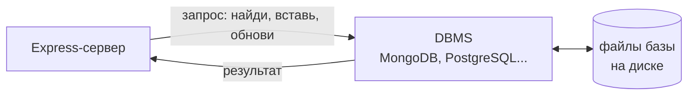
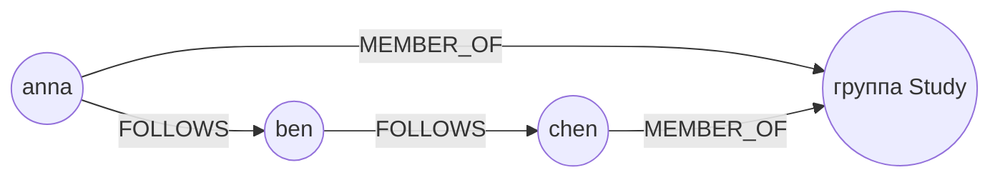
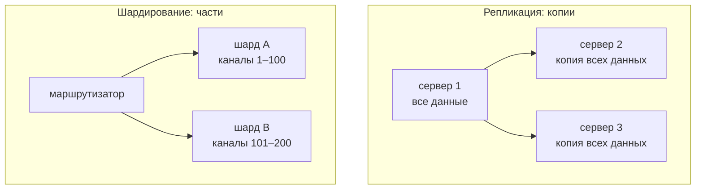
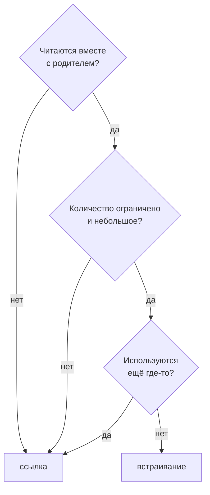

# 8_1 — NoSQL-хранилища: конспект

**Курс:** 3813ICT, неделя 8 (на неделе 7 новых материалов нет)
**Источник:** `8.1 - NoSQL Storage.pdf`
**Связанные файлы:** [поправки](8_1-nosql-popravki.md) · [примеры](8_1-nosql-primery.md) · [вопросы](8_1-nosql-voprosy.md) · [ответы](8_1-nosql-otvety.md) · дальше: [8_2 MongoDB](8_2-mongodb-konspekt.md)

> Значок **⚠** со ссылкой вида **П-N** ведёт в файл поправок. Там разобрано, где исходный материал курса расходится с официальной документацией, со ссылкой на источник.

**Содержание**

1. [Зачем приложению база данных](#s1): [проблема JSON-файлов](#s1-1) · [база данных и DBMS](#s1-2)
2. [Реляционная модель и NoSQL](#s2): [реляционная модель](#s2-1) · [что такое NoSQL](#s2-2) · [сравнение](#s2-3)
3. [Модели NoSQL](#s3): [ключ–значение](#s3-1) · [документы](#s3-2) · [графы](#s3-3) · [широкие столбцы](#s3-4) · [мультимодельные](#s3-5)
4. [Как выбирать базу данных](#s4): [критерии из материала](#s4-1) · [масштабирование](#s4-2) · [репликация и шардирование](#s4-3) · [вопросы для выбора](#s4-4)
5. [MongoDB: первое знакомство](#s5): [термины](#s5-1) · [документ и BSON](#s5-2) · [гибкая схема и валидация](#s5-3) · [атомарность и транзакции](#s5-4)
6. [Встраивать или ссылаться](#s6)
7. [Как это ляжет на Phase 2](#s7)
8. [Ключевые факты](#s8)

---

<a id="s1"></a>

## 1. Зачем приложению база данных

В неделях 5 и 6 мы передавали данные между клиентом и сервером: через HTTP-запросы и сокеты. Но где эти данные живут, когда запрос закончился, а сервер перезапустили? Пока ответ был — в памяти сервера или в JSON-файле. Эта тема объясняет, почему для настоящего приложения этого мало и какие бывают базы данных, а следующая (8_2) — как работать с одной из них, MongoDB.

<a id="s1-1"></a>

### 1.1 Проблема JSON-файлов

В 5_6 сервер хранил пользователей в `users.json`: читал весь файл, менял массив и записывал весь файл обратно. Для учебного проекта это работает, но у подхода есть пределы, которые быстро дают о себе знать:

- **весь файл на каждую операцию** — чтобы изменить одного пользователя, читаем и пишем тысячи;
- **одновременная запись** — два запроса могут затереть изменения друг друга; в 5_6 пришлось писать очередь вручную;
- **поиск только перебором** — «найди сообщения канала 5 за вчера» означает пройти весь массив;
- **нет правил для данных** — ничто не мешает записать `age: "двадцать"` или забыть обязательное поле;
- **нет восстановления** — если процесс упадёт посреди записи, файл может остаться испорченным.

Все эти задачи давно решены в специальных программах — системах управления базами данных.

<a id="s1-2"></a>

### 1.2 База данных и DBMS

**База данных** — организованный набор данных, который хранится постоянно и из которого данные можно эффективно получать и изменять.

**DBMS** (Database Management System, система управления базами данных) — программа, которая создаёт базу данных и работает с ней: сохраняет, читает, изменяет и удаляет данные (операции CRUD), а также обычно выполняет запросы, строит индексы для быстрого поиска, управляет одновременным доступом, проверяет правила для данных и помогает с резервным копированием. Какие из этих возможностей есть, зависит от конкретной системы.

Примеры DBMS из материала: MySQL, PostgreSQL, Oracle Database, Microsoft SQL Server, MongoDB. ⚠ [П-1](8_1-nosql-popravki.md#p-1)



Приложение не работает с файлами базы напрямую: оно отправляет DBMS запросы, а DBMS сама решает, как быстро и безопасно их выполнить.

---

<a id="s2"></a>

## 2. Реляционная модель и NoSQL

Название «NoSQL» определяется через отрицание — «не SQL». Поэтому, чтобы понять его, сначала нужно вспомнить, что такое SQL-базы и реляционная модель.

<a id="s2-1"></a>

### 2.1 Реляционная модель

**Реляционная база данных** хранит данные в **таблицах**: у таблицы есть столбцы с заданными типами, а каждая строка — одна запись. Структуру (схему) описывают заранее, а база следит, чтобы данные ей соответствовали. Связи между таблицами задают через ключи: **первичный ключ** однозначно определяет строку, **внешний ключ** ссылается на строку другой таблицы. Работают с такими базами на языке **SQL**.

Вот как выглядели бы пользователи и сообщения чата в реляционной базе:

```sql
CREATE TABLE users (
  id       SERIAL PRIMARY KEY,           -- первичный ключ
  username TEXT NOT NULL UNIQUE,
  role     TEXT NOT NULL
);

CREATE TABLE messages (
  id        SERIAL PRIMARY KEY,
  author_id INTEGER NOT NULL REFERENCES users(id),   -- внешний ключ → users
  text      TEXT NOT NULL,
  sent_at   TIMESTAMP NOT NULL DEFAULT now()
);

-- JOIN соединяет таблицы по ключу: сообщения вместе с именем автора
SELECT m.text, u.username
FROM messages m JOIN users u ON u.id = m.author_id;
```

Сила модели — в явной структуре и в том, что одни и те же данные можно гибко соединять разными запросами.

<a id="s2-2"></a>

### 2.2 Что такое NoSQL

**NoSQL** — общее название семейства **нереляционных** баз данных, которые организуют данные не таблицами со строгими связями, а другими моделями: документами, парами «ключ–значение», графами, широкими столбцами. Название обычно расшифровывают как *Not only SQL* — «не только SQL»: это не запрет на SQL и не один конкретный продукт.

Материал описывает NoSQL как противоположность заранее заданной схеме и делает вывод, что NoSQL не подходит приложениям с высокими требованиями к согласованности данных. Это слишком общее утверждение: у разных NoSQL-систем разные гарантии. Например, MongoDB поддерживает схему-валидацию и ACID-транзакции. Оценивать нужно конкретную систему, а не всю категорию. ⚠ [П-2](8_1-nosql-popravki.md#p-2)

**Откуда вообще взялся NoSQL?** Веб-приложения начали работать с огромными объёмами данных, часто разной формы, и с нагрузкой, которую удобнее распределять по многим серверам. Для части таких задач нереляционные модели оказались естественнее.

<a id="s2-3"></a>

### 2.3 Сравнение

Вот как типично различаются подходы. Это сравнение **моделей**, а не обещание свойств каждой конкретной базы:

| | Реляционная модель | NoSQL-модели |
|---|---|---|
| Как представлены данные | таблицы, строки, столбцы | документы, ключ–значение, графы, широкие столбцы |
| Схема | обычно задаётся заранее и проверяется базой | зависит от продукта: гибкая, с валидацией или строгая |
| Связи | внешние ключи и `JOIN` | вложенные данные, ссылки, рёбра графа — зависит от модели |
| Язык запросов | SQL | у каждой системы свой API или язык |
| Выбор | по задаче приложения | по задаче приложения |

---

<a id="s3"></a>

## 3. Модели NoSQL

Материал делит NoSQL-системы по тому, **как они организуют данные**. Главное здесь — не запомнить список, а увидеть, для какой задачи каждая модель естественна. Чтобы было нагляднее, посмотрим на все модели на примере одного и того же чата.

<a id="s3-1"></a>

### 3.1 Ключ–значение

**Хранилище «ключ–значение»** (key-value) — модель, в которой каждое значение хранится и находится по уникальному ключу, как в словаре или объекте JavaScript.

```
session:9f2c1a      → { "userId": 2, "expires": "2026-10-01T10:00:00Z" }
online:channel:5    → "12"
```

Операции очень простые — положить, получить, удалить по ключу, — и поэтому очень быстрые. Хорошо подходит для сессий, кэша, счётчиков. Искать по содержимому значения большинство таких систем не умеют или умеют ограниченно. Пример — Redis.

Материал утверждает, что key-value системы часто не поддерживают транзакции ради скорости. Это зависит от продукта: например, Redis выполняет группу команд атомарно через `MULTI`/`EXEC`. ⚠ [П-3](8_1-nosql-popravki.md#p-3)

<a id="s3-2"></a>

### 3.2 Документы

**Документная модель** хранит данные **документами** — структурированными записями с полями, вложенными объектами и массивами, похожими на JSON. Документы объединяются в коллекции.

```js
{
  _id: ObjectId('66f1c0a1b2c3d4e5f6a7b8c9'),
  channelId: 5,
  author: { id: 2, username: 'anna' },     // вложенный объект
  text: 'Привет всем',
  reactions: ['👍', '🎉'],                  // массив
  sentAt: ISODate('2026-09-24T10:15:00Z')
}
```

В отличие от key-value, база **видит структуру** документа: можно искать по любому полю, в том числе вложенному (`author.username`), и строить по полям индексы. Данные, которые читаются вместе, лежат вместе. Пример — MongoDB; с ней будем работать в 8_2.

Материал говорит, что документы в одной коллекции могут иметь разную структуру. Это правда, но «могут» не значит «должны»: MongoDB позволяет задать правила проверки документов. ⚠ [П-4](8_1-nosql-popravki.md#p-4)

<a id="s3-3"></a>

### 3.3 Графы

**Графовая модель** хранит **узлы** (сущности) и **рёбра** (связи между ними), и связи в ней — такие же полноправные данные, как сами сущности.



Такие базы сильны там, где запросы «ходят по связям»: «друзья друзей», «рекомендации», «кратчайший путь». В реляционной базе такой запрос превращается в цепочку `JOIN`, а в графовой — это основная операция. Пример — Neo4j.

<a id="s3-4"></a>

### 3.4 Широкие столбцы

**Wide-column** (базы с широкими столбцами) группируют данные по **ключу строки** и **семействам столбцов**; у разных строк может быть разный набор столбцов, а данные распределяются по многим серверам. Модель рассчитана на очень большие объёмы записей и предсказуемые запросы по ключу — например, журналы событий или показания датчиков по устройству и времени. Пример — Apache Cassandra.

Это не просто «SQL-таблица, где часть столбцов пропущена»: запросы в таких системах обычно проектируют заранее под ключи, а произвольные соединения таблиц не поддерживаются.

<a id="s3-5"></a>

### 3.5 Мультимодельные системы

Некоторые продукты поддерживают сразу несколько моделей — например, документы и графы. Материал перечисляет их как отдельную категорию рядом с четырьмя основными. Точнее сказать, что мультимодельность **пересекает** категории: это продукт, который сочетает несколько подходов. Сами четыре типа — распространённая учебная классификация, а не единый стандарт. ⚠ [П-6](8_1-nosql-popravki.md#p-6)

Вот сводка всех моделей на примере чата:

| Модель | Что в чате ей естественно | Пример продукта |
|---|---|---|
| Ключ–значение | сессия по ключу, счётчик «в сети» | Redis |
| Документы | сообщение с автором и реакциями, профиль пользователя | MongoDB |
| Графы | кто на кого подписан, кто с кем в группах | Neo4j |
| Широкие столбцы | огромный журнал событий по каналу и времени | Cassandra |

---

<a id="s4"></a>

## 4. Как выбирать базу данных

Знать модели мало — нужно понимать, по каким признакам выбирать между ними. Материал называет четыре преимущества NoSQL: производительность, горизонтальное масштабирование, высокую доступность и гибкость. Разберём, что стоит за каждым словом, и почему это скорее вопросы, чем гарантии.

<a id="s4-1"></a>

### 4.1 Критерии из материала

- **Производительность** — насколько быстро выполняются **твои** запросы. Одна и та же база быстра для одних запросов и медленна для других; решают модель данных и индексы.
- **Масштабирование** — как система справляется с ростом данных и нагрузки ([§4.2](#s4-2)).
- **Доступность** — продолжает ли система отвечать, если один сервер вышел из строя ([§4.3](#s4-3)).
- **Гибкость** — насколько легко менять структуру данных по мере развития приложения.

Материал подаёт это как общие свойства NoSQL, вплоть до «глобально согласованного опыта пользователей». Это рекламное обобщение: каждое свойство зависит от конкретной системы, её настройки и архитектуры. ⚠ [П-5](8_1-nosql-popravki.md#p-5)

<a id="s4-2"></a>

### 4.2 Вертикальное и горизонтальное масштабирование

Когда нагрузка растёт, есть два пути:

- **вертикальное масштабирование** — поставить более мощный сервер: больше памяти, быстрее процессор. Просто, но у одного сервера есть предел, и он дорог;
- **горизонтальное масштабирование** — добавить **ещё серверы** и распределить данные и нагрузку между ними. Предел отодвигается, но система становится распределённой — а значит, сложнее.

<a id="s4-3"></a>

### 4.3 Репликация и шардирование

Горизонтальное масштабирование и доступность обеспечиваются двумя разными механизмами:

- **Репликация** — хранение **копий одних и тех же данных** на нескольких серверах. Если один сервер падает, данные есть на другом, поэтому это прежде всего про доступность и сохранность. В MongoDB группа таких серверов называется **replica set**.
- **Шардирование** (sharding) — разделение данных **на части** по нескольким серверам (шардам): каждый хранит только свою часть. Это про объём данных и нагрузку на запись. Какая запись на какой шард попадёт, определяет **ключ шардирования** (shard key).



Шардирование — не кнопка «ускорить». Неудачный ключ шардирования перегружает один шард, а запросы без этого ключа приходится рассылать на все шарды. К тому же распределённую систему сложнее обслуживать. До шардирования обычно проверяют индексы, запросы и ресурсы сервера.

<a id="s4-4"></a>

### 4.4 Вопросы для выбора

Вместо «какая база лучше» полезнее задать себе такие вопросы:

1. **Какие запросы** выполняет приложение чаще всего? По ключу, по полям, по связям?
2. **Какие данные читаются вместе?** Сообщение с автором? Пользователь со всеми его группами?
3. **Какие гарантии нужны?** Можно ли потерять или увидеть с задержкой часть данных? Нужны ли транзакции через несколько записей?
4. **Какой объём и нагрузка** ожидаются — сейчас и через год?
5. **Что умеет команда** и сколько стоит эксплуатация?

Для чата Phase 2 ответы простые: небольшой объём, запросы «сообщения канала», «группы пользователя», данные удобно представлять документами — поэтому курс выбирает MongoDB.

---

<a id="s5"></a>

## 5. MongoDB: первое знакомство

Раз дальше мы работаем с MongoDB, разберём её основные понятия сразу — в 8_2 они понадобятся с первой строки кода.

<a id="s5-1"></a>

### 5.1 Термины

Вот как понятия MongoDB соотносятся с реляционными:

| Реляционная база | MongoDB |
|---|---|
| база данных | база данных |
| таблица | **коллекция** |
| строка | **документ** |
| столбец | **поле** |
| первичный ключ | поле `_id` (есть у каждого документа) |
| `JOIN` | вложенные документы или стадия `$lookup` |

<a id="s5-2"></a>

### 5.2 Документ и BSON

Документ MongoDB выглядит как объект JSON, но хранится в формате **BSON** (Binary JSON) — двоичном представлении с дополнительными типами, которых нет в JSON:

- `ObjectId` — 12-байтный идентификатор, который MongoDB по умолчанию генерирует для `_id`;
- `Date` — настоящая дата, а не строка;
- `Int32`, `Int64`, `Double`, `Decimal128` — разные виды чисел.

У каждого документа обязательно есть поле `_id` с уникальным в коллекции значением; если его не указать при вставке, MongoDB создаст `ObjectId` сама. Размер одного документа ограничен 16 МБ — поэтому бесконечно растущие списки (например, все сообщения канала) в один документ не складывают ([§6](#s6)).

Материал связывает NoSQL прежде всего с «неструктурированными» данными. Документ — это как раз **структурированные** данные: у него есть поля и типы, просто схема может быть гибкой. ⚠ [П-6](8_1-nosql-popravki.md#p-6)

<a id="s5-3"></a>

### 5.3 Гибкая схема и валидация

По умолчанию MongoDB не требует, чтобы все документы коллекции имели одинаковые поля: это называют **гибкой схемой**. Удобно, когда структура данных меняется по мере развития приложения.

Но гибкость — это возможность, а не рекомендация. Если цена книги всегда должна быть числом, а у сообщения всегда должен быть текст, коллекции задают **правила валидации**, и MongoDB будет отклонять неподходящие документы. ⚠ [П-4](8_1-nosql-popravki.md#p-4) Вот пример того, как это выглядит в `mongosh`:

```js
db.createCollection('messages', {
  validator: {
    $jsonSchema: {
      bsonType: 'object',
      required: ['channelId', 'authorId', 'text', 'sentAt'],   // обязательные поля
      properties: {
        channelId: { bsonType: 'int' },
        authorId: { bsonType: 'int' },
        text: { bsonType: 'string', minLength: 1, maxLength: 1000 },
        sentAt: { bsonType: 'date' },
      },
    },
  },
});
```

Подробный разбор с проверкой — в [примерах, пример 2](8_1-nosql-primery.md#ex-2).

<a id="s5-4"></a>

### 5.4 Атомарность и транзакции

**Атомарность** — свойство операции выполниться целиком или не выполниться вовсе. В MongoDB любая операция над **одним документом** атомарна: если обновление меняет три поля документа, другой запрос никогда не увидит документ, где изменено только одно.

Для операций над **несколькими документами** (например, «удалить канал и все его сообщения») MongoDB поддерживает **многодокументные ACID-транзакции**. Они работают на replica set и на шардированных кластерах; на одиночном сервере (standalone) их нет, поэтому для локальных опытов сервер запускают как replica set из одного узла. Документация подчёркивает: транзакции дороже одиночных операций и не заменяют продуманную схему — часто правильное встраивание данных делает транзакцию ненужной. ⚠ [П-2](8_1-nosql-popravki.md#p-2)

---

<a id="s6"></a>

## 6. Встраивать или ссылаться

Материал описывает документы как самодостаточные и не говорит, что делать со связями между данными. А это главный вопрос проектирования в MongoDB: наличие связей **не** означает, что нужна SQL-база. ⚠ [П-7](8_1-nosql-popravki.md#p-7) Способов два.

**Встраивание** (embedding) — связанные данные хранятся **внутри** документа:

```js
// Группа со встроенными каналами — каналы читаются вместе с группой
{ _id: 1, name: 'Study Group',
  channels: [ { id: 1, name: 'general' }, { id: 2, name: 'homework' } ] }
```

**Ссылка** (referencing) — в документе хранится идентификатор документа из другой коллекции:

```js
// Сообщения — отдельная коллекция, ссылаются на канал и автора
{ _id: ObjectId('...'), channelId: 2, authorId: 3, text: 'Когда дедлайн?' }
```

Когда нужны данные из нескольких коллекций сразу, в запросе используют стадию агрегации `$lookup` — аналог `JOIN` (подробно в 8_2).

Вот как выбирать:

| Встраивать, если данные… | Ссылаться, если данные… |
|---|---|
| почти всегда читаются вместе с родителем | часто нужны отдельно |
| небольшие и ограничены по количеству | растут без ограничений (сообщения канала) |
| меняются вместе с родителем | меняются независимо или общие для многих документов |
| принадлежат только этому родителю | используются в нескольких местах (пользователь — автор многих сообщений) |



---

<a id="s7"></a>

## 7. Как это ляжет на Phase 2

Если сейчас данные чата хранятся в JSON-файлах, при переходе на MongoDB естественная раскладка такая:

| Сейчас | В MongoDB | Почему так |
|---|---|---|
| `users.json` | коллекция `users` | пользователь нужен отдельно: вход, профиль, роли |
| группы с каналами | коллекция `groups`, каналы **встроены** | каналов в группе немного, читаются вместе с группой |
| сообщения | коллекция `messages`, **ссылки** на канал и автора | сообщений неограниченно много, их загружают порциями |

Как создать эти коллекции, добавить документы и выполнить запросы — тема [8_2](8_2-mongodb-konspekt.md).

---

<a id="s8"></a>

## 8. Ключевые факты

**База данных и DBMS**

- База данных — организованное постоянное хранилище данных; DBMS — программа, которая с ней работает (CRUD, запросы, индексы, одновременный доступ).
- JSON-файл вместо базы: запись целиком, гонки при одновременной записи, поиск перебором, нет правил для данных.

**Реляционная модель и NoSQL**

- Реляционная модель: таблицы, схема, первичные и внешние ключи, `JOIN`, язык SQL.
- NoSQL — семейство нереляционных моделей («Not only SQL»), а не один продукт и не отказ от гарантий.
- Схема, согласованность и транзакции зависят от конкретной системы, а не от ярлыка «NoSQL».

**Модели**

- Ключ–значение: поиск по ключу; сессии, кэш, счётчики (Redis).
- Документы: поля, вложенные объекты, массивы; запросы и индексы по полям (MongoDB).
- Графы: узлы и рёбра; запросы по связям (Neo4j).
- Широкие столбцы: ключ строки и семейства столбцов; огромные объёмы, запросы по ключу (Cassandra).
- Мультимодельность пересекает категории; четыре типа — учебная классификация.

**Выбор и масштабирование**

- Выбирают по запросам, совместно читаемым данным, нужным гарантиям и нагрузке.
- Вертикальное масштабирование — мощнее сервер; горизонтальное — больше серверов.
- Репликация — копии данных (доступность); шардирование — части данных по ключу (объём и нагрузка), с усложнением.

**MongoDB**

- Коллекция ≈ таблица, документ ≈ строка, поле ≈ столбец; `_id` обязателен и уникален.
- Документы хранятся в BSON: `ObjectId`, `Date`, разные числовые типы; до 16 МБ на документ.
- Гибкая схема по умолчанию; правила проверки — через валидацию `$jsonSchema`.
- Операция над одним документом атомарна; многодокументные транзакции — на replica set и шардированных кластерах.
- Связи: встраивание (читаются вместе, ограничены) или ссылки (растут, нужны отдельно); `$lookup` — аналог `JOIN`.
