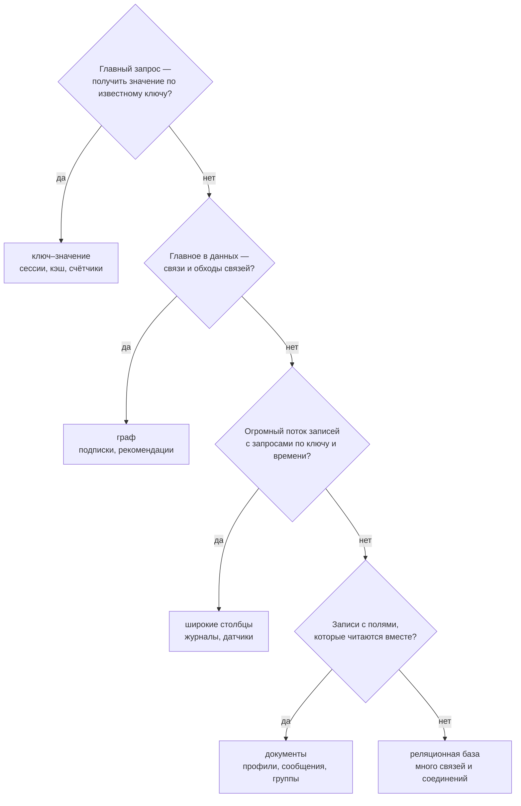
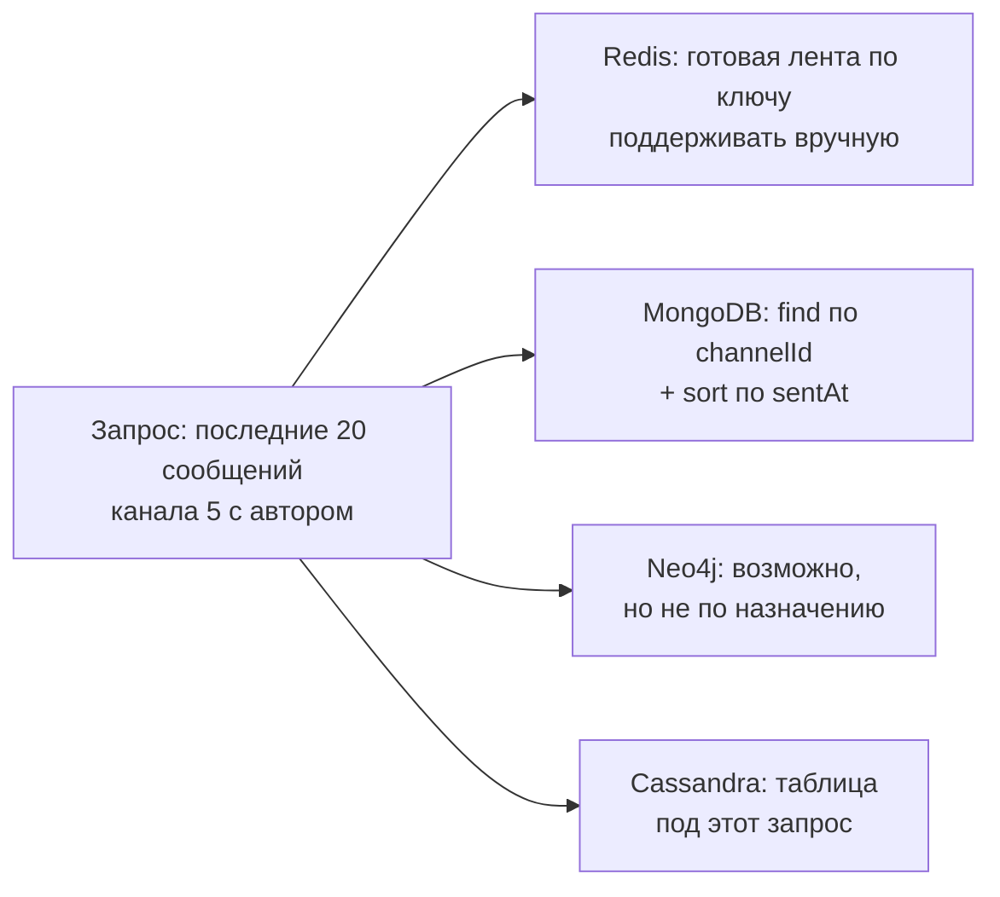
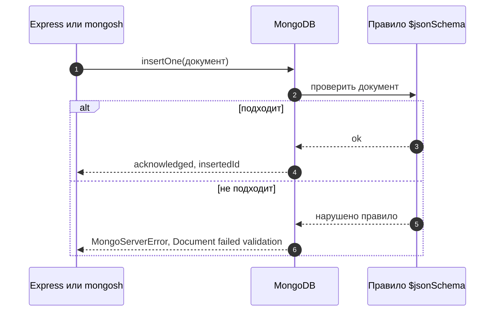
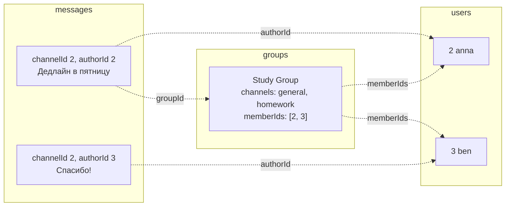
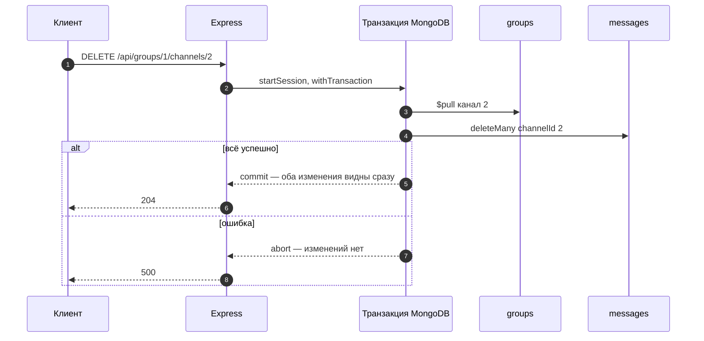

# 8_1 — NoSQL-хранилища: примеры использования

**Курс:** 3813ICT, неделя 8
**Связанные файлы:** [конспект](8_1-nosql-konspekt.md) · [поправки](8_1-nosql-popravki.md) · [вопросы](8_1-nosql-voprosy.md) · [ответы](8_1-nosql-otvety.md)

Каждый пример — рабочий кусок кода, на который можно сослаться при разработке: один большой фрагмент, пошаговая последовательность и диаграмма. Примеры затрагивают и следующую тему (8_2): важнее реальный сценарий чата Phase 2, чем рамки одного файла курса.

> **Где запускать.** Команды `db.…` выполняются в `mongosh` — консоли MongoDB. Код для Node.js использует официальный драйвер `mongodb` (`npm install mongodb`). Команды Redis, Cypher и CQL в примере 1 — для сравнения моделей, устанавливать эти базы не нужно.

> **Диаграммы.** В Obsidian mermaid рендерится сам. В VS Code нужно расширение **Markdown Preview Mermaid Support**.

---

<a id="ex-0"></a>

## Какую модель выбрать



| Пример | Что показывает |
|---|---|
| [1. Один чат в четырёх моделях](#ex-1) | как одни и те же данные выглядят в key-value, документах, графе и широких столбцах |
| [2. Валидация коллекции сообщений](#ex-2) | гибкая схема с правилами: какие документы MongoDB примет, а какие отклонит |
| [3. Модель данных чата в MongoDB](#ex-3) | встраивание каналов, ссылки в сообщениях, индекс и `$lookup` |
| [4. Транзакция: удалить канал с сообщениями](#ex-4) | когда хватает атомарности одного документа, а когда нужна транзакция |

---

<a id="ex-1"></a>

## Пример 1 — Один чат в четырёх моделях

**Когда использовать:** когда нужно объяснить (себе или на защите), почему для задачи выбрана именно эта модель. Лучший способ — посмотреть на одни и те же данные в разных моделях и спросить, какой запрос в каждой получается естественным.

**Где в конспекте:** [§3 Модели NoSQL](8_1-nosql-konspekt.md#s3) · [§4.4 Вопросы для выбора](8_1-nosql-konspekt.md#s4-4)

```js
// ═════ 1. Ключ–значение (Redis): сессия и счётчик ═════
// SET session:9f2c1a '{"userId":2,"role":"groupadmin"}' EX 3600   ← ключ живёт 1 час
// GET session:9f2c1a                                             ← поиск только по ключу
// INCR online:channel:5                                          ← атомарный счётчик
// Естественный запрос: «дай значение по этому ключу». Спросить «чьи сессии с role=groupadmin» нельзя.

// ═════ 2. Документы (MongoDB): сообщение со всем, что читается вместе ═════
db.messages.insertOne({
  channelId: 5,
  author: { id: 2, username: 'anna' },       // вложенный объект — автор рядом с текстом
  text: 'Привет всем',
  reactions: ['👍'],                          // массив
  sentAt: new Date(),
});
db.messages.find({ channelId: 5, 'author.username': 'anna' });   // поиск по любому полю, даже вложенному
// Естественный запрос: «записи с такими-то значениями полей».

// ═════ 3. Граф (Neo4j, язык Cypher): кто из тех, на кого подписана anna, состоит в Study ═════
// MATCH (a:User {username: 'anna'})-[:FOLLOWS]->(f:User)-[:MEMBER_OF]->(g:Group {name: 'Study'})
// RETURN f.username
// Естественный запрос: «пройди по связям». В SQL это цепочка JOIN, в документах — несколько запросов.

// ═════ 4. Широкие столбцы (Cassandra, язык CQL): таблица под один запрос ═════
// CREATE TABLE messages_by_channel (
//   channel_id int,
//   sent_at    timestamp,
//   message_id uuid,
//   author     text,
//   body       text,
//   PRIMARY KEY ((channel_id), sent_at, message_id)   -- ключ раздела и порядок внутри
// ) WITH CLUSTERING ORDER BY (sent_at DESC, message_id ASC);
//
// SELECT * FROM messages_by_channel WHERE channel_id = 5 LIMIT 20;   ← последние 20 сообщений канала
// Естественный запрос: заранее спроектированный — «по ключу раздела, в заданном порядке».
// Запрос «все сообщения anna во всех каналах» потребует ещё одной таблицы под него.
```

### Последовательность

1. Приложению нужно показать последние сообщения канала 5, в каждом — имя автора.
2. **Redis** может хранить готовую ленту под ключом `channel:5:last` — быстро, но искать по содержимому нельзя, и ленту нужно поддерживать вручную.
3. **MongoDB** хранит каждое сообщение документом с автором внутри; запрос по `channelId` с сортировкой по `sentAt` возвращает готовые данные.
4. **Neo4j** справится, но эта задача не про связи — модель используется не по назначению.
5. **Cassandra** отдаёт такие данные очень быстро при огромных объёмах, если таблица спроектирована именно под этот запрос.
6. Для чата Phase 2 (небольшой объём, запросы по полям) документная модель — самая естественная.



---

<a id="ex-2"></a>

## Пример 2 — Валидация коллекции сообщений

**Когда использовать:** у данных есть обязательная форма — у сообщения всегда есть канал, автор, непустой текст и дата. Проверка на сервере Express нужна в любом случае, но правило в самой базе — последняя линия защиты: оно не даст записать неверный документ даже из `mongosh` или из забытого места в коде.

**Где в конспекте:** [§5.3 Гибкая схема и валидация](8_1-nosql-konspekt.md#s5-3) · [П-4](8_1-nosql-popravki.md#p-4)

```js
// ═════ mongosh: создать коллекцию с правилами ═════
use chat

db.createCollection('messages', {
  validator: {
    $jsonSchema: {
      bsonType: 'object',
      required: ['channelId', 'authorId', 'text', 'sentAt'],   // без этих полей документ не примут
      properties: {
        channelId: { bsonType: 'int', description: 'id канала — целое число' },
        authorId: { bsonType: 'int', description: 'id автора — целое число' },
        text: {
          bsonType: 'string',
          minLength: 1,
          maxLength: 1000,
          description: 'непустая строка до 1000 символов',
        },
        sentAt: { bsonType: 'date', description: 'дата отправки — тип Date, не строка' },
        reactions: { bsonType: 'array', items: { bsonType: 'string' } },   // необязательное поле
      },
    },
  },
  // По умолчанию: validationLevel 'strict' (проверять все вставки и обновления),
  //               validationAction 'error' (отклонять неподходящие документы)
});

// ✅ Подходит
db.messages.insertOne({ channelId: 5, authorId: 2, text: 'Привет', sentAt: new Date() });

// ❌ Нет обязательного поля sentAt
db.messages.insertOne({ channelId: 5, authorId: 2, text: 'Без даты' });
// MongoServerError: Document failed validation  (в errInfo — какое правило нарушено)

// ❌ Дата строкой, а не Date
db.messages.insertOne({ channelId: 5, authorId: 2, text: 'Строка', sentAt: '2026-09-24' });

// ❌ Пустой текст
db.messages.insertOne({ channelId: 5, authorId: 2, text: '', sentAt: new Date() });

// ✅ Дополнительные поля разрешены — схема остаётся гибкой
db.messages.insertOne({ channelId: 5, authorId: 3, text: 'С реакциями', sentAt: new Date(), reactions: ['🎉'] });

// Посмотреть текущие правила коллекции
db.getCollectionInfos({ name: 'messages' })[0].options.validator;
```

### Последовательность

1. `createCollection` создаёт коллекцию `messages` и сохраняет правило `$jsonSchema`.
2. При каждой вставке и обновлении MongoDB проверяет документ по правилу (уровень `strict`).
3. Документ со всеми полями нужных типов записывается.
4. Документ без `sentAt`, с датой-строкой или с пустым текстом отклоняется с ошибкой `Document failed validation`; в `errInfo` видно, какое правило не выполнено.
5. Поле `reactions`, которого нет в `required`, можно добавлять или не добавлять — схема по-прежнему гибкая, но то, что задано, проверяется.



---

<a id="ex-3"></a>

## Пример 3 — Модель данных чата в MongoDB

**Когда использовать:** при переносе данных Phase 2 из JSON-файлов в MongoDB. Пример показывает оба способа хранить связи и то, какие запросы они дают.

**Где в конспекте:** [§6 Встраивать или ссылаться](8_1-nosql-konspekt.md#s6) · [§7 Как это ляжет на Phase 2](8_1-nosql-konspekt.md#s7) · [П-7](8_1-nosql-popravki.md#p-7)

```js
// ═════ server/db/seed.js (Node.js, драйвер mongodb) ═════
const { MongoClient } = require('mongodb');

async function main() {
  const client = new MongoClient('mongodb://localhost:27017');
  await client.connect();
  const db = client.db('chat');

  // ── users: отдельная коллекция — пользователь нужен сам по себе (вход, профиль)
  //    и на него ссылаются многие сообщения
  await db.collection('users').insertMany([
    { _id: 1, username: 'super', role: 'superadmin' },
    { _id: 2, username: 'anna', role: 'groupadmin' },
    { _id: 3, username: 'ben', role: 'user' },
  ]);

  // ── groups: каналы ВСТРОЕНЫ — их немного, они читаются вместе с группой
  await db.collection('groups').insertOne({
    _id: 1,
    name: 'Study Group',
    adminIds: [2],                        // ссылки на пользователей
    memberIds: [2, 3],
    channels: [
      { id: 1, name: 'general' },
      { id: 2, name: 'homework' },
    ],
  });

  // ── messages: отдельная коллекция со ССЫЛКАМИ — сообщений неограниченно много,
  //    в документ группы их не встраивают (лимит документа 16 МБ, да и читать всё сразу незачем)
  await db.collection('messages').insertMany([
    { groupId: 1, channelId: 2, authorId: 2, text: 'Дедлайн в пятницу', sentAt: new Date('2026-09-24T09:00:00Z') },
    { groupId: 1, channelId: 2, authorId: 3, text: 'Спасибо!', sentAt: new Date('2026-09-24T09:05:00Z') },
  ]);

  // Индекс под главный запрос «последние сообщения канала»
  await db.collection('messages').createIndex({ channelId: 1, sentAt: -1 });

  // ── Запрос 1: каналы группы — один документ, без соединений
  const group = await db.collection('groups').findOne({ _id: 1 }, { projection: { channels: 1 } });
  console.log(group.channels);            // [{ id: 1, name: 'general' }, { id: 2, name: 'homework' }]

  // ── Запрос 2: последние 20 сообщений канала 2 с именем автора — $lookup
  const feed = await db.collection('messages').aggregate([
    { $match: { channelId: 2 } },                        // фильтр (использует индекс)
    { $sort: { sentAt: -1 } },
    { $limit: 20 },
    { $lookup: { from: 'users', localField: 'authorId', foreignField: '_id', as: 'author' } },
    { $unwind: '$author' },                              // массив из одного автора → объект
    { $project: { text: 1, sentAt: 1, 'author.username': 1 } },
  ]).toArray();
  console.log(feed);   // [{ text: 'Спасибо!', author: { username: 'ben' }, ... }, ...]

  // ── Запрос 3: переименовать канал — одно обновление ОДНОГО документа, атомарно
  await db.collection('groups').updateOne(
    { _id: 1, 'channels.id': 2 },
    { $set: { 'channels.$.name': 'deadlines' } },        // $ — найденный элемент массива
  );

  await client.close();
}

main().catch(console.error);
```

### Последовательность

1. Сервер подключается к MongoDB и выбирает базу `chat` (база и коллекции создадутся при первой записи).
2. Пользователи записываются в отдельную коллекцию: на них ссылаются группы и сообщения.
3. Группа записывается одним документом с массивом каналов внутри.
4. Сообщения записываются в свою коллекцию; каждое хранит ссылки `groupId`, `channelId`, `authorId`.
5. Составной индекс `{ channelId: 1, sentAt: -1 }` ускоряет запрос «последние сообщения канала».
6. Каналы группы читаются одним `findOne` — встраивание избавило от соединения.
7. Лента канала собирается агрегацией: отфильтровать, отсортировать, ограничить, присоединить автора через `$lookup`.
8. Переименование канала — `updateOne` одного документа группы, поэтому оно атомарно без транзакции.



---

<a id="ex-4"></a>

## Пример 4 — Транзакция: удалить канал с сообщениями

**Когда использовать:** операция меняет **несколько документов** в разных коллекциях, и промежуточное состояние недопустимо. Удаление канала — хороший пример: канал удалён из группы, а его сообщения остались «сиротами» — или наоборот. Для изменений внутри одного документа транзакция не нужна.

**Где в конспекте:** [§5.4 Атомарность и транзакции](8_1-nosql-konspekt.md#s5-4) · [П-2](8_1-nosql-popravki.md#p-2)

```js
// ═════ Подготовка: транзакциям нужна replica set ═════
// Одиночный сервер (standalone) транзакции не поддерживает.
// Локально можно запустить replica set из одного узла:
//   mongod --replSet rs0 --dbpath ./data
//   mongosh --eval "rs.initiate()"
// (В MongoDB Atlas кластер уже является replica set.)

// ═════ server/routes/channels.js (Express 5 + драйвер mongodb) ═════
const express = require('express');
const router = express.Router();

class ChannelNotFound extends Error {}   // своя ошибка, чтобы отличить «нет канала» от сбоя

module.exports = (client) => {
  const db = client.db('chat');

  // DELETE /api/groups/:groupId/channels/:channelId
  router.delete('/:groupId/channels/:channelId', async (req, res) => {
    const groupId = Number(req.params.groupId);
    const channelId = Number(req.params.channelId);
    const session = client.startSession();

    try {
      // withTransaction: выполнит функцию в транзакции, при временной ошибке повторит,
      // а если функция бросит исключение — отменит ВСЕ изменения и пробросит его дальше
      await session.withTransaction(async () => {
        const result = await db.collection('groups').updateOne(
          { _id: groupId, 'channels.id': channelId },
          { $pull: { channels: { id: channelId } } },      // убрать канал из массива
          { session },                                      // ← операция внутри транзакции
        );
        if (result.matchedCount === 0) {
          throw new ChannelNotFound();                      // исключение → транзакция отменяется
        }
        await db.collection('messages').deleteMany({ channelId }, { session });
      });
      res.status(204).end();
    } catch (err) {
      if (err instanceof ChannelNotFound) return res.status(404).json({ error: 'Channel not found' });
      console.error('Удаление канала не удалось:', err.message);
      res.status(500).json({ error: 'Server error' });     // транзакция уже отменена
    } finally {
      await session.endSession();
    }
  });

  return router;
};

// ═════ Для сравнения: без транзакции, потому что меняется ОДИН документ ═════
// db.groups.updateOne({ _id: 1, 'channels.id': 2 }, { $set: { 'channels.$.name': 'deadlines' } });
```

### Последовательность

1. Запрос `DELETE /api/groups/1/channels/2` приходит на сервер.
2. Сервер открывает сессию и начинает транзакцию.
3. `updateOne` с `$pull` удаляет канал из массива `channels` группы — пока это изменение видно только внутри транзакции.
4. Если канала нет, функция бросает `ChannelNotFound` — транзакция отменяется, клиенту уходит `404`.
5. `deleteMany` удаляет сообщения канала — тоже внутри транзакции.
6. Транзакция фиксируется: оба изменения становятся видны **одновременно**.
7. Если между шагами 3 и 6 что-то упало, MongoDB отменяет всё: группа и сообщения остаются как были, клиент получает `500`.


