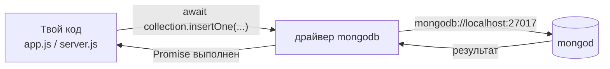
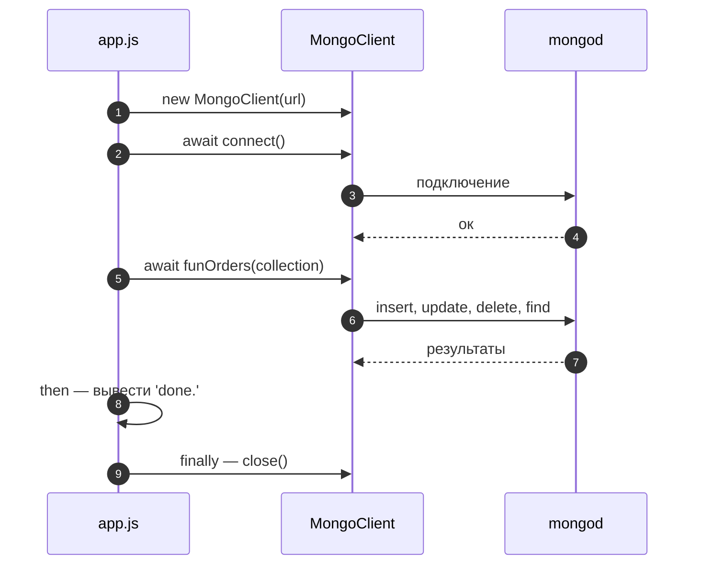
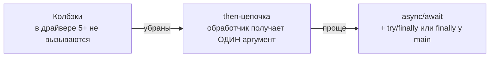

# 9_1 — MongoDB и Node.js: конспект

**Курс:** 3813ICT, неделя 9
**Источник:** `9_1_-_MongoDB_with_Node_24.pdf` (9 слайдов)
**Связанные файлы:** [поправки](9_1-mongodb-node-popravki.md) · [примеры](9_1-mongodb-node-primery.md) · [вопросы](9_1-mongodb-node-voprosy.md) · [ответы](9_1-mongodb-node-otvety.md) · дальше: [9_2 Node, MongoDB и Angular](9_2-mongodb-angular-konspekt.md)

> Значок **⚠** со ссылкой вида **П-N** ведёт в файл поправок. Там разобрано, где исходный материал курса расходится с официальной документацией, со ссылкой на источник.

> Проверка: код проверен с драйвером `mongodb` 7.6 (требует Node.js 20.19+) — строгой компиляцией TypeScript по типам драйвера и запуском Node.js. Запустить сервер `mongod` в среде проверки нельзя, поэтому операции с базой проверены по документации и типам.

**Содержание**

1. [От mongosh к коду](#s1)
2. [Подготовка проекта](#s2)
3. [Подключение](#s3)
4. [Методы коллекции в драйвере](#s4)
5. [Колбэки, промисы и async/await](#s5): [колбэки](#s5-1) · [цепочка промисов](#s5-2) · [async/await](#s5-3)
6. [Ошибки и закрытие соединения](#s6)
7. [Ключевые факты](#s7)

---

<a id="s1"></a>

## 1. От mongosh к коду

В 8_2 мы работали с MongoDB руками, через `mongosh`. Но итоговому проекту нужно, чтобы с базой работал **сервер**: получил запрос из Angular, нашёл данные, ответил. Для этого Node.js-коду нужен посредник — **драйвер**.

**Драйвер MongoDB для Node.js** — npm-пакет `mongodb`, через который код на JavaScript или TypeScript подключается к серверу `mongod` и выполняет те же операции, что ты выполнял в `mongosh`.

Хорошая новость: методы почти те же — `insertOne`, `find`, `updateOne`, `deleteOne`, `countDocuments`. Отличие одно, но принципиальное: запрос к базе идёт по сети, поэтому каждый метод драйвера **асинхронный** и возвращает Promise ([6_2](../week6/6_2-promises-async-konspekt.md#s1)). Как правильно ждать результат — главная тема этого файла.



---

<a id="s2"></a>

## 2. Подготовка проекта

Материал начинает с шагов подготовки:

```
Download and install the right MongoDB version
Create a new Node project (npm init)
Install the mongoDB driver dependency (npm install mongodb –save)
start a mongod process (mongod --dbpath=/data)
```

**Что в нём происходит.** Устанавливается MongoDB, создаётся Node-проект, в него ставится драйвер, запускается сервер с каталогом данных `/data`.

Порядок верный, но две команды не сработают как написано: у `–save` длинное тире (и сам флаг не нужен с npm 5), а каталог `/data` на современных macOS создать нельзя. Если MongoDB установлена по [8_2 §2](../week8/8_2-mongodb-konspekt.md#s2), сервер уже работает как служба. ⚠ [П-1](9_1-mongodb-node-popravki.md#p-1)

```bash
mkdir store-app && cd store-app
npm init -y
npm install mongodb                          # драйвер; --save не нужен

brew services start mongodb-community@8.0    # macOS: сервер как служба (см. 8_2 §2.1)
node --version                               # драйвер 7.x требует Node.js 20.19 или новее
```

---

<a id="s3"></a>

## 3. Подключение

Подключение делают через класс **`MongoClient`**: создают клиента со строкой подключения, вызывают `connect()`, затем получают базу через `client.db(имя)` и коллекцию через `db.collection(имя)`. Вот код из материала:

```js
const { MongoClient } = require('mongodb');
// or as an es module:
// import { MongoClient } from 'mongodb'

// Connection URL
const url = 'mongodb://localhost:27017';
const client = new MongoClient(url);

// Database Name
const dbName = 'myProject';
async function main() {
  // Use connect method to connect to the server
  await client.connect();
  console.log('Connected successfully to server');
  const db = client.db(dbName);
  const collection = db.collection('colName');

  // more codes can be pasted here..
  funOrders(client,collection)

  return 'done.';
}

main()
  .then(console.log("main..."))
  .catch(console.error)
  .finally(() => client.close());
```

**Что в нём происходит.** Создаётся клиент для `localhost:27017`. Асинхронная функция `main` ждёт подключения, выводит сообщение, берёт базу `myProject` и коллекцию `colName`, вызывает `funOrders` с операциями и возвращает `'done.'`. После `main` цепочка должна вывести результат, обработать ошибку и закрыть соединение.

Скелет верный — это почти пример из официальной документации драйвера. Но в нём две ошибки. `.then(console.log("main..."))` вызывает `console.log` **сразу** и передаёт в `then` его результат `undefined`, поэтому «main...» печатается до подключения, а `'done.'` не выводится никогда. И `funOrders` вызывается без `await`: `main` сразу возвращается, `finally` закрывает клиента, пока операции ещё идут, и они падают с ошибкой о закрытом соединении. Кроме того, в тексте слайда написано `db.connection(colName)`, а метод называется `db.collection`. ⚠ [П-2](9_1-mongodb-node-popravki.md#p-2)

Вот исправленная версия:

```js
// app.js
const { MongoClient } = require('mongodb');
const funOrders = require('./dbOperations/funOrders');

const client = new MongoClient('mongodb://localhost:27017');

async function main() {
  await client.connect();
  console.log('Connected successfully to server');
  const collection = client.db('myProject').collection('colName');

  await funOrders(collection);             // ЖДЁМ операции, прежде чем закончить main
  return 'done.';
}

main()
  .then((result) => console.log(result))   // функция, которая получит 'done.'
  .catch(console.error)
  .finally(() => client.close());          // закрываем, когда ВСЁ завершено
```

**Какая последовательность?**

1. **Создаётся `MongoClient`** — пока без соединения.
2. **`main()` запускается.**
   1. `await client.connect()` — ждём подключения к серверу.
   2. `client.db(...)` и `db.collection(...)` — синхронные вызовы: они не ходят в сеть, а только создают объекты для работы.
   3. `await funOrders(collection)` — ждём, пока выполнятся **все** операции.
3. **`main` возвращает `'done.'`** — Promise выполняется.
4. **`.then(result => ...)`** выводит `done.`.
5. **`.finally`** закрывает соединение — уже после всех операций.
6. **Если на любом шаге ошибка** — `.catch` выводит её, `.finally` всё равно закрывает клиента.



---

<a id="s4"></a>

## 4. Методы коллекции в драйвере

Прежде чем разбирать, как ждать результат, соберём сами методы. Они повторяют `mongosh`, но возвращают Promise, а результаты — объекты с полезными полями. Вот главные:

| Метод | Что возвращает Promise | Главные поля результата |
|---|---|---|
| `insertOne(doc)` | результат вставки | `insertedId` |
| `insertMany(docs)` | результат вставки | `insertedCount`, `insertedIds` |
| `find(filter, options)` | **курсор**, не Promise; массив — через `.toArray()` | — |
| `findOne(filter)` | документ или `null` | — |
| `updateOne` / `updateMany(filter, update)` | результат обновления | `matchedCount`, `modifiedCount` |
| `findOneAndUpdate(filter, update, { returnDocument })` | документ или `null` (драйвер 6+) | — |
| `deleteOne` / `deleteMany(filter)` | результат удаления | `deletedCount` |
| `countDocuments(filter)` | число | — |

Два отличия от `mongosh`, о которые часто спотыкаются:

- **`find` возвращает курсор**, а не массив и не Promise. Чтобы получить массив, нужен `await collection.find(...).toArray()`.
- **Проекция, сортировка и лимит** передаются либо цепочкой курсора (`.sort().limit()`), либо **опциями** вторым аргументом: `find(filter, { projection: {...}, sort: {...}, limit: 1 })`. Запись `find(filter, { title: 1 })` из `mongosh` в драйвере **не** сработает как проекция.

---

<a id="s5"></a>

## 5. Колбэки, промисы и async/await

Материал показывает три стиля одной и той же последовательности «вставить → обновить → удалить → найти»: колбэки, цепочку промисов и `async`/`await`. Это та же эволюция, что в [6_2](../week6/6_2-promises-async-konspekt.md#s6), только на реальном драйвере. Разберём все три — и увидим, что первый в современном драйвере не работает вовсе.

<a id="s5-1"></a>

### 5.1 Колбэки

Вот операции из материала, каждая принимает колбэк:

```js
exports.insertDocuments = function(collection, docArray, callback) {
  collection.insertMany(docArray, function(err, result) {
    console.log("Inserted the following documents into the collection:");
    console.log(docArray);
    callback(result);
  });
}

exports.findDocuments = function(collection, queryJSON, callback) {
  // Find some documents
  collection.find(queryJSON).toArray(function(err, docs) {
    console.log("Found the following records");
    console.log(docs);
    callback(docs);
  });
};
// updateDocument и removeDocument устроены так же: updateOne(..., function(err, result) {...}),
// deleteOne(..., function(err, result) {...})
```

И модуль, который вызывает их по очереди — каждую следующую внутри колбэка предыдущей:

```js
const docArray = [{ name: "A", id: 1 }, { name: "B", id: 2 }, { name: "C", id: 3 }]
const queryJSONf = {}
const queryJSONup = { name: "A" };
const updateJSON = { id: 5 };
const queryJSONdel = { id: 3 };
const operations = require('./operations');

module.exports = function(client, col) {
  operations.insertDocuments(col, docArray,
    () => {
      operations.updateDocument(col, queryJSONup, updateJSON,
        () => {
          operations.removeDocument(col, queryJSONdel,
            () => {
              operations.findDocuments(col, queryJSONf,
                () => { client.close(); })
            })
        })
    });
};
```

**Что в нём происходит.** Каждая операция получает функцию, которую драйвер должен вызвать по завершении. Чтобы операции шли по порядку, следующая запускается внутри колбэка предыдущей — отсюда лестница вложенности, которую материал справедливо называет «callback hell».

Но главное: **в современном драйвере этот код не работает вообще.** Поддержку колбэков убрали из драйвера в версии 5.0 (2023 год). Методы игнорируют переданную функцию и возвращают Promise. Проверено с драйвером 7.6: `insertMany(docs, callback)` вернул Promise, а колбэк не был вызван ни разу — значит, цепочка остановится на первом шаге, и `client.close()` не вызовется никогда. Кроме того, все колбэки игнорируют `err`. ⚠ [П-3](9_1-mongodb-node-popravki.md#p-3)

В «all-in-one» версии материала есть ещё две вещи, которые в драйвере 7 сразу падают: опция `useNewUrlParser` (проверено: `MongoParseError: option usenewurlparser is not supported`) и `mongodb.ObjectID` (такого экспорта больше нет, правильно `ObjectId`). ⚠ [П-4](9_1-mongodb-node-popravki.md#p-4)

<a id="s5-2"></a>

### 5.2 Цепочка промисов

Материал предлагает заменить колбэки промисами:

```js
const promiseWorld = function(client, myCol){
  myCol.insertMany(docArray).then(function(err, result) {
    console.log("Inserted the following document into the collection:");
    console.log(docArray);
    return myCol.updateMany(queryJSONup, { $set: updateJSON });
  }).then(function(err, result) {
    console.log("for the documents with", queryJSONup);
    console.log("SET: ", updateJSON);
    return myCol.updateMany(queryJSONup, { $set: updateJSON });
  }).then(function(err, result) {
    console.log("for the documents with", queryJSONup);
    console.log("SET: ", updateJSON);
    return myCol.deleteMany(queryJSONdel);
  }).then(function(err, result) {
    console.log("Removed the documents with: ", queryJSONdel);
    return myCol.find({}).toArray();
  }).then(function(err, result) {
    if (err) throw err;
    console.log(result);
    client.close();
  });
};
```

**Что в нём происходит.** Каждый `then` возвращает следующий Promise, поэтому операции идут по очереди без вложенности. Идея верная — это и есть цепочка из [6_2 §5](../week6/6_2-promises-async-konspekt.md#s5).

Но обработчики написаны в стиле колбэков — `function(err, result)`. Обработчик `then` получает **один** аргумент — результат. Поэтому результат попадает в `err`, а `result` всегда `undefined`. В последнем `then` это ломает всё: `err` — это массив найденных документов (непустой, значит истинный), и `if (err) throw err` **бросает массив документов как ошибку** — результат не выводится, а `client.close()` не вызывается. Кроме того, второй и третий `then` дважды выполняют одно и то же обновление, а `catch` нет вообще. ⚠ [П-5](9_1-mongodb-node-popravki.md#p-5)

<a id="s5-3"></a>

### 5.3 async/await

Третий вариант материала — самый короткий:

```js
const awaitHeaven = async function(client, myCol){
  result = await myCol.insertMany(docArray);
  console.log("Inserted the following document into the collection:");
  console.log(docArray);

  result = await myCol.updateMany(queryJSONup, { $set: updateJSON });
  console.log("for the documents with", queryJSONup);
  console.log("SET: ", updateJSON);

  await myCol.deleteMany(queryJSONdel);
  console.log("Removed the documents with: ", queryJSONdel);
  result = await myCol.find({}).toArray();
  console.log(result);
  client.close();
};
```

**Что в нём происходит.** Каждый `await` ждёт свою операцию, код читается сверху вниз как синхронный. Это правильный современный стиль — материал верно называет его самым лаконичным.

Две мелочи всё же мешают: `result` нигде не объявлен (в строгом режиме — `ReferenceError`, иначе — случайная глобальная переменная), а `client.close()` не выполнится, если любая операция бросит ошибку — соединение останется открытым. ⚠ [П-6](9_1-mongodb-node-popravki.md#p-6)

Вот исправленная версия — модуль операций, который вызывает `app.js` из [§3](#s3):

```js
// dbOperations/funOrders.js
const docArray = [
  { _id: 1, name: 'A' },          // свой идентификатор — в _id, а не в отдельном поле id (8_2 §3)
  { _id: 2, name: 'B' },
  { _id: 3, name: 'C' },
];

module.exports = async function funOrders(collection) {
  const inserted = await collection.insertMany(docArray);
  console.log('Inserted:', inserted.insertedCount);                   // 3

  const updated = await collection.updateOne({ name: 'A' }, { $set: { name: 'A2' } });
  console.log('Updated:', updated.matchedCount, updated.modifiedCount); // 1 1

  const deleted = await collection.deleteOne({ _id: 3 });
  console.log('Deleted:', deleted.deletedCount);                       // 1

  const docs = await collection.find({}).sort({ _id: 1 }).toArray();
  console.log(docs);   // [ { _id: 1, name: 'A2' }, { _id: 2, name: 'B' } ]
  // Соединение здесь НЕ закрываем: этим управляет тот, кто открыл, — main в app.js
};
```

**Какая последовательность?**

1. **`insertMany`** вставляет три документа; `await` ждёт подтверждения, в результате `insertedCount`.
2. **`updateOne`** находит документ `name: 'A'` и меняет имя; `matchedCount` и `modifiedCount` показывают, что нашлось и изменилось.
3. **`deleteOne`** удаляет документ с `_id: 3`; `deletedCount` — сколько удалено.
4. **`find().sort().toArray()`** собирает оставшиеся документы в массив.
5. **Функция возвращает управление** — `main` в `app.js` продолжает и в `finally` закрывает соединение ([§3](#s3)).
6. **Если любая операция бросит ошибку** — исключение поднимется в `main`, попадёт в `.catch`, а `.finally` всё равно закроет клиента.



---

<a id="s6"></a>

## 6. Ошибки и закрытие соединения

Раз каждая операция может упасть (сервер недоступен, дубликат `_id`, неверный запрос), важно знать, где эти ошибки ловить и когда закрывать соединение.

- **Ошибки операций** в `async`-коде ловят `try/catch`. Ошибки сервера MongoDB — объекты `MongoServerError` с числовым `code`: например, `11000` — нарушение уникальности (дубликат `_id` или уникального поля).
- **Закрывать соединение** нужно тогда, когда работа закончена:
  - в **скрипте** (как `app.js`) — в `finally` после всех операций;
  - на **сервере Express** — **не** после каждого запроса, а один раз при остановке сервера. `MongoClient` держит пул соединений и рассчитан на то, чтобы его создали один раз и переиспользовали ([примеры, пример 2](9_1-mongodb-node-primery.md#ex-2)).

```js
const { MongoServerError } = require('mongodb');

try {
  await collection.insertOne({ _id: 1, name: 'A' });
} catch (err) {
  if (err instanceof MongoServerError && err.code === 11000) {
    console.log('Документ с таким _id уже есть');
  } else {
    throw err;                       // остальные ошибки — дальше
  }
}
```

Материал в конце ссылается на урок W3Schools. Для драйвера лучше опираться на официальную документацию MongoDB Node.js Driver: сторонние уроки часто отстают от версий драйвера. ⚠ [П-7](9_1-mongodb-node-popravki.md#p-7)

---

<a id="s7"></a>

## 7. Ключевые факты

**Драйвер и подключение**

- Драйвер — npm-пакет `mongodb`; версия 7.x требует Node.js 20.19+.
- `new MongoClient(url)` → `await client.connect()` → `client.db(имя)` → `db.collection(имя)`; `db()` и `collection()` синхронные.
- В скрипте соединение закрывают в `finally` после всех операций; на сервере — один клиент на всё время работы.

**Методы**

- Все операции асинхронные и возвращают Promise; `find` возвращает курсор — массив через `.toArray()`.
- Результаты: `insertedId`/`insertedCount`, `matchedCount`/`modifiedCount`, `deletedCount`.
- Проекция в драйвере — опция `{ projection: {...} }`, а не второй аргумент как в `mongosh`.

**Стили асинхронного кода**

- Колбэки убраны из драйвера в версии 5.0: переданная функция не вызывается, операция возвращает Promise.
- `useNewUrlParser` вызывает `MongoParseError`; `ObjectID` больше не экспортируется — `ObjectId`.
- Обработчик `then` получает один аргумент — результат; `function(err, result)` в `then` — ошибка.
- `async`/`await` — основной стиль; переменные объявляют через `const`/`let`.

**Ошибки**

- Ошибки операций ловят `try/catch`; `MongoServerError.code === 11000` — дубликат уникального значения.
- Функции, которые запускают операции, вызывают с `await`, иначе соединение может закрыться раньше.
