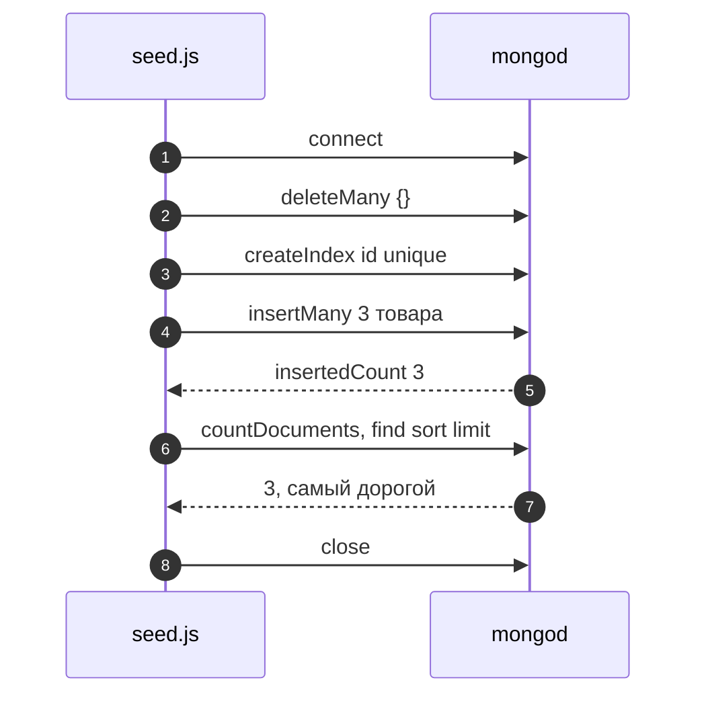
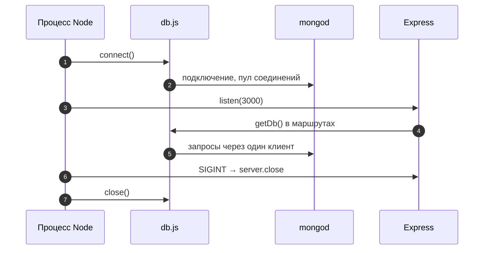
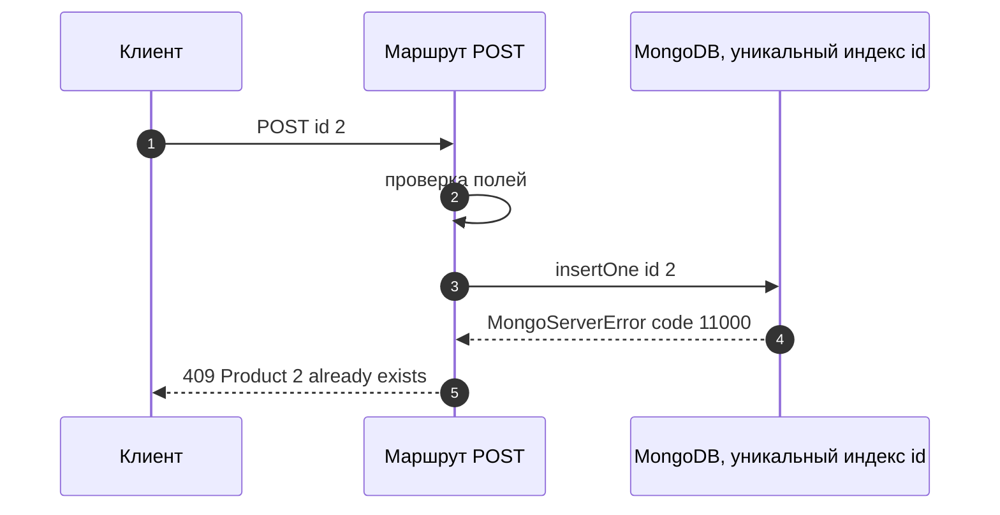

# 9_1 — MongoDB и Node.js: примеры использования

**Курс:** 3813ICT, неделя 9
**Связанные файлы:** [конспект](9_1-mongodb-node-konspekt.md) · [поправки](9_1-mongodb-node-popravki.md) · [вопросы](9_1-mongodb-node-voprosy.md) · [ответы](9_1-mongodb-node-otvety.md)

Каждый пример — рабочий кусок кода для сервера итогового проекта: один большой фрагмент, пошаговая последовательность и диаграмма. Код рассчитан на Node.js 20.19+, драйвер `mongodb` 7.x и Express 5.

> **Диаграммы.** В Obsidian mermaid рендерится сам. В VS Code нужно расширение **Markdown Preview Mermaid Support**.

---

<a id="ex-0"></a>

## Три стиля одного вызова

| Стиль | Запись | Работает в драйвере 5+? |
|---|---|---|
| Колбэк | `col.insertOne(doc, function (err, res) {...})` | ❌ колбэк не вызывается |
| `then` | `col.insertOne(doc).then((res) => ...).catch(...)` | ✅ |
| `async`/`await` | `const res = await col.insertOne(doc)` внутри `try/catch` | ✅ основной стиль |

| Пример | Что показывает |
|---|---|
| [1. Скрипт наполнения базы](#ex-1) | подключение, уникальный индекс, `insertMany`, `try/finally` |
| [2. Одно подключение на весь сервер](#ex-2) | модуль `db.js`, запуск Express после подключения, корректная остановка |
| [3. Ошибки и результаты операций](#ex-3) | `MongoServerError` 11000 → 409, `matchedCount` → 404 |

---

<a id="ex-1"></a>

## Пример 1 — Скрипт наполнения базы

**Когда использовать:** перед разработкой и демонстрацией нужна база с тестовыми данными, которую можно пересоздать одной командой. Скрипт запускается `node seed.js` и сам закрывает соединение.

**Где в конспекте:** [§3 Подключение](9_1-mongodb-node-konspekt.md#s3) · [§5.3 async/await](9_1-mongodb-node-konspekt.md#s5-3) · [§6 Ошибки](9_1-mongodb-node-konspekt.md#s6)

```js
// ═════ server/seed.js ═════
const { MongoClient } = require('mongodb');

const URL = process.env.MONGO_URL ?? 'mongodb://localhost:27017';
const client = new MongoClient(URL);

const products = [
  { id: 1, name: 'Learning Node.js', description: 'Intro to Node', price: 42.5, units: 3 },
  { id: 2, name: 'Angular in Practice', description: 'Components and services', price: 48, units: 5 },
  { id: 3, name: 'MongoDB Basics', description: 'Documents and queries', price: 39, units: 0 },
];

async function seed() {
  await client.connect();
  const col = client.db('store').collection('products');

  await col.deleteMany({});                                  // пересоздать с нуля (только для тестовых данных!)
  await col.createIndex({ id: 1 }, { unique: true });        // номер товара уникален на уровне базы
  const { insertedCount } = await col.insertMany(products);
  console.log(`Inserted ${insertedCount} products`);

  const count = await col.countDocuments({});
  const top = await col.find({}, { sort: { price: -1 }, limit: 1, projection: { _id: 0, name: 1, price: 1 } }).toArray();
  console.log('Total:', count, '| Most expensive:', top[0]);
}

seed()
  .catch((err) => {
    console.error('Seed failed:', err.message);
    process.exitCode = 1;                                     // код ошибки для терминала
  })
  .finally(() => client.close());
```

### Последовательность

1. `node seed.js` создаёт клиента и вызывает `seed()`.
2. `connect()` подключается к серверу.
3. `deleteMany({})` очищает коллекцию — пустой фильтр здесь намеренный, потому что это тестовые данные.
4. `createIndex({ id: 1 }, { unique: true })` запрещает два товара с одинаковым `id` на уровне базы.
5. `insertMany` вставляет товары, в ответе `insertedCount`.
6. `countDocuments` и `find` с опциями `sort`, `limit` и `projection` проверяют результат.
7. При ошибке `catch` выводит её и ставит код выхода 1; `finally` в любом случае закрывает соединение, и процесс завершается.



---

<a id="ex-2"></a>

## Пример 2 — Одно подключение на весь сервер

**Когда использовать:** сервер Express работает с базой. `MongoClient` держит пул соединений и рассчитан на то, чтобы его создали один раз при запуске, использовали во всех маршрутах и закрыли при остановке. Подключение и отключение на каждый запрос — ошибка ([9_2 П-1](9_2-mongodb-angular-popravki.md#p-1)).

**Где в конспекте:** [§6 Ошибки и закрытие соединения](9_1-mongodb-node-konspekt.md#s6)

```js
// ═════ server/db.js ═════
const { MongoClient } = require('mongodb');

const client = new MongoClient(process.env.MONGO_URL ?? 'mongodb://localhost:27017');
let db = null;

async function connect(dbName = 'store') {
  await client.connect();
  db = client.db(dbName);
  console.log('MongoDB connected');
  return db;
}

function getDb() {
  if (!db) throw new Error('Database not connected — call connect() first');
  return db;
}

async function close() {
  await client.close();
  console.log('MongoDB connection closed');
}

module.exports = { connect, getDb, close };

// ═════ server/server.js ═════
const express = require('express');
const { connect, getDb, close } = require('./db');

const app = express();
app.use(express.json());

app.get('/api/products', async (req, res) => {
  const list = await getDb().collection('products').find({}).sort({ id: 1 }).toArray();
  res.json(list);
});

// Express 5 сам передаёт ошибки async-обработчиков сюда
app.use((err, req, res, next) => {
  console.error(err);
  res.status(500).json({ error: 'Server error' });
});

async function start() {
  await connect();                                   // сначала база...
  const server = app.listen(3000, () => console.log('http://localhost:3000'));   // ...потом HTTP

  // Корректная остановка по Ctrl+C: перестать принимать запросы, закрыть базу
  process.on('SIGINT', () => {
    server.close(async () => {
      await close();
      process.exit(0);
    });
  });
}

start().catch((err) => {
  console.error('Startup failed:', err.message);    // например, mongod не запущен
  process.exit(1);
});
```

### Последовательность

1. `node server.js` вызывает `start()`.
2. `connect()` подключается к MongoDB и запоминает объект базы в модуле `db.js`.
3. Только после этого Express начинает слушать порт — запросы не придут раньше, чем готова база.
4. Каждый маршрут берёт базу через `getDb()` — один и тот же клиент и пул соединений.
5. Если маршрут бросит ошибку, Express 5 передаст её в обработчик ошибок, и клиент получит `500`.
6. По Ctrl+C сервер перестаёт принимать запросы, дожидается текущих, закрывает соединение с базой и завершается.
7. Если `mongod` не запущен, `start()` падает сразу с понятным сообщением.



---

<a id="ex-3"></a>

## Пример 3 — Ошибки и результаты операций

**Когда использовать:** маршрутам нужно отвечать правильными кодами: дубликат — `409`, не найдено — `404`, неверные данные — `400`. Информация для этого есть в ошибке сервера и в полях результата операции.

**Где в конспекте:** [§4 Методы и результаты](9_1-mongodb-node-konspekt.md#s4) · [§6 Ошибки](9_1-mongodb-node-konspekt.md#s6)

```js
// ═════ server/routes/products.js ═════
const express = require('express');
const { MongoServerError } = require('mongodb');
const { getDb } = require('../db');

const router = express.Router();
const products = () => getDb().collection('products');

// POST /api/products — создать товар с уникальным id
router.post('/', async (req, res) => {
  const { id, name, price, units, description = '' } = req.body ?? {};
  if (!Number.isInteger(id) || !name || typeof price !== 'number' || !Number.isInteger(units)) {
    return res.status(400).json({ error: 'id, name, price and units are required' });
  }

  try {
    const { insertedId } = await products().insertOne({ id, name, description, price, units });
    res.status(201).json({ _id: insertedId, id, name, description, price, units });
  } catch (err) {
    // Уникальный индекс на id (пример 1) — база сама не даст создать дубликат
    if (err instanceof MongoServerError && err.code === 11000) {
      return res.status(409).json({ error: `Product ${id} already exists` });
    }
    throw err;                                     // остальное — в обработчик ошибок (500)
  }
});

// PATCH /api/products/:id — изменить цену
router.patch('/:id', async (req, res) => {
  const id = Number(req.params.id);
  const { price } = req.body ?? {};
  if (typeof price !== 'number' || price < 0) {
    return res.status(400).json({ error: 'price must be a non-negative number' });
  }

  const { matchedCount } = await products().updateOne({ id }, { $set: { price } });
  if (matchedCount === 0) return res.status(404).json({ error: 'Product not found' });
  res.json({ id, price });
});

module.exports = router;
// server.js: app.use('/api/products', require('./routes/products'));
```

### Последовательность (POST с дубликатом)

1. Клиент отправляет `POST /api/products` с `id: 2`, который уже есть.
2. Маршрут проверяет поля — все на месте.
3. `insertOne` доходит до базы; уникальный индекс не даёт вставить второй документ с `id: 2`.
4. Драйвер бросает `MongoServerError` с `code: 11000`.
5. `catch` узнаёт код и отвечает `409` с понятным сообщением.
6. Любая другая ошибка пробрасывается дальше и превращается в `500` в обработчике ошибок.



Проверка «такой id уже есть?» отдельным запросом перед вставкой не защищает от двух одновременных запросов: оба увидят «нет» и оба вставят. Уникальный индекс делает проверку и вставку одной операцией базы.
