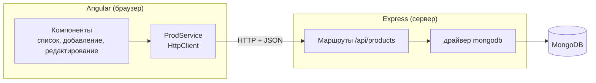

# 9_2 — MongoDB, Node.js и Angular: конспект

**Курс:** 3813ICT, неделя 9
**Источник:** `9_2_-_MongoDB_with_Node_and_Angular_24.pdf` (12 слайдов)
**Связанные файлы:** [поправки](9_2-mongodb-angular-popravki.md) · [примеры](9_2-mongodb-angular-primery.md) · [вопросы](9_2-mongodb-angular-voprosy.md) · [ответы](9_2-mongodb-angular-otvety.md) · назад: [9_1](9_1-mongodb-node-konspekt.md) · дальше: [9_3 Пример магазина](9_3-crud-example-konspekt.md)

> Значок **⚠** со ссылкой вида **П-N** ведёт в файл поправок. Там разобрано, где исходный материал курса расходится с официальной документацией, со ссылкой на источник.

> Проверка: код со скриншотов переписан дословно; фрагменты Angular-классов из материала скомпилированы TypeScript 5.9 в строгом режиме, сообщения об ошибках — реальные. Серверный код — по драйверу `mongodb` 7.6 и Express 5.

**Содержание**

1. [Три слоя приложения](#s1)
2. [Сервер: маршруты для MongoDB](#s2): [пример из материала](#s2-1) · [что с ним не так](#s2-2) · [исправленный сервер](#s2-3)
3. [Angular: структура и навигация](#s3)
4. [Сервис](#s4)
5. [Список товаров](#s5)
6. [Добавление и редактирование](#s6)
7. [Ключевые факты](#s7)

---

<a id="s1"></a>

## 1. Три слоя приложения

В 9_1 сервер научился работать с MongoDB, в неделе 5 Angular научился ходить на сервер через `HttpClient`. Эта тема соединяет всё в одно приложение — каталог товаров, где пользователь в браузере добавляет, видит, редактирует и удаляет товары, а данные живут в базе.

Приложение состоит из трёх слоёв, и каждый отвечает за своё:



- **Компоненты** показывают данные и принимают действия пользователя;
- **сервис** превращает действия в HTTP-запросы ([5_4](../week5/5_4-http-requests-konspekt.md#s5));
- **маршруты Express** проверяют запрос и выполняют операцию в базе ([9_1](9_1-mongodb-node-konspekt.md#s4)).

Главное правило, которое будет встречаться весь файл: **клиент и сервер должны договориться** о каждом маршруте — метод, адрес, форма тела и ответа. Если хоть что-то не совпадает, запрос не работает.

---

<a id="s2"></a>

## 2. Сервер: маршруты для MongoDB

<a id="s2-1"></a>

### 2.1 Пример из материала

Материал описывает сервер так: если соединение с базой есть, Express начинает слушать порт 3000; маршруты обрабатывают CRUD-запросы клиента. Вот `server.js`:

```js
// get dependencies
const express = require('express'),
    bodyParser = require('body-parser'),
    app = express(),
    { MongoClient} = require('mongodb'),
    client = new MongoClient('mongodb://localhost:27017');

// parse requests
app.use(bodyParser.urlencoded({extended: true}));
app.use(bodyParser.json());
cors = require('cors');
app.use(cors());

const products = require('./dbOperations/operations');
app.post('/productInsert', (req, res) => { products.insert(req, res, client)
});
app.get('/productFind', (req, res) => { products.find(req, res, client)
});
app.post('/productUpdate', (req, res) => { products.update(req, res, client)
});
app.post('/productDelete', (req, res) => {products.delete(req, res, client)
});

const https = require('https'),
    fs = require('fs'),
    options = {
        //generate a SSL certificate in the elf terminal.
        //openssl genrsa -out key.pem
        //openssl req -new -key key.pem -out csr.pem
        //openssl x509 -req -days 9999 -in csr.pem -signkey key.pem -out cert.pem
        //rm csr.pem
        key: fs.readFileSync('key.pem'),
        cert: fs.readFileSync('cert.pem')
    },
    PORT = 3000,
    httpsServer = https.createServer(options, app);

httpsServer.listen(PORT, () => {
    console.log(`Starting https server at: ${PORT}`);
});
```

И модуль операций:

```js
const { MongoClient,ObjectId} = require('mongodb');

exports.insert = async function(req, res, client) {
    let doc = req.body;
    await client.connect();
    console.log("client connected");
    let db = await client.db("dbName22"),
        myCol = await db.collection("colName");
    await myCol.insertOne(doc);
    console.log("Inserted the following document into the collection:");
    console.log(doc);
    res.send(doc);
    client.close();
};

exports.find = async function(req, res, client) {
    await client.connect();
    let db = client.db("dbName22"),
        myCol = db.collection("colName");
    const docs = await myCol.find({}).toArray();
    console.log('Found documents =>', docs);
    res.send(docs);
    client.close();
};

exports.update = async function(req, res, client) {
    console.log(req.body);
    await client.connect();
    let db = await client.db("dbName22"),
        myCol = await db.collection("colName");
    let queryJSON = req.body.query;
    let updateJSON = req.body.update;
    // Update document with queryJSON, set updateJSON
    result = await db.collection("colName").updateMany(queryJSON, {
        $set: updateJSON
    });
    console.log("for the documents with", queryJSON);
    console.log("SET: ", updateJSON);
    res.send(result);
    client.close();
};

exports.delete = async function(req, res, client) {
    await client.connect();
    let db = await client.db("dbName22"),
        myCol = await db.collection("colName");
    let queryJSON = req.body;
    console.log(queryJSON);
    console.log(queryJSON._id);
    queryJSON._id = new ObjectId(queryJSON._id);
    console.log(queryJSON._id)
    let result = await myCol.deleteMany(queryJSON);
    console.log("Removed the documents with: ", queryJSON, result);
    res.send(queryJSON);
    client.close();
};
```

**Что в нём происходит.** Сервер разбирает тела запросов, разрешает CORS и объявляет четыре маршрута: вставка, поиск, обновление, удаление — каждый передаёт запрос в свою функцию модуля. Сервер запускается по HTTPS с самоподписанным сертификатом на порту 3000. Каждая функция модуля подключается к базе, выполняет одну операцию драйвера (уже с `async`/`await`, как в 9_1), отправляет ответ и закрывает соединение.

<a id="s2-2"></a>

### 2.2 Что с ним не так

Операции уже на `async`/`await` — это правильное направление. Но в сервере четыре проблемы, и две из них опасны.

1. **Подключение и закрытие на каждый запрос.** Все маршруты используют **один** `client`, и каждый в конце вызывает `client.close()`. Если два запроса пришли одновременно, первый закроет клиента посреди работы второго. Кроме того, текст слайда обещает «запускать Express, если есть соединение», а код слушает порт, не проверив базу. Клиента подключают один раз при старте ([9_1, пример 2](9_1-mongodb-node-primery.md#ex-2)). ⚠ [П-1](9_2-mongodb-angular-popravki.md#p-1)
2. **Самоподписанный HTTPS для локальной разработки.** Сертификат нужен для среды ELF курса, но браузер не доверяет ему без ручного подтверждения. А сервис Angular в материале обращается к `http://localhost:3000` — к HTTPS-серверу такой запрос не дойдёт. ⚠ [П-2](9_2-mongodb-angular-popravki.md#p-2)
3. **Маршруты не в стиле REST и лишний пакет.** Глаголы в адресах (`/productUpdate`) и `POST` для изменения и удаления; `body-parser` вместо `express.json()` ([5_3 П-5](../week5/5_3-node-hosting-popravki.md#p-5)). ⚠ [П-3](9_2-mongodb-angular-popravki.md#p-3)
4. **Клиент управляет запросом к базе.** Обновление берёт фильтр и изменения прямо из тела запроса (`req.body.query`, `req.body.update`) и передаёт в `updateMany`. Удаление передаёт тело целиком в `deleteMany`. Любой клиент может отправить фильтр `{}` и изменить или удалить **все** документы. Сервер должен сам решать, что менять: по `_id` из адреса и только разрешённые поля. ⚠ [П-4](9_2-mongodb-angular-popravki.md#p-4)

<a id="s2-3"></a>

### 2.3 Исправленный сервер

Вот тот же сервер с одним подключением, REST-маршрутами и проверкой данных на сервере:

```js
// ═════ server/server.js ═════
const express = require('express');
const cors = require('cors');
const { connect } = require('./db');                   // модуль из 9_1, пример 2

const app = express();
app.use(cors({ origin: 'http://localhost:4200' }));    // или прокси ng serve без CORS (5_3)
app.use(express.json());
app.use('/api/products', require('./routes/products'));
app.use((err, req, res, next) => { console.error(err); res.status(500).json({ error: 'Server error' }); });

connect().then(() => app.listen(3000, () => console.log('http://localhost:3000')));

// ═════ server/routes/products.js ═════
const express = require('express');
const { ObjectId } = require('mongodb');
const { getDb } = require('../db');

const router = express.Router();
const col = () => getDb().collection('products');
const toId = (s) => (ObjectId.isValid(s) ? new ObjectId(s) : null);

// Сервер сам собирает документ из разрешённых полей — клиент не управляет запросом к базе
function readProduct(body) {
  const { name, price, company } = body ?? {};
  if (typeof name !== 'string' || !name.trim()) return null;
  if (typeof price !== 'number' || price < 0) return null;
  return { name: name.trim(), price, company: typeof company === 'string' ? company.trim() : '' };
}

router.get('/', async (req, res) => {                  // список
  res.json(await col().find({}).sort({ name: 1 }).toArray());
});

router.get('/:id', async (req, res) => {               // один товар
  const _id = toId(req.params.id);
  const product = _id && (await col().findOne({ _id }));
  if (!product) return res.status(404).json({ error: 'Product not found' });
  res.json(product);
});

router.post('/', async (req, res) => {                 // создать
  const product = readProduct(req.body);
  if (!product) return res.status(400).json({ error: 'name and non-negative price are required' });
  const { insertedId } = await col().insertOne(product);
  res.status(201).json({ _id: insertedId, ...product });
});

router.put('/:id', async (req, res) => {               // изменить
  const _id = toId(req.params.id);
  const product = readProduct(req.body);
  if (!_id) return res.status(400).json({ error: 'Invalid id' });
  if (!product) return res.status(400).json({ error: 'name and non-negative price are required' });
  const updated = await col().findOneAndUpdate({ _id }, { $set: product }, { returnDocument: 'after' });
  if (!updated) return res.status(404).json({ error: 'Product not found' });
  res.json(updated);
});

router.delete('/:id', async (req, res) => {            // удалить
  const _id = toId(req.params.id);
  if (!_id) return res.status(400).json({ error: 'Invalid id' });
  const { deletedCount } = await col().deleteOne({ _id });   // только ОДИН документ по _id
  if (deletedCount === 0) return res.status(404).json({ error: 'Product not found' });
  res.status(204).end();
});

module.exports = router;
```

**Какая последовательность?**

1. **Сервер стартует:** сначала `connect()` к MongoDB, затем Express слушает порт 3000.
2. **Запрос приходит на `/api/products/...`.**
   1. `cors` разрешает запросы с `localhost:4200`, `express.json()` кладёт тело в `req.body`.
   2. Роутер выбирает обработчик по **методу** и **адресу**.
3. **Обработчик проверяет данные.**
   1. `_id` из адреса превращается в `ObjectId`; неверная строка — `400`.
   2. `readProduct` берёт из тела только `name`, `price`, `company` и проверяет их; остальное игнорируется.
4. **Выполняется одна операция драйвера** — всегда с фильтром по `_id`, который определил сервер.
5. **Ответ по результату:** `201` с созданным товаром, `200` с изменённым, `204` после удаления, `404`, если документа нет.
6. **Соединение не закрывается** — клиент MongoDB живёт, пока работает сервер.

| Действие | Материал | Исправленный вариант |
|---|---|---|
| список | `GET /productFind` | `GET /api/products` |
| один товар | — | `GET /api/products/:id` |
| создать | `POST /productInsert` | `POST /api/products` |
| изменить | `POST /productUpdate` (фильтр от клиента) | `PUT /api/products/:id` |
| удалить | `POST /productDelete` (`deleteMany`) | `DELETE /api/products/:id` (`deleteOne`) |

---

<a id="s3"></a>

## 3. Angular: структура и навигация

Клиент состоит из трёх страниц-компонентов — `prod-add` (добавление), `prod-get` (список) и `prod-edit` (редактирование) — и сервиса `ProdService` для HTTP-запросов. Навигация — панель с двумя ссылками и `<router-outlet>`:

```html
<nav class="navbar navbar-expand-sm bg-light">
  <div class="container-fluid">
    <ul class="navbar-nav">
      <li class="nav-item">
        <a routerLink="prod-add" class="nav-link" routerLinkActive="active">
          Create a Product
        </a>
      </li>
      <li class="nav-item">
        <a routerLink="prod-get" class="nav-link" routerLinkActive="active">
          List all Products
        </a>
      </li>
    </ul>
  </div>
</nav>

<div class="container">
  <router-outlet></router-outlet>
</div>
```

Разметка верная: `routerLinkActive="active"` добавляет ссылке класс `active`, когда её маршрут открыт.

Структуру материал собирает через `app.module.ts` — с `HttpClientModule`, `FormsModule` и `AppRoutingModule` в `imports`. Так делали в приложениях на NgModule. В standalone-проекте `HttpClient` подключают через `provideHttpClient()` в `app.config.ts`, маршруты — через `provideRouter`, а `RouterLink`, `RouterLinkActive`, `RouterOutlet` и `FormsModule` — в `imports` компонентов, которые их используют ([5_4 П-1](../week5/5_4-http-requests-popravki.md#p-1)). ⚠ [П-5](9_2-mongodb-angular-popravki.md#p-5)

```ts
// src/app/app.routes.ts
export const routes: Routes = [
  { path: 'prod-get', component: ProdGetComponent },
  { path: 'prod-add', component: ProdAddComponent },
  { path: 'prod-edit/:id', component: ProdEditComponent },   // id товара — в адресе
  { path: '', pathMatch: 'full', redirectTo: 'prod-get' },
];
```

---

<a id="s4"></a>

## 4. Сервис

Все HTTP-запросы живут в сервисе. Вот `prod.service.ts` из материала:

```ts
import { Injectable } from '@angular/core';
import { HttpClient, HttpHeaders, HttpParams} from '@angular/common/http';
import { ProdModel } from './ProdModel';
import { Observable} from 'rxjs';

@Injectable({providedIn: 'root'})
export class ProdService {
  url = 'http://localhost:3000/';
  constructor(private http: HttpClient) { }
  // insert a product
  productInsert(prod) {
    console.log(prod);
    this.http.post(this.url + 'productInsert', prod)
      .subscribe(res => console.log('Done'));
  }
  // find all products, and return a promise of all products
  productFind(){
    return this.http.get<ProdModel[]>(this.url + 'productFind');
  }
  // update products with proQuery and set prodUpdate, returnning a promise
  productUpdate(prodQuery, prodUpdate){
    const queryUpdate = {query: prodQuery, update: prodUpdate};
    return this.http.put(this.url + 'productUpdate', queryUpdate);
  }
  // delete a product
  productDelete(prod) {
    console.log(prod);
    this.http.delete(this.url + 'productDelete', prod)
      .subscribe(res => console.log('Done'));
  }
}
```

**Что в нём происходит.** У сервиса четыре метода под четыре маршрута сервера: вставка и удаление сами подписываются на запрос и выводят «Done», поиск и обновление возвращают Observable компоненту.

Сервис **не совпадает с сервером** из того же материала, поэтому обновление и удаление не работают: ⚠ [П-6](9_2-mongodb-angular-popravki.md#p-6)

- сервер ждёт `POST /productUpdate`, а сервис отправляет `PUT` — сервер ответит `404`;
- сервер ждёт `POST /productDelete`, а сервис отправляет `DELETE`, и к тому же второй аргумент `http.delete` — это **опции**, а не тело, так что `prod` на сервер не уйдёт;
- сервер запущен по HTTPS, а сервис обращается к `http://`;
- `productInsert` и `productDelete` подписываются внутри сервиса и ничего не возвращают — компонент не узнает, когда операция закончилась, и не сможет обновить экран ([5_4 П-4](../week5/5_4-http-requests-popravki.md#p-4));
- комментарии говорят «возвращает promise», а методы возвращают Observable; параметры без типов не компилируются в строгом режиме.

Вот исправленный сервис под сервер из [§2.3](#s2-3):

```ts
// src/app/prod.service.ts
import { Injectable, inject } from '@angular/core';
import { HttpClient } from '@angular/common/http';
import { Observable } from 'rxjs';

export interface ProdModel {
  _id: string;                       // ObjectId приходит в JSON строкой
  name: string;
  price: number;
  company: string;
}
export type ProdInput = Omit<ProdModel, '_id'>;   // то, что отправляем: без _id

@Injectable({ providedIn: 'root' })
export class ProdService {
  private http = inject(HttpClient);
  private readonly url = '/api/products';        // относительный адрес: работает с прокси ng serve (5_3)

  getAll(): Observable<ProdModel[]> {
    return this.http.get<ProdModel[]>(this.url);
  }
  getOne(id: string): Observable<ProdModel> {
    return this.http.get<ProdModel>(`${this.url}/${id}`);
  }
  create(prod: ProdInput): Observable<ProdModel> {
    return this.http.post<ProdModel>(this.url, prod);
  }
  update(id: string, prod: ProdInput): Observable<ProdModel> {
    return this.http.put<ProdModel>(`${this.url}/${id}`, prod);
  }
  remove(id: string): Observable<void> {
    return this.http.delete<void>(`${this.url}/${id}`);   // id в адресе, тело не нужно
  }
}
```

---

<a id="s5"></a>

## 5. Список товаров

Список показывает товары таблицей; у каждой строки кнопки «Удалить» и «Изменить». Вот шаблон и класс из материала:

```html
<table class="table table-hover">
  <thead>
    <tr>
      <td>Name</td>
      <td>Price</td>
      <td>Company</td>
      <td colspan="2">Actions</td>
    </tr>
  </thead>
  <tbody>
    <tr *ngFor="let prod of prods">
      <td>{{ prod.name }}</td>
      <td>{{ prod.price }}</td>
      <td>{{ prod.company }}</td>
      <td><button (click)="deleteProduct(prod)" class="btn btn-danger"> Delete</button> </td>
      <td><button (click)="updateProduct(prod)" class="btn btn-primary"> Edit</button></td>
    </tr>
  </tbody>
</table>
```

```ts
export class ProdGetComponent implements OnInit {
  prods: ProdModel[];
  constructor(private prodService: ProdService, private router: Router) { }
  ngOnInit() {
    this.getProducts();
  }
  // find all products
  getProducts(): void {
    this.prodService.productFind().subscribe(data => {
      this.prods = data;
    });
  };
  // delete the selected products
  deleteProduct(product: ProdModel){
    this.prodService.productDelete({_id: product._id});
  }
  // update the slected product, not considering property _id
  // product information is saved as localStorage to be used in the navigated page
  updateProduct(product: ProdModel){
    localStorage.removeItem('product');
    delete product._id;
    localStorage.setItem('product', JSON.stringify(product));
    this.router.navigate(['prod-edit']);
  }
}
```

**Что в нём происходит.** При открытии страницы компонент загружает товары и выводит их строками таблицы. «Удалить» отправляет запрос удаления с `_id`. «Изменить» удаляет из товара `_id`, кладёт товар в localStorage и переходит на страницу редактирования, которая прочитает его оттуда.

В строгом TypeScript класс не компилируется, а поведение ломается в двух местах: ⚠ [П-7](9_2-mongodb-angular-popravki.md#p-7)

```
error TS2564: Property 'prods' has no initializer and is not definitely assigned in the constructor.
error TS2790: The operand of a 'delete' operator must be optional.
```

- `delete product._id` удаляет `_id` у того же объекта, который показан в таблице: после возврата со страницы редактирования удалить эту строку уже нельзя — `_id` нет;
- после удаления список не обновляется — строка остаётся на экране;
- данные между страницами передаются через localStorage, и страница редактирования зависит от того, что кто-то положил их туда заранее. Надёжнее передать `_id` в адресе (`/prod-edit/:id`) и загрузить товар с сервера — тогда страница работает и после F5, и по прямой ссылке ([5_1 §3.7](../week5/5_1-data-persistence-konspekt.md#s3-7));
- заголовки таблицы — в `<td>` вместо `<th>`; `*ngFor` — старый синтаксис.

Вот исправленная версия:

```ts
// src/app/prod-get/prod-get.component.ts
import { Component, OnInit, inject, signal } from '@angular/core';
import { CurrencyPipe } from '@angular/common';
import { RouterLink } from '@angular/router';
import { ProdModel, ProdService } from '../prod.service';

@Component({
  selector: 'app-prod-get',
  imports: [RouterLink, CurrencyPipe],
  template: `
    <table class="table table-hover">
      <thead>
        <tr><th>Name</th><th>Price</th><th>Company</th><th colspan="2">Actions</th></tr>
      </thead>
      <tbody>
        @for (prod of prods(); track prod._id) {
          <tr>
            <td>{{ prod.name }}</td>
            <td>{{ prod.price | currency }}</td>
            <td>{{ prod.company }}</td>
            <td><button class="btn btn-danger" (click)="remove(prod)">Delete</button></td>
            <td><a class="btn btn-primary" [routerLink]="['/prod-edit', prod._id]">Edit</a></td>
          </tr>
        } @empty {
          <tr><td colspan="5">Товаров пока нет</td></tr>
        }
      </tbody>
    </table>
    @if (error()) { <p class="text-danger">{{ error() }}</p> }
  `,
})
export class ProdGetComponent implements OnInit {
  private prodService = inject(ProdService);
  protected prods = signal<ProdModel[]>([]);      // начальное значение — пустой список
  protected error = signal('');

  ngOnInit(): void {
    this.prodService.getAll().subscribe({
      next: (list) => this.prods.set(list),
      error: () => this.error.set('Не удалось загрузить товары'),
    });
  }

  protected remove(prod: ProdModel): void {
    if (!confirm(`Удалить «${prod.name}»?`)) return;
    this.prodService.remove(prod._id).subscribe({
      next: () => this.prods.update((list) => list.filter((p) => p._id !== prod._id)),   // убрать строку
      error: () => this.error.set('Не удалось удалить'),
    });
  }
}
```

**Какая последовательность?**

1. **Компонент создаётся**, `prods` — пустой сигнал; `@empty` показывает «Товаров пока нет».
2. **`ngOnInit` загружает список** — `GET /api/products`; ответ кладётся в сигнал, таблица перерисовывается.
3. **«Удалить».**
   1. Пользователь подтверждает.
   2. `DELETE /api/products/<_id>`; сервер удаляет один документ и отвечает `204`.
   3. Компонент убирает строку из сигнала **новым массивом** — таблица обновляется без повторной загрузки.
4. **«Изменить»** — ссылка на `/prod-edit/<_id>`: `_id` уходит в адресе, объект в таблице не меняется.

---

<a id="s6"></a>

## 6. Добавление и редактирование

Форма добавления в материале — три поля с `[(ngModel)]` и кнопка, которая вызывает `insertfunc()`; форма редактирования — такая же. Вот шаблон добавления и класс редактирования:

```html
<h3>Create Prodct</h3>
<br> Product Price:<br>
<input type="text" [(ngModel)]="prod.name"> <br> Product Price:<br>
<input type="number" [(ngModel)]="prod.price"> <br> Company: <br>
<input type="text" [(ngModel)]="prod.company"> <br>

<button class="submit" id="insert" (click)="insertfunc()">Insert</button>
```

```ts
export class ProdEditComponent implements OnInit {
  prodOrigin = JSON.parse(localStorage.getItem('product'));
  prod = JSON.parse(localStorage.getItem('product'));

  constructor(private prodService: ProdService, private router: Router) { }
  ngOnInit() {}

  editfunc() {
    this.prodService.productUpdate(this.prodOrigin, this.prod).subscribe(data =>{
      console.log(data);
      this.router.navigate(['']);
    });
  }
}
```

**Что в нём происходит.** Редактирование читает товар из localStorage дважды: `prodOrigin` — исходная версия, `prod` — та, что связана с формой. При сохранении сервис отправляет исходную версию как **фильтр**, а изменённую — как новые значения; сервер выполняет `updateMany` по этому фильтру.

Здесь три проблемы: ⚠ [П-8](9_2-mongodb-angular-popravki.md#p-8)

- `JSON.parse(localStorage.getItem(...))` не компилируется в строгом режиме: `getItem` может вернуть `null` (`error TS2345: Argument of type 'string | null' is not assignable to parameter of type 'string'`). А если открыть страницу без выбранного товара, `prod` будет `null`, и шаблон упадёт;
- **фильтр по всем полям старой версии** вместо `_id`: если два товара совпадают по имени, цене и компании, `updateMany` изменит **оба**, а если товар успели изменить в другой вкладке — ни одного;
- в форме добавления первое поле подписано «Product Price», хотя это название; «Create Prodct» — опечатка; кнопка без `<form>` не срабатывает по Enter.

Вот исправленная страница редактирования — `_id` из адреса, товар с сервера, обновление по `_id`:

```ts
// src/app/prod-edit/prod-edit.component.ts
import { Component, OnInit, inject, signal } from '@angular/core';
import { FormsModule } from '@angular/forms';
import { ActivatedRoute, Router } from '@angular/router';
import { ProdInput, ProdService } from '../prod.service';

@Component({
  selector: 'app-prod-edit',
  imports: [FormsModule],
  template: `
    <h3>Edit Product</h3>
    @if (loaded()) {
      <form (ngSubmit)="save()">
        <label>Name <input name="name" [(ngModel)]="form.name" required></label>
        <label>Price <input name="price" type="number" min="0" [(ngModel)]="form.price" required></label>
        <label>Company <input name="company" [(ngModel)]="form.company"></label>
        <button type="submit" class="btn btn-primary">Save</button>
      </form>
    }
    @if (error()) { <p class="text-danger">{{ error() }}</p> }
  `,
})
export class ProdEditComponent implements OnInit {
  private prodService = inject(ProdService);
  private route = inject(ActivatedRoute);
  private router = inject(Router);

  private id = '';
  protected form: ProdInput = { name: '', price: 0, company: '' };
  protected loaded = signal(false);
  protected error = signal('');

  ngOnInit(): void {
    this.id = this.route.snapshot.paramMap.get('id') ?? '';        // из адреса /prod-edit/:id
    this.prodService.getOne(this.id).subscribe({
      next: ({ name, price, company }) => {
        this.form = { name, price, company };                        // копия для формы
        this.loaded.set(true);
      },
      error: () => this.error.set('Товар не найден'),
    });
  }

  protected save(): void {
    this.prodService.update(this.id, this.form).subscribe({         // обновление ПО _id
      next: () => this.router.navigate(['/prod-get']),
      error: () => this.error.set('Не удалось сохранить'),
    });
  }
}
```

**Какая последовательность?**

1. **Переход на `/prod-edit/66f1…`** — роутер создаёт компонент.
2. **`ngOnInit` берёт `id` из адреса** и запрашивает `GET /api/products/66f1…`.
   1. Найден — поля копируются в `form`, форма показывается.
   2. Не найден (`404`) — сообщение «Товар не найден».
3. **Пользователь меняет поля и нажимает «Save» или Enter** — `ngSubmit` вызывает `save()`.
4. **`PUT /api/products/66f1…`** — сервер проверяет данные и обновляет один документ по `_id`.
5. **Успех** — переход на список, который загрузит свежие данные.
6. **F5 на странице редактирования** работает: `id` есть в адресе, товар загрузится снова.

---

<a id="s7"></a>

## 7. Ключевые факты

**Архитектура**

- Три слоя: компоненты → сервис с `HttpClient` → маршруты Express → драйвер → MongoDB.
- Клиент и сервер должны совпадать в методе, адресе и форме данных каждого маршрута.

**Сервер**

- Один `MongoClient` на всё время работы; подключение до `listen`; без `close()` в маршрутах.
- REST: `GET /api/products`, `GET /:id`, `POST /`, `PUT /:id`, `DELETE /:id`.
- Сервер сам строит фильтр (по `_id` из адреса) и документ (из разрешённых полей); фильтр и `$set` от клиента напрямую — дыра.
- Для одного документа — `deleteOne`, `findOneAndUpdate` по `_id`; коды `201`, `204`, `400`, `404`.

**Angular**

- Standalone: `provideHttpClient()`, `provideRouter`, `imports` в компонентах.
- Сервис возвращает Observable, компонент подписывается; `http.delete(url, options)` — второй аргумент не тело.
- Поля класса инициализируют (`signal([])`); `delete` на обязательном поле — ошибка компиляции.
- Между страницами передают `_id` в адресе и загружают данные с сервера, а не через localStorage.
- После удаления список обновляют новым массивом.
