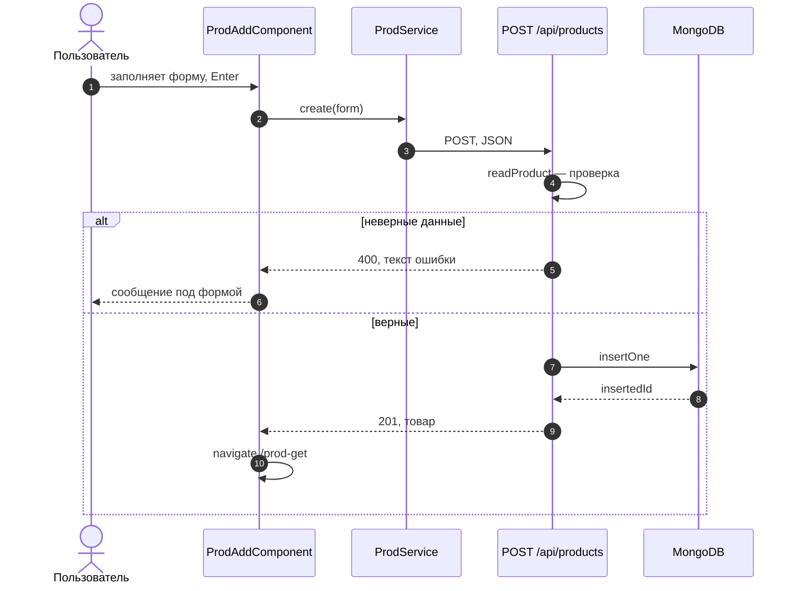
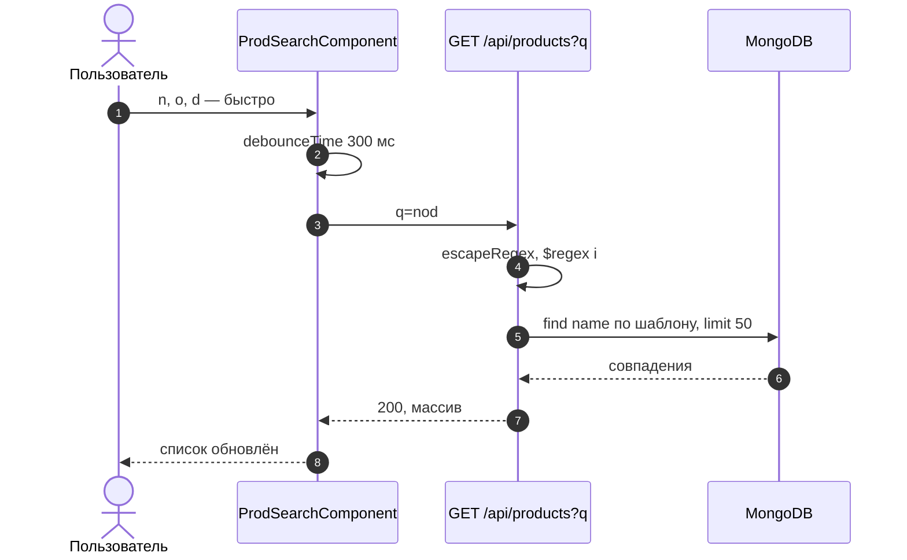
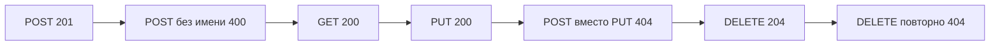

# 9_2 — MongoDB, Node.js и Angular: примеры использования

**Курс:** 3813ICT, неделя 9
**Связанные файлы:** [конспект](9_2-mongodb-angular-konspekt.md) · [поправки](9_2-mongodb-angular-popravki.md) · [вопросы](9_2-mongodb-angular-voprosy.md) · [ответы](9_2-mongodb-angular-otvety.md)

Каждый пример — рабочий кусок итогового проекта: один большой фрагмент, пошаговая последовательность и диаграмма. Сервер — из [конспекта §2.3](9_2-mongodb-angular-konspekt.md#s2-3), сервис Angular — из [§4](9_2-mongodb-angular-konspekt.md#s4).

> **Диаграммы.** В Obsidian mermaid рендерится сам. В VS Code нужно расширение **Markdown Preview Mermaid Support**.

---

<a id="ex-0"></a>

## Контракт клиента и сервера

Прежде чем писать компонент, сверь строку маршрута в сервисе и на сервере. Если хоть одна колонка не совпадает, запрос не работает.

| Действие | Метод и адрес | Тело запроса | Успешный ответ | Ошибки |
|---|---|---|---|---|
| список | `GET /api/products?q=` | — | `200`, массив | — |
| один | `GET /api/products/:id` | — | `200`, товар | `400`, `404` |
| создать | `POST /api/products` | `{ name, price, company }` | `201`, товар с `_id` | `400` |
| изменить | `PUT /api/products/:id` | `{ name, price, company }` | `200`, товар | `400`, `404` |
| удалить | `DELETE /api/products/:id` | — | `204` | `400`, `404` |

| Пример | Что показывает |
|---|---|
| [1. Добавление товара от формы до базы](#ex-1) | форма с `ngSubmit`, ошибки сервера на экране, переход после успеха |
| [2. Поиск по названию на сервере](#ex-2) | `HttpParams`, экранирование в регулярном выражении, индекс |
| [3. Проверка контракта одной командой](#ex-3) | скрипт, который проходит все маршруты и показывает коды ответов |

---

<a id="ex-1"></a>

## Пример 1 — Добавление товара от формы до базы

**Когда использовать:** любая форма создания в итоговом проекте. Пример показывает полный путь данных и то, как показать пользователю ошибку, которую вернул сервер.

**Где в конспекте:** [§2.3 Исправленный сервер](9_2-mongodb-angular-konspekt.md#s2-3) · [§6 Добавление и редактирование](9_2-mongodb-angular-konspekt.md#s6)

```ts
// ═════ src/app/prod-add/prod-add.component.ts ═════
import { Component, inject, signal } from '@angular/core';
import { FormsModule } from '@angular/forms';
import { Router } from '@angular/router';
import { HttpErrorResponse } from '@angular/common/http';
import { ProdInput, ProdService } from '../prod.service';

@Component({
  selector: 'app-prod-add',
  imports: [FormsModule],
  template: `
    <h3>Create Product</h3>
    <form (ngSubmit)="save()">
      <label>Name <input name="name" [(ngModel)]="form.name" required></label>
      <label>Price <input name="price" type="number" min="0" step="0.01" [(ngModel)]="form.price" required></label>
      <label>Company <input name="company" [(ngModel)]="form.company"></label>
      <button type="submit" class="btn btn-primary" [disabled]="saving()">Insert</button>
    </form>
    @if (error()) { <p class="text-danger">{{ error() }}</p> }
  `,
})
export class ProdAddComponent {
  private prodService = inject(ProdService);
  private router = inject(Router);

  protected form: ProdInput = { name: '', price: 0, company: '' };
  protected saving = signal(false);
  protected error = signal('');

  protected save(): void {
    this.error.set('');
    this.saving.set(true);
    this.prodService.create({ ...this.form, name: this.form.name.trim() }).subscribe({
      next: (created) => this.router.navigate(['/prod-get'], { state: { highlight: created._id } }),
      error: (err: HttpErrorResponse) => {
        // Текст ошибки сервера (400) — пользователю; остальное — общее сообщение
        this.error.set(err.status === 400 ? err.error?.error ?? 'Проверьте данные' : 'Не удалось сохранить');
        this.saving.set(false);
      },
    });
  }
}

// ═════ server/routes/products.js — обработчик POST (из конспекта §2.3) ═════
// router.post('/', async (req, res) => {
//   const product = readProduct(req.body);
//   if (!product) return res.status(400).json({ error: 'name and non-negative price are required' });
//   const { insertedId } = await col().insertOne(product);
//   res.status(201).json({ _id: insertedId, ...product });
// });
```

### Последовательность

1. Пользователь заполняет поля — `[(ngModel)]` обновляет объект `form`.
2. Enter или «Insert» — `ngSubmit` вызывает `save()`; кнопка блокируется, чтобы не отправить дважды.
3. Сервис отправляет `POST /api/products` с `{ name, price, company }`.
4. Сервер собирает документ только из разрешённых полей и проверяет их.
5. Данные неверны — сервер отвечает `400` с текстом; компонент показывает его и разблокирует кнопку.
6. Данные верны — `insertOne` создаёт документ, сервер отвечает `201` с товаром и новым `_id`.
7. Компонент переходит на список и передаёт `_id` нового товара в состоянии навигации — список может его подсветить.



---

<a id="ex-2"></a>

## Пример 2 — Поиск по названию на сервере

**Когда использовать:** список большой, и фильтровать его в браузере, загрузив всё, неэффективно. Поиск выполняет база, а клиент передаёт строку параметром запроса.

**Где в конспекте:** [§4 Сервис](9_2-mongodb-angular-konspekt.md#s4) · [5_4 §8 Параметры](../week5/5_4-http-requests-konspekt.md#s8)

```ts
// ═════ server/routes/products.js — GET со строкой поиска ═════
// Пользовательский ввод превращается в регулярное выражение — спецсимволы экранируем,
// иначе строка вроде ".*" или "(" изменит смысл запроса или сломает его
const escapeRegex = (s) => s.replace(/[.*+?^${}()|[\]\\]/g, '\\$&');

router.get('/', async (req, res) => {
  const q = typeof req.query.q === 'string' ? req.query.q.trim().slice(0, 50) : '';
  const filter = q ? { name: { $regex: escapeRegex(q), $options: 'i' } } : {};   // i — без учёта регистра
  const list = await col().find(filter).sort({ name: 1 }).limit(50).toArray();
  res.json(list);
});

// ═════ src/app/prod.service.ts — метод поиска ═════
// search(q: string): Observable<ProdModel[]> {
//   return this.http.get<ProdModel[]>(this.url, { params: { q } });   // → /api/products?q=node
// }

// ═════ src/app/prod-get/prod-get.component.ts — поле поиска ═════
import { Component, inject, signal } from '@angular/core';
import { takeUntilDestroyed } from '@angular/core/rxjs-interop';
import { Subject, debounceTime, distinctUntilChanged, startWith, switchMap } from 'rxjs';
import { ProdModel, ProdService } from '../prod.service';

@Component({
  selector: 'app-prod-search',
  template: `
    <input placeholder="Поиск по названию" (input)="query$.next($any($event.target).value)">
    <ul>
      @for (p of results(); track p._id) { <li>{{ p.name }} — {{ p.price }}</li> }
      @empty { <li>Ничего не найдено</li> }
    </ul>
  `,
})
export class ProdSearchComponent {
  private prodService = inject(ProdService);
  protected query$ = new Subject<string>();
  protected results = signal<ProdModel[]>([]);

  constructor() {
    this.query$.pipe(
      startWith(''),                        // сразу показать всё
      debounceTime(300),                    // ждать паузу в наборе, а не слать запрос на каждую букву
      distinctUntilChanged(),               // та же строка — повторно не искать
      switchMap((q) => this.prodService.search(q)),   // новый ввод отменяет прежний запрос
      takeUntilDestroyed(),
    ).subscribe((list) => this.results.set(list));
  }
}
```

### Последовательность

1. Компонент создаётся — `startWith('')` сразу запрашивает весь список.
2. Пользователь печатает «nod» — каждое событие `input` уходит в `query$`.
3. `debounceTime(300)` ждёт паузу 300 мс: пока пользователь печатает, запросов нет.
4. `distinctUntilChanged` пропускает только изменившуюся строку.
5. `switchMap` отправляет `GET /api/products?q=nod`; если пользователь продолжит печатать, прежний запрос отменится.
6. Сервер экранирует спецсимволы, строит регулярное выражение без учёта регистра и возвращает до 50 совпадений.
7. Результат попадает в сигнал, список перерисовывается.



(Поиск по подстроке с `$regex` не использует обычный индекс эффективно; для больших коллекций используют текстовый индекс или Atlas Search. Для учебного каталога этого достаточно.)

---

<a id="ex-3"></a>

## Пример 3 — Проверка контракта одной командой

**Когда использовать:** после изменения маршрутов или сервиса нужно быстро убедиться, что все эндпоинты отвечают ожидаемыми кодами. Именно такая проверка сразу поймала бы несовпадение `PUT` и `POST` из [П-6](9_2-mongodb-angular-popravki.md#p-6).

**Где в конспекте:** [§2.3 Исправленный сервер](9_2-mongodb-angular-konspekt.md#s2-3) · [контракт выше](#ex-0)

```js
// ═════ server/smoke.mjs — запуск: node smoke.mjs (сервер должен работать) ═════
const BASE = 'http://localhost:3000/api/products';

async function call(method, url, body) {
  const res = await fetch(url, {
    method,
    headers: body ? { 'Content-Type': 'application/json' } : undefined,
    body: body ? JSON.stringify(body) : undefined,
  });
  const text = await res.text();
  return { status: res.status, data: text ? JSON.parse(text) : null };
}

function check(name, actual, expected) {
  console.log(`${actual === expected ? '✅' : '❌'} ${name}: ${actual} (ожидали ${expected})`);
}

const created = await call('POST', BASE, { name: 'Smoke test', price: 1, company: 'QA' });
check('POST создать', created.status, 201);
const id = created.data?._id;

check('POST без имени', (await call('POST', BASE, { price: 1 })).status, 400);
check('GET список', (await call('GET', BASE)).status, 200);
check('GET один', (await call('GET', `${BASE}/${id}`)).status, 200);
check('GET неверный id', (await call('GET', `${BASE}/not-an-id`)).status, 404);
check('PUT изменить', (await call('PUT', `${BASE}/${id}`, { name: 'Smoke 2', price: 2, company: 'QA' })).status, 200);
check('POST вместо PUT', (await call('POST', `${BASE}/${id}`, { name: 'X', price: 1 })).status, 404);
check('DELETE удалить', (await call('DELETE', `${BASE}/${id}`)).status, 204);
check('DELETE повторно', (await call('DELETE', `${BASE}/${id}`)).status, 404);
```

### Последовательность

1. Скрипт создаёт тестовый товар и запоминает его `_id`.
2. Проверяет отказ на неверных данных (`400`).
3. Читает список и один товар, проверяет неверный `id`.
4. Изменяет товар методом `PUT`, а затем пробует «не тот» метод — сервер отвечает `404`, как было бы с сервисом из материала.
5. Удаляет товар и проверяет, что повторное удаление даёт `404`.
6. Каждая строка печатает ✅ или ❌ с фактическим и ожидаемым кодом.


